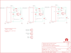

Contents
========

* [PRS11850 > Sparkfun](#prs11850--sparkfun)
	* [Schematic](#schematic)
	* [Interactive BOM](#interactive-bom)
	* [OOMP Parts](#oomp-parts)
	* [Images](#images)
	* [Tags](#tags)
  
![][im]
# PRS11850 > Sparkfun

- ID: PROJ-SPAR-11850-STAN-01
- Hex ID: PRS11850
- Name: Sparkfun
- Description: Sparkfun
- Long Link: [http://oom.lt/PROJ-SPAR-11850-STAN-01](http://oom.lt/PROJ-SPAR-11850-STAN-01)
- Long Link: [http://oom.lt/PRS11850](http://oom.lt/PRS11850)

## Schematic
  
![][schem]
## Interactive BOM

- Interactive BOM page: [ibom.html](https://htmlpreview.github.io/?https://github.com/oomlout/oomlout_OOMP_projects/blob/main/PROJ-SPAR-11850-STAN-01/kicad/bom/ibom.html)

## OOMP Parts
  

|OOMP Parts|
| :---: |
|C1,UNMATCHED-UNMATCHED-UNMATCHED-UNMATCHED-UNMATCHED,C1,1uF,1.0UF-25V-+80/-20(0805),0805,,CAP-11625,1.0uF,|
|C2,UNMATCHED-UNMATCHED-UNMATCHED-UNMATCHED-UNMATCHED,C2,2.2uF,2.2UF-25V-+80/-20(0805),0805,,CAP-11624,2.2uF,|
|C3,UNMATCHED-UNMATCHED-UNMATCHED-UNMATCHED-UNMATCHED,C3,1uF,1.0UF-25V-+80/-20(0805),0805,,CAP-11625,1.0uF,|
|C4,UNMATCHED-UNMATCHED-UNMATCHED-UNMATCHED-UNMATCHED,C4,2.2uF,2.2UF-25V-+80/-20(0805),0805,,CAP-11624,2.2uF,|
|C5,UNMATCHED-UNMATCHED-UNMATCHED-UNMATCHED-UNMATCHED,C5,1uF,1.0UF-25V-+80/-20(0805),0805,,CAP-11625,1.0uF,|
|C6,UNMATCHED-UNMATCHED-UNMATCHED-UNMATCHED-UNMATCHED,C6,2.2uF,2.2UF-25V-+80/-20(0805),0805,,CAP-11624,2.2uF,|
|CH1,UNMATCHED-UNMATCHED-UNMATCHED-UNMATCHED-UNMATCHED,CH1,,CONN_023.5MM_LOCK,SCREWTERMINAL-3.5MM-2_LOCK,Multi connection point. Often used as Generic Header-pin footprint for 0.1 inch spaced/style header connections,CONN-08399,,|
|CH2,UNMATCHED-UNMATCHED-UNMATCHED-UNMATCHED-UNMATCHED,CH2,,CONN_023.5MM_LOCK,SCREWTERMINAL-3.5MM-2_LOCK,Multi connection point. Often used as Generic Header-pin footprint for 0.1 inch spaced/style header connections,CONN-08399,,|
|CH3,UNMATCHED-UNMATCHED-UNMATCHED-UNMATCHED-UNMATCHED,CH3,,CONN_023.5MM_LOCK,SCREWTERMINAL-3.5MM-2_LOCK,Multi connection point. Often used as Generic Header-pin footprint for 0.1 inch spaced/style header connections,CONN-08399,,|
|D1,UNMATCHED-UNMATCHED-UNMATCHED-UNMATCHED-UNMATCHED,D1,MBRA140,DIODE-SCHOTTKY-MBRA140,SMA-DIODE,Schottky diodes in SFEs production catalog,DIO-08053,MBRA140,|
|D2,UNMATCHED-UNMATCHED-UNMATCHED-UNMATCHED-UNMATCHED,D2,MBRA140,DIODE-SCHOTTKY-MBRA140,SMA-DIODE,Schottky diodes in SFEs production catalog,DIO-08053,MBRA140,|
|D3,UNMATCHED-UNMATCHED-UNMATCHED-UNMATCHED-UNMATCHED,D3,MBRA140,DIODE-SCHOTTKY-MBRA140,SMA-DIODE,Schottky diodes in SFEs production catalog,DIO-08053,MBRA140,|
|FRAME1,UNMATCHED-UNMATCHED-UNMATCHED-UNMATCHED-UNMATCHED,FID1,FIDUCIALUFIDUCIAL,FIDUCIALUFIDUCIAL,MICRO-FIDUCIAL,Fiducial Alignment Points,,,|
|JP2,UNMATCHED-UNMATCHED-UNMATCHED-UNMATCHED-UNMATCHED,FID2,FIDUCIALUFIDUCIAL,FIDUCIALUFIDUCIAL,MICRO-FIDUCIAL,Fiducial Alignment Points,,,|
|JP3,UNMATCHED-UNMATCHED-UNMATCHED-UNMATCHED-UNMATCHED,FRAME1,FRAME-LETTER,FRAME-LETTER,CREATIVE_COMMONS,Schematic Frame,,,|
|JP4,UNMATCHED-UNMATCHED-UNMATCHED-UNMATCHED-UNMATCHED,JP2,,CONN_023.5MM_LOCK,SCREWTERMINAL-3.5MM-2_LOCK,Multi connection point. Often used as Generic Header-pin footprint for 0.1 inch spaced/style header connections,CONN-08399,,|
|L1,UNMATCHED-UNMATCHED-UNMATCHED-UNMATCHED-UNMATCHED,JP3,M022.54MM_SCREWTERM,M022.54MM_SCREWTERM,1X02_2.54_SCREWTERM@1,Standard 2-pin 0.1 header. Use with,,,|
|L2,UNMATCHED-UNMATCHED-UNMATCHED-UNMATCHED-UNMATCHED,JP4,M022.54MM_SCREWTERM,M022.54MM_SCREWTERM,1X02_2.54_SCREWTERM@1,Standard 2-pin 0.1 header. Use with,,,|
|L3,UNMATCHED-UNMATCHED-UNMATCHED-UNMATCHED-UNMATCHED,L1,33µH/±20%/1.4A,INDUCTOR-SRN6045-33UH,SRN6045,Inductors,NDUC-11627,33µH/±20%/1.4A,|
|LOGO1,UNMATCHED-UNMATCHED-UNMATCHED-UNMATCHED-UNMATCHED,L2,33µH/±20%/1.4A,INDUCTOR-SRN6045-33UH,SRN6045,Inductors,NDUC-11627,33µH/±20%/1.4A,|
|LOGO2,UNMATCHED-UNMATCHED-UNMATCHED-UNMATCHED-UNMATCHED,L3,33µH/±20%/1.4A,INDUCTOR-SRN6045-33UH,SRN6045,Inductors,NDUC-11627,33µH/±20%/1.4A,|
|R1,UNMATCHED-UNMATCHED-UNMATCHED-UNMATCHED-UNMATCHED,LOGO1,OSHW-LOGOS,OSHW-LOGOS,OSHW-LOGO-S,Open Source Hardware Logo This logo indicates the piece of hardware it is found on incorporates a OSHW license and/or adheres to the definition of open source hardware found here: http://freedomdefined.org/OSHW,,,|
|R2,UNMATCHED-UNMATCHED-UNMATCHED-UNMATCHED-UNMATCHED,LOGO2,LOGO-SFENEW,LOGO-SFENEW,SFE-NEW-WEBLOGO,Spark Fun Electronics PCB Logo,,,|
|R3,UNMATCHED-UNMATCHED-UNMATCHED-UNMATCHED-UNMATCHED,R1,0.3R,0.3OHM-1/8W-1%(0805),0805,,RES-11622,0.3,|
|R4,UNMATCHED-UNMATCHED-UNMATCHED-UNMATCHED-UNMATCHED,R2,0.3R,0.3OHM-1/8W-1%(0805),0805,,RES-11622,0.3,|
|R5,UNMATCHED-UNMATCHED-UNMATCHED-UNMATCHED-UNMATCHED,R3,0.3R,0.3OHM-1/8W-1%(0805),0805,,RES-11622,0.3,|
|R6,UNMATCHED-UNMATCHED-UNMATCHED-UNMATCHED-UNMATCHED,R4,0.3R,0.3OHM-1/8W-1%(0805),0805,,RES-11622,0.3,|
|SJ1,UNMATCHED-UNMATCHED-UNMATCHED-UNMATCHED-UNMATCHED,R5,0.3R,0.3OHM-1/8W-1%(0805),0805,,RES-11622,0.3,|
|SJ2,UNMATCHED-UNMATCHED-UNMATCHED-UNMATCHED-UNMATCHED,R6,0.3R,0.3OHM-1/8W-1%(0805),0805,,RES-11622,0.3,|
|SJ3,UNMATCHED-UNMATCHED-UNMATCHED-UNMATCHED-UNMATCHED,SJ1,JUMPER-SMT_2_NO_NO-SILK,JUMPER-SMT_2_NO_NO-SILK,SMT-JUMPER_2_NO_NO-SILK,Normally open jumper,,,|
|STANDOFF1,UNMATCHED-UNMATCHED-UNMATCHED-UNMATCHED-UNMATCHED,SJ2,JUMPER-SMT_2_NO_NO-SILK,JUMPER-SMT_2_NO_NO-SILK,SMT-JUMPER_2_NO_NO-SILK,Normally open jumper,,,|
|STANDOFF2,UNMATCHED-UNMATCHED-UNMATCHED-UNMATCHED-UNMATCHED,SJ3,JUMPER-SMT_2_NO_NO-SILK,JUMPER-SMT_2_NO_NO-SILK,SMT-JUMPER_2_NO_NO-SILK,Normally open jumper,,,|
|U1,UNMATCHED-UNMATCHED-UNMATCHED-UNMATCHED-UNMATCHED,STANDOFF1,STAND-OFF,STAND-OFF,STAND-OFF,#4 Stand Off,,,|
|U2,UNMATCHED-UNMATCHED-UNMATCHED-UNMATCHED-UNMATCHED,STANDOFF2,STAND-OFF,STAND-OFF,STAND-OFF,#4 Stand Off,,,|
|U3,UNMATCHED-UNMATCHED-UNMATCHED-UNMATCHED-UNMATCHED,U1,AL8860,AL8860SOT23,SOT23-5,The AL8860 is a buck LED driver thats used on the PicoBuck and FemtoBuck products. Its a replacement for the AL8805 which has gone EOL.,IC-16593,,|

## Images
  
  

|kicadPcb3d|kicadPcb3dFront|kicadPcb3dBack|eagleImage|eagleSchemImage|
| :---: | :---: | :---: | :---: | :---: |
||||||

## Tags

- hexID: PRS11850
- oompType: PROJ
- oompSize: SPAR
- oompColor: 11850
- oompDesc: STAN
- oompIndex: 01
- oompName: PicoBuck
- sources: All source files from https://github.com/sparkfun/PicoBuck (source licence details in srcLicense.md)
- linkBuyPage: https://www.sparkfun.com/products/11850
- oompID: PROJ-SPAR-11850-STAN-01
- oompParts: C1,UNMATCHED-UNMATCHED-UNMATCHED-UNMATCHED-UNMATCHED
- oompParts: C2,UNMATCHED-UNMATCHED-UNMATCHED-UNMATCHED-UNMATCHED
- oompParts: C3,UNMATCHED-UNMATCHED-UNMATCHED-UNMATCHED-UNMATCHED
- oompParts: C4,UNMATCHED-UNMATCHED-UNMATCHED-UNMATCHED-UNMATCHED
- oompParts: C5,UNMATCHED-UNMATCHED-UNMATCHED-UNMATCHED-UNMATCHED
- oompParts: C6,UNMATCHED-UNMATCHED-UNMATCHED-UNMATCHED-UNMATCHED
- oompParts: CH1,UNMATCHED-UNMATCHED-UNMATCHED-UNMATCHED-UNMATCHED
- oompParts: CH2,UNMATCHED-UNMATCHED-UNMATCHED-UNMATCHED-UNMATCHED
- oompParts: CH3,UNMATCHED-UNMATCHED-UNMATCHED-UNMATCHED-UNMATCHED
- oompParts: D1,UNMATCHED-UNMATCHED-UNMATCHED-UNMATCHED-UNMATCHED
- oompParts: D2,UNMATCHED-UNMATCHED-UNMATCHED-UNMATCHED-UNMATCHED
- oompParts: D3,UNMATCHED-UNMATCHED-UNMATCHED-UNMATCHED-UNMATCHED
- oompParts: FRAME1,UNMATCHED-UNMATCHED-UNMATCHED-UNMATCHED-UNMATCHED
- oompParts: JP2,UNMATCHED-UNMATCHED-UNMATCHED-UNMATCHED-UNMATCHED
- oompParts: JP3,UNMATCHED-UNMATCHED-UNMATCHED-UNMATCHED-UNMATCHED
- oompParts: JP4,UNMATCHED-UNMATCHED-UNMATCHED-UNMATCHED-UNMATCHED
- oompParts: L1,UNMATCHED-UNMATCHED-UNMATCHED-UNMATCHED-UNMATCHED
- oompParts: L2,UNMATCHED-UNMATCHED-UNMATCHED-UNMATCHED-UNMATCHED
- oompParts: L3,UNMATCHED-UNMATCHED-UNMATCHED-UNMATCHED-UNMATCHED
- oompParts: LOGO1,UNMATCHED-UNMATCHED-UNMATCHED-UNMATCHED-UNMATCHED
- oompParts: LOGO2,UNMATCHED-UNMATCHED-UNMATCHED-UNMATCHED-UNMATCHED
- oompParts: R1,UNMATCHED-UNMATCHED-UNMATCHED-UNMATCHED-UNMATCHED
- oompParts: R2,UNMATCHED-UNMATCHED-UNMATCHED-UNMATCHED-UNMATCHED
- oompParts: R3,UNMATCHED-UNMATCHED-UNMATCHED-UNMATCHED-UNMATCHED
- oompParts: R4,UNMATCHED-UNMATCHED-UNMATCHED-UNMATCHED-UNMATCHED
- oompParts: R5,UNMATCHED-UNMATCHED-UNMATCHED-UNMATCHED-UNMATCHED
- oompParts: R6,UNMATCHED-UNMATCHED-UNMATCHED-UNMATCHED-UNMATCHED
- oompParts: SJ1,UNMATCHED-UNMATCHED-UNMATCHED-UNMATCHED-UNMATCHED
- oompParts: SJ2,UNMATCHED-UNMATCHED-UNMATCHED-UNMATCHED-UNMATCHED
- oompParts: SJ3,UNMATCHED-UNMATCHED-UNMATCHED-UNMATCHED-UNMATCHED
- oompParts: STANDOFF1,UNMATCHED-UNMATCHED-UNMATCHED-UNMATCHED-UNMATCHED
- oompParts: STANDOFF2,UNMATCHED-UNMATCHED-UNMATCHED-UNMATCHED-UNMATCHED
- oompParts: U1,UNMATCHED-UNMATCHED-UNMATCHED-UNMATCHED-UNMATCHED
- oompParts: U2,UNMATCHED-UNMATCHED-UNMATCHED-UNMATCHED-UNMATCHED
- oompParts: U3,UNMATCHED-UNMATCHED-UNMATCHED-UNMATCHED-UNMATCHED
- rawParts: C1,1uF,1.0UF-25V-+80/-20(0805),0805,,CAP-11625,1.0uF,
- rawParts: C2,2.2uF,2.2UF-25V-+80/-20(0805),0805,,CAP-11624,2.2uF,
- rawParts: C3,1uF,1.0UF-25V-+80/-20(0805),0805,,CAP-11625,1.0uF,
- rawParts: C4,2.2uF,2.2UF-25V-+80/-20(0805),0805,,CAP-11624,2.2uF,
- rawParts: C5,1uF,1.0UF-25V-+80/-20(0805),0805,,CAP-11625,1.0uF,
- rawParts: C6,2.2uF,2.2UF-25V-+80/-20(0805),0805,,CAP-11624,2.2uF,
- rawParts: CH1,,CONN_023.5MM_LOCK,SCREWTERMINAL-3.5MM-2_LOCK,Multi connection point. Often used as Generic Header-pin footprint for 0.1 inch spaced/style header connections,CONN-08399,,
- rawParts: CH2,,CONN_023.5MM_LOCK,SCREWTERMINAL-3.5MM-2_LOCK,Multi connection point. Often used as Generic Header-pin footprint for 0.1 inch spaced/style header connections,CONN-08399,,
- rawParts: CH3,,CONN_023.5MM_LOCK,SCREWTERMINAL-3.5MM-2_LOCK,Multi connection point. Often used as Generic Header-pin footprint for 0.1 inch spaced/style header connections,CONN-08399,,
- rawParts: D1,MBRA140,DIODE-SCHOTTKY-MBRA140,SMA-DIODE,Schottky diodes in SFEs production catalog,DIO-08053,MBRA140,
- rawParts: D2,MBRA140,DIODE-SCHOTTKY-MBRA140,SMA-DIODE,Schottky diodes in SFEs production catalog,DIO-08053,MBRA140,
- rawParts: D3,MBRA140,DIODE-SCHOTTKY-MBRA140,SMA-DIODE,Schottky diodes in SFEs production catalog,DIO-08053,MBRA140,
- rawParts: FID1,FIDUCIALUFIDUCIAL,FIDUCIALUFIDUCIAL,MICRO-FIDUCIAL,Fiducial Alignment Points,,,
- rawParts: FID2,FIDUCIALUFIDUCIAL,FIDUCIALUFIDUCIAL,MICRO-FIDUCIAL,Fiducial Alignment Points,,,
- rawParts: FRAME1,FRAME-LETTER,FRAME-LETTER,CREATIVE_COMMONS,Schematic Frame,,,
- rawParts: JP2,,CONN_023.5MM_LOCK,SCREWTERMINAL-3.5MM-2_LOCK,Multi connection point. Often used as Generic Header-pin footprint for 0.1 inch spaced/style header connections,CONN-08399,,
- rawParts: JP3,M022.54MM_SCREWTERM,M022.54MM_SCREWTERM,1X02_2.54_SCREWTERM@1,Standard 2-pin 0.1 header. Use with,,,
- rawParts: JP4,M022.54MM_SCREWTERM,M022.54MM_SCREWTERM,1X02_2.54_SCREWTERM@1,Standard 2-pin 0.1 header. Use with,,,
- rawParts: L1,33µH/±20%/1.4A,INDUCTOR-SRN6045-33UH,SRN6045,Inductors,NDUC-11627,33µH/±20%/1.4A,
- rawParts: L2,33µH/±20%/1.4A,INDUCTOR-SRN6045-33UH,SRN6045,Inductors,NDUC-11627,33µH/±20%/1.4A,
- rawParts: L3,33µH/±20%/1.4A,INDUCTOR-SRN6045-33UH,SRN6045,Inductors,NDUC-11627,33µH/±20%/1.4A,
- rawParts: LOGO1,OSHW-LOGOS,OSHW-LOGOS,OSHW-LOGO-S,Open Source Hardware Logo This logo indicates the piece of hardware it is found on incorporates a OSHW license and/or adheres to the definition of open source hardware found here: http://freedomdefined.org/OSHW,,,
- rawParts: LOGO2,LOGO-SFENEW,LOGO-SFENEW,SFE-NEW-WEBLOGO,Spark Fun Electronics PCB Logo,,,
- rawParts: R1,0.3R,0.3OHM-1/8W-1%(0805),0805,,RES-11622,0.3,
- rawParts: R2,0.3R,0.3OHM-1/8W-1%(0805),0805,,RES-11622,0.3,
- rawParts: R3,0.3R,0.3OHM-1/8W-1%(0805),0805,,RES-11622,0.3,
- rawParts: R4,0.3R,0.3OHM-1/8W-1%(0805),0805,,RES-11622,0.3,
- rawParts: R5,0.3R,0.3OHM-1/8W-1%(0805),0805,,RES-11622,0.3,
- rawParts: R6,0.3R,0.3OHM-1/8W-1%(0805),0805,,RES-11622,0.3,
- rawParts: SJ1,JUMPER-SMT_2_NO_NO-SILK,JUMPER-SMT_2_NO_NO-SILK,SMT-JUMPER_2_NO_NO-SILK,Normally open jumper,,,
- rawParts: SJ2,JUMPER-SMT_2_NO_NO-SILK,JUMPER-SMT_2_NO_NO-SILK,SMT-JUMPER_2_NO_NO-SILK,Normally open jumper,,,
- rawParts: SJ3,JUMPER-SMT_2_NO_NO-SILK,JUMPER-SMT_2_NO_NO-SILK,SMT-JUMPER_2_NO_NO-SILK,Normally open jumper,,,
- rawParts: STANDOFF1,STAND-OFF,STAND-OFF,STAND-OFF,#4 Stand Off,,,
- rawParts: STANDOFF2,STAND-OFF,STAND-OFF,STAND-OFF,#4 Stand Off,,,
- rawParts: U1,AL8860,AL8860SOT23,SOT23-5,The AL8860 is a buck LED driver thats used on the PicoBuck and FemtoBuck products. Its a replacement for the AL8805 which has gone EOL.,IC-16593,,
- rawParts: U2,AL8860,AL8860SOT23,SOT23-5,The AL8860 is a buck LED driver thats used on the PicoBuck and FemtoBuck products. Its a replacement for the AL8805 which has gone EOL.,IC-16593,,
- rawParts: U3,AL8860,AL8860SOT23,SOT23-5,The AL8860 is a buck LED driver thats used on the PicoBuck and FemtoBuck products. Its a replacement for the AL8805 which has gone EOL.,IC-16593,,

[im]: kicadPcb3d_450.png
[schem]: eagleSchemImage.png
