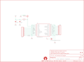

Contents
========

* [PRS11858 > Copernicus II DIP Module](#prs11858--copernicus-ii-dip-module)
	* [Schematic](#schematic)
	* [PCB](#pcb)
	* [Interactive BOM](#interactive-bom)
	* [OOMP Parts](#oomp-parts)
	* [Images](#images)
	* [Tags](#tags)
  
![][im]
# PRS11858 > Copernicus II DIP Module

- ID: PROJ-SPAR-11858-STAN-01
- Hex ID: PRS11858
- Name: Sparkfun
- Description: Sparkfun
- Long Link: [http://oom.lt/PROJ-SPAR-11858-STAN-01](http://oom.lt/PROJ-SPAR-11858-STAN-01)
- Short Link: [http://oom.lt/PRS11858](http://oom.lt/PRS11858)

## Schematic
  

## PCB
  

## Interactive BOM

- Interactive BOM page: [ibom.html](https://htmlpreview.github.io/?https://github.com/oomlout/oomlout_OOMP_projects/blob/main/PROJ-SPAR-11858-STAN-01/kicad/bom/ibom.html)

## OOMP Parts
  

|OOMP Parts|
| :---: |
|[CAPC-0603-X-NF100-V50  SMD (0603) 100 nF Capacitor (Ceramic) 50v  C1](https://github.com/oomlout/oomlout_OOMP_parts/tree/main/CAPC-0603-X-NF100-V50/)|
|[CAPC-0603-X-PF22-V50  SMD (0603) 22 pF Capacitor (Ceramic) 50v  C3](https://github.com/oomlout/oomlout_OOMP_parts/tree/main/CAPC-0603-X-PF22-V50/)|
|[HEAD-I01-X-PI10-01  2.54 mm 10 Pin Header  JP1, JP2](https://github.com/oomlout/oomlout_OOMP_parts/tree/main/HEAD-I01-X-PI10-01/)|
|UNMATCHED-UNMATCHED-X-UNMATCHED-01 JP3, U1|
|UNMATCHED-0603-X-UNMATCHED-01 L1|

## Images
  
  

|bominteractivefront|bominteractiveback|kicadPcb3d|kicadPcb3dFront|kicadPcb3dBack|eagleImage|eagleSchemImage|
| :---: | :---: | :---: | :---: | :---: | :---: | :---: |
||||||||

## Tags

- hexID: PRS11858
- oompType: PROJ
- oompSize: SPAR
- oompColor: 11858
- oompDesc: STAN
- oompIndex: 01
- oompName: Copernicus II DIP Module
- sources: All source files from https://github.com/sparkfun/Copernicus_II_DIP_Module (source licence details in srcLicense.md)
- linkBuyPage: https://www.sparkfun.com/products/11858
- oompID: PROJ-SPAR-11858-STAN-01
- oompParts: C1,CAPC-0603-X-NF100-V50
- oompParts: C3,CAPC-0603-X-PF22-V50
- oompParts: JP1,HEAD-I01-X-PI10-01
- oompParts: JP2,HEAD-I01-X-PI10-01
- oompParts: JP3,UNMATCHED-UNMATCHED-X-UNMATCHED-01
- oompParts: L1,UNMATCHED-0603-X-UNMATCHED-01
- oompParts: U1,UNMATCHED-UNMATCHED-X-UNMATCHED-01
- rawParts: C1,0.1uF,CAP0603-CAP,0603-CAP,Capacitor,,
- rawParts: C3,22pF,CAP0603-CAP,0603-CAP,Capacitor,,
- rawParts: FRAME1,FRAME-LETTER,FRAME-LETTER,CREATIVE_COMMONS,Schematic Frame,,
- rawParts: JP1,,M10,1X10,Header 10,,
- rawParts: JP2,,M10,1X10,Header 10,,
- rawParts: JP3,SMA_EDGE,SMA_EDGE,SMA_EDGE,,,
- rawParts: JP4,LOGO-SFESK,LOGO-SFESK,SFE-LOGO-FLAME,Spark Fun Electronics PCB Logo,,
- rawParts: L1,33nH,INDUCTOR0603,0603,Inductors,,
- rawParts: SJ1,SOLDERJUMPERTRACE,SOLDERJUMPERTRACE,SJ_2S-TRACE,Solder Jumper,,
- rawParts: U$1,OSHW-LOGOS,OSHW-LOGOS,OSHW-LOGO-S,Open Source Hardware Logo This logo indicates the piece of hardware it is found on incorporates a OSHW license and/or adheres to the definition of open source hardware found here: http://freedomdefined.org/OSHW,,
- rawParts: U$2,FIDUCIAL1X2,FIDUCIAL1X2,FIDUCIAL-1X2,Fiducial Alignment Points,,
- rawParts: U$3,FIDUCIAL1X2,FIDUCIAL1X2,FIDUCIAL-1X2,Fiducial Alignment Points,,
- rawParts: U1,COPERNICUS,COPERNICUSSMD,COPERNICUS,Copernicus II GPS-  Trimble recommended layout and paste layer. Footprint production proven. Spark Fun Electronics SKU : GPS-07951,,

[im]: kicadPcb3d_450.png
