Contents
========

* [PRS11890 > MiniMoto](#prs11890--minimoto)
	* [Schematic](#schematic)
	* [PCB](#pcb)
	* [Interactive BOM](#interactive-bom)
	* [OOMP Parts](#oomp-parts)
	* [Images](#images)
	* [Tags](#tags)
  
![][im]
# PRS11890 > MiniMoto

- ID: PROJ-SPAR-11890-STAN-01
- Hex ID: PRS11890
- Name: Sparkfun
- Description: Sparkfun
- Long Link: [http://oom.lt/PROJ-SPAR-11890-STAN-01](http://oom.lt/PROJ-SPAR-11890-STAN-01)
- Short Link: [http://oom.lt/PRS11890](http://oom.lt/PRS11890)

## Schematic
  
[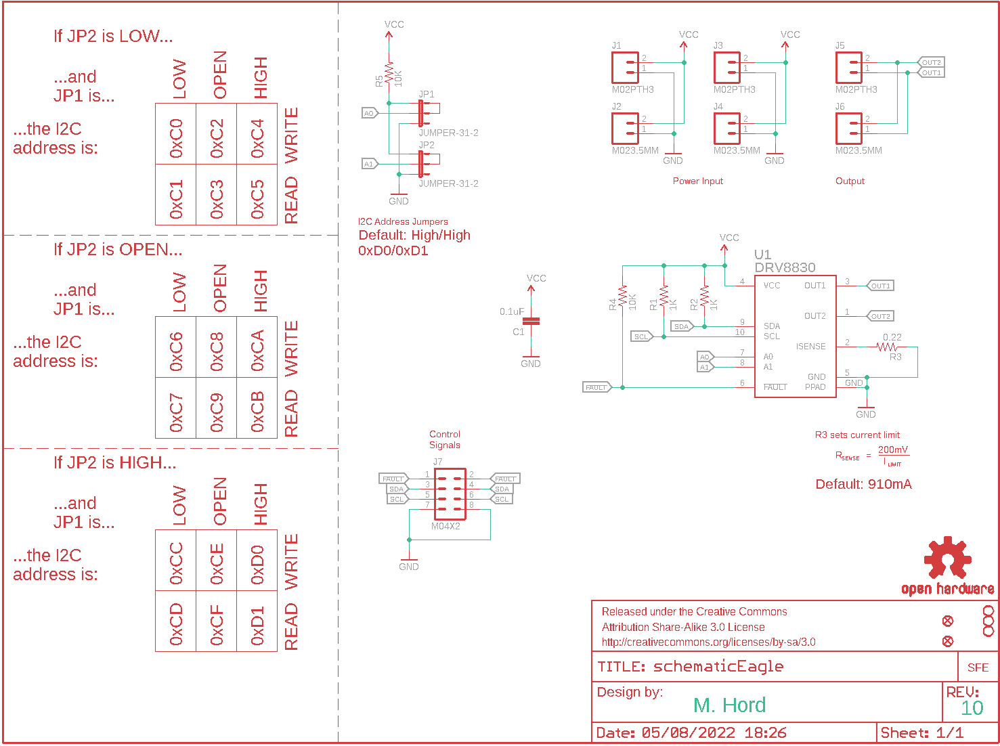](eagleSchemImage.png)
## PCB
  
[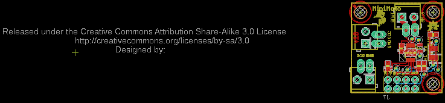](eagleImage.png)
## Interactive BOM

- Interactive BOM page: [ibom.html](https://htmlpreview.github.io/?https://github.com/oomlout/oomlout_OOMP_projects/blob/main/PROJ-SPAR-11890-STAN-01/kicad/bom/ibom.html)

## OOMP Parts
  

|OOMP Parts|
| :---: |
|[CAPC-0603-X-NF100-V50  SMD (0603) 100 nF Capacitor (Ceramic) 50v  C1](https://github.com/oomlout/oomlout_OOMP_parts/tree/main/CAPC-0603-X-NF100-V50/)|
|[HEAD-I01-X-PI02-01  2.54 mm 2 Pin Header  J1, J3, J5](https://github.com/oomlout/oomlout_OOMP_parts/tree/main/HEAD-I01-X-PI02-01/)|
|[TERS-35D-L-PI02-01  3.5 mm 2 Pin Blue Screw Terminal  J2, J4, J6](https://github.com/oomlout/oomlout_OOMP_parts/tree/main/TERS-35D-L-PI02-01/)|
|HEAD-I01-X-UNMATCHED-01 J7|
|UNMATCHED-UNMATCHED-X-UNMATCHED-01 JP1, JP2, U1|
|[RESE-0603-X-O102-01  SMD (0603) 1k Ohm Resistor  R1, R2](https://github.com/oomlout/oomlout_OOMP_parts/tree/main/RESE-0603-X-O102-01/)|
|RESE-0805-X-UNMATCHED-01 R3|
|[RESE-0603-X-O103-01  SMD (0603) 10k Ohm Resistor  R4, R5](https://github.com/oomlout/oomlout_OOMP_parts/tree/main/RESE-0603-X-O103-01/)|

## Images
  
  

|bominteractivefront|bominteractiveback|kicadPcb3d|kicadPcb3dFront|kicadPcb3dBack|eagleImage|eagleSchemImage|pcbdraw|pcbdrawback|
| :---: | :---: | :---: | :---: | :---: | :---: | :---: | :---: | :---: |
|[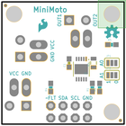](bomFront.png)|[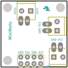](bomBack.png)|[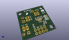](kicadPcb3d.png)|[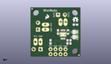](kicadPcb3dFront.png)|[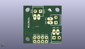](kicadPcb3dBack.png)|[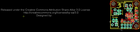](eagleImage.png)|[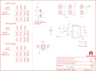](eagleSchemImage.png)|[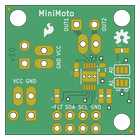](pcbdraw.png)|[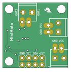](pcbdrawBack.png)|

## Tags

- hexID: PRS11890
- oompType: PROJ
- oompSize: SPAR
- oompColor: 11890
- oompDesc: STAN
- oompIndex: 01
- oompName: MiniMoto
- sources: All source files from https://github.com/sparkfun/MiniMoto (source licence details in srcLicense.md)
- linkBuyPage: https://www.sparkfun.com/products/11890
- oompID: PROJ-SPAR-11890-STAN-01
- oompParts: C1,CAPC-0603-X-NF100-V50
- oompParts: J1,HEAD-I01-X-PI02-01
- oompParts: J2,TERS-35D-L-PI02-01
- oompParts: J3,HEAD-I01-X-PI02-01
- oompParts: J4,TERS-35D-L-PI02-01
- oompParts: J5,HEAD-I01-X-PI02-01
- oompParts: J6,TERS-35D-L-PI02-01
- oompParts: J7,HEAD-I01-X-UNMATCHED-01
- oompParts: JP1,UNMATCHED-UNMATCHED-X-UNMATCHED-01
- oompParts: JP2,UNMATCHED-UNMATCHED-X-UNMATCHED-01
- oompParts: R1,RESE-0603-X-O102-01
- oompParts: R2,RESE-0603-X-O102-01
- oompParts: R3,RESE-0805-X-UNMATCHED-01
- oompParts: R4,RESE-0603-X-O103-01
- oompParts: R5,RESE-0603-X-O103-01
- oompParts: U1,UNMATCHED-UNMATCHED-X-UNMATCHED-01
- rawParts: C1,0.1uF,0.1UF-25V(+80/-20%)(0603),0603-CAP,Ceramic,CAP-00810,0.1uF,
- rawParts: FID1,FIDUCIALUFIDUCIAL,FIDUCIALUFIDUCIAL,MICRO-FIDUCIAL,Fiducial Alignment Points,,,
- rawParts: FID2,FIDUCIALUFIDUCIAL,FIDUCIALUFIDUCIAL,MICRO-FIDUCIAL,Fiducial Alignment Points,,,
- rawParts: FRAME1,FRAME-LETTER,FRAME-LETTER,CREATIVE_COMMONS,Schematic Frame,,,
- rawParts: J1,M02PTH3,M02PTH3,1X02_LONGPADS,Standard 2-pin 0.1 header. Use with,,,
- rawParts: J2,M023.5MM,M023.5MM,SCREWTERMINAL-3.5MM-2,Standard 2-pin 0.1 header. Use with,,,
- rawParts: J3,M02PTH3,M02PTH3,1X02_LONGPADS,Standard 2-pin 0.1 header. Use with,,,
- rawParts: J4,M023.5MM,M023.5MM,SCREWTERMINAL-3.5MM-2,Standard 2-pin 0.1 header. Use with,,,
- rawParts: J5,M02PTH3,M02PTH3,1X02_LONGPADS,Standard 2-pin 0.1 header. Use with,,,
- rawParts: J6,M023.5MM,M023.5MM,SCREWTERMINAL-3.5MM-2,Standard 2-pin 0.1 header. Use with,,,
- rawParts: J7,M04X2,M04X2,2X4,.1 header, two rows of four.,,,
- rawParts: JP1,JUMPER-31-2,JUMPER-31-2,SJ_3_PASTE1&2,,,,
- rawParts: JP2,JUMPER-31-2,JUMPER-31-2,SJ_3_PASTE1&2,,,,
- rawParts: LOGO1,LOGO-SFESK,LOGO-SFESK,SFE-LOGO-FLAME,Spark Fun Electronics PCB Logo,,,
- rawParts: LOGO2,OSHW-LOGOS,OSHW-LOGOS,OSHW-LOGO-S,Open Source Hardware Logo This logo indicates the piece of hardware it is found on incorporates a OSHW license and/or adheres to the definition of open source hardware found here: http://freedomdefined.org/OSHW,,,
- rawParts: LOGO3,LOGO-SFESK,LOGO-SFESK,SFE-LOGO-FLAME,Spark Fun Electronics PCB Logo,,,
- rawParts: R1,1K,1KOHM1/10W1%(0603),0603-RES,RES-07856,RES-07856,1K,
- rawParts: R2,1K,1KOHM1/10W1%(0603),0603-RES,RES-07856,RES-07856,1K,
- rawParts: R3,0.22,0.22OHM1/4W1%(0805),0805,RES-09883,RES-09883,0.22,
- rawParts: R4,10K,10KOHM1/10W1%(0603)0603,0603-RES,RES-00824,RES-00824,10K,
- rawParts: R5,10K,10KOHM1/10W1%(0603)0603,0603-RES,RES-00824,RES-00824,10K,
- rawParts: STANDOFF1,STAND-OFF,STAND-OFF,STAND-OFF,#4 Stand Off,,,
- rawParts: STANDOFF2,STAND-OFF,STAND-OFF,STAND-OFF,#4 Stand Off,,,
- rawParts: STANDOFF3,STAND-OFF,STAND-OFF,STAND-OFF,#4 Stand Off,,,
- rawParts: U1,DRV8830,DRV8830,MSOP-10-GNDPAD,DRV8830 I2C DC Motor Driver,,,

[im]: kicadPcb3d_450.png
