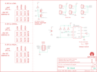

Contents
========

* [PRS11890 > Sparkfun](#prs11890--sparkfun)
	* [Schematic](#schematic)
	* [Interactive BOM](#interactive-bom)
	* [OOMP Parts](#oomp-parts)
	* [Images](#images)
	* [Tags](#tags)
  
![][im]
# PRS11890 > Sparkfun

- ID: PROJ-SPAR-11890-STAN-01
- Hex ID: PRS11890
- Name: Sparkfun
- Description: Sparkfun
- Long Link: [http://oom.lt/PROJ-SPAR-11890-STAN-01](http://oom.lt/PROJ-SPAR-11890-STAN-01)
- Short Link: [http://oom.lt/PRS11890](http://oom.lt/PRS11890)

## Schematic
  

## Interactive BOM

- Interactive BOM page: [ibom.html](https://htmlpreview.github.io/?https://github.com/oomlout/oomlout_OOMP_projects/blob/main/PROJ-SPAR-11890-STAN-01/kicad/bom/ibom.html)

## OOMP Parts
  

|OOMP Parts|
| :---: |
|C1,UNMATCHED-UNMATCHED-UNMATCHED-UNMATCHED-UNMATCHED,C1,0.1uF,0.1UF-25V(+80/-20%)(0603),0603-CAP,Ceramic,CAP-00810,0.1uF,|
|FRAME1,UNMATCHED-UNMATCHED-UNMATCHED-UNMATCHED-UNMATCHED,FID1,FIDUCIALUFIDUCIAL,FIDUCIALUFIDUCIAL,MICRO-FIDUCIAL,Fiducial Alignment Points,,,|
|J1,UNMATCHED-UNMATCHED-UNMATCHED-UNMATCHED-UNMATCHED,FID2,FIDUCIALUFIDUCIAL,FIDUCIALUFIDUCIAL,MICRO-FIDUCIAL,Fiducial Alignment Points,,,|
|J2,UNMATCHED-UNMATCHED-UNMATCHED-UNMATCHED-UNMATCHED,FRAME1,FRAME-LETTER,FRAME-LETTER,CREATIVE_COMMONS,Schematic Frame,,,|
|J3,UNMATCHED-UNMATCHED-UNMATCHED-UNMATCHED-UNMATCHED,J1,M02PTH3,M02PTH3,1X02_LONGPADS,Standard 2-pin 0.1 header. Use with,,,|
|J4,UNMATCHED-UNMATCHED-UNMATCHED-UNMATCHED-UNMATCHED,J2,M023.5MM,M023.5MM,SCREWTERMINAL-3.5MM-2,Standard 2-pin 0.1 header. Use with,,,|
|J5,UNMATCHED-UNMATCHED-UNMATCHED-UNMATCHED-UNMATCHED,J3,M02PTH3,M02PTH3,1X02_LONGPADS,Standard 2-pin 0.1 header. Use with,,,|
|J6,UNMATCHED-UNMATCHED-UNMATCHED-UNMATCHED-UNMATCHED,J4,M023.5MM,M023.5MM,SCREWTERMINAL-3.5MM-2,Standard 2-pin 0.1 header. Use with,,,|
|J7,UNMATCHED-UNMATCHED-UNMATCHED-UNMATCHED-UNMATCHED,J5,M02PTH3,M02PTH3,1X02_LONGPADS,Standard 2-pin 0.1 header. Use with,,,|
|JP1,UNMATCHED-UNMATCHED-UNMATCHED-UNMATCHED-UNMATCHED,J6,M023.5MM,M023.5MM,SCREWTERMINAL-3.5MM-2,Standard 2-pin 0.1 header. Use with,,,|
|JP2,UNMATCHED-UNMATCHED-UNMATCHED-UNMATCHED-UNMATCHED,J7,M04X2,M04X2,2X4,.1 header, two rows of four.,,,|
|LOGO1,UNMATCHED-UNMATCHED-UNMATCHED-UNMATCHED-UNMATCHED,JP1,JUMPER-31-2,JUMPER-31-2,SJ_3_PASTE1&2,,,,|
|LOGO2,UNMATCHED-UNMATCHED-UNMATCHED-UNMATCHED-UNMATCHED,JP2,JUMPER-31-2,JUMPER-31-2,SJ_3_PASTE1&2,,,,|
|LOGO3,UNMATCHED-UNMATCHED-UNMATCHED-UNMATCHED-UNMATCHED,LOGO1,LOGO-SFESK,LOGO-SFESK,SFE-LOGO-FLAME,Spark Fun Electronics PCB Logo,,,|
|R1,UNMATCHED-UNMATCHED-UNMATCHED-UNMATCHED-UNMATCHED,LOGO2,OSHW-LOGOS,OSHW-LOGOS,OSHW-LOGO-S,Open Source Hardware Logo This logo indicates the piece of hardware it is found on incorporates a OSHW license and/or adheres to the definition of open source hardware found here: http://freedomdefined.org/OSHW,,,|
|R2,UNMATCHED-UNMATCHED-UNMATCHED-UNMATCHED-UNMATCHED,LOGO3,LOGO-SFESK,LOGO-SFESK,SFE-LOGO-FLAME,Spark Fun Electronics PCB Logo,,,|
|R3,UNMATCHED-UNMATCHED-UNMATCHED-UNMATCHED-UNMATCHED,R1,1K,1KOHM1/10W1%(0603),0603-RES,RES-07856,RES-07856,1K,|
|R4,UNMATCHED-UNMATCHED-UNMATCHED-UNMATCHED-UNMATCHED,R2,1K,1KOHM1/10W1%(0603),0603-RES,RES-07856,RES-07856,1K,|
|R5,UNMATCHED-UNMATCHED-UNMATCHED-UNMATCHED-UNMATCHED,R3,0.22,0.22OHM1/4W1%(0805),0805,RES-09883,RES-09883,0.22,|
|STANDOFF1,UNMATCHED-UNMATCHED-UNMATCHED-UNMATCHED-UNMATCHED,R4,10K,10KOHM1/10W1%(0603)0603,0603-RES,RES-00824,RES-00824,10K,|
|STANDOFF2,UNMATCHED-UNMATCHED-UNMATCHED-UNMATCHED-UNMATCHED,R5,10K,10KOHM1/10W1%(0603)0603,0603-RES,RES-00824,RES-00824,10K,|
|STANDOFF3,UNMATCHED-UNMATCHED-UNMATCHED-UNMATCHED-UNMATCHED,STANDOFF1,STAND-OFF,STAND-OFF,STAND-OFF,#4 Stand Off,,,|
|U1,UNMATCHED-UNMATCHED-UNMATCHED-UNMATCHED-UNMATCHED,STANDOFF2,STAND-OFF,STAND-OFF,STAND-OFF,#4 Stand Off,,,|

## Images
  
  

|kicadPcb3d|kicadPcb3dFront|kicadPcb3dBack|eagleImage|eagleSchemImage|
| :---: | :---: | :---: | :---: | :---: |
||||||

## Tags

- hexID: PRS11890
- oompType: PROJ
- oompSize: SPAR
- oompColor: 11890
- oompDesc: STAN
- oompIndex: 01
- oompName: MiniMoto
- sources: All source files from https://github.com/sparkfun/MiniMoto (source licence details in srcLicense.md)
- linkBuyPage: https://www.sparkfun.com/products/11890
- oompID: PROJ-SPAR-11890-STAN-01
- oompParts: C1,UNMATCHED-UNMATCHED-UNMATCHED-UNMATCHED-UNMATCHED
- oompParts: FRAME1,UNMATCHED-UNMATCHED-UNMATCHED-UNMATCHED-UNMATCHED
- oompParts: J1,UNMATCHED-UNMATCHED-UNMATCHED-UNMATCHED-UNMATCHED
- oompParts: J2,UNMATCHED-UNMATCHED-UNMATCHED-UNMATCHED-UNMATCHED
- oompParts: J3,UNMATCHED-UNMATCHED-UNMATCHED-UNMATCHED-UNMATCHED
- oompParts: J4,UNMATCHED-UNMATCHED-UNMATCHED-UNMATCHED-UNMATCHED
- oompParts: J5,UNMATCHED-UNMATCHED-UNMATCHED-UNMATCHED-UNMATCHED
- oompParts: J6,UNMATCHED-UNMATCHED-UNMATCHED-UNMATCHED-UNMATCHED
- oompParts: J7,UNMATCHED-UNMATCHED-UNMATCHED-UNMATCHED-UNMATCHED
- oompParts: JP1,UNMATCHED-UNMATCHED-UNMATCHED-UNMATCHED-UNMATCHED
- oompParts: JP2,UNMATCHED-UNMATCHED-UNMATCHED-UNMATCHED-UNMATCHED
- oompParts: LOGO1,UNMATCHED-UNMATCHED-UNMATCHED-UNMATCHED-UNMATCHED
- oompParts: LOGO2,UNMATCHED-UNMATCHED-UNMATCHED-UNMATCHED-UNMATCHED
- oompParts: LOGO3,UNMATCHED-UNMATCHED-UNMATCHED-UNMATCHED-UNMATCHED
- oompParts: R1,UNMATCHED-UNMATCHED-UNMATCHED-UNMATCHED-UNMATCHED
- oompParts: R2,UNMATCHED-UNMATCHED-UNMATCHED-UNMATCHED-UNMATCHED
- oompParts: R3,UNMATCHED-UNMATCHED-UNMATCHED-UNMATCHED-UNMATCHED
- oompParts: R4,UNMATCHED-UNMATCHED-UNMATCHED-UNMATCHED-UNMATCHED
- oompParts: R5,UNMATCHED-UNMATCHED-UNMATCHED-UNMATCHED-UNMATCHED
- oompParts: STANDOFF1,UNMATCHED-UNMATCHED-UNMATCHED-UNMATCHED-UNMATCHED
- oompParts: STANDOFF2,UNMATCHED-UNMATCHED-UNMATCHED-UNMATCHED-UNMATCHED
- oompParts: STANDOFF3,UNMATCHED-UNMATCHED-UNMATCHED-UNMATCHED-UNMATCHED
- oompParts: U1,UNMATCHED-UNMATCHED-UNMATCHED-UNMATCHED-UNMATCHED
- rawParts: C1,0.1uF,0.1UF-25V(+80/-20%)(0603),0603-CAP,Ceramic,CAP-00810,0.1uF,
- rawParts: FID1,FIDUCIALUFIDUCIAL,FIDUCIALUFIDUCIAL,MICRO-FIDUCIAL,Fiducial Alignment Points,,,
- rawParts: FID2,FIDUCIALUFIDUCIAL,FIDUCIALUFIDUCIAL,MICRO-FIDUCIAL,Fiducial Alignment Points,,,
- rawParts: FRAME1,FRAME-LETTER,FRAME-LETTER,CREATIVE_COMMONS,Schematic Frame,,,
- rawParts: J1,M02PTH3,M02PTH3,1X02_LONGPADS,Standard 2-pin 0.1 header. Use with,,,
- rawParts: J2,M023.5MM,M023.5MM,SCREWTERMINAL-3.5MM-2,Standard 2-pin 0.1 header. Use with,,,
- rawParts: J3,M02PTH3,M02PTH3,1X02_LONGPADS,Standard 2-pin 0.1 header. Use with,,,
- rawParts: J4,M023.5MM,M023.5MM,SCREWTERMINAL-3.5MM-2,Standard 2-pin 0.1 header. Use with,,,
- rawParts: J5,M02PTH3,M02PTH3,1X02_LONGPADS,Standard 2-pin 0.1 header. Use with,,,
- rawParts: J6,M023.5MM,M023.5MM,SCREWTERMINAL-3.5MM-2,Standard 2-pin 0.1 header. Use with,,,
- rawParts: J7,M04X2,M04X2,2X4,.1 header, two rows of four.,,,
- rawParts: JP1,JUMPER-31-2,JUMPER-31-2,SJ_3_PASTE1&2,,,,
- rawParts: JP2,JUMPER-31-2,JUMPER-31-2,SJ_3_PASTE1&2,,,,
- rawParts: LOGO1,LOGO-SFESK,LOGO-SFESK,SFE-LOGO-FLAME,Spark Fun Electronics PCB Logo,,,
- rawParts: LOGO2,OSHW-LOGOS,OSHW-LOGOS,OSHW-LOGO-S,Open Source Hardware Logo This logo indicates the piece of hardware it is found on incorporates a OSHW license and/or adheres to the definition of open source hardware found here: http://freedomdefined.org/OSHW,,,
- rawParts: LOGO3,LOGO-SFESK,LOGO-SFESK,SFE-LOGO-FLAME,Spark Fun Electronics PCB Logo,,,
- rawParts: R1,1K,1KOHM1/10W1%(0603),0603-RES,RES-07856,RES-07856,1K,
- rawParts: R2,1K,1KOHM1/10W1%(0603),0603-RES,RES-07856,RES-07856,1K,
- rawParts: R3,0.22,0.22OHM1/4W1%(0805),0805,RES-09883,RES-09883,0.22,
- rawParts: R4,10K,10KOHM1/10W1%(0603)0603,0603-RES,RES-00824,RES-00824,10K,
- rawParts: R5,10K,10KOHM1/10W1%(0603)0603,0603-RES,RES-00824,RES-00824,10K,
- rawParts: STANDOFF1,STAND-OFF,STAND-OFF,STAND-OFF,#4 Stand Off,,,
- rawParts: STANDOFF2,STAND-OFF,STAND-OFF,STAND-OFF,#4 Stand Off,,,
- rawParts: STANDOFF3,STAND-OFF,STAND-OFF,STAND-OFF,#4 Stand Off,,,
- rawParts: U1,DRV8830,DRV8830,MSOP-10-GNDPAD,DRV8830 I2C DC Motor Driver,,,

[im]: kicadPcb3d_450.png
