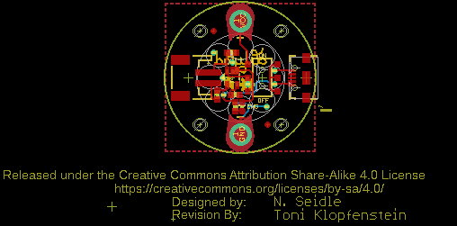
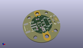
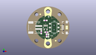
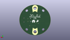
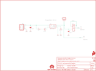

Contents
========

* [PRS11893 > LilyPad Simple Power](#prs11893--lilypad-simple-power)
	* [Schematic](#schematic)
	* [PCB](#pcb)
	* [Interactive BOM](#interactive-bom)
	* [OOMP Parts](#oomp-parts)
	* [Images](#images)
	* [Tags](#tags)
  
![][im]
# PRS11893 > LilyPad Simple Power

- ID: PROJ-SPAR-11893-STAN-01
- Hex ID: PRS11893
- Name: Sparkfun
- Description: Sparkfun
- Long Link: [http://oom.lt/PROJ-SPAR-11893-STAN-01](http://oom.lt/PROJ-SPAR-11893-STAN-01)
- Short Link: [http://oom.lt/PRS11893](http://oom.lt/PRS11893)

## Schematic
  

## PCB
  

## Interactive BOM

- Interactive BOM page: [ibom.html](https://htmlpreview.github.io/?https://github.com/oomlout/oomlout_OOMP_projects/blob/main/PROJ-SPAR-11893-STAN-01/kicad/bom/ibom.html)

## OOMP Parts
  

|OOMP Parts|
| :---: |
|C1 C1,CAPC-0603-X-UF47D-01|
|C2 C2,CAPC-0603-X-UF47D-01|
|[D1 LEDS-0603-G-STAN-01 SMD (0603) Green LED](https://github.com/oomlout/oomlout_OOMP_parts/tree/main/LEDS-0603-G-STAN-01/)|
|FRAME1 FRAME1,UNMATCHED-UNMATCHED-X-UNMATCHED-01|
|JP1 JP1,UNMATCHED-UNMATCHED-X-UNMATCHED-01|
|JP4 JP4,UNMATCHED-UNMATCHED-X-UNMATCHED-01|
|[R3 RESE-0603-X-O331-01 SMD (0603) 330 Ohm Resistor](https://github.com/oomlout/oomlout_OOMP_parts/tree/main/RESE-0603-X-O331-01/)|
|R4 R4,RESE-0603-X-UNMATCHED-01|
|S1 S1,UNMATCHED-UNMATCHED-X-UNMATCHED-01|
|U1 U1,UNMATCHED-SO235-X-UNMATCHED-01|

## Images
  
  

|kicadPcb3d|kicadPcb3dFront|kicadPcb3dBack|eagleImage|eagleSchemImage|
| :---: | :---: | :---: | :---: | :---: |
||||||

## Tags

- hexID: PRS11893
- oompType: PROJ
- oompSize: SPAR
- oompColor: 11893
- oompDesc: STAN
- oompIndex: 01
- oompName: LilyPad Simple Power
- sources: All source files from https://github.com/sparkfun/LilyPad_Simple_Power (source licence details in srcLicense.md)
- linkBuyPage: https://www.sparkfun.com/products/11893
- oompID: PROJ-SPAR-11893-STAN-01
- oompParts: C1,CAPC-0603-X-UF47D-01
- oompParts: C2,CAPC-0603-X-UF47D-01
- oompParts: D1,LEDS-0603-G-STAN-01
- oompParts: FRAME1,UNMATCHED-UNMATCHED-X-UNMATCHED-01
- oompParts: JP1,UNMATCHED-UNMATCHED-X-UNMATCHED-01
- oompParts: JP4,UNMATCHED-UNMATCHED-X-UNMATCHED-01
- oompParts: R3,RESE-0603-X-O331-01
- oompParts: R4,RESE-0603-X-UNMATCHED-01
- oompParts: S1,UNMATCHED-UNMATCHED-X-UNMATCHED-01
- oompParts: U1,UNMATCHED-SO235-X-UNMATCHED-01
- rawParts: C1,4.7uF,4.7UF-6.3V-10%(0603)0603,0603-CAP,CAP-08280,,CAP-08280,4.7uF,,
- rawParts: C2,4.7uF,4.7UF-6.3V-10%(0603)0603,0603-CAP,CAP-08280,,CAP-08280,4.7uF,,
- rawParts: D1,Yellow,LED-YELLOW0603,LED-0603,Yellow SMD LEDs,,DIO-09003,Yellow,,
- rawParts: FID1,FIDUCIAL1X2,FIDUCIAL1X2,FIDUCIAL-1X2,Fiducial Alignment Points,,,,,
- rawParts: FID2,FIDUCIAL1X2,FIDUCIAL1X2,FIDUCIAL-1X2,Fiducial Alignment Points,,,,,
- rawParts: FRAME1,,FRAME-LETTER,CREATIVE_COMMONS,Schematic Frame,Nathan Seidle,,,v21,
- rawParts: JP1,M02-JST-2MM-SMT,M02-JST-2MM-SMT,JST-2-SMD,Standard 2-pin 0.1 header. Use with,,CONN-08352,,,
- rawParts: JP2,SEWTAP9,SEWTAP9,PETAL-LONG-1-2SIDE,Sew Taps for LilyPad Boards.,,,,,
- rawParts: JP3,SEWTAP9,SEWTAP9,PETAL-LONG-1-2SIDE,Sew Taps for LilyPad Boards.,,,,,
- rawParts: JP4,USB_MICROB_PLUGCONN-11752,USB_MICROB_PLUGCONN-11752,USB-B-MICRO-SMD_V03,USB Micro-B connectors,,CONN-11752,,,
- rawParts: JP5,SFE_LOGO_FLAME.1_INCH,SFE_LOGO_FLAME.1_INCH,SFE_LOGO_FLAME_.1,SFE Logo, flame only,,,,,
- rawParts: R3,330,330OHM1/10W1%(0603),0603-RES,RES-00818,,RES-00818,330,,
- rawParts: R4,2.0k,2.0KOHM1/10W5%(0603),0603-RES,RES-08296,,RES-08296,2.0k,,
- rawParts: S1,DPDT,SWITCH-DPDTAYZ0202,AYZ0202,DPDT Version of the COM-00597,,SWCH-08179,DPDT,,
- rawParts: STANDOFF1,SEW-HOLE-NO-PAD,SEW-HOLE-NO-PAD,SEW-HOLE-NO-PAD,#4 Stand Off,,,,,
- rawParts: STANDOFF2,SEW-HOLE-NO-PAD,SEW-HOLE-NO-PAD,SEW-HOLE-NO-PAD,#4 Stand Off,,,,,
- rawParts: STANDOFF3,SEW-HOLE-NO-PAD,SEW-HOLE-NO-PAD,SEW-HOLE-NO-PAD,#4 Stand Off,,,,,
- rawParts: STANDOFF4,SEW-HOLE-NO-PAD,SEW-HOLE-NO-PAD,SEW-HOLE-NO-PAD,#4 Stand Off,,,,,
- rawParts: U$1,LOGO-LPLP,LOGO-LPLP,LOGO-LILYPAD,,,,,,
- rawParts: U$5,OSHW-LOGOS,OSHW-LOGOS,OSHW-LOGO-S,Open Source Hardware Logo This logo indicates the piece of hardware it is found on incorporates a OSHW license and/or adheres to the definition of open source hardware found here: http://freedomdefined.org/OSHW,,,,,
- rawParts: U$6,REVISION,REVISION,REVISION,,,,,,
- rawParts: U1,MCP73831,MCP73831,SOT23-5,Miniature single cell, fully integrated Li-Ion, Li-polymer charge management controller,,IC-09995,,,

[im]: kicadPcb3d_450.png
