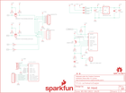

Contents
========

* [PRS11924 > Purpletooth Jamboree](#prs11924--purpletooth-jamboree)
	* [Schematic](#schematic)
	* [PCB](#pcb)
	* [Interactive BOM](#interactive-bom)
	* [OOMP Parts](#oomp-parts)
	* [Images](#images)
	* [Tags](#tags)
  
![][im]
# PRS11924 > Purpletooth Jamboree

- ID: PROJ-SPAR-11924-STAN-01
- Hex ID: PRS11924
- Name: Sparkfun
- Description: Sparkfun
- Long Link: [http://oom.lt/PROJ-SPAR-11924-STAN-01](http://oom.lt/PROJ-SPAR-11924-STAN-01)
- Short Link: [http://oom.lt/PRS11924](http://oom.lt/PRS11924)

## Schematic
  

## PCB
  

## Interactive BOM

- Interactive BOM page: [ibom.html](https://htmlpreview.github.io/?https://github.com/oomlout/oomlout_OOMP_projects/blob/main/PROJ-SPAR-11924-STAN-01/kicad/bom/ibom.html)

## OOMP Parts
  

|OOMP Parts|
| :---: |
|CAPT-3216-X-UF10-01 C1, C3|
|[CAPC-0805-X-UF1-V25  SMD (0805) 1 uF Capacitor (Ceramic) 25v  C2](https://github.com/oomlout/oomlout_OOMP_parts/tree/main/CAPC-0805-X-UF1-V25/)|
|[CAPC-0603-X-UF47D-V10  SMD (0603) 4.7 uF Capacitor (Ceramic) 10v  C4](https://github.com/oomlout/oomlout_OOMP_parts/tree/main/CAPC-0603-X-UF47D-V10/)|
|CAPC-0603-X-PF180-01 C5, C10|
|CAPC-0603-X-UF1D-01 C6, C8, C11, C13|
|CAPC-0603-X-PF47-01 C7, C9, C12, C14|
|[CAPC-0603-X-UF1-V25  SMD (0603) 1 uF Capacitor (Ceramic) 25v  C15, C16, C17](https://github.com/oomlout/oomlout_OOMP_parts/tree/main/CAPC-0603-X-UF1-V25/)|
|[CAPC-0603-X-PF15-V50  SMD (0603) 15 pF Capacitor (Ceramic) 50v  C18, C19](https://github.com/oomlout/oomlout_OOMP_parts/tree/main/CAPC-0603-X-PF15-V50/)|
|[LEDS-0603-G-STAN-01  SMD (0603) Green LED  D1](https://github.com/oomlout/oomlout_OOMP_parts/tree/main/LEDS-0603-G-STAN-01/)|
|[LEDS-0603-R-STAN-01  SMD (0603) Red LED  D2](https://github.com/oomlout/oomlout_OOMP_parts/tree/main/LEDS-0603-R-STAN-01/)|
|[LEDS-0603-L-STAN-01  SMD (0603) Blue LED  D3](https://github.com/oomlout/oomlout_OOMP_parts/tree/main/LEDS-0603-L-STAN-01/)|
|DIOD-UNMATCHED-X-UNMATCHED-01 D4, D5, D6|
|HEAD-I01-X-UNMATCHED-01 JP1, JP6, JP11, JP16, JP17|
|UNMATCHED-UNMATCHED-X-UNMATCHED-01 JP2, JP19, S1, S2, S3, S4, S5, S6, S7, S8, U1, U3|
|[HEAD-I01-X-PI02-01  2.54 mm 2 Pin Header  JP3, JP4, JP5, JP7, JP8, JP9, JP21, JP22](https://github.com/oomlout/oomlout_OOMP_parts/tree/main/HEAD-I01-X-PI02-01/)|
|[HEAD-I01-X-PI04-01  2.54 mm 4 Pin Header  JP10, JP15](https://github.com/oomlout/oomlout_OOMP_parts/tree/main/HEAD-I01-X-PI04-01/)|
|[HEAD-I01-X-PI06-01  2.54 mm 6 Pin Header  JP12](https://github.com/oomlout/oomlout_OOMP_parts/tree/main/HEAD-I01-X-PI06-01/)|
|TERS-35D-L-UNMATCHED-01 JP13, JP14|
|[HEAD-I01-X-PI03-01  2.54 mm 3 Pin Header  JP18, JP20](https://github.com/oomlout/oomlout_OOMP_parts/tree/main/HEAD-I01-X-PI03-01/)|
|UNMATCHED-0603-X-UNMATCHED-01 L1, L2|
|UNMATCHED-SO23-X-KBSS138-01 Q1, Q2|
|UNMATCHED-SO23-X-UNMATCHED-01 Q3|
|[RESE-0603-X-O103-01  SMD (0603) 10k Ohm Resistor  R1, R5, R6, R7, R8, R9, R10, R27, R33](https://github.com/oomlout/oomlout_OOMP_parts/tree/main/RESE-0603-X-O103-01/)|
|[RESE-0603-X-O241-01  SMD (0603) 240 Ohm Resistor  R2, R3, R4](https://github.com/oomlout/oomlout_OOMP_parts/tree/main/RESE-0603-X-O241-01/)|
|RESE-0805-X-UNMATCHED-01 R11, R12|
|[RESE-0603-X-O153-01  SMD (0603) 16k Ohm Resistor  R13, R16, R19, R22](https://github.com/oomlout/oomlout_OOMP_parts/tree/main/RESE-0603-X-O153-01/)|
|RESE-0603-X-UNMATCHED-01 R14, R18, R20, R24|
|[RESE-0603-X-O433-01  SMD (0603) 43k Ohm Resistor  R15, R17, R21, R23](https://github.com/oomlout/oomlout_OOMP_parts/tree/main/RESE-0603-X-O433-01/)|
|[RESE-0603-X-O222-01  SMD (0603) 2.2k Ohm Resistor  R25, R26, R28, R29, R30, R31, R32](https://github.com/oomlout/oomlout_OOMP_parts/tree/main/RESE-0603-X-O222-01/)|
|UNMATCHED-SO235-X-UNMATCHED-01 U2|

## Images
  
  

|kicadPcb3d|kicadPcb3dFront|kicadPcb3dBack|eagleImage|eagleSchemImage|
| :---: | :---: | :---: | :---: | :---: |
||||||

## Tags

- hexID: PRS11924
- oompType: PROJ
- oompSize: SPAR
- oompColor: 11924
- oompDesc: STAN
- oompIndex: 01
- oompName: Purpletooth Jamboree
- sources: All source files from https://github.com/sparkfun/Purpletooth_Jamboree (source licence details in srcLicense.md)
- linkBuyPage: https://www.sparkfun.com/products/11924
- oompID: PROJ-SPAR-11924-STAN-01
- oompParts: C1,CAPT-3216-X-UF10-01
- oompParts: C2,CAPC-0805-X-UF1-V25
- oompParts: C3,CAPT-3216-X-UF10-01
- oompParts: C4,CAPC-0603-X-UF47D-V10
- oompParts: C5,CAPC-0603-X-PF180-01
- oompParts: C6,CAPC-0603-X-UF1D-01
- oompParts: C7,CAPC-0603-X-PF47-01
- oompParts: C8,CAPC-0603-X-UF1D-01
- oompParts: C9,CAPC-0603-X-PF47-01
- oompParts: C10,CAPC-0603-X-PF180-01
- oompParts: C11,CAPC-0603-X-UF1D-01
- oompParts: C12,CAPC-0603-X-PF47-01
- oompParts: C13,CAPC-0603-X-UF1D-01
- oompParts: C14,CAPC-0603-X-PF47-01
- oompParts: C15,CAPC-0603-X-UF1-V25
- oompParts: C16,CAPC-0603-X-UF1-V25
- oompParts: C17,CAPC-0603-X-UF1-V25
- oompParts: C18,CAPC-0603-X-PF15-V50
- oompParts: C19,CAPC-0603-X-PF15-V50
- oompParts: D1,LEDS-0603-G-STAN-01
- oompParts: D2,LEDS-0603-R-STAN-01
- oompParts: D3,LEDS-0603-L-STAN-01
- oompParts: D4,DIOD-UNMATCHED-X-UNMATCHED-01
- oompParts: D5,DIOD-UNMATCHED-X-UNMATCHED-01
- oompParts: D6,DIOD-UNMATCHED-X-UNMATCHED-01
- oompParts: JP1,HEAD-I01-X-UNMATCHED-01
- oompParts: JP2,UNMATCHED-UNMATCHED-X-UNMATCHED-01
- oompParts: JP3,HEAD-I01-X-PI02-01
- oompParts: JP4,HEAD-I01-X-PI02-01
- oompParts: JP5,HEAD-I01-X-PI02-01
- oompParts: JP6,HEAD-I01-X-UNMATCHED-01
- oompParts: JP7,HEAD-I01-X-PI02-01
- oompParts: JP8,HEAD-I01-X-PI02-01
- oompParts: JP9,HEAD-I01-X-PI02-01
- oompParts: JP10,HEAD-I01-X-PI04-01
- oompParts: JP11,HEAD-I01-X-UNMATCHED-01
- oompParts: JP12,HEAD-I01-X-PI06-01
- oompParts: JP13,TERS-35D-L-UNMATCHED-01
- oompParts: JP14,TERS-35D-L-UNMATCHED-01
- oompParts: JP15,HEAD-I01-X-PI04-01
- oompParts: JP16,HEAD-I01-X-UNMATCHED-01
- oompParts: JP17,HEAD-I01-X-UNMATCHED-01
- oompParts: JP18,HEAD-I01-X-PI03-01
- oompParts: JP19,UNMATCHED-UNMATCHED-X-UNMATCHED-01
- oompParts: JP20,HEAD-I01-X-PI03-01
- oompParts: JP21,HEAD-I01-X-PI02-01
- oompParts: JP22,HEAD-I01-X-PI02-01
- oompParts: L1,UNMATCHED-0603-X-UNMATCHED-01
- oompParts: L2,UNMATCHED-0603-X-UNMATCHED-01
- oompParts: Q1,UNMATCHED-SO23-X-KBSS138-01
- oompParts: Q2,UNMATCHED-SO23-X-KBSS138-01
- oompParts: Q3,UNMATCHED-SO23-X-UNMATCHED-01
- oompParts: R1,RESE-0603-X-O103-01
- oompParts: R2,RESE-0603-X-O241-01
- oompParts: R3,RESE-0603-X-O241-01
- oompParts: R4,RESE-0603-X-O241-01
- oompParts: R5,RESE-0603-X-O103-01
- oompParts: R6,RESE-0603-X-O103-01
- oompParts: R7,RESE-0603-X-O103-01
- oompParts: R8,RESE-0603-X-O103-01
- oompParts: R9,RESE-0603-X-O103-01
- oompParts: R10,RESE-0603-X-O103-01
- oompParts: R11,RESE-0805-X-UNMATCHED-01
- oompParts: R12,RESE-0805-X-UNMATCHED-01
- oompParts: R13,RESE-0603-X-O153-01
- oompParts: R14,RESE-0603-X-UNMATCHED-01
- oompParts: R15,RESE-0603-X-O433-01
- oompParts: R16,RESE-0603-X-O153-01
- oompParts: R17,RESE-0603-X-O433-01
- oompParts: R18,RESE-0603-X-UNMATCHED-01
- oompParts: R19,RESE-0603-X-O153-01
- oompParts: R20,RESE-0603-X-UNMATCHED-01
- oompParts: R21,RESE-0603-X-O433-01
- oompParts: R22,RESE-0603-X-O153-01
- oompParts: R23,RESE-0603-X-O433-01
- oompParts: R24,RESE-0603-X-UNMATCHED-01
- oompParts: R25,RESE-0603-X-O222-01
- oompParts: R26,RESE-0603-X-O222-01
- oompParts: R27,RESE-0603-X-O103-01
- oompParts: R28,RESE-0603-X-O222-01
- oompParts: R29,RESE-0603-X-O222-01
- oompParts: R30,RESE-0603-X-O222-01
- oompParts: R31,RESE-0603-X-O222-01
- oompParts: R32,RESE-0603-X-O222-01
- oompParts: R33,RESE-0603-X-O103-01
- oompParts: S1,UNMATCHED-UNMATCHED-X-UNMATCHED-01
- oompParts: S2,UNMATCHED-UNMATCHED-X-UNMATCHED-01
- oompParts: S3,UNMATCHED-UNMATCHED-X-UNMATCHED-01
- oompParts: S4,UNMATCHED-UNMATCHED-X-UNMATCHED-01
- oompParts: S5,UNMATCHED-UNMATCHED-X-UNMATCHED-01
- oompParts: S6,UNMATCHED-UNMATCHED-X-UNMATCHED-01
- oompParts: S7,UNMATCHED-UNMATCHED-X-UNMATCHED-01
- oompParts: S8,UNMATCHED-UNMATCHED-X-UNMATCHED-01
- oompParts: U1,UNMATCHED-UNMATCHED-X-UNMATCHED-01
- oompParts: U2,UNMATCHED-SO235-X-UNMATCHED-01
- oompParts: U3,UNMATCHED-UNMATCHED-X-UNMATCHED-01
- rawParts: C1,10uF,10UF-16V-10%(TANT),EIA3216,CAP-00811,,,CAP-00811,10uF,
- rawParts: C2,1uF,1UF-25V-10%(0805),0805,CAP-08064,,,CAP-08064,1uF,
- rawParts: C3,10uF,10UF-16V-10%(TANT),EIA3216,CAP-00811,,,CAP-00811,10uF,
- rawParts: C4,4.7uF,4.7UF-6.3V-10%(0603)0603,0603-CAP,CAP-08280,,,CAP-08280,4.7uF,
- rawParts: C5,180pF,CAP0603-CAP,0603-CAP,Capacitor,Digikey,1276-1255-2-ND,,,
- rawParts: C6,0.1uF,0.1UF-25V-5%(0603),0603-CAP,CAP-08604,,,CAP-08604,0.1uF,
- rawParts: C7,47pF,47PF-50V-5%(0603),0603-CAP,CAP-08913,,,CAP-08913,47pF,
- rawParts: C8,0.1uF,0.1UF-25V-5%(0603),0603-CAP,CAP-08604,,,CAP-08604,0.1uF,
- rawParts: C9,47pF,47PF-50V-5%(0603),0603-CAP,CAP-08913,,,CAP-08913,47pF,
- rawParts: C10,180pF,CAP0603-CAP,0603-CAP,Capacitor,Digikey,1276-1255-2-ND,,,
- rawParts: C11,0.1uF,0.1UF-25V-5%(0603),0603-CAP,CAP-08604,,,CAP-08604,0.1uF,
- rawParts: C12,47pF,47PF-50V-5%(0603),0603-CAP,CAP-08913,,,CAP-08913,47pF,
- rawParts: C13,0.1uF,0.1UF-25V-5%(0603),0603-CAP,CAP-08604,,,CAP-08604,0.1uF,
- rawParts: C14,47pF,47PF-50V-5%(0603),0603-CAP,CAP-08913,,,CAP-08913,47pF,
- rawParts: C15,1.0uF,1.0UF-16V-10%(0603),0603-CAP,CAP-00868,,,CAP-00868,1.0uF,
- rawParts: C16,1.0uF,1.0UF-16V-10%(0603),0603-CAP,CAP-00868,,,CAP-00868,1.0uF,
- rawParts: C17,1.0uF,1.0UF-16V-10%(0603),0603-CAP,CAP-00868,,,CAP-00868,1.0uF,
- rawParts: C18,15pF,15PF-50V-5%(0603),0603-CAP,CAP-07881,,,CAP-07881,15pF,
- rawParts: C19,15pF,15PF-50V-5%(0603),0603-CAP,CAP-07881,,,CAP-07881,15pF,
- rawParts: D1,GREEN,LED-GREEN0603,LED-0603,Various green LEDs,,,DIO-00821,GREEN,
- rawParts: D2,RED,LED-RED0603,LED-0603,Assorted Red LEDs,,,DIO-00819,RED,
- rawParts: D3,BLUE,LED-BLUE0603,LED-0603,Blue LEDs for production use,,,DIO-08575,BLUE,
- rawParts: D4,BA340A,B340A,SMA-DIODE,Schottky Diode,,,DIO-09886,BA340A,
- rawParts: D5,BA340A,B340A,SMA-DIODE,Schottky Diode,,,DIO-09886,BA340A,
- rawParts: D6,BA340A,B340A,SMA-DIODE,Schottky Diode,,,DIO-09886,BA340A,
- rawParts: FID1,FIDUCIALUFIDUCIAL,FIDUCIALUFIDUCIAL,MICRO-FIDUCIAL,Fiducial Alignment Points,,,,,
- rawParts: FID2,FIDUCIALUFIDUCIAL,FIDUCIALUFIDUCIAL,MICRO-FIDUCIAL,Fiducial Alignment Points,,,,,
- rawParts: FRAME1,FRAME-LETTER,FRAME-LETTER,CREATIVE_COMMONS,Schematic Frame,,,,,
- rawParts: JP1,FTDI_BASICPTH,FTDI_BASICPTH,FTDI_BASIC,FTDI Basic header with labels,,,,,
- rawParts: JP2,,USB-ABCONN-11794,USB-AB-MICRO-SMD_V03,This is a USB AB connector that is compatible with USB OTG. i.e. this connector can serve as a host or device,,,CONN-11794,,
- rawParts: JP3,M02PTH,M02PTH,1X02,Standard 2-pin 0.1 header. Use with,,,,,
- rawParts: JP4,M02PTH,M02PTH,1X02,Standard 2-pin 0.1 header. Use with,,,,,
- rawParts: JP5,M02PTH,M02PTH,1X02,Standard 2-pin 0.1 header. Use with,,,,,
- rawParts: JP6,M02-JST-2MM-SMT,M02-JST-2MM-SMT,JST-2-SMD,Standard 2-pin 0.1 header. Use with,,,CONN-08352,,
- rawParts: JP7,M02PTH,M02PTH,1X02,Standard 2-pin 0.1 header. Use with,,,,,
- rawParts: JP8,M02PTH,M02PTH,1X02,Standard 2-pin 0.1 header. Use with,,,,,
- rawParts: JP9,M02PTH,M02PTH,1X02,Standard 2-pin 0.1 header. Use with,,,,,
- rawParts: JP10,,M04PTH,1X04,Header 4,,,,,
- rawParts: JP11,,M03X22X3_SILK_SM,2X3,2x3 .1 header.,,,,,
- rawParts: JP12,,M06SIP,1X06,Header 6,,,,,
- rawParts: JP13,AUDIO-JACK2SMD,AUDIO-JACK2SMD,AUDIO-JACK-3.5MM-SMD,Stereo audio jack with bypass switches.,,,CONN-10353,,
- rawParts: JP14,AUDIO-JACK2SMD,AUDIO-JACK2SMD,AUDIO-JACK-3.5MM-SMD,Stereo audio jack with bypass switches.,,,CONN-10353,,
- rawParts: JP15,,M04PTH,1X04,Header 4,,,,,
- rawParts: JP16,M04X2,M04X2,2X4,.1 header, two rows of four.,,,,,
- rawParts: JP17,M05X2PTH,M05X2PTH,AVR_ICSP,Header 5x2,,,,,
- rawParts: JP18,,M03PTH,1X03,Header 3,,,,,
- rawParts: JP19,FTDI_DEVICE,FTDI_DEVICE,FTDI_DEVICE_SIDE,Connector which mates to FTDI basic or FTDI cable.,,,,,
- rawParts: JP20,,M03PTH,1X03,Header 3,,,,,
- rawParts: JP21,M02PTH,M02PTH,1X02,Standard 2-pin 0.1 header. Use with,,,,,
- rawParts: JP22,M02PTH,M02PTH,1X02,Standard 2-pin 0.1 header. Use with,,,,,
- rawParts: L1,15nH,INDUCTOR0603,0603,Inductors,DIGIKEY,535-11527-1-ND,,,
- rawParts: L2,15nH,INDUCTOR0603,0603,Inductors,DIGIKEY,535-11527-1-ND,,,
- rawParts: LOGO1,OSHW-LOGOM,OSHW-LOGOM,OSHW-LOGO-M,Open Source Hardware Logo This logo indicates the piece of hardware it is found on incorporates a OSHW license and/or adheres to the definition of open source hardware found here: http://freedomdefined.org/OSHW,,,,,
- rawParts: LOGO2,SFE_LOGO_NAME_FLAME.2_INCH,SFE_LOGO_NAME_FLAME.2_INCH,SFE_LOGO_NAME_FLAME_.2,SFE Logo, name and flame,,,,,
- rawParts: Q1,MOSFET-NCHANNELBSS138,MOSFET-NCHANNELBSS138,SOT23,Common NMOSFET Parts,,,TRANS-00830,,
- rawParts: Q2,MOSFET-NCHANNELBSS138,MOSFET-NCHANNELBSS138,SOT23,Common NMOSFET Parts,,,TRANS-00830,,
- rawParts: Q3,MMBT4403,TRANSISTOR_PNPMMBT4403,SOT23,Generic PNP BJT,,,TRANS-09245,MMBT4403,
- rawParts: R1,10K,10KOHM1/10W1%(0603)0603,0603-RES,RES-00824,,,RES-00824,10K,
- rawParts: R2,240,240OHM1/10W1%(0603),0603-RES,RES-07849,,,RES-07849,240,
- rawParts: R3,240,240OHM1/10W1%(0603),0603-RES,RES-07849,,,RES-07849,240,
- rawParts: R4,240,240OHM1/10W1%(0603),0603-RES,RES-07849,,,RES-07849,240,
- rawParts: R5,10K,10KOHM1/10W1%(0603)0603,0603-RES,RES-00824,,,RES-00824,10K,
- rawParts: R6,10K,10KOHM1/10W1%(0603)0603,0603-RES,RES-00824,,,RES-00824,10K,
- rawParts: R7,10K,10KOHM1/10W1%(0603)0603,0603-RES,RES-00824,,,RES-00824,10K,
- rawParts: R8,10K,10KOHM1/10W1%(0603)0603,0603-RES,RES-00824,,,RES-00824,10K,
- rawParts: R9,10K,10KOHM1/10W1%(0603)0603,0603-RES,RES-00824,,,RES-00824,10K,
- rawParts: R10,10K,10KOHM1/10W1%(0603)0603,0603-RES,RES-00824,,,RES-00824,10K,
- rawParts: R11,0.75,0.75OHM1/4W1%(0805),0805,RES-08474,,,RES-08474,0.75,
- rawParts: R12,0.22,0.22OHM1/4W1%(0805),0805,RES-09883,,,RES-09883,0.22,
- rawParts: R13,15K,15KOHM1/10W1%(0603)0603,0603-RES,RES-07854,,,RES-07854,15K,
- rawParts: R14,30.1k,30.1KOHM1/10W1%(0603),0603-RES,RES-08595,,,RES-08595,30.1k,
- rawParts: R15,43k,43KOHM1/10W1%(0603),0603-RES,RES-07858,,,RES-07858,43k,
- rawParts: R16,15K,15KOHM1/10W1%(0603)0603,0603-RES,RES-07854,,,RES-07854,15K,
- rawParts: R17,43k,43KOHM1/10W1%(0603),0603-RES,RES-07858,,,RES-07858,43k,
- rawParts: R18,30.1k,30.1KOHM1/10W1%(0603),0603-RES,RES-08595,,,RES-08595,30.1k,
- rawParts: R19,15K,15KOHM1/10W1%(0603)0603,0603-RES,RES-07854,,,RES-07854,15K,
- rawParts: R20,30.1k,30.1KOHM1/10W1%(0603),0603-RES,RES-08595,,,RES-08595,30.1k,
- rawParts: R21,43k,43KOHM1/10W1%(0603),0603-RES,RES-07858,,,RES-07858,43k,
- rawParts: R22,15K,15KOHM1/10W1%(0603)0603,0603-RES,RES-07854,,,RES-07854,15K,
- rawParts: R23,43k,43KOHM1/10W1%(0603),0603-RES,RES-07858,,,RES-07858,43k,
- rawParts: R24,30.1k,30.1KOHM1/10W1%(0603),0603-RES,RES-08595,,,RES-08595,30.1k,
- rawParts: R25,2.2k,2.2KOHM1/10W1%(0603),0603-RES,RES-08272,,,RES-08272,2.2k,
- rawParts: R26,2.2k,2.2KOHM1/10W1%(0603),0603-RES,RES-08272,,,RES-08272,2.2k,
- rawParts: R27,10K,10KOHM1/10W1%(0603)0603,0603-RES,RES-00824,,,RES-00824,10K,
- rawParts: R28,2.2k,2.2KOHM1/10W1%(0603),0603-RES,RES-08272,,,RES-08272,2.2k,
- rawParts: R29,2.2k,2.2KOHM1/10W1%(0603),0603-RES,RES-08272,,,RES-08272,2.2k,
- rawParts: R30,2.2k,2.2KOHM1/10W1%(0603),0603-RES,RES-08272,,,RES-08272,2.2k,
- rawParts: R31,2.2k,2.2KOHM1/10W1%(0603),0603-RES,RES-08272,,,RES-08272,2.2k,
- rawParts: R32,2.2k,2.2KOHM1/10W1%(0603),0603-RES,RES-08272,,,RES-08272,2.2k,
- rawParts: R33,10K,10KOHM1/10W1%(0603)0603,0603-RES,RES-00824,,,RES-00824,10K,
- rawParts: S1,,TAC_SWITCHSMD,TACTILE_SWITCH_SMD,Momentary Switch,,,SWCH-08247,,
- rawParts: S2,,TAC_SWITCHSMD,TACTILE_SWITCH_SMD,Momentary Switch,,,SWCH-08247,,
- rawParts: S3,,TAC_SWITCHSMD,TACTILE_SWITCH_SMD,Momentary Switch,,,SWCH-08247,,
- rawParts: S4,,TAC_SWITCHSMD,TACTILE_SWITCH_SMD,Momentary Switch,,,SWCH-08247,,
- rawParts: S5,,TAC_SWITCHSMD,TACTILE_SWITCH_SMD,Momentary Switch,,,SWCH-08247,,
- rawParts: S6,,TAC_SWITCHSMD,TACTILE_SWITCH_SMD,Momentary Switch,,,SWCH-08247,,
- rawParts: S7,DPDT,SWITCH-DPDTAYZ0202,AYZ0202,DPDT Version of the COM-00597,,,SWCH-08179,DPDT,
- rawParts: S8,,TAC_SWITCHSMD,TACTILE_SWITCH_SMD,Momentary Switch,,,SWCH-08247,,
- rawParts: STANDOFF1,STAND-OFF,STAND-OFF,STAND-OFF,#4 Stand Off,,,,,
- rawParts: STANDOFF2,STAND-OFF,STAND-OFF,STAND-OFF,#4 Stand Off,,,,,
- rawParts: STANDOFF3,STAND-OFF,STAND-OFF,STAND-OFF,#4 Stand Off,,,,,
- rawParts: STANDOFF4,STAND-OFF,STAND-OFF,STAND-OFF,#4 Stand Off,,,,,
- rawParts: U1,,BC127EXTRA_PASTE,BC127_XTRA_PASTE,Blue Creations BC127 BLE module,,,,,
- rawParts: U2,MIC5219 3.3V,V_REG_MIC52193.3V,SOT23-5,V_REG MIC5219,,,VREG-09872,MIC5219 3.3V,
- rawParts: U3,TPA6138A2,TPA6138A2,TSSOP-14,Headphone driver amp,,,IC-11779,,

[im]: kicadPcb3d_450.png
