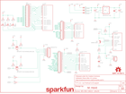

Contents
========

* [PRS11927 > BC127 Breakout Board](#prs11927--bc127-breakout-board)
	* [Schematic](#schematic)
	* [PCB](#pcb)
	* [Interactive BOM](#interactive-bom)
	* [OOMP Parts](#oomp-parts)
	* [Images](#images)
	* [Tags](#tags)
  
![][im]
# PRS11927 > BC127 Breakout Board

- ID: PROJ-SPAR-11927-STAN-01
- Hex ID: PRS11927
- Name: Sparkfun
- Description: Sparkfun
- Long Link: [http://oom.lt/PROJ-SPAR-11927-STAN-01](http://oom.lt/PROJ-SPAR-11927-STAN-01)
- Short Link: [http://oom.lt/PRS11927](http://oom.lt/PRS11927)

## Schematic
  

## PCB
  

## Interactive BOM

- Interactive BOM page: [ibom.html](https://htmlpreview.github.io/?https://github.com/oomlout/oomlout_OOMP_projects/blob/main/PROJ-SPAR-11927-STAN-01/kicad/bom/ibom.html)

## OOMP Parts
  

|OOMP Parts|
| :---: |
|CAPT-3216-X-UF10-01 C1, C3|
|[CAPC-0805-X-UF1-V25  SMD (0805) 1 uF Capacitor (Ceramic) 25v  C2](https://github.com/oomlout/oomlout_OOMP_parts/tree/main/CAPC-0805-X-UF1-V25/)|
|[CAPC-0603-X-UF47D-V10  SMD (0603) 4.7 uF Capacitor (Ceramic) 10v  C4](https://github.com/oomlout/oomlout_OOMP_parts/tree/main/CAPC-0603-X-UF47D-V10/)|
|[LEDS-0603-G-STAN-01  SMD (0603) Green LED  D1](https://github.com/oomlout/oomlout_OOMP_parts/tree/main/LEDS-0603-G-STAN-01/)|
|[LEDS-0603-R-STAN-01  SMD (0603) Red LED  D2](https://github.com/oomlout/oomlout_OOMP_parts/tree/main/LEDS-0603-R-STAN-01/)|
|[LEDS-0603-L-STAN-01  SMD (0603) Blue LED  D3](https://github.com/oomlout/oomlout_OOMP_parts/tree/main/LEDS-0603-L-STAN-01/)|
|DIOD-UNMATCHED-X-UNMATCHED-01 D4, D5, D6|
|HEAD-I01-X-UNMATCHED-01 JP1|
|[HEAD-I01-X-PI16-01  2.54 mm 16 Pin Header  JP2](https://github.com/oomlout/oomlout_OOMP_parts/tree/main/HEAD-I01-X-PI16-01/)|
|HEAD-I01-X-PI15-01 JP3|
|[HEAD-I01-X-PI06-01  2.54 mm 6 Pin Header  JP4, JP5](https://github.com/oomlout/oomlout_OOMP_parts/tree/main/HEAD-I01-X-PI06-01/)|
|[HEAD-I01-X-PI02-01  2.54 mm 2 Pin Header  JP6](https://github.com/oomlout/oomlout_OOMP_parts/tree/main/HEAD-I01-X-PI02-01/)|
|UNMATCHED-SO23-X-KBSS138-01 Q1, Q2|
|UNMATCHED-SO23-X-UNMATCHED-01 Q3|
|[RESE-0603-X-O103-01  SMD (0603) 10k Ohm Resistor  R1, R5, R6, R7, R8, R9, R10, R13](https://github.com/oomlout/oomlout_OOMP_parts/tree/main/RESE-0603-X-O103-01/)|
|[RESE-0603-X-O241-01  SMD (0603) 240 Ohm Resistor  R2, R3, R4](https://github.com/oomlout/oomlout_OOMP_parts/tree/main/RESE-0603-X-O241-01/)|
|RESE-0805-X-UNMATCHED-01 R11, R12|
|UNMATCHED-UNMATCHED-X-UNMATCHED-01 U1|
|UNMATCHED-SO235-X-UNMATCHED-01 U2|

## Images
  
  

|bominteractivefront|bominteractiveback|kicadPcb3d|kicadPcb3dFront|kicadPcb3dBack|eagleImage|eagleSchemImage|
| :---: | :---: | :---: | :---: | :---: | :---: | :---: |
||||||||

## Tags

- hexID: PRS11927
- oompType: PROJ
- oompSize: SPAR
- oompColor: 11927
- oompDesc: STAN
- oompIndex: 01
- oompName: BC127 Breakout Board
- sources: All source files from https://github.com/sparkfun/BC127_Breakout_Board (source licence details in srcLicense.md)
- linkBuyPage: https://www.sparkfun.com/products/11927
- oompID: PROJ-SPAR-11927-STAN-01
- oompParts: C1,CAPT-3216-X-UF10-01
- oompParts: C2,CAPC-0805-X-UF1-V25
- oompParts: C3,CAPT-3216-X-UF10-01
- oompParts: C4,CAPC-0603-X-UF47D-V10
- oompParts: D1,LEDS-0603-G-STAN-01
- oompParts: D2,LEDS-0603-R-STAN-01
- oompParts: D3,LEDS-0603-L-STAN-01
- oompParts: D4,DIOD-UNMATCHED-X-UNMATCHED-01
- oompParts: D5,DIOD-UNMATCHED-X-UNMATCHED-01
- oompParts: D6,DIOD-UNMATCHED-X-UNMATCHED-01
- oompParts: JP1,HEAD-I01-X-UNMATCHED-01
- oompParts: JP2,HEAD-I01-X-PI16-01
- oompParts: JP3,HEAD-I01-X-PI15-01
- oompParts: JP4,HEAD-I01-X-PI06-01
- oompParts: JP5,HEAD-I01-X-PI06-01
- oompParts: JP6,HEAD-I01-X-PI02-01
- oompParts: Q1,UNMATCHED-SO23-X-KBSS138-01
- oompParts: Q2,UNMATCHED-SO23-X-KBSS138-01
- oompParts: Q3,UNMATCHED-SO23-X-UNMATCHED-01
- oompParts: R1,RESE-0603-X-O103-01
- oompParts: R2,RESE-0603-X-O241-01
- oompParts: R3,RESE-0603-X-O241-01
- oompParts: R4,RESE-0603-X-O241-01
- oompParts: R5,RESE-0603-X-O103-01
- oompParts: R6,RESE-0603-X-O103-01
- oompParts: R7,RESE-0603-X-O103-01
- oompParts: R8,RESE-0603-X-O103-01
- oompParts: R9,RESE-0603-X-O103-01
- oompParts: R10,RESE-0603-X-O103-01
- oompParts: R11,RESE-0805-X-UNMATCHED-01
- oompParts: R12,RESE-0805-X-UNMATCHED-01
- oompParts: R13,RESE-0603-X-O103-01
- oompParts: U1,UNMATCHED-UNMATCHED-X-UNMATCHED-01
- oompParts: U2,UNMATCHED-SO235-X-UNMATCHED-01
- rawParts: C1,10uF,10UF-16V-10%(TANT),EIA3216,CAP-00811,CAP-00811,10uF,
- rawParts: C2,1uF,1UF-25V-10%(0805),0805,CAP-08064,CAP-08064,1uF,
- rawParts: C3,10uF,10UF-16V-10%(TANT),EIA3216,CAP-00811,CAP-00811,10uF,
- rawParts: C4,4.7uF,4.7UF-6.3V-10%(0603)0603,0603-CAP,CAP-08280,CAP-08280,4.7uF,
- rawParts: D1,GREEN,LED-GREEN0603,LED-0603,Various green LEDs,DIO-00821,GREEN,
- rawParts: D2,RED,LED-RED0603,LED-0603,Assorted Red LEDs,DIO-00819,RED,
- rawParts: D3,BLUE,LED-BLUE0603,LED-0603,Blue LEDs for production use,DIO-08575,BLUE,
- rawParts: D4,BA340A,B340A,SMA-DIODE,Schottky Diode,DIO-09886,BA340A,
- rawParts: D5,BA340A,B340A,SMA-DIODE,Schottky Diode,DIO-09886,BA340A,
- rawParts: D6,BA340A,B340A,SMA-DIODE,Schottky Diode,DIO-09886,BA340A,
- rawParts: FRAME1,FRAME-LETTER,FRAME-LETTER,CREATIVE_COMMONS,Schematic Frame,,,
- rawParts: JP1,FTDI_BASICPTH,FTDI_BASICPTH,FTDI_BASIC,FTDI Basic header with labels,,,
- rawParts: JP2,M16PTH,M16PTH,1X16,1x16 .1 header,,,
- rawParts: JP3,M15,M15,1X15,Header 15,,,
- rawParts: JP4,,M06SIP,1X06,Header 6,,,
- rawParts: JP5,,M06SIP,1X06,Header 6,,,
- rawParts: JP6,M02PTH,M02PTH,1X02,Standard 2-pin 0.1 header. Use with,,,
- rawParts: LOGO1,OSHW-LOGOM,OSHW-LOGOM,OSHW-LOGO-M,Open Source Hardware Logo This logo indicates the piece of hardware it is found on incorporates a OSHW license and/or adheres to the definition of open source hardware found here: http://freedomdefined.org/OSHW,,,
- rawParts: LOGO2,LOGO-SFENEW,LOGO-SFENEW,SFE-NEW-WEBLOGO,Spark Fun Electronics PCB Logo,,,
- rawParts: LOGO3,SFE_LOGO_NAME.1_INCH,SFE_LOGO_NAME.1_INCH,SFE_LOGO_NAME_.1,SFE Logo, name only,,,
- rawParts: Q1,MOSFET-NCHANNELBSS138,MOSFET-NCHANNELBSS138,SOT23,Common NMOSFET Parts,TRANS-00830,,
- rawParts: Q2,MOSFET-NCHANNELBSS138,MOSFET-NCHANNELBSS138,SOT23,Common NMOSFET Parts,TRANS-00830,,
- rawParts: Q3,MMBT4403,TRANSISTOR_PNPMMBT4403,SOT23,Generic PNP BJT,TRANS-09245,MMBT4403,
- rawParts: R1,10K,10KOHM1/10W1%(0603)0603,0603-RES,RES-00824,RES-00824,10K,
- rawParts: R2,240,240OHM1/10W1%(0603),0603-RES,RES-07849,RES-07849,240,
- rawParts: R3,240,240OHM1/10W1%(0603),0603-RES,RES-07849,RES-07849,240,
- rawParts: R4,240,240OHM1/10W1%(0603),0603-RES,RES-07849,RES-07849,240,
- rawParts: R5,10K,10KOHM1/10W1%(0603)0603,0603-RES,RES-00824,RES-00824,10K,
- rawParts: R6,10K,10KOHM1/10W1%(0603)0603,0603-RES,RES-00824,RES-00824,10K,
- rawParts: R7,10K,10KOHM1/10W1%(0603)0603,0603-RES,RES-00824,RES-00824,10K,
- rawParts: R8,10K,10KOHM1/10W1%(0603)0603,0603-RES,RES-00824,RES-00824,10K,
- rawParts: R9,10K,10KOHM1/10W1%(0603)0603,0603-RES,RES-00824,RES-00824,10K,
- rawParts: R10,10K,10KOHM1/10W1%(0603)0603,0603-RES,RES-00824,RES-00824,10K,
- rawParts: R11,0.75,0.75OHM1/4W1%(0805),0805,RES-08474,RES-08474,0.75,
- rawParts: R12,0.22,0.22OHM1/4W1%(0805),0805,RES-09883,RES-09883,0.22,
- rawParts: R13,10K,10KOHM1/10W1%(0603)0603,0603-RES,RES-00824,RES-00824,10K,
- rawParts: U1,BC127,BC127EXTRA_PASTE,BC127_XTRA_PASTE,Blue Creations BC127 BLE module,,,
- rawParts: U2,MIC5219 3.3V,V_REG_MIC52193.3V,SOT23-5,V_REG MIC5219,VREG-09872,MIC5219 3.3V,

[im]: kicadPcb3d_450.png
