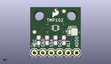
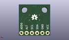
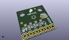

Contents
========

* [PROJ-SPAR-11931-STAN-01>Digital Temperature Sensor Breakout - TMP102](#proj-spar-11931-stan-01digital-temperature-sensor-breakout---tmp102)
	* [Images](#images)
	* [Interactive BOM](#interactive-bom)
	* [OOMP Parts](#oomp-parts)
	* [Tags](#tags)
  
![][im]
# PROJ-SPAR-11931-STAN-01>Digital Temperature Sensor Breakout - TMP102

- ID: PROJ-SPAR-11931-STAN-01
- Hex ID: PRS11931
- Name: Digital Temperature Sensor Breakout - TMP102
- Description: 

## Images
  
  

|eagleImage|kicadPcb3dFront|kicadPcb3dBack|kicadPcb3d|
| :---: | :---: | :---: | :---: |
|||||

## Interactive BOM

- Interactive BOM page: [ibom.html](kicad/bom/ibom.html)

## OOMP Parts
  

|OOMP Parts|
| :---: |
|<table><tr><td></td><td> C1</td><td>[CAPC-0603-X-NF100-V50 SMD (0603) 100 nF Capacitor (Ceramic) 50v](https://github.com/oomlout/oomlout_OOMP_parts/tree/main/CAPC-0603-X-NF100-V50/)</td><td>[C6N100](https://github.com/oomlout/oomlout_OOMP_parts/tree/main/CAPC-0603-X-NF100-V50/)</td></tr></table>|
|<table><tr><td></td><td> JP1</td><td>[HEAD-I01-X-PI06-01 2.54 mm 6 Pin Header](https://github.com/oomlout/oomlout_OOMP_parts/tree/main/HEAD-I01-X-PI06-01/)</td><td>[H06](https://github.com/oomlout/oomlout_OOMP_parts/tree/main/HEAD-I01-X-PI06-01/)</td></tr></table>|
|HEAD-I01-X-PI2-01, JP4, 1.27, 7.619999999999999, 0,JP4, FIDUCIAL1X2, FIDUCIAL-1X2, SparkFun, (0.05, 0.3), R0|
|HEAD-I01-X-PI2-01, JP5, 10.16, 13.97, 0,JP5, FIDUCIAL1X2, FIDUCIAL-1X2, SparkFun, (0.4, 0.55), R0|
|RESE-0603-X-UNMATCHED-01, R1, 5.08, 5.08, 90,R1, 1K, 0603-RES, SparkFun, (0.2, 0.2), R90|
|RESE-0603-X-UNMATCHED-01, R2, 7.619999999999999, 5.08, 90,R2, 1K, 0603-RES, SparkFun, (0.3, 0.2), R90|
|RESE-0603-X-UNMATCHED-01, R3, 10.16, 5.08, 90,R3, 1K, 0603-RES, SparkFun, (0.4, 0.2), R90|
|UNMATCHED-UNMATCHED-X-UNMATCHED-01, U1, 7.619999999999999, 8.889999999999999, 180,U1, TMP1021:1, SOT563-2, SparkFun-Sensors, (0.3, 0.35), R180|

## Tags

- hexID: PRS11931
- oompType: PROJ
- oompSize: SPAR
- oompColor: 11931
- oompDesc: STAN
- oompIndex: 01
- oompName: Digital Temperature Sensor Breakout - TMP102
- sources: All source files from https://github.com/sparkfun/Digital_Temperature_Sensor_Breakout_-_TMP102 (source licence details in srcLicense.md)
- linkBuyPage: https://www.sparkfun.com/products/11931
- oompPart: CAPC-0603-X-NF100-V50, C1, 2.54, 5.08, 270
- oompPart: HEAD-I01-X-PI06-01, JP1, 1.27, 1.27, 0
- oompPart: SKIP-UNMATCHED-X-UNMATCHED-01, JP2, 12.7, 7.619999999999999, 0
- oompPart: HEAD-I01-X-PI2-01, JP4, 1.27, 7.619999999999999, 0
- oompPart: HEAD-I01-X-PI2-01, JP5, 10.16, 13.97, 0
- oompPart: RESE-0603-X-UNMATCHED-01, R1, 5.08, 5.08, 90
- oompPart: RESE-0603-X-UNMATCHED-01, R2, 7.619999999999999, 5.08, 90
- oompPart: RESE-0603-X-UNMATCHED-01, R3, 10.16, 5.08, 90
- oompPart: UNMATCHED-UNMATCHED-X-UNMATCHED-01, U1, 7.619999999999999, 8.889999999999999, 180
- rawPart: C1, 0.1uF, 0603-CAP, SparkFun, (0.1, 0.2), R270
- rawPart: JP1, 1X06, SparkFun, (0.05, 0.05), R0
- rawPart: JP2, JUMPER-32-3, SJ_3_PASTE2&3, SparkFun, (0.5, 0.3), R0
- rawPart: JP4, FIDUCIAL1X2, FIDUCIAL-1X2, SparkFun, (0.05, 0.3), R0
- rawPart: JP5, FIDUCIAL1X2, FIDUCIAL-1X2, SparkFun, (0.4, 0.55), R0
- rawPart: R1, 1K, 0603-RES, SparkFun, (0.2, 0.2), R90
- rawPart: R2, 1K, 0603-RES, SparkFun, (0.3, 0.2), R90
- rawPart: R3, 1K, 0603-RES, SparkFun, (0.4, 0.2), R90
- rawPart: U1, TMP1021:1, SOT563-2, SparkFun-Sensors, (0.3, 0.35), R180
- oompID: PROJ-SPAR-11931-STAN-01

[im]: kicadPcb3d_450.png
