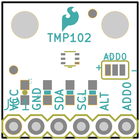
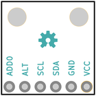
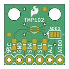
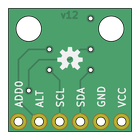

Contents
========

* [PRS11931 > Digital Temperature Sensor Breakout - TMP102](#prs11931--digital-temperature-sensor-breakout---tmp102)
	* [Schematic](#schematic)
	* [PCB](#pcb)
	* [Interactive BOM](#interactive-bom)
	* [OOMP Parts](#oomp-parts)
	* [Images](#images)
	* [Tags](#tags)
  
![][im]
# PRS11931 > Digital Temperature Sensor Breakout - TMP102

- ID: PROJ-SPAR-11931-STAN-01
- Hex ID: PRS11931
- Name: Sparkfun
- Description: Sparkfun
- Long Link: [http://oom.lt/PROJ-SPAR-11931-STAN-01](http://oom.lt/PROJ-SPAR-11931-STAN-01)
- Short Link: [http://oom.lt/PRS11931](http://oom.lt/PRS11931)

## Schematic
  

## PCB
  

## Interactive BOM

- Interactive BOM page: [ibom.html](https://htmlpreview.github.io/?https://github.com/oomlout/oomlout_OOMP_projects/blob/main/PROJ-SPAR-11931-STAN-01/kicad/bom/ibom.html)

## OOMP Parts
  

|OOMP Parts|
| :---: |
|[CAPC-0603-X-NF100-V50  SMD (0603) 100 nF Capacitor (Ceramic) 50v  C1](https://github.com/oomlout/oomlout_OOMP_parts/tree/main/CAPC-0603-X-NF100-V50/)|
|[HEAD-I01-X-PI06-01  2.54 mm 6 Pin Header  JP1](https://github.com/oomlout/oomlout_OOMP_parts/tree/main/HEAD-I01-X-PI06-01/)|
|UNMATCHED-UNMATCHED-X-UNMATCHED-01 JP2, U1|
|[RESE-0603-X-O102-01  SMD (0603) 1k Ohm Resistor  R1, R2, R3](https://github.com/oomlout/oomlout_OOMP_parts/tree/main/RESE-0603-X-O102-01/)|

## Images
  
  

|bominteractivefront|bominteractiveback|kicadPcb3d|kicadPcb3dFront|kicadPcb3dBack|eagleImage|eagleSchemImage|pcbdraw|pcbdrawback|
| :---: | :---: | :---: | :---: | :---: | :---: | :---: | :---: | :---: |
||||||||||

## Tags

- hexID: PRS11931
- oompType: PROJ
- oompSize: SPAR
- oompColor: 11931
- oompDesc: STAN
- oompIndex: 01
- oompName: Digital Temperature Sensor Breakout - TMP102
- sources: All source files from https://github.com/sparkfun/Digital_Temperature_Sensor_Breakout_-_TMP102 (source licence details in srcLicense.md)
- linkBuyPage: https://www.sparkfun.com/products/11931
- oompID: PROJ-SPAR-11931-STAN-01
- oompParts: C1,CAPC-0603-X-NF100-V50
- oompParts: JP1,HEAD-I01-X-PI06-01
- oompParts: JP2,UNMATCHED-UNMATCHED-X-UNMATCHED-01
- oompParts: R1,RESE-0603-X-O102-01
- oompParts: R2,RESE-0603-X-O102-01
- oompParts: R3,RESE-0603-X-O102-01
- oompParts: U1,UNMATCHED-UNMATCHED-X-UNMATCHED-01
- rawParts: C1,0.1uF,CAP0603-CAP,0603-CAP,Capacitor,,
- rawParts: JP1,,M06SIP,1X06,Header 6,,
- rawParts: JP2,JUMPER-32-3,JUMPER-32-3,SJ_3_PASTE2&3,,,
- rawParts: JP3,LOGO-SFESK,LOGO-SFESK,SFE-LOGO-FLAME,Spark Fun Electronics PCB Logo,,
- rawParts: JP4,FIDUCIAL1X2,FIDUCIAL1X2,FIDUCIAL-1X2,Fiducial Alignment Points,,
- rawParts: JP5,FIDUCIAL1X2,FIDUCIAL1X2,FIDUCIAL-1X2,Fiducial Alignment Points,,
- rawParts: JP6,STAND-OFFTIGHT,STAND-OFFTIGHT,STAND-OFF-TIGHT,Stand Off,,
- rawParts: JP7,STAND-OFFTIGHT,STAND-OFFTIGHT,STAND-OFF-TIGHT,Stand Off,,
- rawParts: R1,1K,RESISTOR0603-RES,0603-RES,Resistor,,
- rawParts: R2,1K,RESISTOR0603-RES,0603-RES,Resistor,,
- rawParts: R3,1K,RESISTOR0603-RES,0603-RES,Resistor,,
- rawParts: U$2,CREATIVE_COMMONS,CREATIVE_COMMONS,CREATIVE_COMMONS,,,
- rawParts: U1,TMP1021:1,TMP1021:1,SOT563-2,I2C degC temp sensor,,

[im]: kicadPcb3d_450.png
