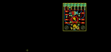
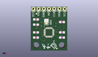
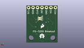
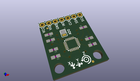

Contents
========

* [PROJ-SPAR-11977-STAN-01>ITG-3200 Breakout](#proj-spar-11977-stan-01itg-3200-breakout)
	* [Images](#images)
	* [Interactive BOM](#interactive-bom)
	* [OOMP Parts](#oomp-parts)
	* [Tags](#tags)
  
![][im]
# PROJ-SPAR-11977-STAN-01>ITG-3200 Breakout

- ID: PROJ-SPAR-11977-STAN-01
- Hex ID: PRS11977
- Name: ITG-3200 Breakout
- Description: 

## Images
  
  

|eagleImage|kicadPcb3dFront|kicadPcb3dBack|kicadPcb3d|
| :---: | :---: | :---: | :---: |
|||||

## Interactive BOM

- Interactive BOM page: [ibom.html](kicad/bom/ibom.html)

## OOMP Parts
  

|OOMP Parts|
| :---: |
|CAPE-0603-X-NF22D-01, C1, 15.239999999999998, 6.35, 0,C1, 2.2nF, 0603-CAP, SparkFun, (0.6, 0.25), R0|
|CAPE-0603-X-NF100-01, C2, 2.54, 6.35, 180,C2, 0.1uF, 0603-CAP, SparkFun, (0.1, 0.25), R180|
|CAPE-0603-X-NF100-01, C3, 2.54, 8.889999999999999, 180,C3, 0.1uF, 0603-CAP, SparkFun, (0.1, 0.35), R180|
|CAPE-0603-X-UNMATCHED-01, C4, 2.54, 12.7, 180,C4, 10nF, 0603-CAP, SparkFun, (0.1, 0.5), R180|
|UNMATCHED-UNMATCHED-X-UNMATCHED-01, JP2, 1.27, 20.32, 0,JP2, 1X07, SparkFun, (0.05, 0.8), R0|
|UNMATCHED-UNMATCHED-X-UNMATCHED-01, JP6, 10.16, 13.97, M90,JP6, SJ_2S-NO, SparkFun, (0.4, 0.55), MR90|
|RESE-0603-X-UNMATCHED-01, R1, 15.239999999999998, 13.97, 0,R1, DNP, 0603-RES, SparkFun, (0.6, 0.55), R0|
|RESE-0603-X-UNMATCHED-01, R2, 15.239999999999998, 8.889999999999999, 0,R2, DNP, 0603-RES, SparkFun, (0.6, 0.35), R0|
|<table><tr><td></td><td> R3</td><td>[RESE-0603-X-O103-01 SMD (0603) 10k Ohm Resistor](https://github.com/oomlout/oomlout_OOMP_parts/tree/main/RESE-0603-X-O103-01/)</td><td>[R6103](https://github.com/oomlout/oomlout_OOMP_parts/tree/main/RESE-0603-X-O103-01/)</td></tr></table>|
|UNMATCHED-UNMATCHED-X-UNMATCHED-01, SJ1, 7.619999999999999, 13.97, 270,SJ1, SJ_3_PASTE1&2, SparkFun, (0.3, 0.55), R270|
|UNMATCHED-UNMATCHED-X-UNMATCHED-01, U1, 8.889999999999999, 8.889999999999999, 270,U1, ITG-32001:1, QFN-24_ITG3200_1:1, SparkFun-DigitalIC, (0.35, 0.35), R270|

## Tags

- hexID: PRS11977
- oompType: PROJ
- oompSize: SPAR
- oompColor: 11977
- oompDesc: STAN
- oompIndex: 01
- oompName: ITG-3200 Breakout
- sources: All source files from https://github.com/sparkfun/ITG-3200_Breakout (source licence details in srcLicense.md)
- linkBuyPage: https://www.sparkfun.com/products/11977
- oompPart: CAPE-0603-X-NF22D-01, C1, 15.239999999999998, 6.35, 0
- oompPart: CAPE-0603-X-NF100-01, C2, 2.54, 6.35, 180
- oompPart: CAPE-0603-X-NF100-01, C3, 2.54, 8.889999999999999, 180
- oompPart: CAPE-0603-X-UNMATCHED-01, C4, 2.54, 12.7, 180
- oompPart: SKIP-UNMATCHED-X-UNMATCHED-01, FID1, 2.7178, 18.059399999999997, 0
- oompPart: SKIP-UNMATCHED-X-UNMATCHED-01, FID2, 12.725399999999999, 0.9905999999999999, 0
- oompPart: UNMATCHED-UNMATCHED-X-UNMATCHED-01, JP2, 1.27, 20.32, 0
- oompPart: UNMATCHED-UNMATCHED-X-UNMATCHED-01, JP6, 10.16, 13.97, M90
- oompPart: RESE-0603-X-UNMATCHED-01, R1, 15.239999999999998, 13.97, 0
- oompPart: RESE-0603-X-UNMATCHED-01, R2, 15.239999999999998, 8.889999999999999, 0
- oompPart: RESE-0603-X-O103-01, R3, 2.54, 15.239999999999998, 180
- oompPart: UNMATCHED-UNMATCHED-X-UNMATCHED-01, SJ1, 7.619999999999999, 13.97, 270
- oompPart: UNMATCHED-UNMATCHED-X-UNMATCHED-01, U1, 8.889999999999999, 8.889999999999999, 270
- rawPart: C1, 2.2nF, 0603-CAP, SparkFun, (0.6, 0.25), R0
- rawPart: C2, 0.1uF, 0603-CAP, SparkFun, (0.1, 0.25), R180
- rawPart: C3, 0.1uF, 0603-CAP, SparkFun, (0.1, 0.35), R180
- rawPart: C4, 10nF, 0603-CAP, SparkFun, (0.1, 0.5), R180
- rawPart: FID1, FIDUCIALUFIDUCIAL, MICRO-FIDUCIAL, SparkFun-Aesthetics, (0.107, 0.711), R0
- rawPart: FID2, FIDUCIALUFIDUCIAL, MICRO-FIDUCIAL, SparkFun-Aesthetics, (0.501, 0.039), R0
- rawPart: JP2, 1X07, SparkFun, (0.05, 0.8), R0
- rawPart: JP6, SJ_2S-NO, SparkFun, (0.4, 0.55), MR90
- rawPart: R1, DNP, 0603-RES, SparkFun, (0.6, 0.55), R0
- rawPart: R2, DNP, 0603-RES, SparkFun, (0.6, 0.35), R0
- rawPart: R3, 10K, 0603-RES, SparkFun-Resistors, (0.1, 0.6), R180
- rawPart: SJ1, SJ_3_PASTE1&2, SparkFun, (0.3, 0.55), R270
- rawPart: U1, ITG-32001:1, QFN-24_ITG3200_1:1, SparkFun-DigitalIC, (0.35, 0.35), R270

[im]: kicadPcb3d_450.png
