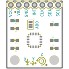
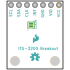
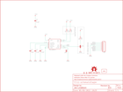

Contents
========

* [PRS11977 > ITG-3200 Breakout](#prs11977--itg-3200-breakout)
	* [Schematic](#schematic)
	* [PCB](#pcb)
	* [Interactive BOM](#interactive-bom)
	* [OOMP Parts](#oomp-parts)
	* [Images](#images)
	* [Tags](#tags)
  
![][im]
# PRS11977 > ITG-3200 Breakout

- ID: PROJ-SPAR-11977-STAN-01
- Hex ID: PRS11977
- Name: Sparkfun
- Description: Sparkfun
- Long Link: [http://oom.lt/PROJ-SPAR-11977-STAN-01](http://oom.lt/PROJ-SPAR-11977-STAN-01)
- Short Link: [http://oom.lt/PRS11977](http://oom.lt/PRS11977)

## Schematic
  

## PCB
  

## Interactive BOM

- Interactive BOM page: [ibom.html](https://htmlpreview.github.io/?https://github.com/oomlout/oomlout_OOMP_projects/blob/main/PROJ-SPAR-11977-STAN-01/kicad/bom/ibom.html)

## OOMP Parts
  

|OOMP Parts|
| :---: |
|CAPC-0603-X-PF22D-01 C1|
|[CAPC-0603-X-NF100-V50  SMD (0603) 100 nF Capacitor (Ceramic) 50v  C2, C3](https://github.com/oomlout/oomlout_OOMP_parts/tree/main/CAPC-0603-X-NF100-V50/)|
|[CAPC-0603-X-NF10-V50  SMD (0603) 10 nF Capacitor (Ceramic) 50v  C4](https://github.com/oomlout/oomlout_OOMP_parts/tree/main/CAPC-0603-X-NF10-V50/)|
|[HEAD-I01-X-PI07-01  2.54 mm 7 Pin Header  JP2](https://github.com/oomlout/oomlout_OOMP_parts/tree/main/HEAD-I01-X-PI07-01/)|
|UNMATCHED-UNMATCHED-X-UNMATCHED-01 JP6, U1|
|RESE-0603-X-UNMATCHED-01 R1, R2|
|[RESE-0603-X-O103-01  SMD (0603) 10k Ohm Resistor  R3](https://github.com/oomlout/oomlout_OOMP_parts/tree/main/RESE-0603-X-O103-01/)|

## Images
  
  

|bominteractivefront|bominteractiveback|kicadPcb3d|kicadPcb3dFront|kicadPcb3dBack|eagleImage|eagleSchemImage|
| :---: | :---: | :---: | :---: | :---: | :---: | :---: |
||||||||

## Tags

- hexID: PRS11977
- oompType: PROJ
- oompSize: SPAR
- oompColor: 11977
- oompDesc: STAN
- oompIndex: 01
- oompName: ITG-3200 Breakout
- sources: All source files from https://github.com/sparkfun/ITG-3200_Breakout (source licence details in srcLicense.md)
- linkBuyPage: https://www.sparkfun.com/products/11977
- oompID: PROJ-SPAR-11977-STAN-01
- oompParts: C1,CAPC-0603-X-PF22D-01
- oompParts: C2,CAPC-0603-X-NF100-V50
- oompParts: C3,CAPC-0603-X-NF100-V50
- oompParts: C4,CAPC-0603-X-NF10-V50
- oompParts: JP2,HEAD-I01-X-PI07-01
- oompParts: JP6,UNMATCHED-UNMATCHED-X-UNMATCHED-01
- oompParts: R1,RESE-0603-X-UNMATCHED-01
- oompParts: R2,RESE-0603-X-UNMATCHED-01
- oompParts: R3,RESE-0603-X-O103-01
- oompParts: U1,UNMATCHED-UNMATCHED-X-UNMATCHED-01
- rawParts: C1,2.2nF,CAP0603-CAP,0603-CAP,Capacitor,,,
- rawParts: C2,0.1uF,CAP0603-CAP,0603-CAP,Capacitor,,,
- rawParts: C3,0.1uF,CAP0603-CAP,0603-CAP,Capacitor,,,
- rawParts: C4,10nF,CAP0603-CAP,0603-CAP,Capacitor,,,
- rawParts: FID1,FIDUCIALUFIDUCIAL,FIDUCIALUFIDUCIAL,MICRO-FIDUCIAL,Fiducial Alignment Points,,,
- rawParts: FID2,FIDUCIALUFIDUCIAL,FIDUCIALUFIDUCIAL,MICRO-FIDUCIAL,Fiducial Alignment Points,,,
- rawParts: FRAME1,FRAME-LETTER,FRAME-LETTER,CREATIVE_COMMONS,Schematic Frame,,,
- rawParts: JP2,,M07,1X07,Header 7,,,
- rawParts: JP6,,JUMPER-2SMD-NO,SJ_2S-NO,Jumper,,,
- rawParts: LOGO1,OSHW-LOGOS,OSHW-LOGOS,OSHW-LOGO-S,Open Source Hardware Logo This logo indicates the piece of hardware it is found on incorporates a OSHW license and/or adheres to the definition of open source hardware found here: http://freedomdefined.org/OSHW,,,
- rawParts: LOGO2,LOGO-SFESK,LOGO-SFESK,SFE-LOGO-FLAME,Spark Fun Electronics PCB Logo,,,
- rawParts: R1,DNP,RESISTOR0603-RES,0603-RES,Resistor,,,
- rawParts: R2,DNP,RESISTOR0603-RES,0603-RES,Resistor,,,
- rawParts: R3,10K,10KOHM1/10W1%(0603)0603,0603-RES,RES-00824,RES-00824,10K,
- rawParts: SJ1,,SOLDERJUMPER_2WAYPASTE1&2,SJ_3_PASTE1&2,Solder Jumper,,,
- rawParts: U1,ITG-32001:1,ITG-32001:1,QFN-24_ITG3200_1:1,ITG-3200 3-axis gyro, digital output, qfn24 package,,,

[im]: kicadPcb3d_450.png
