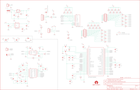

Contents
========

* [PRS12000 > Sparkfun](#prs12000--sparkfun)
	* [Images](#images)
	* [Tags](#tags)
  
![][im]
# PRS12000 > Sparkfun

- ID: PROJ-SPAR-12000-STAN-01
- Hex ID: PRS12000
- Name: Sparkfun
- Description: Sparkfun

## Images
  
  

|kicadPcb3d|kicadPcb3dFront|kicadPcb3dBack|eagleImage|eagleSchemImage|
| :---: | :---: | :---: | :---: | :---: |
||||||

## Tags

- hexID: PRS12000
- oompType: PROJ
- oompSize: SPAR
- oompColor: 12000
- oompDesc: STAN
- oompIndex: 01
- oompName: WAV Trigger
- sources: All source files from https://github.com/sparkfun/WAV_Trigger (source licence details in srcLicense.md)
- linkBuyPage: https://www.sparkfun.com/products/12000
- oompID: PROJ-SPAR-12000-STAN-01
- oompParts: C1,UNMATCHED-UNMATCHED-UNMATCHED-UNMATCHED-UNMATCHED
- oompParts: C2,UNMATCHED-UNMATCHED-UNMATCHED-UNMATCHED-UNMATCHED
- oompParts: C3,UNMATCHED-UNMATCHED-UNMATCHED-UNMATCHED-UNMATCHED
- oompParts: C4,UNMATCHED-UNMATCHED-UNMATCHED-UNMATCHED-UNMATCHED
- oompParts: C5,UNMATCHED-UNMATCHED-UNMATCHED-UNMATCHED-UNMATCHED
- oompParts: C9,UNMATCHED-UNMATCHED-UNMATCHED-UNMATCHED-UNMATCHED
- oompParts: C10,UNMATCHED-UNMATCHED-UNMATCHED-UNMATCHED-UNMATCHED
- oompParts: C11,UNMATCHED-UNMATCHED-UNMATCHED-UNMATCHED-UNMATCHED
- oompParts: C12,UNMATCHED-UNMATCHED-UNMATCHED-UNMATCHED-UNMATCHED
- oompParts: C13,UNMATCHED-UNMATCHED-UNMATCHED-UNMATCHED-UNMATCHED
- oompParts: C14,UNMATCHED-UNMATCHED-UNMATCHED-UNMATCHED-UNMATCHED
- oompParts: C15,UNMATCHED-UNMATCHED-UNMATCHED-UNMATCHED-UNMATCHED
- oompParts: C16,UNMATCHED-UNMATCHED-UNMATCHED-UNMATCHED-UNMATCHED
- oompParts: C17,UNMATCHED-UNMATCHED-UNMATCHED-UNMATCHED-UNMATCHED
- oompParts: C18,UNMATCHED-UNMATCHED-UNMATCHED-UNMATCHED-UNMATCHED
- oompParts: C19,UNMATCHED-UNMATCHED-UNMATCHED-UNMATCHED-UNMATCHED
- oompParts: C20,UNMATCHED-UNMATCHED-UNMATCHED-UNMATCHED-UNMATCHED
- oompParts: C21,UNMATCHED-UNMATCHED-UNMATCHED-UNMATCHED-UNMATCHED
- oompParts: C22,UNMATCHED-UNMATCHED-UNMATCHED-UNMATCHED-UNMATCHED
- oompParts: C23,UNMATCHED-UNMATCHED-UNMATCHED-UNMATCHED-UNMATCHED
- oompParts: C24,UNMATCHED-UNMATCHED-UNMATCHED-UNMATCHED-UNMATCHED
- oompParts: C25,UNMATCHED-UNMATCHED-UNMATCHED-UNMATCHED-UNMATCHED
- oompParts: C26,UNMATCHED-UNMATCHED-UNMATCHED-UNMATCHED-UNMATCHED
- oompParts: C27,UNMATCHED-UNMATCHED-UNMATCHED-UNMATCHED-UNMATCHED
- oompParts: C28,UNMATCHED-UNMATCHED-UNMATCHED-UNMATCHED-UNMATCHED
- oompParts: C29,UNMATCHED-UNMATCHED-UNMATCHED-UNMATCHED-UNMATCHED
- oompParts: C30,UNMATCHED-UNMATCHED-UNMATCHED-UNMATCHED-UNMATCHED
- oompParts: C31,UNMATCHED-UNMATCHED-UNMATCHED-UNMATCHED-UNMATCHED
- oompParts: FRAME2,UNMATCHED-UNMATCHED-UNMATCHED-UNMATCHED-UNMATCHED
- oompParts: J1,UNMATCHED-UNMATCHED-UNMATCHED-UNMATCHED-UNMATCHED
- oompParts: J2,UNMATCHED-UNMATCHED-UNMATCHED-UNMATCHED-UNMATCHED
- oompParts: J3,UNMATCHED-UNMATCHED-UNMATCHED-UNMATCHED-UNMATCHED
- oompParts: J4,UNMATCHED-UNMATCHED-UNMATCHED-UNMATCHED-UNMATCHED
- oompParts: J5,UNMATCHED-UNMATCHED-UNMATCHED-UNMATCHED-UNMATCHED
- oompParts: J6,UNMATCHED-UNMATCHED-UNMATCHED-UNMATCHED-UNMATCHED
- oompParts: J7,UNMATCHED-UNMATCHED-UNMATCHED-UNMATCHED-UNMATCHED
- oompParts: J8,UNMATCHED-UNMATCHED-UNMATCHED-UNMATCHED-UNMATCHED
- oompParts: J9,UNMATCHED-UNMATCHED-UNMATCHED-UNMATCHED-UNMATCHED
- oompParts: LED1,UNMATCHED-UNMATCHED-UNMATCHED-UNMATCHED-UNMATCHED
- oompParts: LOGO1,UNMATCHED-UNMATCHED-UNMATCHED-UNMATCHED-UNMATCHED
- oompParts: LOGO2,UNMATCHED-UNMATCHED-UNMATCHED-UNMATCHED-UNMATCHED
- oompParts: LOGO3,UNMATCHED-UNMATCHED-UNMATCHED-UNMATCHED-UNMATCHED
- oompParts: R1,UNMATCHED-UNMATCHED-UNMATCHED-UNMATCHED-UNMATCHED
- oompParts: R2,UNMATCHED-UNMATCHED-UNMATCHED-UNMATCHED-UNMATCHED
- oompParts: R3,UNMATCHED-UNMATCHED-UNMATCHED-UNMATCHED-UNMATCHED
- oompParts: R4,UNMATCHED-UNMATCHED-UNMATCHED-UNMATCHED-UNMATCHED
- oompParts: R5,UNMATCHED-UNMATCHED-UNMATCHED-UNMATCHED-UNMATCHED
- oompParts: R6,UNMATCHED-UNMATCHED-UNMATCHED-UNMATCHED-UNMATCHED
- oompParts: R7,UNMATCHED-UNMATCHED-UNMATCHED-UNMATCHED-UNMATCHED
- oompParts: R8,UNMATCHED-UNMATCHED-UNMATCHED-UNMATCHED-UNMATCHED
- oompParts: R9,UNMATCHED-UNMATCHED-UNMATCHED-UNMATCHED-UNMATCHED
- oompParts: R10,UNMATCHED-UNMATCHED-UNMATCHED-UNMATCHED-UNMATCHED
- oompParts: R11,UNMATCHED-UNMATCHED-UNMATCHED-UNMATCHED-UNMATCHED
- oompParts: R12,UNMATCHED-UNMATCHED-UNMATCHED-UNMATCHED-UNMATCHED
- oompParts: R13,UNMATCHED-UNMATCHED-UNMATCHED-UNMATCHED-UNMATCHED
- oompParts: R14,UNMATCHED-UNMATCHED-UNMATCHED-UNMATCHED-UNMATCHED
- oompParts: R15,UNMATCHED-UNMATCHED-UNMATCHED-UNMATCHED-UNMATCHED
- oompParts: R16,UNMATCHED-UNMATCHED-UNMATCHED-UNMATCHED-UNMATCHED
- oompParts: R17,UNMATCHED-UNMATCHED-UNMATCHED-UNMATCHED-UNMATCHED
- oompParts: R18,UNMATCHED-UNMATCHED-UNMATCHED-UNMATCHED-UNMATCHED
- oompParts: R19,UNMATCHED-UNMATCHED-UNMATCHED-UNMATCHED-UNMATCHED
- oompParts: R20,UNMATCHED-UNMATCHED-UNMATCHED-UNMATCHED-UNMATCHED
- oompParts: R21,UNMATCHED-UNMATCHED-UNMATCHED-UNMATCHED-UNMATCHED
- oompParts: R22,UNMATCHED-UNMATCHED-UNMATCHED-UNMATCHED-UNMATCHED
- oompParts: R23,UNMATCHED-UNMATCHED-UNMATCHED-UNMATCHED-UNMATCHED
- oompParts: R24,UNMATCHED-UNMATCHED-UNMATCHED-UNMATCHED-UNMATCHED
- oompParts: R25,UNMATCHED-UNMATCHED-UNMATCHED-UNMATCHED-UNMATCHED
- oompParts: R26,UNMATCHED-UNMATCHED-UNMATCHED-UNMATCHED-UNMATCHED
- oompParts: R27,UNMATCHED-UNMATCHED-UNMATCHED-UNMATCHED-UNMATCHED
- oompParts: R28,UNMATCHED-UNMATCHED-UNMATCHED-UNMATCHED-UNMATCHED
- oompParts: R29,UNMATCHED-UNMATCHED-UNMATCHED-UNMATCHED-UNMATCHED
- oompParts: R30,UNMATCHED-UNMATCHED-UNMATCHED-UNMATCHED-UNMATCHED
- oompParts: R31,UNMATCHED-UNMATCHED-UNMATCHED-UNMATCHED-UNMATCHED
- oompParts: R32,UNMATCHED-UNMATCHED-UNMATCHED-UNMATCHED-UNMATCHED
- oompParts: R33,UNMATCHED-UNMATCHED-UNMATCHED-UNMATCHED-UNMATCHED
- oompParts: R34,UNMATCHED-UNMATCHED-UNMATCHED-UNMATCHED-UNMATCHED
- oompParts: R35,UNMATCHED-UNMATCHED-UNMATCHED-UNMATCHED-UNMATCHED
- oompParts: R36,UNMATCHED-UNMATCHED-UNMATCHED-UNMATCHED-UNMATCHED
- oompParts: R37,UNMATCHED-UNMATCHED-UNMATCHED-UNMATCHED-UNMATCHED
- oompParts: R38,UNMATCHED-UNMATCHED-UNMATCHED-UNMATCHED-UNMATCHED
- oompParts: R39,UNMATCHED-UNMATCHED-UNMATCHED-UNMATCHED-UNMATCHED
- oompParts: R40,UNMATCHED-UNMATCHED-UNMATCHED-UNMATCHED-UNMATCHED
- oompParts: R41,UNMATCHED-UNMATCHED-UNMATCHED-UNMATCHED-UNMATCHED
- oompParts: R42,UNMATCHED-UNMATCHED-UNMATCHED-UNMATCHED-UNMATCHED
- oompParts: R43,UNMATCHED-UNMATCHED-UNMATCHED-UNMATCHED-UNMATCHED
- oompParts: R44,UNMATCHED-UNMATCHED-UNMATCHED-UNMATCHED-UNMATCHED
- oompParts: R45,UNMATCHED-UNMATCHED-UNMATCHED-UNMATCHED-UNMATCHED
- oompParts: R46,UNMATCHED-UNMATCHED-UNMATCHED-UNMATCHED-UNMATCHED
- oompParts: R47,UNMATCHED-UNMATCHED-UNMATCHED-UNMATCHED-UNMATCHED
- oompParts: R48,UNMATCHED-UNMATCHED-UNMATCHED-UNMATCHED-UNMATCHED
- oompParts: R49,UNMATCHED-UNMATCHED-UNMATCHED-UNMATCHED-UNMATCHED
- oompParts: R50,UNMATCHED-UNMATCHED-UNMATCHED-UNMATCHED-UNMATCHED
- oompParts: S1,UNMATCHED-UNMATCHED-UNMATCHED-UNMATCHED-UNMATCHED
- oompParts: S2,UNMATCHED-UNMATCHED-UNMATCHED-UNMATCHED-UNMATCHED
- oompParts: SJ2,UNMATCHED-UNMATCHED-UNMATCHED-UNMATCHED-UNMATCHED
- oompParts: SJ3,UNMATCHED-UNMATCHED-UNMATCHED-UNMATCHED-UNMATCHED
- oompParts: SJ4,UNMATCHED-UNMATCHED-UNMATCHED-UNMATCHED-UNMATCHED
- oompParts: SJ5,UNMATCHED-UNMATCHED-UNMATCHED-UNMATCHED-UNMATCHED
- oompParts: STANDOFF1,UNMATCHED-UNMATCHED-UNMATCHED-UNMATCHED-UNMATCHED
- oompParts: STANDOFF2,UNMATCHED-UNMATCHED-UNMATCHED-UNMATCHED-UNMATCHED
- oompParts: STANDOFF3,UNMATCHED-UNMATCHED-UNMATCHED-UNMATCHED-UNMATCHED
- oompParts: STANDOFF4,UNMATCHED-UNMATCHED-UNMATCHED-UNMATCHED-UNMATCHED
- oompParts: U1,UNMATCHED-UNMATCHED-UNMATCHED-UNMATCHED-UNMATCHED
- oompParts: U2,UNMATCHED-UNMATCHED-UNMATCHED-UNMATCHED-UNMATCHED
- oompParts: U4,UNMATCHED-UNMATCHED-UNMATCHED-UNMATCHED-UNMATCHED
- oompParts: U5,UNMATCHED-UNMATCHED-UNMATCHED-UNMATCHED-UNMATCHED
- oompParts: U6,UNMATCHED-UNMATCHED-UNMATCHED-UNMATCHED-UNMATCHED
- oompParts: Y1,UNMATCHED-UNMATCHED-UNMATCHED-UNMATCHED-UNMATCHED
- rawParts: C1,10uF,10UF50V20%(1210),1210,CAP-09824,CAP-09824,10uF,
- rawParts: C2,10uF,1UF-25V-10%(0805),0805,CAP-08064,CAP-08064,1uF,
- rawParts: C3,2.2uF,1UF-25V-10%(0805),0805,CAP-08064,CAP-08064,1uF,
- rawParts: C4,0.1uF,CAP0603-CAP,0603-CAP,Capacitor,,,
- rawParts: C5,2.2uF,1UF-25V-10%(0805),0805,CAP-08064,CAP-08064,1uF,
- rawParts: C9,0.1uF,CAP0603-CAP,0603-CAP,Capacitor,,,
- rawParts: C10,0.1uF,CAP0603-CAP,0603-CAP,Capacitor,,,
- rawParts: C11,1uF,CAP0603-CAP,0603-CAP,Capacitor,,,
- rawParts: C12,4.7uF,CAP0603-CAP,0603-CAP,Capacitor,,,
- rawParts: C13,0.1uF,CAP0603-CAP,0603-CAP,Capacitor,,,
- rawParts: C14,2.2uF,CAP0603-CAP,0603-CAP,Capacitor,,,
- rawParts: C15,0.1uF,CAP0603-CAP,0603-CAP,Capacitor,,,
- rawParts: C16,33pF,CAP0603-CAP,0603-CAP,Capacitor,,,
- rawParts: C17,33pF,CAP0603-CAP,0603-CAP,Capacitor,,,
- rawParts: C18,0.1uF,CAP0603-CAP,0603-CAP,Capacitor,,,
- rawParts: C19,0.1uF,CAP0603-CAP,0603-CAP,Capacitor,,,
- rawParts: C20,2.2uF,CAP0603-CAP,0603-CAP,Capacitor,,,
- rawParts: C21,0.1uF,CAP0603-CAP,0603-CAP,Capacitor,,,
- rawParts: C22,0.1uF,CAP0603-CAP,0603-CAP,Capacitor,,,
- rawParts: C23,0.1uF,CAP0603-CAP,0603-CAP,Capacitor,,,
- rawParts: C24,2.2uF,CAP0603-CAP,0603-CAP,Capacitor,,,
- rawParts: C25,2.2uF,CAP0603-CAP,0603-CAP,Capacitor,,,
- rawParts: C26,0.1uF,CAP0603-CAP,0603-CAP,Capacitor,,,
- rawParts: C27,10uF,CAP0603-CAP,0603-CAP,Capacitor,,,
- rawParts: C28,2200pF,CAP0603-CAP,0603-CAP,Capacitor,,,
- rawParts: C29,2200pF,CAP0603-CAP,0603-CAP,Capacitor,,,
- rawParts: C30,1uF,CAP0603-CAP,0603-CAP,Capacitor,,,
- rawParts: C31,1uF,CAP0603-CAP,0603-CAP,Capacitor,,,
- rawParts: FID1,FIDUCIAL1X2,FIDUCIAL1X2,FIDUCIAL-1X2,Fiducial Alignment Points,,,
- rawParts: FID2,FIDUCIAL1X2,FIDUCIAL1X2,FIDUCIAL-1X2,Fiducial Alignment Points,,,
- rawParts: FRAME2,FRAME-LEDGER,FRAME-LEDGER,CREATIVE_COMMONS,Schematic Frame,,,
- rawParts: J1,5.5x2.1mm Barrel,POWER_JACKSMD,POWER_JACK_SMD,Power Jack,CONN-08106,5.5x2.1mm Barrel,
- rawParts: J2,,AUDIO-JACKSMD2,AUDIO-JACK-3.5MM-SMD,3.5mm Audio Jack,,,
- rawParts: J3,USD-SOCKETNEW,USD-SOCKETNEW,MICRO-SD-SOCKET-PP,microSD Socket,,,
- rawParts: J4,,M06SIP,1X06,Header 6,,,
- rawParts: J5,,M02PTH,1X02,Header 2,,,
- rawParts: J6,M08X2,M08X2,2X8,.1 headers, two rows of 8 each,,,
- rawParts: J7,M08X2,M08X2,2X8,.1 headers, two rows of 8 each,,,
- rawParts: J8,,M04PTH,1X04,Header 4,,,
- rawParts: J9,,M02PTH,1X02,Header 2,,,
- rawParts: LED1,,LED0603,LED-0603,LEDs,,,
- rawParts: LOGO1,OSHW-LOGOL,OSHW-LOGOL,OSHW-LOGO-L,Open Source Hardware Logo This logo indicates the piece of hardware it is found on incorporates a OSHW license and/or adheres to the definition of open source hardware found here: http://freedomdefined.org/OSHW,,,
- rawParts: LOGO2,LOGO-SFENEW,LOGO-SFENEW,SFE-NEW-WEBLOGO,Spark Fun Electronics PCB Logo,,,
- rawParts: LOGO3,LOGO-SFESK,LOGO-SFESK,SFE-LOGO-FLAME,Spark Fun Electronics PCB Logo,,,
- rawParts: R1,47K,RESISTOR0603-RES,0603-RES,Resistor,,,
- rawParts: R2,47K,RESISTOR0603-RES,0603-RES,Resistor,,,
- rawParts: R3,47K,RESISTOR0603-RES,0603-RES,Resistor,,,
- rawParts: R4,47K,RESISTOR0603-RES,0603-RES,Resistor,,,
- rawParts: R5,47K,RESISTOR0603-RES,0603-RES,Resistor,,,
- rawParts: R6,470,RESISTOR0603-RES,0603-RES,Resistor,,,
- rawParts: R7,470,RESISTOR0603-RES,0603-RES,Resistor,,,
- rawParts: R8,10K,RESISTOR0603-RES,0603-RES,Resistor,,,
- rawParts: R9,22K,RESISTOR0603-RES,0603-RES,Resistor,,,
- rawParts: R10,10K,RESISTOR0603-RES,0603-RES,Resistor,,,
- rawParts: R11,100,RESISTOR0603-RES,0603-RES,Resistor,,,
- rawParts: R12,100,RESISTOR0603-RES,0603-RES,Resistor,,,
- rawParts: R13,100,RESISTOR0603-RES,0603-RES,Resistor,,,
- rawParts: R14,10K,RESISTOR0603-RES,0603-RES,Resistor,,,
- rawParts: R15,100,RESISTOR0603-RES,0603-RES,Resistor,,,
- rawParts: R16,10K,RESISTOR0603-RES,0603-RES,Resistor,,,
- rawParts: R17,10K,RESISTOR0603-RES,0603-RES,Resistor,,,
- rawParts: R18,100,RESISTOR0603-RES,0603-RES,Resistor,,,
- rawParts: R19,330,RESISTOR0603-RES,0603-RES,Resistor,,,
- rawParts: R20,10K,RESISTOR0603-RES,0603-RES,Resistor,,,
- rawParts: R21,100,RESISTOR0603-RES,0603-RES,Resistor,,,
- rawParts: R22,100,RESISTOR0603-RES,0603-RES,Resistor,,,
- rawParts: R23,100,RESISTOR0603-RES,0603-RES,Resistor,,,
- rawParts: R24,100,RESISTOR0603-RES,0603-RES,Resistor,,,
- rawParts: R25,DNP,RESISTOR0603-RES,0603-RES,Resistor,,,
- rawParts: R26,DNP,RESISTOR0603-RES,0603-RES,Resistor,,,
- rawParts: R27,DNP,RESISTOR0603-RES,0603-RES,Resistor,,,
- rawParts: R28,DNP,RESISTOR0603-RES,0603-RES,Resistor,,,
- rawParts: R29,DNP,RESISTOR0603-RES,0603-RES,Resistor,,,
- rawParts: R30,DNP,RESISTOR0603-RES,0603-RES,Resistor,,,
- rawParts: R31,DNP,RESISTOR0603-RES,0603-RES,Resistor,,,
- rawParts: R32,DNP,RESISTOR0603-RES,0603-RES,Resistor,,,
- rawParts: R33,100,RESISTOR0603-RES,0603-RES,Resistor,,,
- rawParts: R34,100,RESISTOR0603-RES,0603-RES,Resistor,,,
- rawParts: R35,100,RESISTOR0603-RES,0603-RES,Resistor,,,
- rawParts: R36,100,RESISTOR0603-RES,0603-RES,Resistor,,,
- rawParts: R37,100,RESISTOR0603-RES,0603-RES,Resistor,,,
- rawParts: R38,100,RESISTOR0603-RES,0603-RES,Resistor,,,
- rawParts: R39,100,RESISTOR0603-RES,0603-RES,Resistor,,,
- rawParts: R40,100,RESISTOR0603-RES,0603-RES,Resistor,,,
- rawParts: R41,DNP,RESISTOR0603-RES,0603-RES,Resistor,,,
- rawParts: R42,DNP,RESISTOR0603-RES,0603-RES,Resistor,,,
- rawParts: R43,DNP,RESISTOR0603-RES,0603-RES,Resistor,,,
- rawParts: R44,DNP,RESISTOR0603-RES,0603-RES,Resistor,,,
- rawParts: R45,DNP,RESISTOR0603-RES,0603-RES,Resistor,,,
- rawParts: R46,DNP,RESISTOR0603-RES,0603-RES,Resistor,,,
- rawParts: R47,DNP,RESISTOR0603-RES,0603-RES,Resistor,,,
- rawParts: R48,DNP,RESISTOR0603-RES,0603-RES,Resistor,,,
- rawParts: R49,240,240OHM1/10W1%(0603),0603-RES,RES-07849,RES-07849,240,
- rawParts: R50,715,RESISTOR0603,0603-RES,Resistor,,,
- rawParts: S1,,SWITCH-SPDT-SMD-A,SWITCH-SPST-SMD-A,SPDT Switch,,,
- rawParts: S2,SWITCH-MOMENTARY-2SMD,SWITCH-MOMENTARY-2SMD,TACTILE_SWITCH_SMD,Various NO switches- pushbuttons, reed, etc,,,
- rawParts: SJ2,SOLDERJUMPERNO,SOLDERJUMPERNO,SJ_2S-NO,Solder Jumper,,,
- rawParts: SJ3,SOLDERJUMPERTRACE,SOLDERJUMPERTRACE,SJ_2S-TRACE,Solder Jumper,,,
- rawParts: SJ4,SOLDERJUMPERTRACE,SOLDERJUMPERTRACE,SJ_2S-TRACE,Solder Jumper,,,
- rawParts: SJ5,SOLDERJUMPERTRACE,SOLDERJUMPERTRACE,SJ_2S-TRACE,Solder Jumper,,,
- rawParts: STANDOFF1,STAND-OFF,STAND-OFF,STAND-OFF,#4 Stand Off,,,
- rawParts: STANDOFF2,STAND-OFF,STAND-OFF,STAND-OFF,#4 Stand Off,,,
- rawParts: STANDOFF3,STAND-OFF,STAND-OFF,STAND-OFF,#4 Stand Off,,,
- rawParts: STANDOFF4,STAND-OFF,STAND-OFF,STAND-OFF,#4 Stand Off,,,
- rawParts: U1,,V_REG_LM1117SOT223,SOT223,Voltage Regulator LM1117,,,
- rawParts: U2,MIC5323-3.3,MIC52053.3V,SOT23-5,MIC5205 150mA vreg,VREG-00822,,
- rawParts: U4,STM32F405RG,STM32F405RG,TQFP64,ARM DSP Chip used on the WAV Trigger board.,,,
- rawParts: U5,PCM5100,PCM5100,PW_R-PDSO-G20,PCM5100 Stereo DAC,,,
- rawParts: U6,LM4990,LM4990,S-PDSO-G08,LM4990 2 Watt Audio Amp,,,
- rawParts: Y1,8MHz,CRYSTALSMD,HC49UP,Various standard crystals. Proven footprints. Spark Fun Electronics SKU : COM-00534,,,

[im]: kicadPcb3d_450.png
