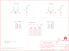

Contents
========

* [PRS12009 > Logic Level Converter](#prs12009--logic-level-converter)
	* [Schematic](#schematic)
	* [PCB](#pcb)
	* [Interactive BOM](#interactive-bom)
	* [OOMP Parts](#oomp-parts)
	* [Images](#images)
	* [Tags](#tags)
  
![][im]
# PRS12009 > Logic Level Converter

- ID: PROJ-SPAR-12009-STAN-01
- Hex ID: PRS12009
- Name: Sparkfun
- Description: Sparkfun
- Long Link: [http://oom.lt/PROJ-SPAR-12009-STAN-01](http://oom.lt/PROJ-SPAR-12009-STAN-01)
- Short Link: [http://oom.lt/PRS12009](http://oom.lt/PRS12009)

## Schematic
  

## PCB
  

## Interactive BOM

- Interactive BOM page: [ibom.html](https://htmlpreview.github.io/?https://github.com/oomlout/oomlout_OOMP_projects/blob/main/PROJ-SPAR-12009-STAN-01/kicad/bom/ibom.html)

## OOMP Parts
  

|OOMP Parts|
| :---: |
|[HEAD-I01-X-PI06-01  2.54 mm 6 Pin Header  JP1, JP2](https://github.com/oomlout/oomlout_OOMP_parts/tree/main/HEAD-I01-X-PI06-01/)|
|UNMATCHED-SO23-X-KBSS138-01 Q1, Q2|
|[RESE-0603-X-O103-01  SMD (0603) 10k Ohm Resistor  R1, R3, R4, R6, R7, R8](https://github.com/oomlout/oomlout_OOMP_parts/tree/main/RESE-0603-X-O103-01/)|
|[RESE-0603-X-O203-01  SMD (0603) 20k Ohm Resistor  R5, R9](https://github.com/oomlout/oomlout_OOMP_parts/tree/main/RESE-0603-X-O203-01/)|

## Images
  
  

|bominteractivefront|bominteractiveback|kicadPcb3d|kicadPcb3dFront|kicadPcb3dBack|eagleImage|eagleSchemImage|pcbdraw|pcbdrawback|
| :---: | :---: | :---: | :---: | :---: | :---: | :---: | :---: | :---: |
||||||||||

## Tags

- hexID: PRS12009
- oompType: PROJ
- oompSize: SPAR
- oompColor: 12009
- oompDesc: STAN
- oompIndex: 01
- oompName: Logic Level Converter
- sources: All source files from https://github.com/sparkfun/Logic_Level_Converter (source licence details in srcLicense.md)
- linkBuyPage: https://www.sparkfun.com/products/12009
- oompID: PROJ-SPAR-12009-STAN-01
- oompParts: JP1,HEAD-I01-X-PI06-01
- oompParts: JP2,HEAD-I01-X-PI06-01
- oompParts: Q1,UNMATCHED-SO23-X-KBSS138-01
- oompParts: Q2,UNMATCHED-SO23-X-KBSS138-01
- oompParts: R1,RESE-0603-X-O103-01
- oompParts: R3,RESE-0603-X-O103-01
- oompParts: R4,RESE-0603-X-O103-01
- oompParts: R5,RESE-0603-X-O203-01
- oompParts: R6,RESE-0603-X-O103-01
- oompParts: R7,RESE-0603-X-O103-01
- oompParts: R8,RESE-0603-X-O103-01
- oompParts: R9,RESE-0603-X-O203-01
- rawParts: CC_TEXT1,CREATIVE_COMMONS,CREATIVE_COMMONS,CREATIVE_COMMONS,Creative Commons License summary,,
- rawParts: JP1,,M06SIP,1X06,Header 6,,
- rawParts: JP2,,M06SIP,1X06,Header 6,,
- rawParts: JP3,FIDUCIALUFIDUCIAL,FIDUCIALUFIDUCIAL,MICRO-FIDUCIAL,Fiducial Alignment Points,,
- rawParts: JP4,FIDUCIALUFIDUCIAL,FIDUCIALUFIDUCIAL,MICRO-FIDUCIAL,Fiducial Alignment Points,,
- rawParts: JP5,LOGO-SFENW2,LOGO-SFENW2,SFE-NEW-WEB,Spark Fun Electronics PCB Logo,,
- rawParts: Q1,BSS138,MOSFET-NCHANNELSMD,SOT23-3,,,
- rawParts: Q2,BSS138,MOSFET-NCHANNELSMD,SOT23-3,,,
- rawParts: R1,10K,RESISTOR0603-RES,0603-RES,Resistor,,
- rawParts: R3,10K,RESISTOR0603-RES,0603-RES,Resistor,,
- rawParts: R4,10K,RESISTOR0603-RES,0603-RES,Resistor,,
- rawParts: R5,20K,RESISTOR0603-RES,0603-RES,Resistor,,
- rawParts: R6,10K,RESISTOR0603-RES,0603-RES,Resistor,,
- rawParts: R7,10K,RESISTOR0603-RES,0603-RES,Resistor,,
- rawParts: R8,10K,RESISTOR0603-RES,0603-RES,Resistor,,
- rawParts: R9,20K,RESISTOR0603-RES,0603-RES,Resistor,,
- rawParts: U$1,LOGO-SFESK,LOGO-SFESK,SFE-LOGO-FLAME,Spark Fun Electronics PCB Logo,,
- rawParts: U$2,OSHW-LOGOS,OSHW-LOGOS,OSHW-LOGO-S,Open Source Hardware Logo This logo indicates the piece of hardware it is found on incorporates a OSHW license and/or adheres to the definition of open source hardware found here: http://freedomdefined.org/OSHW,,

[im]: kicadPcb3d_450.png
