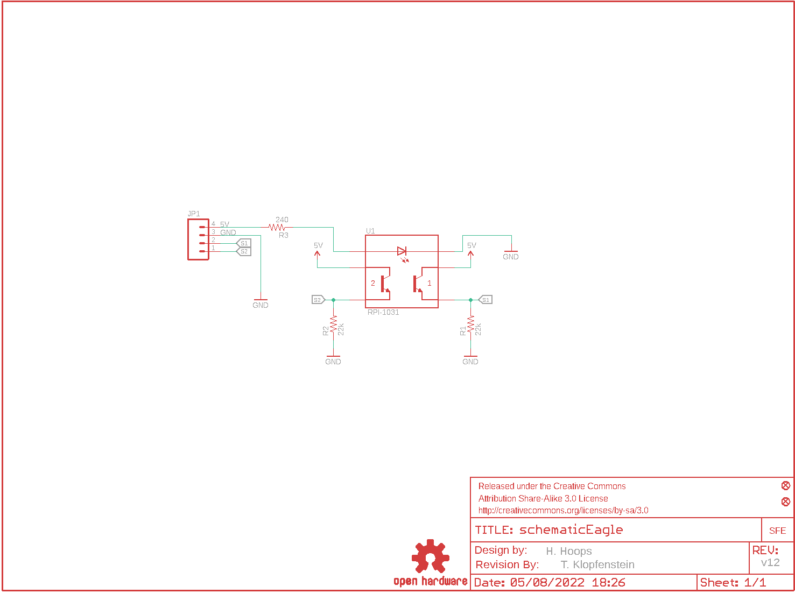
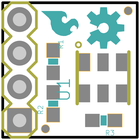
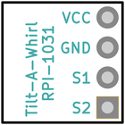
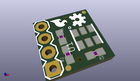
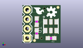
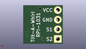

Contents
========

* [PRS12011 > Tilt-a-Whirl Breakout](#prs12011--tilt-a-whirl-breakout)
	* [Schematic](#schematic)
	* [PCB](#pcb)
	* [Interactive BOM](#interactive-bom)
	* [OOMP Parts](#oomp-parts)
	* [Images](#images)
	* [Tags](#tags)
  
![][im]
# PRS12011 > Tilt-a-Whirl Breakout

- ID: PROJ-SPAR-12011-STAN-01
- Hex ID: PRS12011
- Name: Sparkfun
- Description: Sparkfun
- Long Link: [http://oom.lt/PROJ-SPAR-12011-STAN-01](http://oom.lt/PROJ-SPAR-12011-STAN-01)
- Short Link: [http://oom.lt/PRS12011](http://oom.lt/PRS12011)

## Schematic
  

## PCB
  

## Interactive BOM

- Interactive BOM page: [ibom.html](https://htmlpreview.github.io/?https://github.com/oomlout/oomlout_OOMP_projects/blob/main/PROJ-SPAR-12011-STAN-01/kicad/bom/ibom.html)

## OOMP Parts
  

|OOMP Parts|
| :---: |
|[HEAD-I01-X-PI04-01  2.54 mm 4 Pin Header  JP1](https://github.com/oomlout/oomlout_OOMP_parts/tree/main/HEAD-I01-X-PI04-01/)|
|[RESE-0603-X-O223-01  SMD (0603) 22k Ohm Resistor  R1, R2](https://github.com/oomlout/oomlout_OOMP_parts/tree/main/RESE-0603-X-O223-01/)|
|[RESE-0603-X-O241-01  SMD (0603) 240 Ohm Resistor  R3](https://github.com/oomlout/oomlout_OOMP_parts/tree/main/RESE-0603-X-O241-01/)|
|UNMATCHED-UNMATCHED-X-UNMATCHED-01 U1|

## Images
  
  

|bominteractivefront|bominteractiveback|kicadPcb3d|kicadPcb3dFront|kicadPcb3dBack|eagleImage|eagleSchemImage|
| :---: | :---: | :---: | :---: | :---: | :---: | :---: |
||||||||

## Tags

- hexID: PRS12011
- oompType: PROJ
- oompSize: SPAR
- oompColor: 12011
- oompDesc: STAN
- oompIndex: 01
- oompName: Tilt-a-Whirl Breakout
- sources: All source files from https://github.com/sparkfun/Tilt-a-Whirl_Breakout (source licence details in srcLicense.md)
- linkBuyPage: https://www.sparkfun.com/products/12011
- oompID: PROJ-SPAR-12011-STAN-01
- oompParts: JP1,HEAD-I01-X-PI04-01
- oompParts: R1,RESE-0603-X-O223-01
- oompParts: R2,RESE-0603-X-O223-01
- oompParts: R3,RESE-0603-X-O241-01
- oompParts: U1,UNMATCHED-UNMATCHED-X-UNMATCHED-01
- rawParts: FRAME1,FRAME-LETTER,FRAME-LETTER,CREATIVE_COMMONS,Schematic Frame,,,
- rawParts: JP1,,M04PTH,1X04,Header 4,,,
- rawParts: JP2,FIDUCIAL1X2.5,FIDUCIAL1X2.5,FIDUCIAL-1X2.5,Fiducial Alignment Points,,,
- rawParts: JP3,FIDUCIAL1X2.5,FIDUCIAL1X2.5,FIDUCIAL-1X2.5,Fiducial Alignment Points,,,
- rawParts: JP4,LOGO-SFESK,LOGO-SFESK,SFE-LOGO-FLAME,Spark Fun Electronics PCB Logo,,,
- rawParts: R1,22k,22KOHM1/10W1%(0603),0603-RES,RES-07853,RES-07853,22K,
- rawParts: R2,22k,22KOHM1/10W1%(0603),0603-RES,RES-07853,RES-07853,22K,
- rawParts: R3,240,240OHM1/10W1%(0603),0603-RES,RES-07849,RES-07849,240,
- rawParts: U$1,OSHW-LOGOS,OSHW-LOGOS,OSHW-LOGO-S,Open Source Hardware Logo This logo indicates the piece of hardware it is found on incorporates a OSHW license and/or adheres to the definition of open source hardware found here: http://freedomdefined.org/OSHW,,,
- rawParts: U$2,REVISION,REVISION,REVISION,,,,
- rawParts: U1,RPI-1031,RPI-1031,RPI-1031,,,,

[im]: kicadPcb3d_450.png
