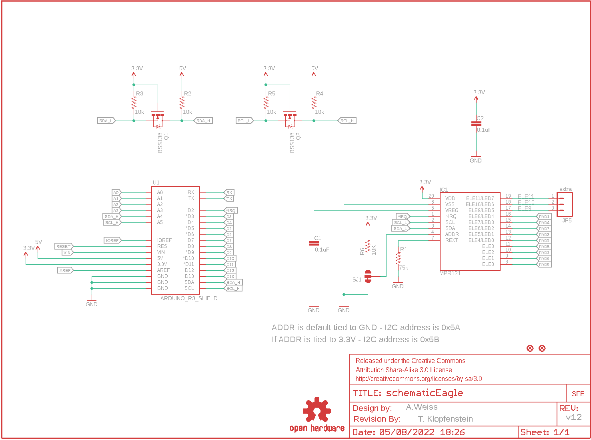
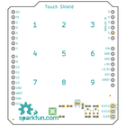
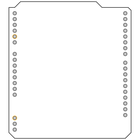
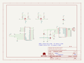
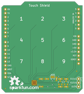
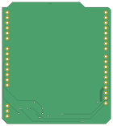

Contents
========

* [PRS12013 > Touch Shield](#prs12013--touch-shield)
	* [Schematic](#schematic)
	* [PCB](#pcb)
	* [Interactive BOM](#interactive-bom)
	* [OOMP Parts](#oomp-parts)
	* [Images](#images)
	* [Tags](#tags)
  
![][im]
# PRS12013 > Touch Shield

- ID: PROJ-SPAR-12013-STAN-01
- Hex ID: PRS12013
- Name: Sparkfun
- Description: Sparkfun
- Long Link: [http://oom.lt/PROJ-SPAR-12013-STAN-01](http://oom.lt/PROJ-SPAR-12013-STAN-01)
- Short Link: [http://oom.lt/PRS12013](http://oom.lt/PRS12013)

## Schematic
  

## PCB
  

## Interactive BOM

- Interactive BOM page: [ibom.html](https://htmlpreview.github.io/?https://github.com/oomlout/oomlout_OOMP_projects/blob/main/PROJ-SPAR-12013-STAN-01/kicad/bom/ibom.html)

## OOMP Parts
  

|OOMP ID|Name|Identifier|
| :---: | :---: | :---: |
|[CAPC-0603-X-NF100-V50](https://github.com/oomlout/oomlout_OOMP_parts/tree/main/CAPC-0603-X-NF100-V50/)|[SMD (0603) 100 nF Capacitor (Ceramic) 50v](https://github.com/oomlout/oomlout_OOMP_parts/tree/main/CAPC-0603-X-NF100-V50/)|[C1, C2](https://github.com/oomlout/oomlout_OOMP_parts/tree/main/CAPC-0603-X-NF100-V50/)|
|UNMATCHED-UNMATCHED-X-UNMATCHED-01||IC1, U1|
|[HEAD-I01-X-PI03-01](https://github.com/oomlout/oomlout_OOMP_parts/tree/main/HEAD-I01-X-PI03-01/)|[2.54 mm 3 Pin Header](https://github.com/oomlout/oomlout_OOMP_parts/tree/main/HEAD-I01-X-PI03-01/)|[JP5](https://github.com/oomlout/oomlout_OOMP_parts/tree/main/HEAD-I01-X-PI03-01/)|
|UNMATCHED-SO23-X-KBSS138-01||Q1, Q2|
|[RESE-0603-X-O753-01](https://github.com/oomlout/oomlout_OOMP_parts/tree/main/RESE-0603-X-O753-01/)|[SMD (0603) 75k Ohm Resistor](https://github.com/oomlout/oomlout_OOMP_parts/tree/main/RESE-0603-X-O753-01/)|[R1](https://github.com/oomlout/oomlout_OOMP_parts/tree/main/RESE-0603-X-O753-01/)|
|[RESE-0603-X-O103-01](https://github.com/oomlout/oomlout_OOMP_parts/tree/main/RESE-0603-X-O103-01/)|[SMD (0603) 10k Ohm Resistor](https://github.com/oomlout/oomlout_OOMP_parts/tree/main/RESE-0603-X-O103-01/)|[R2, R3, R4, R5, R6](https://github.com/oomlout/oomlout_OOMP_parts/tree/main/RESE-0603-X-O103-01/)|

## Images
  
  

|bominteractivefront|bominteractiveback|kicadPcb3d|kicadPcb3dFront|kicadPcb3dBack|kicadSchem|eagleImage|eagleSchemImage|pcbdraw|pcbdrawback|
| :---: | :---: | :---: | :---: | :---: | :---: | :---: | :---: | :---: | :---: |
|||||||||||

## Tags

- hexID: PRS12013
- oompType: PROJ
- oompSize: SPAR
- oompColor: 12013
- oompDesc: STAN
- oompIndex: 01
- oompName: Touch Shield
- sources: All source files from https://github.com/sparkfun/Touch_Shield (source licence details in srcLicense.md)
- linkBuyPage: https://www.sparkfun.com/products/12013
- oompID: PROJ-SPAR-12013-STAN-01
- oompParts: C1,CAPC-0603-X-NF100-V50
- oompParts: C2,CAPC-0603-X-NF100-V50
- oompParts: IC1,UNMATCHED-UNMATCHED-X-UNMATCHED-01
- oompParts: JP5,HEAD-I01-X-PI03-01
- oompParts: Q1,UNMATCHED-SO23-X-KBSS138-01
- oompParts: Q2,UNMATCHED-SO23-X-KBSS138-01
- oompParts: R1,RESE-0603-X-O753-01
- oompParts: R2,RESE-0603-X-O103-01
- oompParts: R3,RESE-0603-X-O103-01
- oompParts: R4,RESE-0603-X-O103-01
- oompParts: R5,RESE-0603-X-O103-01
- oompParts: R6,RESE-0603-X-O103-01
- oompParts: U1,UNMATCHED-UNMATCHED-X-UNMATCHED-01
- rawParts: C1,0.1uF,CAP0603-CAP,0603-CAP,Capacitor,,,
- rawParts: C2,0.1uF,CAP0603-CAP,0603-CAP,Capacitor,,,
- rawParts: FID1,FIDUCIALUFIDUCIAL,FIDUCIALUFIDUCIAL,MICRO-FIDUCIAL,Fiducial Alignment Points,,,
- rawParts: FID2,FIDUCIALUFIDUCIAL,FIDUCIALUFIDUCIAL,MICRO-FIDUCIAL,Fiducial Alignment Points,,,
- rawParts: FRAME1,FRAME-LETTER,FRAME-LETTER,CREATIVE_COMMONS,Schematic Frame,,,
- rawParts: IC1,MPR121,MPR121V2,QFN-20-0.4MM-V2,MPR121 Capacitive Touch Sensor Controller. Variant V2 was created using an image import of the bottom of the IC. It matches metal to metal.,,,
- rawParts: JP1,LOGO-SFENEW,LOGO-SFENEW,SFE-NEW-WEBLOGO,Spark Fun Electronics PCB Logo,,,
- rawParts: JP5,extra,M03PTH,1X03,Header 3,,,
- rawParts: Q1,BSS138,MOSFET-NCHANNELSMD,SOT23-3,,,,
- rawParts: Q2,BSS138,MOSFET-NCHANNELSMD,SOT23-3,,,,
- rawParts: R1,75k,RESISTOR0603-RES,0603-RES,Resistor,,,
- rawParts: R2,10k,10KOHM1/10W1%(0603)0603,0603-RES,RES-00824,RES-00824,10K,
- rawParts: R3,10k,10KOHM1/10W1%(0603)0603,0603-RES,RES-00824,RES-00824,10K,
- rawParts: R4,10k,10KOHM1/10W1%(0603)0603,0603-RES,RES-00824,RES-00824,10K,
- rawParts: R5,10k,10KOHM1/10W1%(0603)0603,0603-RES,RES-00824,RES-00824,10K,
- rawParts: R6,10K,10KOHM1/10W1%(0603)0603,0603-RES,RES-00824,RES-00824,10K,
- rawParts: SJ1,,SOLDERJUMPER_2WAYPASTE1&2,SJ_3_PASTE1&2,Solder Jumper,,,
- rawParts: U$1,REVISION,REVISION,REVISION,,,,
- rawParts: U$5,OSHW-LOGOL,OSHW-LOGOL,OSHW-LOGO-L,Open Source Hardware Logo This logo indicates the piece of hardware it is found on incorporates a OSHW license and/or adheres to the definition of open source hardware found here: http://freedomdefined.org/OSHW,,,
- rawParts: U1,ARDUINO_R3_SHIELD,ARDUINO_R3_SHIELD,UNO_R3_SHIELD,Shield form compatible with the Arduino Uno R3.,,,

[im]: kicadPcb3d_450.png
