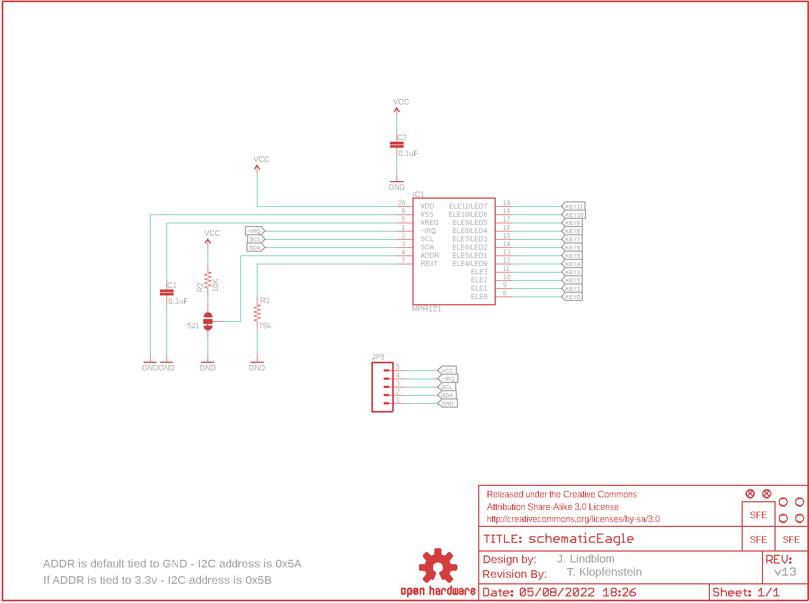
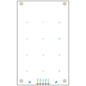
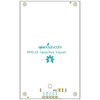
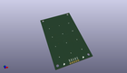
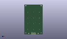
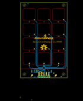
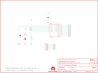

Contents
========

* [PRS12017 > MPR121 Capacitive Touch Keypad](#prs12017--mpr121-capacitive-touch-keypad)
	* [Schematic](#schematic)
	* [PCB](#pcb)
	* [Interactive BOM](#interactive-bom)
	* [OOMP Parts](#oomp-parts)
	* [Images](#images)
	* [Tags](#tags)
  
![][im]
# PRS12017 > MPR121 Capacitive Touch Keypad

- ID: PROJ-SPAR-12017-STAN-01
- Hex ID: PRS12017
- Name: Sparkfun
- Description: Sparkfun
- Long Link: [http://oom.lt/PROJ-SPAR-12017-STAN-01](http://oom.lt/PROJ-SPAR-12017-STAN-01)
- Short Link: [http://oom.lt/PRS12017](http://oom.lt/PRS12017)

## Schematic
  

## PCB
  

## Interactive BOM

- Interactive BOM page: [ibom.html](https://htmlpreview.github.io/?https://github.com/oomlout/oomlout_OOMP_projects/blob/main/PROJ-SPAR-12017-STAN-01/kicad/bom/ibom.html)

## OOMP Parts
  

|OOMP Parts|
| :---: |
|[CAPC-0603-X-NF100-V50  SMD (0603) 100 nF Capacitor (Ceramic) 50v  C1, C2](https://github.com/oomlout/oomlout_OOMP_parts/tree/main/CAPC-0603-X-NF100-V50/)|
|UNMATCHED-UNMATCHED-X-UNMATCHED-01 IC1|
|[HEAD-I01-X-PI05-01  2.54 mm 5 Pin Header  JP9](https://github.com/oomlout/oomlout_OOMP_parts/tree/main/HEAD-I01-X-PI05-01/)|
|RESE-0603-X-O753-01 R1|
|[RESE-0603-X-O103-01  SMD (0603) 10k Ohm Resistor  R2](https://github.com/oomlout/oomlout_OOMP_parts/tree/main/RESE-0603-X-O103-01/)|

## Images
  
  

|bominteractivefront|bominteractiveback|kicadPcb3d|kicadPcb3dFront|kicadPcb3dBack|eagleImage|eagleSchemImage|
| :---: | :---: | :---: | :---: | :---: | :---: | :---: |
||||||||

## Tags

- hexID: PRS12017
- oompType: PROJ
- oompSize: SPAR
- oompColor: 12017
- oompDesc: STAN
- oompIndex: 01
- oompName: MPR121 Capacitive Touch Keypad
- sources: All source files from https://github.com/sparkfun/MPR121_Capacitive_Touch_Keypad (source licence details in srcLicense.md)
- linkBuyPage: https://www.sparkfun.com/products/12017
- oompID: PROJ-SPAR-12017-STAN-01
- oompParts: C1,CAPC-0603-X-NF100-V50
- oompParts: C2,CAPC-0603-X-NF100-V50
- oompParts: IC1,UNMATCHED-UNMATCHED-X-UNMATCHED-01
- oompParts: JP9,HEAD-I01-X-PI05-01
- oompParts: R1,RESE-0603-X-O753-01
- oompParts: R2,RESE-0603-X-O103-01
- rawParts: C1,0.1uF,0.1UF-25V(+80/-20%)(0603),0603-CAP,Ceramic,CAP-00810,0.1uF,
- rawParts: C2,0.1uF,0.1UF-25V(+80/-20%)(0603),0603-CAP,Ceramic,CAP-00810,0.1uF,
- rawParts: FRAME1,FRAME-LETTER,FRAME-LETTER,CREATIVE_COMMONS,Schematic Frame,,,
- rawParts: IC1,MPR121,MPR121V2,QFN-20-0.4MM-V2,MPR121 Capacitive Touch Sensor Controller. Variant V2 was created using an image import of the bottom of the IC. It matches metal to metal.,,,
- rawParts: JP1,LOGO-SFENEW,LOGO-SFENEW,SFE-NEW-WEBLOGO,Spark Fun Electronics PCB Logo,,,
- rawParts: JP2,LOGO-SFESK,LOGO-SFESK,SFE-LOGO-FLAME,Spark Fun Electronics PCB Logo,,,
- rawParts: JP3,STAND-OFF,STAND-OFF,STAND-OFF,Stand Off,,,
- rawParts: JP4,STAND-OFF,STAND-OFF,STAND-OFF,Stand Off,,,
- rawParts: JP5,FIDUCIAL1X2,FIDUCIAL1X2,FIDUCIAL-1X2,Fiducial Alignment Points,,,
- rawParts: JP6,LOGO-SFESK,LOGO-SFESK,SFE-LOGO-FLAME,Spark Fun Electronics PCB Logo,,,
- rawParts: JP7,STAND-OFF,STAND-OFF,STAND-OFF,Stand Off,,,
- rawParts: JP8,STAND-OFF,STAND-OFF,STAND-OFF,Stand Off,,,
- rawParts: JP9,,M05PTH,1X05,Header 5,,,
- rawParts: JP10,FIDUCIAL1X2,FIDUCIAL1X2,FIDUCIAL-1X2,Fiducial Alignment Points,,,
- rawParts: LOGO1,OSHW-LOGOL,OSHW-LOGOL,OSHW-LOGO-L,Open Source Hardware Logo This logo indicates the piece of hardware it is found on incorporates a OSHW license and/or adheres to the definition of open source hardware found here: http://freedomdefined.org/OSHW,,,
- rawParts: R1,75k,RESISTOR0603-RES,0603-RES,Resistor,,,
- rawParts: R2,10K,10KOHM1/10W1%(0603)0603,0603-RES,RES-00824,RES-00824,10K,
- rawParts: SJ1,,SOLDERJUMPER_2WAYPASTE1&2,SJ_3_PASTE1&2,Solder Jumper,,,
- rawParts: U$1,REVISION,REVISION,REVISION,,,,

[im]: kicadPcb3d_450.png
