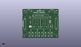
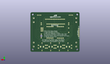
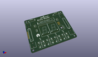

Contents
========

* [PROJ-SPAR-12037-STAN-01>Binary Blaster](#proj-spar-12037-stan-01binary-blaster)
	* [Images](#images)
	* [Interactive BOM](#interactive-bom)
	* [OOMP Parts](#oomp-parts)
	* [Tags](#tags)
  
![][im]
# PROJ-SPAR-12037-STAN-01>Binary Blaster

- ID: PROJ-SPAR-12037-STAN-01
- Hex ID: PRS12037
- Name: Binary Blaster
- Description: 

## Images
  
  

|eagleImage|kicadPcb3dFront|kicadPcb3dBack|kicadPcb3d|
| :---: | :---: | :---: | :---: |
|||||

## Interactive BOM

- Interactive BOM page: [ibom.html](kicad/bom/ibom.html)

## OOMP Parts
  

|OOMP Parts|
| :---: |
|UNMATCHED-UNMATCHED-X-UNMATCHED-01, BAT1, 5.715, 34.29, 270,BAT1, AA, BATTERY-AA-KIT, SparkFun-Electromechanical, (0.225, 1.35), R270|
|UNMATCHED-UNMATCHED-X-UNMATCHED-01, BAT2, 80.645, 34.29, 90,BAT2, AA, BATTERY-AA-KIT, SparkFun-Electromechanical, (3.175, 1.35), R90|
|CAPC-UNMATCHED-X-NF100-V50, C1, 67.30999999999999, 49.529999999999994, 270,C1, 0.1uF, CAP-PTH-SMALL-KIT, SparkFun-Capacitors, (2.65, 1.95), R270|
|CAPC-UNMATCHED-X-NF100-V50, C2, 19.049999999999997, 49.529999999999994, 270,C2, 0.1uF, CAP-PTH-SMALL-KIT, SparkFun-Capacitors, (0.75, 1.95), R270|
|<table><tr><td></td><td> JP1</td><td>[HEAD-I01-X-PI06-01 2.54 mm 6 Pin Header](https://github.com/oomlout/oomlout_OOMP_parts/tree/main/HEAD-I01-X-PI06-01/)</td><td>[H06](https://github.com/oomlout/oomlout_OOMP_parts/tree/main/HEAD-I01-X-PI06-01/)</td></tr></table>|
|UNMATCHED-UNMATCHED-X-UNMATCHED-01, JP3, 66.03999999999999, 39.37, M270,JP3, 2X3-NS, SparkFun, (2.6, 1.55), MR270|
|RESE-UNMATCHED-X-O103-01, R1, 19.049999999999997, 38.099999999999994, 90,R1, 10K, AXIAL-0.3-KIT, SparkFun-Resistors, (0.75, 1.5), R90|
|UNMATCHED-UNMATCHED-X-UNMATCHED-01, S1, 15.239999999999998, 64.77, 270,S1, Power, SWITCH-SPDT_KIT, SparkFun-Electromechanical, (0.6, 2.55), R270|
|UNMATCHED-UNMATCHED-X-UNMATCHED-01, S2, 71.11999999999999, 64.77, 90,S2, SWITCH-SPDT_KIT, SparkFun-Electromechanical, (2.8, 2.55), R90|
|UNMATCHED-UNMATCHED-X-UNMATCHED-01, S3, 20.32, 8.889999999999999, 0,S3, TACTILE-PTH-LED-12MM-EZ, SparkFun-Electromechanical, (0.8, 0.35), R0|
|UNMATCHED-UNMATCHED-X-UNMATCHED-01, S4, 35.559999999999995, 8.889999999999999, 0,S4, TACTILE-PTH-LED-12MM-EZ, SparkFun-Electromechanical, (1.4, 0.35), R0|
|UNMATCHED-UNMATCHED-X-UNMATCHED-01, S5, 50.8, 8.889999999999999, 0,S5, TACTILE-PTH-LED-12MM-EZ, SparkFun-Electromechanical, (2, 0.35), R0|
|UNMATCHED-UNMATCHED-X-UNMATCHED-01, S6, 66.03999999999999, 8.889999999999999, 0,S6, TACTILE-PTH-LED-12MM-EZ, SparkFun-Electromechanical, (2.6, 0.35), R0|
|UNMATCHED-UNMATCHED-X-UNMATCHED-01, SG1, 67.30999999999999, 27.94, 270,SG1, BUZZER, BUZZER-12MM-KIT, SparkFun-Electromechanical, (2.65, 1.1), R270|
|UNMATCHED-UNMATCHED-X-UNMATCHED-01, U$1, 33.654999999999994, 34.29, 0,U$1, 7-SEGMENT-DISPLAY-1-REDEZ, 7-SEGMENT-1PTH-EZ, SparkFun-Displays, (1.325, 1.35), R0|
|UNMATCHED-UNMATCHED-X-UNMATCHED-01, U$6, 52.06999999999999, 34.29, 0,U$6, 7-SEGMENT-DISPLAY-1-REDEZ, 7-SEGMENT-1PTH-EZ, SparkFun-Displays, (2.05, 1.35), R0|
|UNMATCHED-UNMATCHED-X-UNMATCHED-01, U$7, 43.18, 53.339999999999996, 0,U$7, AVR-MEGA8-P-KEYED-14, DIL28-3_KEYED-14, Testing, (1.7, 2.1), R0|

## Tags

- hexID: PRS12037
- oompType: PROJ
- oompSize: SPAR
- oompColor: 12037
- oompDesc: STAN
- oompIndex: 01
- oompName: Binary Blaster
- sources: All source files from https://github.com/sparkfun/Binary_Blaster (source licence details in srcLicense.md)
- linkBuyPage: https://www.sparkfun.com/products/12037
- oompPart: UNMATCHED-UNMATCHED-X-UNMATCHED-01, BAT1, 5.715, 34.29, 270
- oompPart: UNMATCHED-UNMATCHED-X-UNMATCHED-01, BAT2, 80.645, 34.29, 90
- oompPart: CAPC-UNMATCHED-X-NF100-V50, C1, 67.30999999999999, 49.529999999999994, 270
- oompPart: CAPC-UNMATCHED-X-NF100-V50, C2, 19.049999999999997, 49.529999999999994, 270
- oompPart: HEAD-I01-X-PI06-01, JP1, 1.27, 40.64, M270
- oompPart: UNMATCHED-UNMATCHED-X-UNMATCHED-01, JP3, 66.03999999999999, 39.37, M270
- oompPart: SKIP-UNMATCHED-X-UNMATCHED-01, JP4, 17.779999999999998, 8.889999999999999, M90
- oompPart: SKIP-UNMATCHED-X-UNMATCHED-01, JP8, 22.86, 8.889999999999999, M270
- oompPart: SKIP-UNMATCHED-X-UNMATCHED-01, JP9, 33.019999999999996, 8.889999999999999, M90
- oompPart: SKIP-UNMATCHED-X-UNMATCHED-01, JP10, 38.099999999999994, 8.889999999999999, M270
- oompPart: SKIP-UNMATCHED-X-UNMATCHED-01, JP11, 48.26, 8.889999999999999, M90
- oompPart: SKIP-UNMATCHED-X-UNMATCHED-01, JP12, 53.339999999999996, 8.889999999999999, M270
- oompPart: SKIP-UNMATCHED-X-UNMATCHED-01, JP13, 63.5, 8.889999999999999, M90
- oompPart: SKIP-UNMATCHED-X-UNMATCHED-01, JP14, 68.58, 8.889999999999999, M270
- oompPart: RESE-UNMATCHED-X-O103-01, R1, 19.049999999999997, 38.099999999999994, 90
- oompPart: UNMATCHED-UNMATCHED-X-UNMATCHED-01, S1, 15.239999999999998, 64.77, 270
- oompPart: UNMATCHED-UNMATCHED-X-UNMATCHED-01, S2, 71.11999999999999, 64.77, 90
- oompPart: UNMATCHED-UNMATCHED-X-UNMATCHED-01, S3, 20.32, 8.889999999999999, 0
- oompPart: UNMATCHED-UNMATCHED-X-UNMATCHED-01, S4, 35.559999999999995, 8.889999999999999, 0
- oompPart: UNMATCHED-UNMATCHED-X-UNMATCHED-01, S5, 50.8, 8.889999999999999, 0
- oompPart: UNMATCHED-UNMATCHED-X-UNMATCHED-01, S6, 66.03999999999999, 8.889999999999999, 0
- oompPart: UNMATCHED-UNMATCHED-X-UNMATCHED-01, SG1, 67.30999999999999, 27.94, 270
- oompPart: UNMATCHED-UNMATCHED-X-UNMATCHED-01, U$1, 33.654999999999994, 34.29, 0
- oompPart: UNMATCHED-UNMATCHED-X-UNMATCHED-01, U$6, 52.06999999999999, 34.29, 0
- oompPart: UNMATCHED-UNMATCHED-X-UNMATCHED-01, U$7, 43.18, 53.339999999999996, 0
- rawPart: BAT1, AA, BATTERY-AA-KIT, SparkFun-Electromechanical, (0.225, 1.35), R270
- rawPart: BAT2, AA, BATTERY-AA-KIT, SparkFun-Electromechanical, (3.175, 1.35), R90
- rawPart: C1, 0.1uF, CAP-PTH-SMALL-KIT, SparkFun-Capacitors, (2.65, 1.95), R270
- rawPart: C2, 0.1uF, CAP-PTH-SMALL-KIT, SparkFun-Capacitors, (0.75, 1.95), R270
- rawPart: JP1, Serial, 1X06-NOSILK, unclepetes, (0.05, 1.6), MR270
- rawPart: JP3, 2X3-NS, SparkFun, (2.6, 1.55), MR270
- rawPart: JP4, SJ_3, SparkFun-Passives, (0.7, 0.35), MR90
- rawPart: JP8, SJ_3, SparkFun-Passives, (0.9, 0.35), MR270
- rawPart: JP9, SJ_3, SparkFun-Passives, (1.3, 0.35), MR90
- rawPart: JP10, SJ_3, SparkFun-Passives, (1.5, 0.35), MR270
- rawPart: JP11, SJ_3, SparkFun-Passives, (1.9, 0.35), MR90
- rawPart: JP12, SJ_3, SparkFun-Passives, (2.1, 0.35), MR270
- rawPart: JP13, SJ_3, SparkFun-Passives, (2.5, 0.35), MR90
- rawPart: JP14, SJ_3, SparkFun-Passives, (2.7, 0.35), MR270
- rawPart: R1, 10K, AXIAL-0.3-KIT, SparkFun-Resistors, (0.75, 1.5), R90
- rawPart: S1, Power, SWITCH-SPDT_KIT, SparkFun-Electromechanical, (0.6, 2.55), R270
- rawPart: S2, SWITCH-SPDT_KIT, SparkFun-Electromechanical, (2.8, 2.55), R90
- rawPart: S3, TACTILE-PTH-LED-12MM-EZ, SparkFun-Electromechanical, (0.8, 0.35), R0
- rawPart: S4, TACTILE-PTH-LED-12MM-EZ, SparkFun-Electromechanical, (1.4, 0.35), R0
- rawPart: S5, TACTILE-PTH-LED-12MM-EZ, SparkFun-Electromechanical, (2, 0.35), R0
- rawPart: S6, TACTILE-PTH-LED-12MM-EZ, SparkFun-Electromechanical, (2.6, 0.35), R0
- rawPart: SG1, BUZZER, BUZZER-12MM-KIT, SparkFun-Electromechanical, (2.65, 1.1), R270
- rawPart: U$1, 7-SEGMENT-DISPLAY-1-REDEZ, 7-SEGMENT-1PTH-EZ, SparkFun-Displays, (1.325, 1.35), R0
- rawPart: U$6, 7-SEGMENT-DISPLAY-1-REDEZ, 7-SEGMENT-1PTH-EZ, SparkFun-Displays, (2.05, 1.35), R0
- rawPart: U$7, AVR-MEGA8-P-KEYED-14, DIL28-3_KEYED-14, Testing, (1.7, 2.1), R0
- oompID: PROJ-SPAR-12037-STAN-01

[im]: kicadPcb3d_450.png
