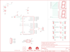

Contents
========

* [PRS12037 > Sparkfun](#prs12037--sparkfun)
	* [Schematic](#schematic)
	* [Interactive BOM](#interactive-bom)
	* [OOMP Parts](#oomp-parts)
	* [Images](#images)
	* [Tags](#tags)
  
![][im]
# PRS12037 > Sparkfun

- ID: PROJ-SPAR-12037-STAN-01
- Hex ID: PRS12037
- Name: Sparkfun
- Description: Sparkfun
- Long Link: [http://oom.lt/PROJ-SPAR-12037-STAN-01](http://oom.lt/PROJ-SPAR-12037-STAN-01)
- Long Link: [http://oom.lt/PRS12037](http://oom.lt/PRS12037)

## Schematic
  
![][schem]
## Interactive BOM

- Interactive BOM page: [ibom.html](https://htmlpreview.github.io/?https://github.com/oomlout/oomlout_OOMP_projects/blob/main/PROJ-SPAR-12037-STAN-01/kicad/bom/ibom.html)

## OOMP Parts
  

|OOMP Parts|
| :---: |
|BAT1,UNMATCHED-UNMATCHED-UNMATCHED-UNMATCHED-UNMATCHED,BAT1,AA,BATTERYAA-KIT,BATTERY-AA-KIT,Battery Holders,BATT-08316,|
|BAT2,UNMATCHED-UNMATCHED-UNMATCHED-UNMATCHED-UNMATCHED,BAT2,AA,BATTERYAA-KIT,BATTERY-AA-KIT,Battery Holders,BATT-08316,|
|C1,UNMATCHED-UNMATCHED-UNMATCHED-UNMATCHED-UNMATCHED,C1,0.1uF,0.1UF-50V-20%(PTH)KIT-EZ,CAP-PTH-SMALL-KIT,CAP-08370,CAP-08370,|
|C2,UNMATCHED-UNMATCHED-UNMATCHED-UNMATCHED-UNMATCHED,C2,0.1uF,0.1UF-50V-20%(PTH)KIT-EZ,CAP-PTH-SMALL-KIT,CAP-08370,CAP-08370,|
|FRAME1,UNMATCHED-UNMATCHED-UNMATCHED-UNMATCHED-UNMATCHED,FRAME1,FRAME-LETTER,FRAME-LETTER,CREATIVE_COMMONS,Schematic Frame,,|
|JP1,UNMATCHED-UNMATCHED-UNMATCHED-UNMATCHED-UNMATCHED,JP1,Serial,M06-SFENOSILK,1X06-NOSILK,Header 6,,|
|JP2,UNMATCHED-UNMATCHED-UNMATCHED-UNMATCHED-UNMATCHED,JP2,STAND-OFF,STAND-OFF,STAND-OFF,Stand Off,,|
|JP3,UNMATCHED-UNMATCHED-UNMATCHED-UNMATCHED-UNMATCHED,JP3,,AVR_SPI_PRG_6NS,2X3-NS,AVR ISP 6 Pin,,|
|JP4,UNMATCHED-UNMATCHED-UNMATCHED-UNMATCHED-UNMATCHED,JP4,,JUMPER-3SMD,SJ_3,,,|
|JP5,UNMATCHED-UNMATCHED-UNMATCHED-UNMATCHED-UNMATCHED,JP5,STAND-OFF,STAND-OFF,STAND-OFF,Stand Off,,|
|JP6,UNMATCHED-UNMATCHED-UNMATCHED-UNMATCHED-UNMATCHED,JP6,STAND-OFF,STAND-OFF,STAND-OFF,Stand Off,,|
|JP7,UNMATCHED-UNMATCHED-UNMATCHED-UNMATCHED-UNMATCHED,JP7,STAND-OFF,STAND-OFF,STAND-OFF,Stand Off,,|
|JP8,UNMATCHED-UNMATCHED-UNMATCHED-UNMATCHED-UNMATCHED,JP8,,JUMPER-3SMD,SJ_3,,,|
|JP9,UNMATCHED-UNMATCHED-UNMATCHED-UNMATCHED-UNMATCHED,JP9,,JUMPER-3SMD,SJ_3,,,|
|JP10,UNMATCHED-UNMATCHED-UNMATCHED-UNMATCHED-UNMATCHED,JP10,,JUMPER-3SMD,SJ_3,,,|
|JP11,UNMATCHED-UNMATCHED-UNMATCHED-UNMATCHED-UNMATCHED,JP11,,JUMPER-3SMD,SJ_3,,,|
|JP12,UNMATCHED-UNMATCHED-UNMATCHED-UNMATCHED-UNMATCHED,JP12,,JUMPER-3SMD,SJ_3,,,|
|JP13,UNMATCHED-UNMATCHED-UNMATCHED-UNMATCHED-UNMATCHED,JP13,,JUMPER-3SMD,SJ_3,,,|
|JP14,UNMATCHED-UNMATCHED-UNMATCHED-UNMATCHED-UNMATCHED,JP14,,JUMPER-3SMD,SJ_3,,,|
|LOGO1,UNMATCHED-UNMATCHED-UNMATCHED-UNMATCHED-UNMATCHED,LOGO1,LOGO-SFENEW,LOGO-SFENEW,SFE-NEW-WEBLOGO,Spark Fun Electronics PCB Logo,,|
|LOGO2,UNMATCHED-UNMATCHED-UNMATCHED-UNMATCHED-UNMATCHED,LOGO2,LOGO-SFENEW,LOGO-SFENEW,SFE-NEW-WEBLOGO,Spark Fun Electronics PCB Logo,,|
|R1,UNMATCHED-UNMATCHED-UNMATCHED-UNMATCHED-UNMATCHED,R1,10K,10KOHM1/6W5%(PTH)KIT,AXIAL-0.3-KIT,RES-08375,RES-08375,|
|S1,UNMATCHED-UNMATCHED-UNMATCHED-UNMATCHED-UNMATCHED,S1,Power,SWITCH-SPDTKIT,SWITCH-SPDT_KIT,SPDT Switch,SWCH-08261,|
|S2,UNMATCHED-UNMATCHED-UNMATCHED-UNMATCHED-UNMATCHED,S2,,SWITCH-SPDTKIT,SWITCH-SPDT_KIT,SPDT Switch,SWCH-08261,|
|S3,UNMATCHED-UNMATCHED-UNMATCHED-UNMATCHED-UNMATCHED,S3,,SWITCH-MOMENTARY-LEDEZ,TACTILE-PTH-LED-12MM-EZ,EZ is for Kits. There is no tStop (covering up the top side of the pads with mask). This helps the beginner see which side they should be soldering too.,,|
|S4,UNMATCHED-UNMATCHED-UNMATCHED-UNMATCHED-UNMATCHED,S4,,SWITCH-MOMENTARY-LEDEZ,TACTILE-PTH-LED-12MM-EZ,EZ is for Kits. There is no tStop (covering up the top side of the pads with mask). This helps the beginner see which side they should be soldering too.,,|
|S5,UNMATCHED-UNMATCHED-UNMATCHED-UNMATCHED-UNMATCHED,S5,,SWITCH-MOMENTARY-LEDEZ,TACTILE-PTH-LED-12MM-EZ,EZ is for Kits. There is no tStop (covering up the top side of the pads with mask). This helps the beginner see which side they should be soldering too.,,|
|S6,UNMATCHED-UNMATCHED-UNMATCHED-UNMATCHED-UNMATCHED,S6,,SWITCH-MOMENTARY-LEDEZ,TACTILE-PTH-LED-12MM-EZ,EZ is for Kits. There is no tStop (covering up the top side of the pads with mask). This helps the beginner see which side they should be soldering too.,,|
|SG1,UNMATCHED-UNMATCHED-UNMATCHED-UNMATCHED-UNMATCHED,SG1,BUZZER,BUZZERPTH-KIT,BUZZER-12MM-KIT,Buzzer 12mm,COMP-08253,|
|U$1,UNMATCHED-UNMATCHED-UNMATCHED-UNMATCHED-UNMATCHED,U$1,7-SEGMENT-DISPLAY-1-REDEZ,7-SEGMENT-DISPLAY-1-REDEZ,7-SEGMENT-1PTH-EZ,7-Segment Display 1 Red (COM-08546),,|
|U$2,UNMATCHED-UNMATCHED-UNMATCHED-UNMATCHED-UNMATCHED,U$2,OSHW-LOGOL,OSHW-LOGOL,OSHW-LOGO-L,Open Source Hardware Logo This logo indicates the piece of hardware it is found on incorporates a OSHW license and/or adheres to the definition of open source hardware found here: http://freedomdefined.org/OSHW,,|
|U$3,UNMATCHED-UNMATCHED-UNMATCHED-UNMATCHED-UNMATCHED,U$3,OSHW-LOGOS,OSHW-LOGOS,OSHW-LOGO-S,Open Source Hardware Logo This logo indicates the piece of hardware it is found on incorporates a OSHW license and/or adheres to the definition of open source hardware found here: http://freedomdefined.org/OSHW,,|
|U$6,UNMATCHED-UNMATCHED-UNMATCHED-UNMATCHED-UNMATCHED,U$6,7-SEGMENT-DISPLAY-1-REDEZ,7-SEGMENT-DISPLAY-1-REDEZ,7-SEGMENT-1PTH-EZ,7-Segment Display 1 Red (COM-08546),,|
|U$7,UNMATCHED-UNMATCHED-UNMATCHED-UNMATCHED-UNMATCHED,U$7,AVR-MEGA8-P-KEYED-14,AVR-MEGA8-P-KEYED-14,DIL28-3_KEYED-14,,,|

## Images
  
  

|kicadPcb3d|kicadPcb3dFront|kicadPcb3dBack|eagleImage|eagleSchemImage|
| :---: | :---: | :---: | :---: | :---: |
||||||

## Tags

- hexID: PRS12037
- oompType: PROJ
- oompSize: SPAR
- oompColor: 12037
- oompDesc: STAN
- oompIndex: 01
- oompName: Binary Blaster
- sources: All source files from https://github.com/sparkfun/Binary_Blaster (source licence details in srcLicense.md)
- linkBuyPage: https://www.sparkfun.com/products/12037
- oompID: PROJ-SPAR-12037-STAN-01
- oompParts: BAT1,UNMATCHED-UNMATCHED-UNMATCHED-UNMATCHED-UNMATCHED
- oompParts: BAT2,UNMATCHED-UNMATCHED-UNMATCHED-UNMATCHED-UNMATCHED
- oompParts: C1,UNMATCHED-UNMATCHED-UNMATCHED-UNMATCHED-UNMATCHED
- oompParts: C2,UNMATCHED-UNMATCHED-UNMATCHED-UNMATCHED-UNMATCHED
- oompParts: FRAME1,UNMATCHED-UNMATCHED-UNMATCHED-UNMATCHED-UNMATCHED
- oompParts: JP1,UNMATCHED-UNMATCHED-UNMATCHED-UNMATCHED-UNMATCHED
- oompParts: JP2,UNMATCHED-UNMATCHED-UNMATCHED-UNMATCHED-UNMATCHED
- oompParts: JP3,UNMATCHED-UNMATCHED-UNMATCHED-UNMATCHED-UNMATCHED
- oompParts: JP4,UNMATCHED-UNMATCHED-UNMATCHED-UNMATCHED-UNMATCHED
- oompParts: JP5,UNMATCHED-UNMATCHED-UNMATCHED-UNMATCHED-UNMATCHED
- oompParts: JP6,UNMATCHED-UNMATCHED-UNMATCHED-UNMATCHED-UNMATCHED
- oompParts: JP7,UNMATCHED-UNMATCHED-UNMATCHED-UNMATCHED-UNMATCHED
- oompParts: JP8,UNMATCHED-UNMATCHED-UNMATCHED-UNMATCHED-UNMATCHED
- oompParts: JP9,UNMATCHED-UNMATCHED-UNMATCHED-UNMATCHED-UNMATCHED
- oompParts: JP10,UNMATCHED-UNMATCHED-UNMATCHED-UNMATCHED-UNMATCHED
- oompParts: JP11,UNMATCHED-UNMATCHED-UNMATCHED-UNMATCHED-UNMATCHED
- oompParts: JP12,UNMATCHED-UNMATCHED-UNMATCHED-UNMATCHED-UNMATCHED
- oompParts: JP13,UNMATCHED-UNMATCHED-UNMATCHED-UNMATCHED-UNMATCHED
- oompParts: JP14,UNMATCHED-UNMATCHED-UNMATCHED-UNMATCHED-UNMATCHED
- oompParts: LOGO1,UNMATCHED-UNMATCHED-UNMATCHED-UNMATCHED-UNMATCHED
- oompParts: LOGO2,UNMATCHED-UNMATCHED-UNMATCHED-UNMATCHED-UNMATCHED
- oompParts: R1,UNMATCHED-UNMATCHED-UNMATCHED-UNMATCHED-UNMATCHED
- oompParts: S1,UNMATCHED-UNMATCHED-UNMATCHED-UNMATCHED-UNMATCHED
- oompParts: S2,UNMATCHED-UNMATCHED-UNMATCHED-UNMATCHED-UNMATCHED
- oompParts: S3,UNMATCHED-UNMATCHED-UNMATCHED-UNMATCHED-UNMATCHED
- oompParts: S4,UNMATCHED-UNMATCHED-UNMATCHED-UNMATCHED-UNMATCHED
- oompParts: S5,UNMATCHED-UNMATCHED-UNMATCHED-UNMATCHED-UNMATCHED
- oompParts: S6,UNMATCHED-UNMATCHED-UNMATCHED-UNMATCHED-UNMATCHED
- oompParts: SG1,UNMATCHED-UNMATCHED-UNMATCHED-UNMATCHED-UNMATCHED
- oompParts: U$1,UNMATCHED-UNMATCHED-UNMATCHED-UNMATCHED-UNMATCHED
- oompParts: U$2,UNMATCHED-UNMATCHED-UNMATCHED-UNMATCHED-UNMATCHED
- oompParts: U$3,UNMATCHED-UNMATCHED-UNMATCHED-UNMATCHED-UNMATCHED
- oompParts: U$6,UNMATCHED-UNMATCHED-UNMATCHED-UNMATCHED-UNMATCHED
- oompParts: U$7,UNMATCHED-UNMATCHED-UNMATCHED-UNMATCHED-UNMATCHED
- rawParts: BAT1,AA,BATTERYAA-KIT,BATTERY-AA-KIT,Battery Holders,BATT-08316,
- rawParts: BAT2,AA,BATTERYAA-KIT,BATTERY-AA-KIT,Battery Holders,BATT-08316,
- rawParts: C1,0.1uF,0.1UF-50V-20%(PTH)KIT-EZ,CAP-PTH-SMALL-KIT,CAP-08370,CAP-08370,
- rawParts: C2,0.1uF,0.1UF-50V-20%(PTH)KIT-EZ,CAP-PTH-SMALL-KIT,CAP-08370,CAP-08370,
- rawParts: FRAME1,FRAME-LETTER,FRAME-LETTER,CREATIVE_COMMONS,Schematic Frame,,
- rawParts: JP1,Serial,M06-SFENOSILK,1X06-NOSILK,Header 6,,
- rawParts: JP2,STAND-OFF,STAND-OFF,STAND-OFF,Stand Off,,
- rawParts: JP3,,AVR_SPI_PRG_6NS,2X3-NS,AVR ISP 6 Pin,,
- rawParts: JP4,,JUMPER-3SMD,SJ_3,,,
- rawParts: JP5,STAND-OFF,STAND-OFF,STAND-OFF,Stand Off,,
- rawParts: JP6,STAND-OFF,STAND-OFF,STAND-OFF,Stand Off,,
- rawParts: JP7,STAND-OFF,STAND-OFF,STAND-OFF,Stand Off,,
- rawParts: JP8,,JUMPER-3SMD,SJ_3,,,
- rawParts: JP9,,JUMPER-3SMD,SJ_3,,,
- rawParts: JP10,,JUMPER-3SMD,SJ_3,,,
- rawParts: JP11,,JUMPER-3SMD,SJ_3,,,
- rawParts: JP12,,JUMPER-3SMD,SJ_3,,,
- rawParts: JP13,,JUMPER-3SMD,SJ_3,,,
- rawParts: JP14,,JUMPER-3SMD,SJ_3,,,
- rawParts: LOGO1,LOGO-SFENEW,LOGO-SFENEW,SFE-NEW-WEBLOGO,Spark Fun Electronics PCB Logo,,
- rawParts: LOGO2,LOGO-SFENEW,LOGO-SFENEW,SFE-NEW-WEBLOGO,Spark Fun Electronics PCB Logo,,
- rawParts: R1,10K,10KOHM1/6W5%(PTH)KIT,AXIAL-0.3-KIT,RES-08375,RES-08375,
- rawParts: S1,Power,SWITCH-SPDTKIT,SWITCH-SPDT_KIT,SPDT Switch,SWCH-08261,
- rawParts: S2,,SWITCH-SPDTKIT,SWITCH-SPDT_KIT,SPDT Switch,SWCH-08261,
- rawParts: S3,,SWITCH-MOMENTARY-LEDEZ,TACTILE-PTH-LED-12MM-EZ,EZ is for Kits. There is no tStop (covering up the top side of the pads with mask). This helps the beginner see which side they should be soldering too.,,
- rawParts: S4,,SWITCH-MOMENTARY-LEDEZ,TACTILE-PTH-LED-12MM-EZ,EZ is for Kits. There is no tStop (covering up the top side of the pads with mask). This helps the beginner see which side they should be soldering too.,,
- rawParts: S5,,SWITCH-MOMENTARY-LEDEZ,TACTILE-PTH-LED-12MM-EZ,EZ is for Kits. There is no tStop (covering up the top side of the pads with mask). This helps the beginner see which side they should be soldering too.,,
- rawParts: S6,,SWITCH-MOMENTARY-LEDEZ,TACTILE-PTH-LED-12MM-EZ,EZ is for Kits. There is no tStop (covering up the top side of the pads with mask). This helps the beginner see which side they should be soldering too.,,
- rawParts: SG1,BUZZER,BUZZERPTH-KIT,BUZZER-12MM-KIT,Buzzer 12mm,COMP-08253,
- rawParts: U$1,7-SEGMENT-DISPLAY-1-REDEZ,7-SEGMENT-DISPLAY-1-REDEZ,7-SEGMENT-1PTH-EZ,7-Segment Display 1 Red (COM-08546),,
- rawParts: U$2,OSHW-LOGOL,OSHW-LOGOL,OSHW-LOGO-L,Open Source Hardware Logo This logo indicates the piece of hardware it is found on incorporates a OSHW license and/or adheres to the definition of open source hardware found here: http://freedomdefined.org/OSHW,,
- rawParts: U$3,OSHW-LOGOS,OSHW-LOGOS,OSHW-LOGO-S,Open Source Hardware Logo This logo indicates the piece of hardware it is found on incorporates a OSHW license and/or adheres to the definition of open source hardware found here: http://freedomdefined.org/OSHW,,
- rawParts: U$6,7-SEGMENT-DISPLAY-1-REDEZ,7-SEGMENT-DISPLAY-1-REDEZ,7-SEGMENT-1PTH-EZ,7-Segment Display 1 Red (COM-08546),,
- rawParts: U$7,AVR-MEGA8-P-KEYED-14,AVR-MEGA8-P-KEYED-14,DIL28-3_KEYED-14,,,

[im]: kicadPcb3d_450.png
[schem]: eagleSchemImage.png
