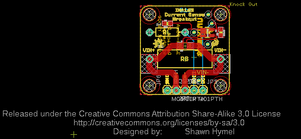
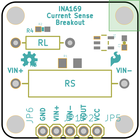
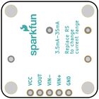
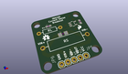
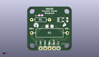
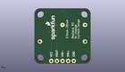
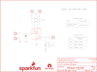

Contents
========

* [PRS12040 > INA169 Breakout](#prs12040--ina169-breakout)
	* [Schematic](#schematic)
	* [PCB](#pcb)
	* [Interactive BOM](#interactive-bom)
	* [OOMP Parts](#oomp-parts)
	* [Images](#images)
	* [Tags](#tags)
  
![][im]
# PRS12040 > INA169 Breakout

- ID: PROJ-SPAR-12040-STAN-01
- Hex ID: PRS12040
- Name: Sparkfun
- Description: Sparkfun
- Long Link: [http://oom.lt/PROJ-SPAR-12040-STAN-01](http://oom.lt/PROJ-SPAR-12040-STAN-01)
- Short Link: [http://oom.lt/PRS12040](http://oom.lt/PRS12040)

## Schematic
  

## PCB
  

## Interactive BOM

- Interactive BOM page: [ibom.html](https://htmlpreview.github.io/?https://github.com/oomlout/oomlout_OOMP_projects/blob/main/PROJ-SPAR-12040-STAN-01/kicad/bom/ibom.html)

## OOMP Parts
  

|OOMP Parts|
| :---: |
|[CAPC-0603-X-NF100-V50  SMD (0603) 100 nF Capacitor (Ceramic) 50v  C1](https://github.com/oomlout/oomlout_OOMP_parts/tree/main/CAPC-0603-X-NF100-V50/)|
|HEAD-I01-X-PI01-01 JP1, JP2, JP5, JP6, JP7|
|RESE-1206-X-O100-01 R1|
|[RESE-0603-X-O103-01  SMD (0603) 10k Ohm Resistor  R2](https://github.com/oomlout/oomlout_OOMP_parts/tree/main/RESE-0603-X-O103-01/)|
|RESE-UNMATCHED-X-UNMATCHED-01 R3, R4|
|UNMATCHED-SO235-X-UNMATCHED-01 U1|

## Images
  
  

|bominteractivefront|bominteractiveback|kicadPcb3d|kicadPcb3dFront|kicadPcb3dBack|eagleImage|eagleSchemImage|
| :---: | :---: | :---: | :---: | :---: | :---: | :---: |
||||||||

## Tags

- hexID: PRS12040
- oompType: PROJ
- oompSize: SPAR
- oompColor: 12040
- oompDesc: STAN
- oompIndex: 01
- oompName: INA169 Breakout
- sources: All source files from https://github.com/sparkfun/INA169_Breakout (source licence details in srcLicense.md)
- linkBuyPage: https://www.sparkfun.com/products/12040
- oompID: PROJ-SPAR-12040-STAN-01
- oompParts: C1,CAPC-0603-X-NF100-V50
- oompParts: JP1,HEAD-I01-X-PI01-01
- oompParts: JP2,HEAD-I01-X-PI01-01
- oompParts: JP5,HEAD-I01-X-PI01-01
- oompParts: JP6,HEAD-I01-X-PI01-01
- oompParts: JP7,HEAD-I01-X-PI01-01
- oompParts: R1,RESE-1206-X-O100-01
- oompParts: R2,RESE-0603-X-O103-01
- oompParts: R3,RESE-UNMATCHED-X-UNMATCHED-01
- oompParts: R4,RESE-UNMATCHED-X-UNMATCHED-01
- oompParts: U1,UNMATCHED-SO235-X-UNMATCHED-01
- rawParts: C1,0.1uF,CAP0603-CAP,0603-CAP,Capacitor,,,,
- rawParts: FRAME1,FRAME-LETTER,FRAME-LETTER,CREATIVE_COMMONS,Schematic Frame,,,,
- rawParts: JP1,M01PTH,M01PTH,1X01,Header 1,,,,
- rawParts: JP2,M01PTH,M01PTH,1X01,Header 1,,,,
- rawParts: JP5,M01PTH,M01PTH,1X01,Header 1,,,,
- rawParts: JP6,M01PTH,M01PTH,1X01,Header 1,,,,
- rawParts: JP7,M01PTH,M01PTH,1X01,Header 1,,,,
- rawParts: LOGO1,SFE_LOGO_NAME_FLAME.1_INCH,SFE_LOGO_NAME_FLAME.1_INCH,SFE_LOGO_NAME_FLAME_.1,SFE Logo, name and flame,,,,
- rawParts: LOGO2,OSHW-LOGOS,OSHW-LOGOS,OSHW-LOGO-S,Open Source Hardware Logo This logo indicates the piece of hardware it is found on incorporates a OSHW license and/or adheres to the definition of open source hardware found here: http://freedomdefined.org/OSHW,,,,
- rawParts: LOGO3,LOGO-SFESK,LOGO-SFESK,SFE-LOGO-FLAME,Spark Fun Electronics PCB Logo,,,,
- rawParts: R1,10,RESISTOR1206,1206,Resistor,,1206,1%,
- rawParts: R2,10k,RESISTOR0603,0603-RES,Resistor,,,1%,
- rawParts: R3,,RESISTORPTH-2W,AXIAL-0.8,Resistor,DNP,,,
- rawParts: R4,,RESISTORPTH-1/4W,AXIAL-0.4,Resistor,DNP,,,
- rawParts: STANDOFF1,STAND-OFF,STAND-OFF,STAND-OFF,#4 Stand Off,,,,
- rawParts: STANDOFF2,STAND-OFF,STAND-OFF,STAND-OFF,#4 Stand Off,,,,
- rawParts: STANDOFF3,STAND-OFF,STAND-OFF,STAND-OFF,#4 Stand Off,,,,
- rawParts: STANDOFF4,STAND-OFF,STAND-OFF,STAND-OFF,#4 Stand Off,,,,
- rawParts: U1,INA169,INA169,SOT23-5,,,,,

[im]: kicadPcb3d_450.png
