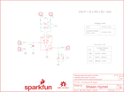

Contents
========

* [PRS12040 > Sparkfun](#prs12040--sparkfun)
	* [Schematic](#schematic)
	* [Interactive BOM](#interactive-bom)
	* [OOMP Parts](#oomp-parts)
	* [Images](#images)
	* [Tags](#tags)
  
![][im]
# PRS12040 > Sparkfun

- ID: PROJ-SPAR-12040-STAN-01
- Hex ID: PRS12040
- Name: Sparkfun
- Description: Sparkfun
- Long Link: [http://oom.lt/PROJ-SPAR-12040-STAN-01](http://oom.lt/PROJ-SPAR-12040-STAN-01)
- Short Link: [http://oom.lt/PRS12040](http://oom.lt/PRS12040)

## Schematic
  

## Interactive BOM

- Interactive BOM page: [ibom.html](https://htmlpreview.github.io/?https://github.com/oomlout/oomlout_OOMP_projects/blob/main/PROJ-SPAR-12040-STAN-01/kicad/bom/ibom.html)

## OOMP Parts
  

|OOMP Parts|
| :---: |
|C1,UNMATCHED-UNMATCHED-UNMATCHED-UNMATCHED-UNMATCHED,C1,0.1uF,CAP0603-CAP,0603-CAP,Capacitor,,,,|
|FRAME1,UNMATCHED-UNMATCHED-UNMATCHED-UNMATCHED-UNMATCHED,FRAME1,FRAME-LETTER,FRAME-LETTER,CREATIVE_COMMONS,Schematic Frame,,,,|
|JP1,UNMATCHED-UNMATCHED-UNMATCHED-UNMATCHED-UNMATCHED,JP1,M01PTH,M01PTH,1X01,Header 1,,,,|
|JP2,UNMATCHED-UNMATCHED-UNMATCHED-UNMATCHED-UNMATCHED,JP2,M01PTH,M01PTH,1X01,Header 1,,,,|
|JP5,UNMATCHED-UNMATCHED-UNMATCHED-UNMATCHED-UNMATCHED,JP5,M01PTH,M01PTH,1X01,Header 1,,,,|
|JP6,UNMATCHED-UNMATCHED-UNMATCHED-UNMATCHED-UNMATCHED,JP6,M01PTH,M01PTH,1X01,Header 1,,,,|
|JP7,UNMATCHED-UNMATCHED-UNMATCHED-UNMATCHED-UNMATCHED,JP7,M01PTH,M01PTH,1X01,Header 1,,,,|
|LOGO1,UNMATCHED-UNMATCHED-UNMATCHED-UNMATCHED-UNMATCHED,LOGO1,SFE_LOGO_NAME_FLAME.1_INCH,SFE_LOGO_NAME_FLAME.1_INCH,SFE_LOGO_NAME_FLAME_.1,SFE Logo, name and flame,,,,|
|LOGO2,UNMATCHED-UNMATCHED-UNMATCHED-UNMATCHED-UNMATCHED,LOGO2,OSHW-LOGOS,OSHW-LOGOS,OSHW-LOGO-S,Open Source Hardware Logo This logo indicates the piece of hardware it is found on incorporates a OSHW license and/or adheres to the definition of open source hardware found here: http://freedomdefined.org/OSHW,,,,|
|LOGO3,UNMATCHED-UNMATCHED-UNMATCHED-UNMATCHED-UNMATCHED,LOGO3,LOGO-SFESK,LOGO-SFESK,SFE-LOGO-FLAME,Spark Fun Electronics PCB Logo,,,,|
|R1,UNMATCHED-UNMATCHED-UNMATCHED-UNMATCHED-UNMATCHED,R1,10,RESISTOR1206,1206,Resistor,,1206,1%,|
|R2,UNMATCHED-UNMATCHED-UNMATCHED-UNMATCHED-UNMATCHED,R2,10k,RESISTOR0603,0603-RES,Resistor,,,1%,|
|R3,UNMATCHED-UNMATCHED-UNMATCHED-UNMATCHED-UNMATCHED,R3,,RESISTORPTH-2W,AXIAL-0.8,Resistor,DNP,,,|
|R4,UNMATCHED-UNMATCHED-UNMATCHED-UNMATCHED-UNMATCHED,R4,,RESISTORPTH-1/4W,AXIAL-0.4,Resistor,DNP,,,|
|STANDOFF1,UNMATCHED-UNMATCHED-UNMATCHED-UNMATCHED-UNMATCHED,STANDOFF1,STAND-OFF,STAND-OFF,STAND-OFF,#4 Stand Off,,,,|
|STANDOFF2,UNMATCHED-UNMATCHED-UNMATCHED-UNMATCHED-UNMATCHED,STANDOFF2,STAND-OFF,STAND-OFF,STAND-OFF,#4 Stand Off,,,,|
|STANDOFF3,UNMATCHED-UNMATCHED-UNMATCHED-UNMATCHED-UNMATCHED,STANDOFF3,STAND-OFF,STAND-OFF,STAND-OFF,#4 Stand Off,,,,|
|STANDOFF4,UNMATCHED-UNMATCHED-UNMATCHED-UNMATCHED-UNMATCHED,STANDOFF4,STAND-OFF,STAND-OFF,STAND-OFF,#4 Stand Off,,,,|
|U1,UNMATCHED-UNMATCHED-UNMATCHED-UNMATCHED-UNMATCHED,U1,INA169,INA169,SOT23-5,,,,,|

## Images
  
  

|kicadPcb3d|kicadPcb3dFront|kicadPcb3dBack|eagleImage|eagleSchemImage|
| :---: | :---: | :---: | :---: | :---: |
||||||

## Tags

- hexID: PRS12040
- oompType: PROJ
- oompSize: SPAR
- oompColor: 12040
- oompDesc: STAN
- oompIndex: 01
- oompName: INA169 Breakout
- sources: All source files from https://github.com/sparkfun/INA169_Breakout (source licence details in srcLicense.md)
- linkBuyPage: https://www.sparkfun.com/products/12040
- oompID: PROJ-SPAR-12040-STAN-01
- oompParts: C1,UNMATCHED-UNMATCHED-UNMATCHED-UNMATCHED-UNMATCHED
- oompParts: FRAME1,UNMATCHED-UNMATCHED-UNMATCHED-UNMATCHED-UNMATCHED
- oompParts: JP1,UNMATCHED-UNMATCHED-UNMATCHED-UNMATCHED-UNMATCHED
- oompParts: JP2,UNMATCHED-UNMATCHED-UNMATCHED-UNMATCHED-UNMATCHED
- oompParts: JP5,UNMATCHED-UNMATCHED-UNMATCHED-UNMATCHED-UNMATCHED
- oompParts: JP6,UNMATCHED-UNMATCHED-UNMATCHED-UNMATCHED-UNMATCHED
- oompParts: JP7,UNMATCHED-UNMATCHED-UNMATCHED-UNMATCHED-UNMATCHED
- oompParts: LOGO1,UNMATCHED-UNMATCHED-UNMATCHED-UNMATCHED-UNMATCHED
- oompParts: LOGO2,UNMATCHED-UNMATCHED-UNMATCHED-UNMATCHED-UNMATCHED
- oompParts: LOGO3,UNMATCHED-UNMATCHED-UNMATCHED-UNMATCHED-UNMATCHED
- oompParts: R1,UNMATCHED-UNMATCHED-UNMATCHED-UNMATCHED-UNMATCHED
- oompParts: R2,UNMATCHED-UNMATCHED-UNMATCHED-UNMATCHED-UNMATCHED
- oompParts: R3,UNMATCHED-UNMATCHED-UNMATCHED-UNMATCHED-UNMATCHED
- oompParts: R4,UNMATCHED-UNMATCHED-UNMATCHED-UNMATCHED-UNMATCHED
- oompParts: STANDOFF1,UNMATCHED-UNMATCHED-UNMATCHED-UNMATCHED-UNMATCHED
- oompParts: STANDOFF2,UNMATCHED-UNMATCHED-UNMATCHED-UNMATCHED-UNMATCHED
- oompParts: STANDOFF3,UNMATCHED-UNMATCHED-UNMATCHED-UNMATCHED-UNMATCHED
- oompParts: STANDOFF4,UNMATCHED-UNMATCHED-UNMATCHED-UNMATCHED-UNMATCHED
- oompParts: U1,UNMATCHED-UNMATCHED-UNMATCHED-UNMATCHED-UNMATCHED
- rawParts: C1,0.1uF,CAP0603-CAP,0603-CAP,Capacitor,,,,
- rawParts: FRAME1,FRAME-LETTER,FRAME-LETTER,CREATIVE_COMMONS,Schematic Frame,,,,
- rawParts: JP1,M01PTH,M01PTH,1X01,Header 1,,,,
- rawParts: JP2,M01PTH,M01PTH,1X01,Header 1,,,,
- rawParts: JP5,M01PTH,M01PTH,1X01,Header 1,,,,
- rawParts: JP6,M01PTH,M01PTH,1X01,Header 1,,,,
- rawParts: JP7,M01PTH,M01PTH,1X01,Header 1,,,,
- rawParts: LOGO1,SFE_LOGO_NAME_FLAME.1_INCH,SFE_LOGO_NAME_FLAME.1_INCH,SFE_LOGO_NAME_FLAME_.1,SFE Logo, name and flame,,,,
- rawParts: LOGO2,OSHW-LOGOS,OSHW-LOGOS,OSHW-LOGO-S,Open Source Hardware Logo This logo indicates the piece of hardware it is found on incorporates a OSHW license and/or adheres to the definition of open source hardware found here: http://freedomdefined.org/OSHW,,,,
- rawParts: LOGO3,LOGO-SFESK,LOGO-SFESK,SFE-LOGO-FLAME,Spark Fun Electronics PCB Logo,,,,
- rawParts: R1,10,RESISTOR1206,1206,Resistor,,1206,1%,
- rawParts: R2,10k,RESISTOR0603,0603-RES,Resistor,,,1%,
- rawParts: R3,,RESISTORPTH-2W,AXIAL-0.8,Resistor,DNP,,,
- rawParts: R4,,RESISTORPTH-1/4W,AXIAL-0.4,Resistor,DNP,,,
- rawParts: STANDOFF1,STAND-OFF,STAND-OFF,STAND-OFF,#4 Stand Off,,,,
- rawParts: STANDOFF2,STAND-OFF,STAND-OFF,STAND-OFF,#4 Stand Off,,,,
- rawParts: STANDOFF3,STAND-OFF,STAND-OFF,STAND-OFF,#4 Stand Off,,,,
- rawParts: STANDOFF4,STAND-OFF,STAND-OFF,STAND-OFF,#4 Stand Off,,,,
- rawParts: U1,INA169,INA169,SOT23-5,,,,,

[im]: kicadPcb3d_450.png
