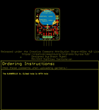
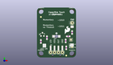
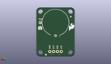
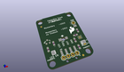

Contents
========

* [PROJ-SPAR-12041-STAN-01>AT42QT1010 Capacitive Touch Breakout](#proj-spar-12041-stan-01at42qt1010-capacitive-touch-breakout)
	* [Images](#images)
	* [Interactive BOM](#interactive-bom)
	* [OOMP Parts](#oomp-parts)
	* [Tags](#tags)
  
![][im]
# PROJ-SPAR-12041-STAN-01>AT42QT1010 Capacitive Touch Breakout

- ID: PROJ-SPAR-12041-STAN-01
- Hex ID: PRS12041
- Name: AT42QT1010 Capacitive Touch Breakout
- Description: 

## Images
  
  

|eagleImage|kicadPcb3dFront|kicadPcb3dBack|kicadPcb3d|
| :---: | :---: | :---: | :---: |
|||||

## Interactive BOM

- Interactive BOM page: [ibom.html](kicad/bom/ibom.html)

## OOMP Parts
  

|OOMP Parts|
| :---: |
|CAPE-0603-X-NF100-01, C1, 19.049999999999997, 6.35, 270,C1, 0.1uF, 0603, SparkFun-Capacitors, (0.75, 0.25), R270|
|CAPE-0603-X-UNMATCHED-01, C2, 20.32, 13.97, 180,C2, 10nF, 0603, SparkFun-Capacitors, (0.8, 0.55), R180|
|CAPE-0603-X-UNMATCHED-01, C3, 6.476999999999999, 13.081, 270,C3, 10nF, 0603, SparkFun-Capacitors, (0.255, 0.515), R270|
|UNMATCHED-UNMATCHED-X-UNMATCHED-01, J1, 16.509999999999998, 3.429, 180,J1, 1X04, SparkFun-Connectors, (0.65, 0.135), R180|
|UNMATCHED-UNMATCHED-X-UNMATCHED-01, JP5, 22.86, 22.86, 0,JP5, 1X01, SparkFun-Connectors, (0.9, 0.9), R0|
|UNMATCHED-UNMATCHED-X-UNMATCHED-01, JP6, 12.7, 1.27, 0,JP6, SMD, 1X04_SMD_RA_MALE, SparkFun-Connectors, (0.5, 0.05), R0|
|UNMATCHED-UNMATCHED-X-UNMATCHED-01, JP7, 4.826, 7.874, 270,JP7, JUMPER-SMT_2_NC_PASTE_SILK, SMT-JUMPER_2_NC_PASTE_SILK, SparkFun-Jumpers, (0.19, 0.31), R270|
|UNMATCHED-UNMATCHED-X-UNMATCHED-01, JP8, 22.86, 7.619999999999999, 90,JP8, JUMPER-SMT_3_1-NC_PASTE_SILK, SMT-JUMPER_3_1-NC_PASTE_SILK, SparkFun-Jumpers, (0.9, 0.3), R90|
|UNMATCHED-UNMATCHED-X-UNMATCHED-01, JP9, 22.86, 20.32, 90,JP9, M01SMD-4.5X1.5, PAD-1.5X4.5, SparkFun-Connectors, (0.9, 0.8), R90|
|UNMATCHED-UNMATCHED-X-UNMATCHED-01, LED1, 12.7, 13.97, 180,LED1, Green, LED-1206-BOTTOM, SparkFun-LED, (0.5, 0.55), R180|
|UNMATCHED-UNMATCHED-X-UNMATCHED-01, Q1, 3.556, 15.239999999999998, 0,Q1, 600mA/40V, SOT23-3, SparkFun-DiscreteSemi, (0.14, 0.6), R0|
|<table><tr><td></td><td> R1</td><td>[RESE-0603-X-O103-01 SMD (0603) 10k Ohm Resistor](https://github.com/oomlout/oomlout_OOMP_parts/tree/main/RESE-0603-X-O103-01/)</td><td>[R6103](https://github.com/oomlout/oomlout_OOMP_parts/tree/main/RESE-0603-X-O103-01/)</td></tr></table>|
|RESE-0603-X-UNMATCHED-01, R2, 2.54, 10.540999999999999, 90,R2, 2.2k, 0603, SparkFun-Resistors, (0.1, 0.415), R90|
|RESE-0603-X-UNMATCHED-01, R3, 18.668999999999997, 10.921999999999999, 270,R3, 200, 0603, SparkFun-Resistors, (0.735, 0.43), R270|
|ERROR, U1 AT42QT1010 -, 0, 0, 0,U1, AT42QT1010, -, UDFN, UDFN/USON_8_PAD, local_parts, (0.87, 0.46), R180|

## Tags

- hexID: PRS12041
- oompType: PROJ
- oompSize: SPAR
- oompColor: 12041
- oompDesc: STAN
- oompIndex: 01
- oompName: AT42QT1010 Capacitive Touch Breakout
- sources: All source files from https://github.com/sparkfun/AT42QT1010_Capacitive_Touch_Breakout (source licence details in srcLicense.md)
- linkBuyPage: https://www.sparkfun.com/products/12041
- oompPart: CAPE-0603-X-NF100-01, C1, 19.049999999999997, 6.35, 270
- oompPart: CAPE-0603-X-UNMATCHED-01, C2, 20.32, 13.97, 180
- oompPart: CAPE-0603-X-UNMATCHED-01, C3, 6.476999999999999, 13.081, 270
- oompPart: SKIP-UNMATCHED-X-UNMATCHED-01, FID1, 2.54, 26.796999999999997, 0
- oompPart: SKIP-UNMATCHED-X-UNMATCHED-01, FID2, 19.049999999999997, 1.27, 0
- oompPart: SKIP-UNMATCHED-X-UNMATCHED-01, FID3, 19.049999999999997, 1.27, M0
- oompPart: SKIP-UNMATCHED-X-UNMATCHED-01, FID4, 2.54, 26.796999999999997, M0
- oompPart: UNMATCHED-UNMATCHED-X-UNMATCHED-01, J1, 16.509999999999998, 3.429, 180
- oompPart: UNMATCHED-UNMATCHED-X-UNMATCHED-01, JP5, 22.86, 22.86, 0
- oompPart: UNMATCHED-UNMATCHED-X-UNMATCHED-01, JP6, 12.7, 1.27, 0
- oompPart: UNMATCHED-UNMATCHED-X-UNMATCHED-01, JP7, 4.826, 7.874, 270
- oompPart: UNMATCHED-UNMATCHED-X-UNMATCHED-01, JP8, 22.86, 7.619999999999999, 90
- oompPart: UNMATCHED-UNMATCHED-X-UNMATCHED-01, JP9, 22.86, 20.32, 90
- oompPart: UNMATCHED-UNMATCHED-X-UNMATCHED-01, LED1, 12.7, 13.97, 180
- oompPart: UNMATCHED-UNMATCHED-X-UNMATCHED-01, Q1, 3.556, 15.239999999999998, 0
- oompPart: RESE-0603-X-O103-01, R1, 22.86, 16.509999999999998, 90
- oompPart: RESE-0603-X-UNMATCHED-01, R2, 2.54, 10.540999999999999, 90
- oompPart: RESE-0603-X-UNMATCHED-01, R3, 18.668999999999997, 10.921999999999999, 270
- oompPart: ERROR, U1 AT42QT1010 -, 0, 0, 0
- rawPart: C1, 0.1uF, 0603, SparkFun-Capacitors, (0.75, 0.25), R270
- rawPart: C2, 10nF, 0603, SparkFun-Capacitors, (0.8, 0.55), R180
- rawPart: C3, 10nF, 0603, SparkFun-Capacitors, (0.255, 0.515), R270
- rawPart: FID1, FIDUCIAL1X2, FIDUCIAL-1X2, SparkFun-Aesthetics, (0.1, 1.055), R0
- rawPart: FID2, FIDUCIAL1X2, FIDUCIAL-1X2, SparkFun-Aesthetics, (0.75, 0.05), R0
- rawPart: FID3, FIDUCIAL1X2, FIDUCIAL-1X2, SparkFun-Aesthetics, (0.75, 0.05), MR0
- rawPart: FID4, FIDUCIAL1X2, FIDUCIAL-1X2, SparkFun-Aesthetics, (0.1, 1.055), MR0
- rawPart: J1, 1X04, SparkFun-Connectors, (0.65, 0.135), R180
- rawPart: JP5, 1X01, SparkFun-Connectors, (0.9, 0.9), R0
- rawPart: JP6, SMD, 1X04_SMD_RA_MALE, SparkFun-Connectors, (0.5, 0.05), R0
- rawPart: JP7, JUMPER-SMT_2_NC_PASTE_SILK, SMT-JUMPER_2_NC_PASTE_SILK, SparkFun-Jumpers, (0.19, 0.31), R270
- rawPart: JP8, JUMPER-SMT_3_1-NC_PASTE_SILK, SMT-JUMPER_3_1-NC_PASTE_SILK, SparkFun-Jumpers, (0.9, 0.3), R90
- rawPart: JP9, M01SMD-4.5X1.5, PAD-1.5X4.5, SparkFun-Connectors, (0.9, 0.8), R90
- rawPart: LED1, Green, LED-1206-BOTTOM, SparkFun-LED, (0.5, 0.55), R180
- rawPart: Q1, 600mA/40V, SOT23-3, SparkFun-DiscreteSemi, (0.14, 0.6), R0
- rawPart: R1, 10k, 0603, SparkFun-Resistors, (0.9, 0.65), R90
- rawPart: R2, 2.2k, 0603, SparkFun-Resistors, (0.1, 0.415), R90
- rawPart: R3, 200, 0603, SparkFun-Resistors, (0.735, 0.43), R270
- rawPart: U1, AT42QT1010, -, UDFN, UDFN/USON_8_PAD, local_parts, (0.87, 0.46), R180

[im]: kicadPcb3d_450.png
