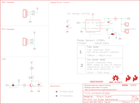

Contents
========

* [PRS12041 > AT42QT1010 Capacitive Touch Breakout](#prs12041--at42qt1010-capacitive-touch-breakout)
	* [Schematic](#schematic)
	* [PCB](#pcb)
	* [Interactive BOM](#interactive-bom)
	* [OOMP Parts](#oomp-parts)
	* [Images](#images)
	* [Tags](#tags)
  
![][im]
# PRS12041 > AT42QT1010 Capacitive Touch Breakout

- ID: PROJ-SPAR-12041-STAN-01
- Hex ID: PRS12041
- Name: Sparkfun
- Description: Sparkfun
- Long Link: [http://oom.lt/PROJ-SPAR-12041-STAN-01](http://oom.lt/PROJ-SPAR-12041-STAN-01)
- Short Link: [http://oom.lt/PRS12041](http://oom.lt/PRS12041)

## Schematic
  

## PCB
  

## Interactive BOM

- Interactive BOM page: [ibom.html](https://htmlpreview.github.io/?https://github.com/oomlout/oomlout_OOMP_projects/blob/main/PROJ-SPAR-12041-STAN-01/kicad/bom/ibom.html)

## OOMP Parts
  

|OOMP Parts|
| :---: |
|CAPC-0603-X-UF1D-01 C1|
|[CAPC-0603-X-NF10-V50  SMD (0603) 10 nF Capacitor (Ceramic) 50v  C2, C3](https://github.com/oomlout/oomlout_OOMP_parts/tree/main/CAPC-0603-X-NF10-V50/)|
|[HEAD-I01-X-PI04-01  2.54 mm 4 Pin Header  J1, JP6](https://github.com/oomlout/oomlout_OOMP_parts/tree/main/HEAD-I01-X-PI04-01/)|
|HEAD-I01-X-PI01-01 JP5|
|HEAD-I01-X-UNMATCHED-01 JP9|
|LEDS-1206-G-STAN-01 LED1|
|UNMATCHED-SO23-X-UNMATCHED-01 Q1|
|[RESE-0603-X-O103-01  SMD (0603) 10k Ohm Resistor  R1](https://github.com/oomlout/oomlout_OOMP_parts/tree/main/RESE-0603-X-O103-01/)|
|[RESE-0603-X-O222-01  SMD (0603) 2.2k Ohm Resistor  R2](https://github.com/oomlout/oomlout_OOMP_parts/tree/main/RESE-0603-X-O222-01/)|
|[RESE-0603-X-O201-01  SMD (0603) 200 Ohm Resistor  R3](https://github.com/oomlout/oomlout_OOMP_parts/tree/main/RESE-0603-X-O201-01/)|
|UNMATCHED-UNMATCHED-X-UNMATCHED-01 U$1, U1|

## Images
  
  

|kicadPcb3d|kicadPcb3dFront|kicadPcb3dBack|eagleImage|eagleSchemImage|
| :---: | :---: | :---: | :---: | :---: |
||||||

## Tags

- hexID: PRS12041
- oompType: PROJ
- oompSize: SPAR
- oompColor: 12041
- oompDesc: STAN
- oompIndex: 01
- oompName: AT42QT1010 Capacitive Touch Breakout
- sources: All source files from https://github.com/sparkfun/AT42QT1010_Capacitive_Touch_Breakout (source licence details in srcLicense.md)
- linkBuyPage: https://www.sparkfun.com/products/12041
- oompID: PROJ-SPAR-12041-STAN-01
- oompParts: C1,CAPC-0603-X-UF1D-01
- oompParts: C2,CAPC-0603-X-NF10-V50
- oompParts: C3,CAPC-0603-X-NF10-V50
- oompParts: J1,HEAD-I01-X-PI04-01
- oompParts: JP5,HEAD-I01-X-PI01-01
- oompParts: JP6,HEAD-I01-X-PI04-01
- oompParts: JP9,HEAD-I01-X-UNMATCHED-01
- oompParts: LED1,LEDS-1206-G-STAN-01
- oompParts: Q1,UNMATCHED-SO23-X-UNMATCHED-01
- oompParts: R1,RESE-0603-X-O103-01
- oompParts: R2,RESE-0603-X-O222-01
- oompParts: R3,RESE-0603-X-O201-01
- oompParts: U$1,UNMATCHED-UNMATCHED-X-UNMATCHED-01
- oompParts: U1,UNMATCHED-UNMATCHED-X-UNMATCHED-01
- rawParts: C1,0.1uF,0.1UF-0603-25V-(+80/-20%),0603,0.1µF ceramic capacitors,CAP-00810,,0.1uF,
- rawParts: C2,10nF,10NF-0603-50V-10%,0603,0.01uF/10nF/10,000pF ceramic capacitors,CAP-00867,,10nF,
- rawParts: C3,10nF,10NF-0603-50V-10%,0603,0.01uF/10nF/10,000pF ceramic capacitors,CAP-00867,,10nF,
- rawParts: FID1,FIDUCIAL1X2,FIDUCIAL1X2,FIDUCIAL-1X2,Fiducial Alignment Points,,,,
- rawParts: FID2,FIDUCIAL1X2,FIDUCIAL1X2,FIDUCIAL-1X2,Fiducial Alignment Points,,,,
- rawParts: FID3,FIDUCIAL1X2,FIDUCIAL1X2,FIDUCIAL-1X2,Fiducial Alignment Points,,,,
- rawParts: FID4,FIDUCIAL1X2,FIDUCIAL1X2,FIDUCIAL-1X2,Fiducial Alignment Points,,,,
- rawParts: FRAME1,FRAME-LETTER,FRAME-LETTER,CREATIVE_COMMONS,Schematic Frame - Letter,,,,
- rawParts: J1,,CONN_04,1X04,Multi connection point. Often used as Generic Header-pin footprint for 0.1 inch spaced/style header connections,CONN-09696,,,
- rawParts: JP5,,CONN_01,1X01,Single connection point. Often used as Generic Header-pin footprint for 0.1 inch spaced/style header connections,,,,
- rawParts: JP6,SMD,CONN_04SMD,1X04_SMD_RA_MALE,Multi connection point. Often used as Generic Header-pin footprint for 0.1 inch spaced/style header connections,CONN-09140,PRT-12638,,
- rawParts: JP7,JUMPER-SMT_2_NC_PASTE_SILK,JUMPER-SMT_2_NC_PASTE_SILK,SMT-JUMPER_2_NC_PASTE_SILK,Normally closed solder jumper,,,,
- rawParts: JP8,JUMPER-SMT_3_1-NC_PASTE_SILK,JUMPER-SMT_3_1-NC_PASTE_SILK,SMT-JUMPER_3_1-NC_PASTE_SILK,Normally closed solder jumper (1 of 2 connections),,,,
- rawParts: JP9,M01SMD-4.5X1.5,M01SMD-4.5X1.5,PAD-1.5X4.5,Header 1,,,,
- rawParts: LED1,Green,LED-GREEN1206-BOTTOM,LED-1206-BOTTOM,Green SMD LED,DIO-11076,,Green,
- rawParts: LOGO1,SFE_LOGO_FLAME.2_INCH,SFE_LOGO_FLAME.2_INCH,SFE_LOGO_FLAME_.2,SparkFun Flame Logo,,,,
- rawParts: LOGO2,OSHW-LOGOS,OSHW-LOGOS,OSHW-LOGO-S,Open Source Hardware Logo This logo indicates the piece of hardware it is found on incorporates a OSHW license and/or adheres to the definition of open source hardware found here: http://freedomdefined.org/OSHW,,,,
- rawParts: LOGO4,SFE_LOGO_FLAME.2_INCH,SFE_LOGO_FLAME.2_INCH,SFE_LOGO_FLAME_.2,SparkFun Flame Logo,,,,
- rawParts: Q1,600mA/40V,TRANS_NPN-MMBT2222AL,SOT23-3,NPN transistor,TRANS-08049,,600mA/40V,
- rawParts: R1,10k,10KOHM-0603-1/10W-1%,0603,10kΩ resistor,RES-00824,,10k,
- rawParts: R2,2.2k,2.2KOHM-0603-1/10W-1%,0603,2.2kΩ resistor,RES-08272,,2.2k,
- rawParts: R3,200,200OHM-0603-1/10W-1%,0603,200Ω resistor,RES-08220,,200,
- rawParts: STANDOFF1,STAND-OFF,STAND-OFF,STAND-OFF,Stand Off,,,,
- rawParts: STANDOFF2,STAND-OFF,STAND-OFF,STAND-OFF,Stand Off,,,,
- rawParts: STANDOFF3,STAND-OFF,STAND-OFF,STAND-OFF,Stand Off,,,,
- rawParts: STANDOFF4,STAND-OFF,STAND-OFF,STAND-OFF,Stand Off,,,,
- rawParts: U$1,SPECIAL_INSTRUCTIONS-ORDERING,SPECIAL_INSTRUCTIONS-ORDERING,ORDERING_INSTRUCTIONS,Special Ordering/Production Instructions Alert,,,,
- rawParts: U1,AT42QT1010 - UDFN,AT42QT1010UDFN,UDFN/USON_8_PAD,Atmel AT42QT1010,IC-13773,,AT42QT1010 - UDFN,

[im]: kicadPcb3d_450.png
