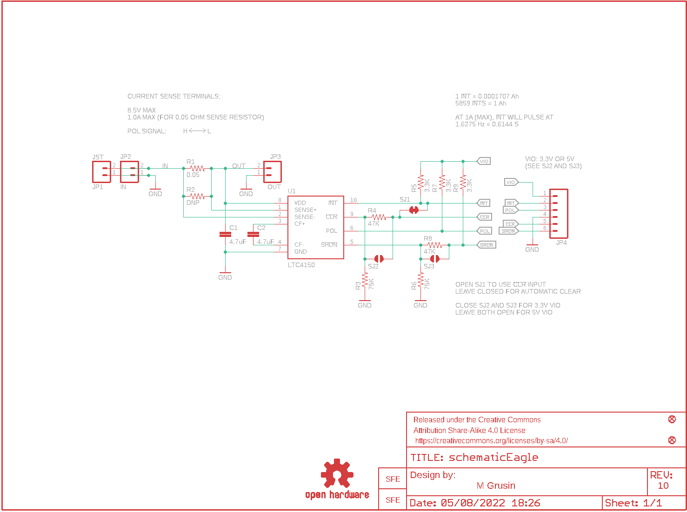
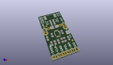
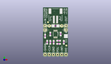
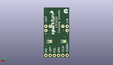
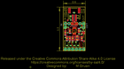
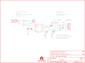

Contents
========

* [PRS12052 > Sparkfun](#prs12052--sparkfun)
	* [Schematic](#schematic)
	* [Interactive BOM](#interactive-bom)
	* [OOMP Parts](#oomp-parts)
	* [Images](#images)
	* [Tags](#tags)
  
![][im]
# PRS12052 > Sparkfun

- ID: PROJ-SPAR-12052-STAN-01
- Hex ID: PRS12052
- Name: Sparkfun
- Description: Sparkfun
- Long Link: [http://oom.lt/PROJ-SPAR-12052-STAN-01](http://oom.lt/PROJ-SPAR-12052-STAN-01)
- Short Link: [http://oom.lt/PRS12052](http://oom.lt/PRS12052)

## Schematic
  

## Interactive BOM

- Interactive BOM page: [ibom.html](https://htmlpreview.github.io/?https://github.com/oomlout/oomlout_OOMP_projects/blob/main/PROJ-SPAR-12052-STAN-01/kicad/bom/ibom.html)

## OOMP Parts
  

|OOMP Parts|
| :---: |
|C1,CAPC-0603-X-UNMATCHED-01,C1,4.7uF,CAP0603-CAP,0603-CAP,Capacitor,,|
|C2,CAPC-0603-X-UNMATCHED-01,C2,4.7uF,CAP0603-CAP,0603-CAP,Capacitor,,|
|JP1,UNMATCHED-UNMATCHED-X-UNMATCHED-01,FID1,FIDUCIAL1X2,FIDUCIAL1X2,FIDUCIAL-1X2,Fiducial Alignment Points,,|
|JP2,HEAD-I01-X-PI02-01,FID2,FIDUCIAL1X2,FIDUCIAL1X2,FIDUCIAL-1X2,Fiducial Alignment Points,,|
|JP3,HEAD-I01-X-PI02-01,FRAME1,FRAME-LETTER,FRAME-LETTER,CREATIVE_COMMONS,Schematic Frame,,|
|JP4,HEAD-I01-X-PI06-01,JP1,JST,M02-JST-2MM-SMT,JST-2-SMD,Standard 2-pin 0.1 header. Use with,CONN-08352,|
|R1,RESE-1206-X-UNMATCHED-01,JP2,IN,M02PTH,1X02,Standard 2-pin 0.1 header. Use with,,|
|R2,RESE-UNMATCHED-X-UNMATCHED-01,JP3,OUT,M02PTH,1X02,Standard 2-pin 0.1 header. Use with,,|
|R3,RESE-0603-X-O753-01,JP4,,M06SIP,1X06,Header 6,,|
|R4,RESE-0603-X-O473-01,LOGO1,OSHW-LOGOS,OSHW-LOGOS,OSHW-LOGO-S,Open Source Hardware Logo This logo indicates the piece of hardware it is found on incorporates a OSHW license and/or adheres to the definition of open source hardware found here: http://freedomdefined.org/OSHW,,|
|R5,RESE-0603-X-UNMATCHED-01,LOGO2,LOGO-SFENW2,LOGO-SFENW2,SFE-NEW-WEB,Spark Fun Electronics PCB Logo,,|
|R6,RESE-0603-X-O753-01,LOGO3,LOGO-SFESK,LOGO-SFESK,SFE-LOGO-FLAME,Spark Fun Electronics PCB Logo,,|
|R7,RESE-0603-X-UNMATCHED-01,R1,0.05,RESISTOR1206,1206,Resistor,,|
|R8,RESE-0603-X-O473-01,R2,DNP,RESISTORAXIAL-0.3,AXIAL-0.3,Resistor,,|
|R9,RESE-0603-X-UNMATCHED-01,R3,75K,RESISTOR0603-RES,0603-RES,Resistor,,|
|U1,UNMATCHED-UNMATCHED-X-UNMATCHED-01,R4,47K,RESISTOR0603-RES,0603-RES,Resistor,,|

## Images
  
  

|kicadPcb3d|kicadPcb3dFront|kicadPcb3dBack|eagleImage|eagleSchemImage|
| :---: | :---: | :---: | :---: | :---: |
||||||

## Tags

- hexID: PRS12052
- oompType: PROJ
- oompSize: SPAR
- oompColor: 12052
- oompDesc: STAN
- oompIndex: 01
- oompName: LTC4150 Coulomb Counter BOB
- sources: All source files from https://github.com/sparkfun/LTC4150_Coulomb_Counter_BOB (source licence details in srcLicense.md)
- linkBuyPage: https://www.sparkfun.com/products/12052
- oompID: PROJ-SPAR-12052-STAN-01
- oompParts: C1,CAPC-0603-X-UNMATCHED-01
- oompParts: C2,CAPC-0603-X-UNMATCHED-01
- oompParts: JP1,UNMATCHED-UNMATCHED-X-UNMATCHED-01
- oompParts: JP2,HEAD-I01-X-PI02-01
- oompParts: JP3,HEAD-I01-X-PI02-01
- oompParts: JP4,HEAD-I01-X-PI06-01
- oompParts: R1,RESE-1206-X-UNMATCHED-01
- oompParts: R2,RESE-UNMATCHED-X-UNMATCHED-01
- oompParts: R3,RESE-0603-X-O753-01
- oompParts: R4,RESE-0603-X-O473-01
- oompParts: R5,RESE-0603-X-UNMATCHED-01
- oompParts: R6,RESE-0603-X-O753-01
- oompParts: R7,RESE-0603-X-UNMATCHED-01
- oompParts: R8,RESE-0603-X-O473-01
- oompParts: R9,RESE-0603-X-UNMATCHED-01
- oompParts: U1,UNMATCHED-UNMATCHED-X-UNMATCHED-01
- rawParts: C1,4.7uF,CAP0603-CAP,0603-CAP,Capacitor,,
- rawParts: C2,4.7uF,CAP0603-CAP,0603-CAP,Capacitor,,
- rawParts: FID1,FIDUCIAL1X2,FIDUCIAL1X2,FIDUCIAL-1X2,Fiducial Alignment Points,,
- rawParts: FID2,FIDUCIAL1X2,FIDUCIAL1X2,FIDUCIAL-1X2,Fiducial Alignment Points,,
- rawParts: FRAME1,FRAME-LETTER,FRAME-LETTER,CREATIVE_COMMONS,Schematic Frame,,
- rawParts: JP1,JST,M02-JST-2MM-SMT,JST-2-SMD,Standard 2-pin 0.1 header. Use with,CONN-08352,
- rawParts: JP2,IN,M02PTH,1X02,Standard 2-pin 0.1 header. Use with,,
- rawParts: JP3,OUT,M02PTH,1X02,Standard 2-pin 0.1 header. Use with,,
- rawParts: JP4,,M06SIP,1X06,Header 6,,
- rawParts: LOGO1,OSHW-LOGOS,OSHW-LOGOS,OSHW-LOGO-S,Open Source Hardware Logo This logo indicates the piece of hardware it is found on incorporates a OSHW license and/or adheres to the definition of open source hardware found here: http://freedomdefined.org/OSHW,,
- rawParts: LOGO2,LOGO-SFENW2,LOGO-SFENW2,SFE-NEW-WEB,Spark Fun Electronics PCB Logo,,
- rawParts: LOGO3,LOGO-SFESK,LOGO-SFESK,SFE-LOGO-FLAME,Spark Fun Electronics PCB Logo,,
- rawParts: R1,0.05,RESISTOR1206,1206,Resistor,,
- rawParts: R2,DNP,RESISTORAXIAL-0.3,AXIAL-0.3,Resistor,,
- rawParts: R3,75K,RESISTOR0603-RES,0603-RES,Resistor,,
- rawParts: R4,47K,RESISTOR0603-RES,0603-RES,Resistor,,
- rawParts: R5,3.3K,RESISTOR0603-RES,0603-RES,Resistor,,
- rawParts: R6,75K,RESISTOR0603-RES,0603-RES,Resistor,,
- rawParts: R7,3.3K,RESISTOR0603-RES,0603-RES,Resistor,,
- rawParts: R8,47K,RESISTOR0603-RES,0603-RES,Resistor,,
- rawParts: R9,3.3K,RESISTOR0603-RES,0603-RES,Resistor,,
- rawParts: SJ1,,SOLDERJUMPERNC,SJ_2S,Solder Jumper,,
- rawParts: SJ2,,SOLDERJUMPERNO,SJ_2S-NO,Solder Jumper,,
- rawParts: SJ3,,SOLDERJUMPERNO,SJ_2S-NO,Solder Jumper,,
- rawParts: U1,LTC4150,LTC4150,MSOP10,,,

[im]: kicadPcb3d_450.png
