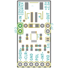
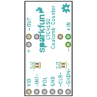
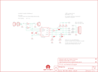
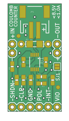
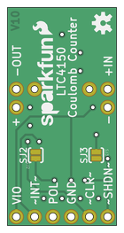

Contents
========

* [PRS12052 > LTC4150 Coulomb Counter BOB](#prs12052--ltc4150-coulomb-counter-bob)
	* [Schematic](#schematic)
	* [PCB](#pcb)
	* [Interactive BOM](#interactive-bom)
	* [OOMP Parts](#oomp-parts)
	* [Images](#images)
	* [Tags](#tags)
  
![][im]
# PRS12052 > LTC4150 Coulomb Counter BOB

- ID: PROJ-SPAR-12052-STAN-01
- Hex ID: PRS12052
- Name: Sparkfun
- Description: Sparkfun
- Long Link: [http://oom.lt/PROJ-SPAR-12052-STAN-01](http://oom.lt/PROJ-SPAR-12052-STAN-01)
- Short Link: [http://oom.lt/PRS12052](http://oom.lt/PRS12052)

## Schematic
  

## PCB
  

## Interactive BOM

- Interactive BOM page: [ibom.html](https://htmlpreview.github.io/?https://github.com/oomlout/oomlout_OOMP_projects/blob/main/PROJ-SPAR-12052-STAN-01/kicad/bom/ibom.html)

## OOMP Parts
  

|OOMP Parts|
| :---: |
|[CAPC-0603-X-UF47D-V10  SMD (0603) 4.7 uF Capacitor (Ceramic) 10v  C1, C2](https://github.com/oomlout/oomlout_OOMP_parts/tree/main/CAPC-0603-X-UF47D-V10/)|
|HEAD-I01-X-UNMATCHED-01 JP1|
|[HEAD-I01-X-PI02-01  2.54 mm 2 Pin Header  JP2, JP3](https://github.com/oomlout/oomlout_OOMP_parts/tree/main/HEAD-I01-X-PI02-01/)|
|[HEAD-I01-X-PI06-01  2.54 mm 6 Pin Header  JP4](https://github.com/oomlout/oomlout_OOMP_parts/tree/main/HEAD-I01-X-PI06-01/)|
|RESE-1206-X-UNMATCHED-01 R1|
|RESE-UNMATCHED-X-UNMATCHED-01 R2|
|RESE-0603-X-O753-01 R3, R6|
|[RESE-0603-X-O473-01  SMD (0603) 47k Ohm Resistor  R4, R8](https://github.com/oomlout/oomlout_OOMP_parts/tree/main/RESE-0603-X-O473-01/)|
|RESE-0603-X-UNMATCHED-01 R5, R7, R9|
|UNMATCHED-UNMATCHED-X-UNMATCHED-01 U1|

## Images
  
  

|bominteractivefront|bominteractiveback|kicadPcb3d|kicadPcb3dFront|kicadPcb3dBack|eagleImage|eagleSchemImage|pcbdraw|pcbdrawback|
| :---: | :---: | :---: | :---: | :---: | :---: | :---: | :---: | :---: |
||||||||||

## Tags

- hexID: PRS12052
- oompType: PROJ
- oompSize: SPAR
- oompColor: 12052
- oompDesc: STAN
- oompIndex: 01
- oompName: LTC4150 Coulomb Counter BOB
- sources: All source files from https://github.com/sparkfun/LTC4150_Coulomb_Counter_BOB (source licence details in srcLicense.md)
- linkBuyPage: https://www.sparkfun.com/products/12052
- oompID: PROJ-SPAR-12052-STAN-01
- oompParts: C1,CAPC-0603-X-UF47D-V10
- oompParts: C2,CAPC-0603-X-UF47D-V10
- oompParts: JP1,HEAD-I01-X-UNMATCHED-01
- oompParts: JP2,HEAD-I01-X-PI02-01
- oompParts: JP3,HEAD-I01-X-PI02-01
- oompParts: JP4,HEAD-I01-X-PI06-01
- oompParts: R1,RESE-1206-X-UNMATCHED-01
- oompParts: R2,RESE-UNMATCHED-X-UNMATCHED-01
- oompParts: R3,RESE-0603-X-O753-01
- oompParts: R4,RESE-0603-X-O473-01
- oompParts: R5,RESE-0603-X-UNMATCHED-01
- oompParts: R6,RESE-0603-X-O753-01
- oompParts: R7,RESE-0603-X-UNMATCHED-01
- oompParts: R8,RESE-0603-X-O473-01
- oompParts: R9,RESE-0603-X-UNMATCHED-01
- oompParts: U1,UNMATCHED-UNMATCHED-X-UNMATCHED-01
- rawParts: C1,4.7uF,CAP0603-CAP,0603-CAP,Capacitor,,
- rawParts: C2,4.7uF,CAP0603-CAP,0603-CAP,Capacitor,,
- rawParts: FID1,FIDUCIAL1X2,FIDUCIAL1X2,FIDUCIAL-1X2,Fiducial Alignment Points,,
- rawParts: FID2,FIDUCIAL1X2,FIDUCIAL1X2,FIDUCIAL-1X2,Fiducial Alignment Points,,
- rawParts: FRAME1,FRAME-LETTER,FRAME-LETTER,CREATIVE_COMMONS,Schematic Frame,,
- rawParts: JP1,JST,M02-JST-2MM-SMT,JST-2-SMD,Standard 2-pin 0.1 header. Use with,CONN-08352,
- rawParts: JP2,IN,M02PTH,1X02,Standard 2-pin 0.1 header. Use with,,
- rawParts: JP3,OUT,M02PTH,1X02,Standard 2-pin 0.1 header. Use with,,
- rawParts: JP4,,M06SIP,1X06,Header 6,,
- rawParts: LOGO1,OSHW-LOGOS,OSHW-LOGOS,OSHW-LOGO-S,Open Source Hardware Logo This logo indicates the piece of hardware it is found on incorporates a OSHW license and/or adheres to the definition of open source hardware found here: http://freedomdefined.org/OSHW,,
- rawParts: LOGO2,LOGO-SFENW2,LOGO-SFENW2,SFE-NEW-WEB,Spark Fun Electronics PCB Logo,,
- rawParts: LOGO3,LOGO-SFESK,LOGO-SFESK,SFE-LOGO-FLAME,Spark Fun Electronics PCB Logo,,
- rawParts: R1,0.05,RESISTOR1206,1206,Resistor,,
- rawParts: R2,DNP,RESISTORAXIAL-0.3,AXIAL-0.3,Resistor,,
- rawParts: R3,75K,RESISTOR0603-RES,0603-RES,Resistor,,
- rawParts: R4,47K,RESISTOR0603-RES,0603-RES,Resistor,,
- rawParts: R5,3.3K,RESISTOR0603-RES,0603-RES,Resistor,,
- rawParts: R6,75K,RESISTOR0603-RES,0603-RES,Resistor,,
- rawParts: R7,3.3K,RESISTOR0603-RES,0603-RES,Resistor,,
- rawParts: R8,47K,RESISTOR0603-RES,0603-RES,Resistor,,
- rawParts: R9,3.3K,RESISTOR0603-RES,0603-RES,Resistor,,
- rawParts: SJ1,,SOLDERJUMPERNC,SJ_2S,Solder Jumper,,
- rawParts: SJ2,,SOLDERJUMPERNO,SJ_2S-NO,Solder Jumper,,
- rawParts: SJ3,,SOLDERJUMPERNO,SJ_2S-NO,Solder Jumper,,
- rawParts: U1,LTC4150,LTC4150,MSOP10,,,

[im]: kicadPcb3d_450.png
