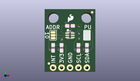
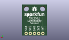
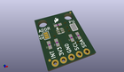

Contents
========

* [PROJ-SPAR-12055-STAN-01>TSL2561 Luminosity Sensor BOB](#proj-spar-12055-stan-01tsl2561-luminosity-sensor-bob)
	* [Images](#images)
	* [Interactive BOM](#interactive-bom)
	* [OOMP Parts](#oomp-parts)
	* [Tags](#tags)
  
![][im]
# PROJ-SPAR-12055-STAN-01>TSL2561 Luminosity Sensor BOB

- ID: PROJ-SPAR-12055-STAN-01
- Hex ID: PRS12055
- Name: TSL2561 Luminosity Sensor BOB
- Description: 

## Images
  
  

|eagleImage|kicadPcb3dFront|kicadPcb3dBack|kicadPcb3d|
| :---: | :---: | :---: | :---: |
|||||

## Interactive BOM

- Interactive BOM page: [ibom.html](kicad/bom/ibom.html)

## OOMP Parts
  

|OOMP Parts|
| :---: |
|<table><tr><td></td><td> C1</td><td>[CAPC-0603-X-NF100-V50 SMD (0603) 100 nF Capacitor (Ceramic) 50v](https://github.com/oomlout/oomlout_OOMP_parts/tree/main/CAPC-0603-X-NF100-V50/)</td><td>[C6N100](https://github.com/oomlout/oomlout_OOMP_parts/tree/main/CAPC-0603-X-NF100-V50/)</td></tr></table>|
|<table><tr><td></td><td> JP1</td><td>[HEAD-I01-X-PI05-01 2.54 mm 5 Pin Header](https://github.com/oomlout/oomlout_OOMP_parts/tree/main/HEAD-I01-X-PI05-01/)</td><td>[H05](https://github.com/oomlout/oomlout_OOMP_parts/tree/main/HEAD-I01-X-PI05-01/)</td></tr></table>|
|<table><tr><td></td><td> R1</td><td>[RESE-0603-X-O103-01 SMD (0603) 10k Ohm Resistor](https://github.com/oomlout/oomlout_OOMP_parts/tree/main/RESE-0603-X-O103-01/)</td><td>[R6103](https://github.com/oomlout/oomlout_OOMP_parts/tree/main/RESE-0603-X-O103-01/)</td></tr></table>|
|RESE-0603-X-UNMATCHED-01, R2, 10.16, 7.302499999999999, 90,R2, 4.7K, 0603-RES, SparkFun-Resistors, (0.4, 0.2875), R90|
|RESE-0603-X-UNMATCHED-01, R3, 12.7, 7.302499999999999, 90,R3, 4.7K, 0603-RES, SparkFun-Resistors, (0.5, 0.2875), R90|
|<table><tr><td></td><td> R4</td><td>[RESE-0603-X-O103-01 SMD (0603) 10k Ohm Resistor](https://github.com/oomlout/oomlout_OOMP_parts/tree/main/RESE-0603-X-O103-01/)</td><td>[R6103](https://github.com/oomlout/oomlout_OOMP_parts/tree/main/RESE-0603-X-O103-01/)</td></tr></table>|
|UNMATCHED-UNMATCHED-X-UNMATCHED-01, U1, 7.619999999999999, 11.112499999999999, 0,U1, TSL2561FN, FN-6, SparkFun-DigitalIC, (0.3, 0.4375), R0|

## Tags

- hexID: PRS12055
- oompType: PROJ
- oompSize: SPAR
- oompColor: 12055
- oompDesc: STAN
- oompIndex: 01
- oompName: TSL2561 Luminosity Sensor BOB
- sources: All source files from https://github.com/sparkfun/TSL2561_Luminosity_Sensor_BOB (source licence details in srcLicense.md)
- linkBuyPage: https://www.sparkfun.com/products/12055
- oompID: PROJ-SPAR-12055-STAN-01
- oompPart: CAPC-0603-X-NF100-V50, C1, 7.619999999999999, 13.97, 0
- oompPart: SKIP-UNMATCHED-X-UNMATCHED-01, FID1, 1.27, 2.54, 0
- oompPart: SKIP-UNMATCHED-X-UNMATCHED-01, FID2, 14.2875, 18.0975, 0
- oompPart: HEAD-I01-X-PI05-01, JP1, 12.7, 1.27, 180
- oompPart: RESE-0603-X-O103-01, R1, 2.54, 7.302499999999999, 90
- oompPart: RESE-0603-X-UNMATCHED-01, R2, 10.16, 7.302499999999999, 90
- oompPart: RESE-0603-X-UNMATCHED-01, R3, 12.7, 7.302499999999999, 90
- oompPart: RESE-0603-X-O103-01, R4, 5.08, 7.302499999999999, 90
- oompPart: SKIP-UNMATCHED-X-UNMATCHED-01, SJ1, 12.7, 11.112499999999999, 270
- oompPart: SKIP-UNMATCHED-X-UNMATCHED-01, SJ2, 2.54, 11.112499999999999, 270
- oompPart: UNMATCHED-UNMATCHED-X-UNMATCHED-01, U1, 7.619999999999999, 11.112499999999999, 0
- rawPart: C1, 0.1uF, 0603-CAP, SparkFun-Capacitors, (0.3, 0.55), R0
- rawPart: FID1, FIDUCIALUFIDUCIAL, MICRO-FIDUCIAL, SparkFun-Aesthetics, (0.05, 0.1), R0
- rawPart: FID2, FIDUCIALUFIDUCIAL, MICRO-FIDUCIAL, SparkFun-Aesthetics, (0.5625, 0.7125), R0
- rawPart: JP1, 1X05_NO_SILK, SparkFun-Connectors, (0.5, 0.05), R180
- rawPart: R1, 10K, 0603-RES, SparkFun-Resistors, (0.1, 0.2875), R90
- rawPart: R2, 4.7K, 0603-RES, SparkFun-Resistors, (0.4, 0.2875), R90
- rawPart: R3, 4.7K, 0603-RES, SparkFun-Resistors, (0.5, 0.2875), R90
- rawPart: R4, 10K, 0603-RES, SparkFun-Resistors, (0.2, 0.2875), R90
- rawPart: SJ1, JUMPER-PAD-3-NC_BY_PASTE, PAD-JUMPER-3-NC_BY_PASTE_YES_SILK_FULL_BOX, SparkFun-Passives, (0.5, 0.4375), R270
- rawPart: SJ2, SJ_3, mike-temp, (0.1, 0.4375), R270
- rawPart: U1, TSL2561FN, FN-6, SparkFun-DigitalIC, (0.3, 0.4375), R0

[im]: kicadPcb3d_450.png
