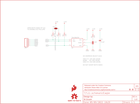

Contents
========

* [PRS12055 > TSL2561 Luminosity Sensor BOB](#prs12055--tsl2561-luminosity-sensor-bob)
	* [Schematic](#schematic)
	* [PCB](#pcb)
	* [Interactive BOM](#interactive-bom)
	* [OOMP Parts](#oomp-parts)
	* [Images](#images)
	* [Tags](#tags)
  
![][im]
# PRS12055 > TSL2561 Luminosity Sensor BOB

- ID: PROJ-SPAR-12055-STAN-01
- Hex ID: PRS12055
- Name: Sparkfun
- Description: Sparkfun
- Long Link: [http://oom.lt/PROJ-SPAR-12055-STAN-01](http://oom.lt/PROJ-SPAR-12055-STAN-01)
- Short Link: [http://oom.lt/PRS12055](http://oom.lt/PRS12055)

## Schematic
  

## PCB
  

## Interactive BOM

- Interactive BOM page: [ibom.html](https://htmlpreview.github.io/?https://github.com/oomlout/oomlout_OOMP_projects/blob/main/PROJ-SPAR-12055-STAN-01/kicad/bom/ibom.html)

## OOMP Parts
  

|OOMP Parts|
| :---: |
|[CAPC-0603-X-NF100-V50  SMD (0603) 100 nF Capacitor (Ceramic) 50v  C1](https://github.com/oomlout/oomlout_OOMP_parts/tree/main/CAPC-0603-X-NF100-V50/)|
|[HEAD-I01-X-PI05-01  2.54 mm 5 Pin Header  JP1](https://github.com/oomlout/oomlout_OOMP_parts/tree/main/HEAD-I01-X-PI05-01/)|
|[RESE-0603-X-O103-01  SMD (0603) 10k Ohm Resistor  R1, R4](https://github.com/oomlout/oomlout_OOMP_parts/tree/main/RESE-0603-X-O103-01/)|
|[RESE-0603-X-O472-01  SMD (0603) 4.7k Ohm Resistor  R2, R3](https://github.com/oomlout/oomlout_OOMP_parts/tree/main/RESE-0603-X-O472-01/)|
|UNMATCHED-UNMATCHED-X-UNMATCHED-01 U1|

## Images
  
  

|bominteractivefront|bominteractiveback|kicadPcb3d|kicadPcb3dFront|kicadPcb3dBack|eagleImage|eagleSchemImage|
| :---: | :---: | :---: | :---: | :---: | :---: | :---: |
||||||||

## Tags

- hexID: PRS12055
- oompType: PROJ
- oompSize: SPAR
- oompColor: 12055
- oompDesc: STAN
- oompIndex: 01
- oompName: TSL2561 Luminosity Sensor BOB
- sources: All source files from https://github.com/sparkfun/TSL2561_Luminosity_Sensor_BOB (source licence details in srcLicense.md)
- linkBuyPage: https://www.sparkfun.com/products/12055
- oompID: PROJ-SPAR-12055-STAN-01
- oompParts: C1,CAPC-0603-X-NF100-V50
- oompParts: JP1,HEAD-I01-X-PI05-01
- oompParts: R1,RESE-0603-X-O103-01
- oompParts: R2,RESE-0603-X-O472-01
- oompParts: R3,RESE-0603-X-O472-01
- oompParts: R4,RESE-0603-X-O103-01
- oompParts: U1,UNMATCHED-UNMATCHED-X-UNMATCHED-01
- rawParts: C1,0.1uF,0.1UF-25V(+80/-20%)(0603),0603-CAP,CAP-00810,CAP-00810,0.1uF,
- rawParts: FID1,FIDUCIALUFIDUCIAL,FIDUCIALUFIDUCIAL,MICRO-FIDUCIAL,Fiducial Alignment Points,,,
- rawParts: FID2,FIDUCIALUFIDUCIAL,FIDUCIALUFIDUCIAL,MICRO-FIDUCIAL,Fiducial Alignment Points,,,
- rawParts: FRAME1,FRAME-LETTER,FRAME-LETTER,CREATIVE_COMMONS,Schematic Frame,,,
- rawParts: JP1,,M05NO_SILK,1X05_NO_SILK,Header 5,,,
- rawParts: LOGO1,OSHW-LOGOS,OSHW-LOGOS,OSHW-LOGO-S,Open Source Hardware Logo This logo indicates the piece of hardware it is found on incorporates a OSHW license and/or adheres to the definition of open source hardware found here: http://freedomdefined.org/OSHW,,,
- rawParts: LOGO2,LOGO-SFENW2,LOGO-SFENW2,SFE-NEW-WEB,Spark Fun Electronics PCB Logo,,,
- rawParts: LOGO3,SFE_LOGO_FLAME.1_INCH,SFE_LOGO_FLAME.1_INCH,SFE_LOGO_FLAME_.1,SFE Logo, flame only,,,
- rawParts: R1,10K,10KOHM-1/10W-1%(0603)0603,0603-RES,RES-00824,RES-00824,10K,
- rawParts: R2,4.7K,4.7KOHM-1/10W-1%(0603),0603-RES,RES-07857,RES-07857,4.7K,
- rawParts: R3,4.7K,4.7KOHM-1/10W-1%(0603),0603-RES,RES-07857,RES-07857,4.7K,
- rawParts: R4,10K,10KOHM-1/10W-1%(0603)0603,0603-RES,RES-00824,RES-00824,10K,
- rawParts: SJ1,JUMPER-PAD-3-NC_BY_PASTE,JUMPER-PAD-3-NC_BY_PASTE,PAD-JUMPER-3-NC_BY_PASTE_YES_SILK_FULL_BOX,,,,
- rawParts: SJ2,,SOLDERJUMPER_2WAYS,SJ_3,Solder Jumper,,,
- rawParts: STANDOFF1,STAND-OFF,STAND-OFF,STAND-OFF,#4 Stand Off,,,
- rawParts: STANDOFF2,STAND-OFF,STAND-OFF,STAND-OFF,#4 Stand Off,,,
- rawParts: U1,TSL2561FN,TSL2561FN,FN-6,TSL2561 illumination sensor,IC-11791,,

[im]: kicadPcb3d_450.png
