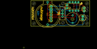
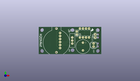
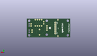
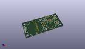

Contents
========

* [PROJ-SPAR-12069-STAN-01>H2OhNo](#proj-spar-12069-stan-01h2ohno)
	* [Images](#images)
	* [Interactive BOM](#interactive-bom)
	* [Tags](#tags)
  
![][im]
# PROJ-SPAR-12069-STAN-01>H2OhNo

- ID: PROJ-SPAR-12069-STAN-01
- Hex ID: PRS12069
- Name: H2OhNo
- Description: 

## Images
  
  

|eagleImage|kicadPcb3dFront|kicadPcb3dBack|kicadPcb3d|
| :---: | :---: | :---: | :---: |
|||||

## Interactive BOM

- Interactive BOM page: [ibom.html](kicad/bom/ibom.html)

## Tags

- hexID: PRS12069
- oompType: PROJ
- oompSize: SPAR
- oompColor: 12069
- oompDesc: STAN
- oompIndex: 01
- oompName: H2OhNo
- sources: All source files from https://github.com/sparkfun/H2OhNo (source licence details in srcLicense.md)
- linkBuyPage: https://www.sparkfun.com/products/12069
- oompID: PROJ-SPAR-12069-STAN-01
- oompParts: BAT1,UNMATCHED-UNMATCHED-UNMATCHED-UNMATCHED-UNMATCHED
- oompParts: C6,UNMATCHED-UNMATCHED-UNMATCHED-UNMATCHED-UNMATCHED
- oompParts: FRAME2,UNMATCHED-UNMATCHED-UNMATCHED-UNMATCHED-UNMATCHED
- oompParts: JP3,UNMATCHED-UNMATCHED-UNMATCHED-UNMATCHED-UNMATCHED
- oompParts: JP4,UNMATCHED-UNMATCHED-UNMATCHED-UNMATCHED-UNMATCHED
- oompParts: LED1,UNMATCHED-UNMATCHED-UNMATCHED-UNMATCHED-UNMATCHED
- oompParts: S1,UNMATCHED-UNMATCHED-UNMATCHED-UNMATCHED-UNMATCHED
- oompParts: SG1,UNMATCHED-UNMATCHED-UNMATCHED-UNMATCHED-UNMATCHED
- oompParts: STANDOFF1,UNMATCHED-UNMATCHED-UNMATCHED-UNMATCHED-UNMATCHED
- oompParts: STANDOFF3,UNMATCHED-UNMATCHED-UNMATCHED-UNMATCHED-UNMATCHED
- oompParts: STANDOFF4,UNMATCHED-UNMATCHED-UNMATCHED-UNMATCHED-UNMATCHED
- oompParts: U$1,UNMATCHED-UNMATCHED-UNMATCHED-UNMATCHED-UNMATCHED
- oompParts: U$4,UNMATCHED-UNMATCHED-UNMATCHED-UNMATCHED-UNMATCHED
- oompParts: U$5,UNMATCHED-UNMATCHED-UNMATCHED-UNMATCHED-UNMATCHED
- oompParts: U2,UNMATCHED-UNMATCHED-UNMATCHED-UNMATCHED-UNMATCHED
- rawParts: BAT1,,BATTERY20PTH,BATTCOM_20MM_PTH,Battery Holders,,,
- rawParts: C6,0.1uF,CAPPTH2,CAP-PTH-SMALL2,Capacitor,,,
- rawParts: FRAME2,FRAME-LETTER,FRAME-LETTER,CREATIVE_COMMONS,Schematic Frame,,,
- rawParts: JP3,Water Sensor,M02PTH,1X02,Standard 2-pin 0.1 header. Use with,,,
- rawParts: JP4,ISP,M06SIP,1X06,Header 6,,,
- rawParts: LED1,,LED5MM,LED5MM,LEDs,,,
- rawParts: S1,Power,SWITCH-SPDTPTH,SWITCH-SPDT,SPDT Switch,,,
- rawParts: SG1,Buzzer,BUZZERPTH,BUZZER-12MM,Buzzer 12mm,,,
- rawParts: STANDOFF1,STAND-OFF,STAND-OFF,STAND-OFF,#4 Stand Off,,,
- rawParts: STANDOFF3,STAND-OFF,STAND-OFF,STAND-OFF,#4 Stand Off,,,
- rawParts: STANDOFF4,STAND-OFF,STAND-OFF,STAND-OFF,#4 Stand Off,,,
- rawParts: U$1,LOGO-SFESK,LOGO-SFESK,SFE-LOGO-FLAME,Spark Fun Electronics PCB Logo,,,
- rawParts: U$4,OSHW-LOGOS,OSHW-LOGOS,OSHW-LOGO-S,Open Source Hardware Logo This logo indicates the piece of hardware it is found on incorporates a OSHW license and/or adheres to the definition of open source hardware found here: http://freedomdefined.org/OSHW,,,
- rawParts: U$5,LOGO-SFENW2,LOGO-SFENW2,SFE-NEW-WEB,Spark Fun Electronics PCB Logo,,,
- rawParts: U2,TINY85-20-DIP,ATTINY45TINY85-20-DIP,DIP08,Atmel 8-pin 2/4/8kB flash uC,IC-09445,TINY85-20-DIP,

[im]: kicadPcb3d_450.png
