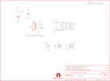

Contents
========

* [PRS12069 > H2OhNo](#prs12069--h2ohno)
	* [Schematic](#schematic)
	* [PCB](#pcb)
	* [Interactive BOM](#interactive-bom)
	* [OOMP Parts](#oomp-parts)
	* [Images](#images)
	* [Tags](#tags)
  
![][im]
# PRS12069 > H2OhNo

- ID: PROJ-SPAR-12069-STAN-01
- Hex ID: PRS12069
- Name: Sparkfun
- Description: Sparkfun
- Long Link: [http://oom.lt/PROJ-SPAR-12069-STAN-01](http://oom.lt/PROJ-SPAR-12069-STAN-01)
- Short Link: [http://oom.lt/PRS12069](http://oom.lt/PRS12069)

## Schematic
  

## PCB
  

## Interactive BOM

- Interactive BOM page: [ibom.html](https://htmlpreview.github.io/?https://github.com/oomlout/oomlout_OOMP_projects/blob/main/PROJ-SPAR-12069-STAN-01/kicad/bom/ibom.html)

## OOMP Parts
  

|OOMP Parts|
| :---: |
|UNMATCHED-UNMATCHED-X-UNMATCHED-01 BAT1, S1, SG1, U2|
|CAPX-UNMATCHED-X-UF1D-01 C6|
|[HEAD-I01-X-PI02-01  2.54 mm 2 Pin Header  JP3](https://github.com/oomlout/oomlout_OOMP_parts/tree/main/HEAD-I01-X-PI02-01/)|
|[HEAD-I01-X-PI06-01  2.54 mm 6 Pin Header  JP4](https://github.com/oomlout/oomlout_OOMP_parts/tree/main/HEAD-I01-X-PI06-01/)|
|LEDS-UNMATCHED-G-STAN-01 LED1|

## Images
  
  

|kicadPcb3d|kicadPcb3dFront|kicadPcb3dBack|eagleImage|eagleSchemImage|
| :---: | :---: | :---: | :---: | :---: |
||||||

## Tags

- hexID: PRS12069
- oompType: PROJ
- oompSize: SPAR
- oompColor: 12069
- oompDesc: STAN
- oompIndex: 01
- oompName: H2OhNo
- sources: All source files from https://github.com/sparkfun/H2OhNo (source licence details in srcLicense.md)
- linkBuyPage: https://www.sparkfun.com/products/12069
- oompID: PROJ-SPAR-12069-STAN-01
- oompParts: BAT1,UNMATCHED-UNMATCHED-X-UNMATCHED-01
- oompParts: C6,CAPX-UNMATCHED-X-UF1D-01
- oompParts: JP3,HEAD-I01-X-PI02-01
- oompParts: JP4,HEAD-I01-X-PI06-01
- oompParts: LED1,LEDS-UNMATCHED-G-STAN-01
- oompParts: S1,UNMATCHED-UNMATCHED-X-UNMATCHED-01
- oompParts: SG1,UNMATCHED-UNMATCHED-X-UNMATCHED-01
- oompParts: U2,UNMATCHED-UNMATCHED-X-UNMATCHED-01
- rawParts: BAT1,,BATTERY20PTH,BATTCOM_20MM_PTH,Battery Holders,,,
- rawParts: C6,0.1uF,CAPPTH2,CAP-PTH-SMALL2,Capacitor,,,
- rawParts: FRAME2,FRAME-LETTER,FRAME-LETTER,CREATIVE_COMMONS,Schematic Frame,,,
- rawParts: JP3,Water Sensor,M02PTH,1X02,Standard 2-pin 0.1 header. Use with,,,
- rawParts: JP4,ISP,M06SIP,1X06,Header 6,,,
- rawParts: LED1,,LED5MM,LED5MM,LEDs,,,
- rawParts: S1,Power,SWITCH-SPDTPTH,SWITCH-SPDT,SPDT Switch,,,
- rawParts: SG1,Buzzer,BUZZERPTH,BUZZER-12MM,Buzzer 12mm,,,
- rawParts: STANDOFF1,STAND-OFF,STAND-OFF,STAND-OFF,#4 Stand Off,,,
- rawParts: STANDOFF3,STAND-OFF,STAND-OFF,STAND-OFF,#4 Stand Off,,,
- rawParts: STANDOFF4,STAND-OFF,STAND-OFF,STAND-OFF,#4 Stand Off,,,
- rawParts: U$1,LOGO-SFESK,LOGO-SFESK,SFE-LOGO-FLAME,Spark Fun Electronics PCB Logo,,,
- rawParts: U$4,OSHW-LOGOS,OSHW-LOGOS,OSHW-LOGO-S,Open Source Hardware Logo This logo indicates the piece of hardware it is found on incorporates a OSHW license and/or adheres to the definition of open source hardware found here: http://freedomdefined.org/OSHW,,,
- rawParts: U$5,LOGO-SFENW2,LOGO-SFENW2,SFE-NEW-WEB,Spark Fun Electronics PCB Logo,,,
- rawParts: U2,TINY85-20-DIP,ATTINY45TINY85-20-DIP,DIP08,Atmel 8-pin 2/4/8kB flash uC,IC-09445,TINY85-20-DIP,

[im]: kicadPcb3d_450.png
