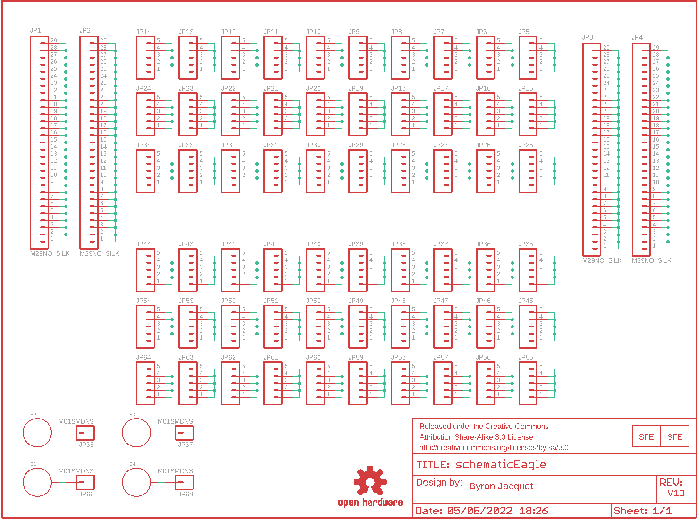
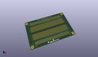
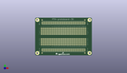
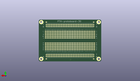
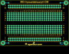
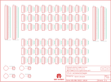

Contents
========

* [PRS12070 > Sparkfun](#prs12070--sparkfun)
	* [Schematic](#schematic)
	* [Interactive BOM](#interactive-bom)
	* [OOMP Parts](#oomp-parts)
	* [Images](#images)
	* [Tags](#tags)
  
![][im]
# PRS12070 > Sparkfun

- ID: PROJ-SPAR-12070-STAN-01
- Hex ID: PRS12070
- Name: Sparkfun
- Description: Sparkfun
- Long Link: [http://oom.lt/PROJ-SPAR-12070-STAN-01](http://oom.lt/PROJ-SPAR-12070-STAN-01)
- Short Link: [http://oom.lt/PRS12070](http://oom.lt/PRS12070)

## Schematic
  

## Interactive BOM

- Interactive BOM page: [ibom.html](https://htmlpreview.github.io/?https://github.com/oomlout/oomlout_OOMP_projects/blob/main/PROJ-SPAR-12070-STAN-01/kicad/bom/ibom.html)

## OOMP Parts
  

|OOMP Parts|
| :---: |
|JP1,HEAD-I01-X-PI29-01,FRAME1,FRAME-LETTER,FRAME-LETTER,CREATIVE_COMMONS,Schematic Frame,,|
|JP2,HEAD-I01-X-PI29-01,JP1,M29NO_SILK,M29NO_SILK,1X29_NO_SILK,1x29 .1 header,,|
|JP3,HEAD-I01-X-PI29-01,JP2,M29NO_SILK,M29NO_SILK,1X29_NO_SILK,1x29 .1 header,,|
|JP4,HEAD-I01-X-PI29-01,JP3,M29NO_SILK,M29NO_SILK,1X29_NO_SILK,1x29 .1 header,,|
|JP5,HEAD-I01-X-PI05-01,JP4,M29NO_SILK,M29NO_SILK,1X29_NO_SILK,1x29 .1 header,,|
|JP6,HEAD-I01-X-PI05-01,JP5,,M05NO_SILK,1X05_NO_SILK,Header 5,,|
|JP7,HEAD-I01-X-PI05-01,JP6,,M05NO_SILK,1X05_NO_SILK,Header 5,,|
|JP8,HEAD-I01-X-PI05-01,JP7,,M05NO_SILK,1X05_NO_SILK,Header 5,,|
|JP9,HEAD-I01-X-PI05-01,JP8,,M05NO_SILK,1X05_NO_SILK,Header 5,,|
|JP10,HEAD-I01-X-PI05-01,JP9,,M05NO_SILK,1X05_NO_SILK,Header 5,,|
|JP11,HEAD-I01-X-PI05-01,JP10,,M05NO_SILK,1X05_NO_SILK,Header 5,,|
|JP12,HEAD-I01-X-PI05-01,JP11,,M05NO_SILK,1X05_NO_SILK,Header 5,,|
|JP13,HEAD-I01-X-PI05-01,JP12,,M05NO_SILK,1X05_NO_SILK,Header 5,,|
|JP14,HEAD-I01-X-PI05-01,JP13,,M05NO_SILK,1X05_NO_SILK,Header 5,,|
|JP15,HEAD-I01-X-PI05-01,JP14,,M05NO_SILK,1X05_NO_SILK,Header 5,,|
|JP16,HEAD-I01-X-PI05-01,JP15,,M05NO_SILK,1X05_NO_SILK,Header 5,,|
|JP17,HEAD-I01-X-PI05-01,JP16,,M05NO_SILK,1X05_NO_SILK,Header 5,,|
|JP18,HEAD-I01-X-PI05-01,JP17,,M05NO_SILK,1X05_NO_SILK,Header 5,,|
|JP19,HEAD-I01-X-PI05-01,JP18,,M05NO_SILK,1X05_NO_SILK,Header 5,,|
|JP20,HEAD-I01-X-PI05-01,JP19,,M05NO_SILK,1X05_NO_SILK,Header 5,,|
|JP21,HEAD-I01-X-PI05-01,JP20,,M05NO_SILK,1X05_NO_SILK,Header 5,,|
|JP22,HEAD-I01-X-PI05-01,JP21,,M05NO_SILK,1X05_NO_SILK,Header 5,,|
|JP23,HEAD-I01-X-PI05-01,JP22,,M05NO_SILK,1X05_NO_SILK,Header 5,,|
|JP24,HEAD-I01-X-PI05-01,JP23,,M05NO_SILK,1X05_NO_SILK,Header 5,,|
|JP25,HEAD-I01-X-PI05-01,JP24,,M05NO_SILK,1X05_NO_SILK,Header 5,,|
|JP26,HEAD-I01-X-PI05-01,JP25,,M05NO_SILK,1X05_NO_SILK,Header 5,,|
|JP27,HEAD-I01-X-PI05-01,JP26,,M05NO_SILK,1X05_NO_SILK,Header 5,,|
|JP28,HEAD-I01-X-PI05-01,JP27,,M05NO_SILK,1X05_NO_SILK,Header 5,,|
|JP29,HEAD-I01-X-PI05-01,JP28,,M05NO_SILK,1X05_NO_SILK,Header 5,,|
|JP30,HEAD-I01-X-PI05-01,JP29,,M05NO_SILK,1X05_NO_SILK,Header 5,,|
|JP31,HEAD-I01-X-PI05-01,JP30,,M05NO_SILK,1X05_NO_SILK,Header 5,,|
|JP32,HEAD-I01-X-PI05-01,JP31,,M05NO_SILK,1X05_NO_SILK,Header 5,,|
|JP33,HEAD-I01-X-PI05-01,JP32,,M05NO_SILK,1X05_NO_SILK,Header 5,,|
|JP34,HEAD-I01-X-PI05-01,JP33,,M05NO_SILK,1X05_NO_SILK,Header 5,,|
|JP35,HEAD-I01-X-PI05-01,JP34,,M05NO_SILK,1X05_NO_SILK,Header 5,,|
|JP36,HEAD-I01-X-PI05-01,JP35,,M05NO_SILK,1X05_NO_SILK,Header 5,,|
|JP37,HEAD-I01-X-PI05-01,JP36,,M05NO_SILK,1X05_NO_SILK,Header 5,,|
|JP38,HEAD-I01-X-PI05-01,JP37,,M05NO_SILK,1X05_NO_SILK,Header 5,,|
|JP39,HEAD-I01-X-PI05-01,JP38,,M05NO_SILK,1X05_NO_SILK,Header 5,,|
|JP40,HEAD-I01-X-PI05-01,JP39,,M05NO_SILK,1X05_NO_SILK,Header 5,,|
|JP41,HEAD-I01-X-PI05-01,JP40,,M05NO_SILK,1X05_NO_SILK,Header 5,,|
|JP42,HEAD-I01-X-PI05-01,JP41,,M05NO_SILK,1X05_NO_SILK,Header 5,,|
|JP43,HEAD-I01-X-PI05-01,JP42,,M05NO_SILK,1X05_NO_SILK,Header 5,,|
|JP44,HEAD-I01-X-PI05-01,JP43,,M05NO_SILK,1X05_NO_SILK,Header 5,,|
|JP45,HEAD-I01-X-PI05-01,JP44,,M05NO_SILK,1X05_NO_SILK,Header 5,,|
|JP46,HEAD-I01-X-PI05-01,JP45,,M05NO_SILK,1X05_NO_SILK,Header 5,,|
|JP47,HEAD-I01-X-PI05-01,JP46,,M05NO_SILK,1X05_NO_SILK,Header 5,,|
|JP48,HEAD-I01-X-PI05-01,JP47,,M05NO_SILK,1X05_NO_SILK,Header 5,,|
|JP49,HEAD-I01-X-PI05-01,JP48,,M05NO_SILK,1X05_NO_SILK,Header 5,,|
|JP50,HEAD-I01-X-PI05-01,JP49,,M05NO_SILK,1X05_NO_SILK,Header 5,,|
|JP51,HEAD-I01-X-PI05-01,JP50,,M05NO_SILK,1X05_NO_SILK,Header 5,,|
|JP52,HEAD-I01-X-PI05-01,JP51,,M05NO_SILK,1X05_NO_SILK,Header 5,,|
|JP53,HEAD-I01-X-PI05-01,JP52,,M05NO_SILK,1X05_NO_SILK,Header 5,,|
|JP54,HEAD-I01-X-PI05-01,JP53,,M05NO_SILK,1X05_NO_SILK,Header 5,,|
|JP55,HEAD-I01-X-PI05-01,JP54,,M05NO_SILK,1X05_NO_SILK,Header 5,,|
|JP56,HEAD-I01-X-PI05-01,JP55,,M05NO_SILK,1X05_NO_SILK,Header 5,,|
|JP57,HEAD-I01-X-PI05-01,JP56,,M05NO_SILK,1X05_NO_SILK,Header 5,,|
|JP58,HEAD-I01-X-PI05-01,JP57,,M05NO_SILK,1X05_NO_SILK,Header 5,,|
|JP59,HEAD-I01-X-PI05-01,JP58,,M05NO_SILK,1X05_NO_SILK,Header 5,,|
|JP60,HEAD-I01-X-PI05-01,JP59,,M05NO_SILK,1X05_NO_SILK,Header 5,,|
|JP61,HEAD-I01-X-PI05-01,JP60,,M05NO_SILK,1X05_NO_SILK,Header 5,,|
|JP62,HEAD-I01-X-PI05-01,JP61,,M05NO_SILK,1X05_NO_SILK,Header 5,,|
|JP63,HEAD-I01-X-PI05-01,JP62,,M05NO_SILK,1X05_NO_SILK,Header 5,,|
|JP64,HEAD-I01-X-PI05-01,JP63,,M05NO_SILK,1X05_NO_SILK,Header 5,,|
|JP65,HEAD-I01-X-PI01-01,JP64,,M05NO_SILK,1X05_NO_SILK,Header 5,,|
|JP66,HEAD-I01-X-PI01-01,JP65,M01SMDNS,M01SMDNS,1X01NS,Header 1,,|
|JP67,HEAD-I01-X-PI01-01,JP66,M01SMDNS,M01SMDNS,1X01NS,Header 1,,|
|JP68,HEAD-I01-X-PI01-01,JP67,M01SMDNS,M01SMDNS,1X01NS,Header 1,,|
|S1,UNMATCHED-UNMATCHED-X-UNMATCHED-01,JP68,M01SMDNS,M01SMDNS,1X01NS,Header 1,,|
|S2,UNMATCHED-UNMATCHED-X-UNMATCHED-01,LOGO1,LOGO-SFECP,LOGO-SFECP,SFE-LOGO-FLAME-COPPER,Spark Fun Electronics PCB Logo,,|
|S3,UNMATCHED-UNMATCHED-X-UNMATCHED-01,LOGO2,LOGO-SFENEW,LOGO-SFENEW,SFE-NEW-WEBLOGO,Spark Fun Electronics PCB Logo,,|
|S4,UNMATCHED-UNMATCHED-X-UNMATCHED-01,LOGO3,OSHW-LOGOS,OSHW-LOGOS,OSHW-LOGO-S,Open Source Hardware Logo This logo indicates the piece of hardware it is found on incorporates a OSHW license and/or adheres to the definition of open source hardware found here: http://freedomdefined.org/OSHW,,|

## Images
  
  

|kicadPcb3d|kicadPcb3dFront|kicadPcb3dBack|eagleImage|eagleSchemImage|
| :---: | :---: | :---: | :---: | :---: |
||||||

## Tags

- hexID: PRS12070
- oompType: PROJ
- oompSize: SPAR
- oompColor: 12070
- oompDesc: STAN
- oompIndex: 01
- oompName: Solder-able Breadboard
- sources: All source files from https://github.com/sparkfun/Solder-able_Breadboard (source licence details in srcLicense.md)
- linkBuyPage: https://www.sparkfun.com/products/12070
- oompID: PROJ-SPAR-12070-STAN-01
- oompParts: JP1,HEAD-I01-X-PI29-01
- oompParts: JP2,HEAD-I01-X-PI29-01
- oompParts: JP3,HEAD-I01-X-PI29-01
- oompParts: JP4,HEAD-I01-X-PI29-01
- oompParts: JP5,HEAD-I01-X-PI05-01
- oompParts: JP6,HEAD-I01-X-PI05-01
- oompParts: JP7,HEAD-I01-X-PI05-01
- oompParts: JP8,HEAD-I01-X-PI05-01
- oompParts: JP9,HEAD-I01-X-PI05-01
- oompParts: JP10,HEAD-I01-X-PI05-01
- oompParts: JP11,HEAD-I01-X-PI05-01
- oompParts: JP12,HEAD-I01-X-PI05-01
- oompParts: JP13,HEAD-I01-X-PI05-01
- oompParts: JP14,HEAD-I01-X-PI05-01
- oompParts: JP15,HEAD-I01-X-PI05-01
- oompParts: JP16,HEAD-I01-X-PI05-01
- oompParts: JP17,HEAD-I01-X-PI05-01
- oompParts: JP18,HEAD-I01-X-PI05-01
- oompParts: JP19,HEAD-I01-X-PI05-01
- oompParts: JP20,HEAD-I01-X-PI05-01
- oompParts: JP21,HEAD-I01-X-PI05-01
- oompParts: JP22,HEAD-I01-X-PI05-01
- oompParts: JP23,HEAD-I01-X-PI05-01
- oompParts: JP24,HEAD-I01-X-PI05-01
- oompParts: JP25,HEAD-I01-X-PI05-01
- oompParts: JP26,HEAD-I01-X-PI05-01
- oompParts: JP27,HEAD-I01-X-PI05-01
- oompParts: JP28,HEAD-I01-X-PI05-01
- oompParts: JP29,HEAD-I01-X-PI05-01
- oompParts: JP30,HEAD-I01-X-PI05-01
- oompParts: JP31,HEAD-I01-X-PI05-01
- oompParts: JP32,HEAD-I01-X-PI05-01
- oompParts: JP33,HEAD-I01-X-PI05-01
- oompParts: JP34,HEAD-I01-X-PI05-01
- oompParts: JP35,HEAD-I01-X-PI05-01
- oompParts: JP36,HEAD-I01-X-PI05-01
- oompParts: JP37,HEAD-I01-X-PI05-01
- oompParts: JP38,HEAD-I01-X-PI05-01
- oompParts: JP39,HEAD-I01-X-PI05-01
- oompParts: JP40,HEAD-I01-X-PI05-01
- oompParts: JP41,HEAD-I01-X-PI05-01
- oompParts: JP42,HEAD-I01-X-PI05-01
- oompParts: JP43,HEAD-I01-X-PI05-01
- oompParts: JP44,HEAD-I01-X-PI05-01
- oompParts: JP45,HEAD-I01-X-PI05-01
- oompParts: JP46,HEAD-I01-X-PI05-01
- oompParts: JP47,HEAD-I01-X-PI05-01
- oompParts: JP48,HEAD-I01-X-PI05-01
- oompParts: JP49,HEAD-I01-X-PI05-01
- oompParts: JP50,HEAD-I01-X-PI05-01
- oompParts: JP51,HEAD-I01-X-PI05-01
- oompParts: JP52,HEAD-I01-X-PI05-01
- oompParts: JP53,HEAD-I01-X-PI05-01
- oompParts: JP54,HEAD-I01-X-PI05-01
- oompParts: JP55,HEAD-I01-X-PI05-01
- oompParts: JP56,HEAD-I01-X-PI05-01
- oompParts: JP57,HEAD-I01-X-PI05-01
- oompParts: JP58,HEAD-I01-X-PI05-01
- oompParts: JP59,HEAD-I01-X-PI05-01
- oompParts: JP60,HEAD-I01-X-PI05-01
- oompParts: JP61,HEAD-I01-X-PI05-01
- oompParts: JP62,HEAD-I01-X-PI05-01
- oompParts: JP63,HEAD-I01-X-PI05-01
- oompParts: JP64,HEAD-I01-X-PI05-01
- oompParts: JP65,HEAD-I01-X-PI01-01
- oompParts: JP66,HEAD-I01-X-PI01-01
- oompParts: JP67,HEAD-I01-X-PI01-01
- oompParts: JP68,HEAD-I01-X-PI01-01
- oompParts: S1,UNMATCHED-UNMATCHED-X-UNMATCHED-01
- oompParts: S2,UNMATCHED-UNMATCHED-X-UNMATCHED-01
- oompParts: S3,UNMATCHED-UNMATCHED-X-UNMATCHED-01
- oompParts: S4,UNMATCHED-UNMATCHED-X-UNMATCHED-01
- rawParts: FRAME1,FRAME-LETTER,FRAME-LETTER,CREATIVE_COMMONS,Schematic Frame,,
- rawParts: JP1,M29NO_SILK,M29NO_SILK,1X29_NO_SILK,1x29 .1 header,,
- rawParts: JP2,M29NO_SILK,M29NO_SILK,1X29_NO_SILK,1x29 .1 header,,
- rawParts: JP3,M29NO_SILK,M29NO_SILK,1X29_NO_SILK,1x29 .1 header,,
- rawParts: JP4,M29NO_SILK,M29NO_SILK,1X29_NO_SILK,1x29 .1 header,,
- rawParts: JP5,,M05NO_SILK,1X05_NO_SILK,Header 5,,
- rawParts: JP6,,M05NO_SILK,1X05_NO_SILK,Header 5,,
- rawParts: JP7,,M05NO_SILK,1X05_NO_SILK,Header 5,,
- rawParts: JP8,,M05NO_SILK,1X05_NO_SILK,Header 5,,
- rawParts: JP9,,M05NO_SILK,1X05_NO_SILK,Header 5,,
- rawParts: JP10,,M05NO_SILK,1X05_NO_SILK,Header 5,,
- rawParts: JP11,,M05NO_SILK,1X05_NO_SILK,Header 5,,
- rawParts: JP12,,M05NO_SILK,1X05_NO_SILK,Header 5,,
- rawParts: JP13,,M05NO_SILK,1X05_NO_SILK,Header 5,,
- rawParts: JP14,,M05NO_SILK,1X05_NO_SILK,Header 5,,
- rawParts: JP15,,M05NO_SILK,1X05_NO_SILK,Header 5,,
- rawParts: JP16,,M05NO_SILK,1X05_NO_SILK,Header 5,,
- rawParts: JP17,,M05NO_SILK,1X05_NO_SILK,Header 5,,
- rawParts: JP18,,M05NO_SILK,1X05_NO_SILK,Header 5,,
- rawParts: JP19,,M05NO_SILK,1X05_NO_SILK,Header 5,,
- rawParts: JP20,,M05NO_SILK,1X05_NO_SILK,Header 5,,
- rawParts: JP21,,M05NO_SILK,1X05_NO_SILK,Header 5,,
- rawParts: JP22,,M05NO_SILK,1X05_NO_SILK,Header 5,,
- rawParts: JP23,,M05NO_SILK,1X05_NO_SILK,Header 5,,
- rawParts: JP24,,M05NO_SILK,1X05_NO_SILK,Header 5,,
- rawParts: JP25,,M05NO_SILK,1X05_NO_SILK,Header 5,,
- rawParts: JP26,,M05NO_SILK,1X05_NO_SILK,Header 5,,
- rawParts: JP27,,M05NO_SILK,1X05_NO_SILK,Header 5,,
- rawParts: JP28,,M05NO_SILK,1X05_NO_SILK,Header 5,,
- rawParts: JP29,,M05NO_SILK,1X05_NO_SILK,Header 5,,
- rawParts: JP30,,M05NO_SILK,1X05_NO_SILK,Header 5,,
- rawParts: JP31,,M05NO_SILK,1X05_NO_SILK,Header 5,,
- rawParts: JP32,,M05NO_SILK,1X05_NO_SILK,Header 5,,
- rawParts: JP33,,M05NO_SILK,1X05_NO_SILK,Header 5,,
- rawParts: JP34,,M05NO_SILK,1X05_NO_SILK,Header 5,,
- rawParts: JP35,,M05NO_SILK,1X05_NO_SILK,Header 5,,
- rawParts: JP36,,M05NO_SILK,1X05_NO_SILK,Header 5,,
- rawParts: JP37,,M05NO_SILK,1X05_NO_SILK,Header 5,,
- rawParts: JP38,,M05NO_SILK,1X05_NO_SILK,Header 5,,
- rawParts: JP39,,M05NO_SILK,1X05_NO_SILK,Header 5,,
- rawParts: JP40,,M05NO_SILK,1X05_NO_SILK,Header 5,,
- rawParts: JP41,,M05NO_SILK,1X05_NO_SILK,Header 5,,
- rawParts: JP42,,M05NO_SILK,1X05_NO_SILK,Header 5,,
- rawParts: JP43,,M05NO_SILK,1X05_NO_SILK,Header 5,,
- rawParts: JP44,,M05NO_SILK,1X05_NO_SILK,Header 5,,
- rawParts: JP45,,M05NO_SILK,1X05_NO_SILK,Header 5,,
- rawParts: JP46,,M05NO_SILK,1X05_NO_SILK,Header 5,,
- rawParts: JP47,,M05NO_SILK,1X05_NO_SILK,Header 5,,
- rawParts: JP48,,M05NO_SILK,1X05_NO_SILK,Header 5,,
- rawParts: JP49,,M05NO_SILK,1X05_NO_SILK,Header 5,,
- rawParts: JP50,,M05NO_SILK,1X05_NO_SILK,Header 5,,
- rawParts: JP51,,M05NO_SILK,1X05_NO_SILK,Header 5,,
- rawParts: JP52,,M05NO_SILK,1X05_NO_SILK,Header 5,,
- rawParts: JP53,,M05NO_SILK,1X05_NO_SILK,Header 5,,
- rawParts: JP54,,M05NO_SILK,1X05_NO_SILK,Header 5,,
- rawParts: JP55,,M05NO_SILK,1X05_NO_SILK,Header 5,,
- rawParts: JP56,,M05NO_SILK,1X05_NO_SILK,Header 5,,
- rawParts: JP57,,M05NO_SILK,1X05_NO_SILK,Header 5,,
- rawParts: JP58,,M05NO_SILK,1X05_NO_SILK,Header 5,,
- rawParts: JP59,,M05NO_SILK,1X05_NO_SILK,Header 5,,
- rawParts: JP60,,M05NO_SILK,1X05_NO_SILK,Header 5,,
- rawParts: JP61,,M05NO_SILK,1X05_NO_SILK,Header 5,,
- rawParts: JP62,,M05NO_SILK,1X05_NO_SILK,Header 5,,
- rawParts: JP63,,M05NO_SILK,1X05_NO_SILK,Header 5,,
- rawParts: JP64,,M05NO_SILK,1X05_NO_SILK,Header 5,,
- rawParts: JP65,M01SMDNS,M01SMDNS,1X01NS,Header 1,,
- rawParts: JP66,M01SMDNS,M01SMDNS,1X01NS,Header 1,,
- rawParts: JP67,M01SMDNS,M01SMDNS,1X01NS,Header 1,,
- rawParts: JP68,M01SMDNS,M01SMDNS,1X01NS,Header 1,,
- rawParts: LOGO1,LOGO-SFECP,LOGO-SFECP,SFE-LOGO-FLAME-COPPER,Spark Fun Electronics PCB Logo,,
- rawParts: LOGO2,LOGO-SFENEW,LOGO-SFENEW,SFE-NEW-WEBLOGO,Spark Fun Electronics PCB Logo,,
- rawParts: LOGO3,OSHW-LOGOS,OSHW-LOGOS,OSHW-LOGO-S,Open Source Hardware Logo This logo indicates the piece of hardware it is found on incorporates a OSHW license and/or adheres to the definition of open source hardware found here: http://freedomdefined.org/OSHW,,
- rawParts: S1,STANDOFF_ELECTRICAL,STANDOFF_ELECTRICAL,STANDOFF-ELECTRICAL,A standoff intended to be an electrically connected point.,,
- rawParts: S2,STANDOFF_ELECTRICAL,STANDOFF_ELECTRICAL,STANDOFF-ELECTRICAL,A standoff intended to be an electrically connected point.,,
- rawParts: S3,STANDOFF_ELECTRICAL,STANDOFF_ELECTRICAL,STANDOFF-ELECTRICAL,A standoff intended to be an electrically connected point.,,
- rawParts: S4,STANDOFF_ELECTRICAL,STANDOFF_ELECTRICAL,STANDOFF-ELECTRICAL,A standoff intended to be an electrically connected point.,,

[im]: kicadPcb3d_450.png
