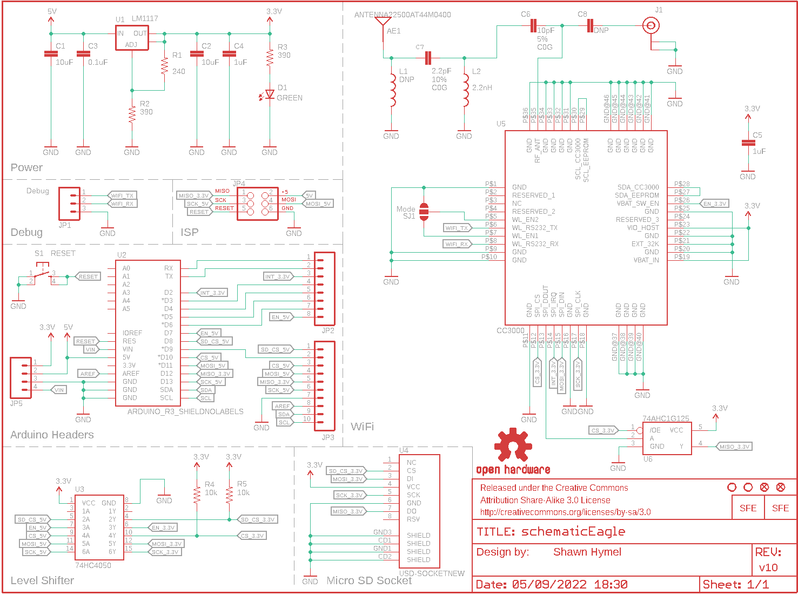
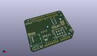
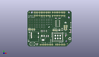
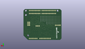
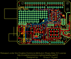
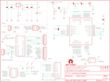

Contents
========

* [PRS12071 > Sparkfun](#prs12071--sparkfun)
	* [Schematic](#schematic)
	* [Interactive BOM](#interactive-bom)
	* [OOMP Parts](#oomp-parts)
	* [Images](#images)
	* [Tags](#tags)
  
![][im]
# PRS12071 > Sparkfun

- ID: PROJ-SPAR-12071-STAN-01
- Hex ID: PRS12071
- Name: Sparkfun
- Description: Sparkfun
- Long Link: [http://oom.lt/PROJ-SPAR-12071-STAN-01](http://oom.lt/PROJ-SPAR-12071-STAN-01)
- Short Link: [http://oom.lt/PRS12071](http://oom.lt/PRS12071)

## Schematic
  

## Interactive BOM

- Interactive BOM page: [ibom.html](https://htmlpreview.github.io/?https://github.com/oomlout/oomlout_OOMP_projects/blob/main/PROJ-SPAR-12071-STAN-01/kicad/bom/ibom.html)

## OOMP Parts
  

|OOMP Parts|
| :---: |
|AE1,UNMATCHED-UNMATCHED-UNMATCHED-UNMATCHED-UNMATCHED,AE1,ANTENNA22500AT44M0400,ANTENNA22500AT44M0400,ANTENNA-CHIP_2500AT44M0400,Chip antenna,,,,,|
|C1,UNMATCHED-UNMATCHED-UNMATCHED-UNMATCHED-UNMATCHED,C1,10uF,CAP0805,0805,Capacitor,,,,,|
|C2,UNMATCHED-UNMATCHED-UNMATCHED-UNMATCHED-UNMATCHED,C2,10uF,CAP0805,0805,Capacitor,,,,,|
|C3,UNMATCHED-UNMATCHED-UNMATCHED-UNMATCHED-UNMATCHED,C3,0.1uF,CAP0603-CAP,0603-CAP,Capacitor,,,,,|
|C4,UNMATCHED-UNMATCHED-UNMATCHED-UNMATCHED-UNMATCHED,C4,1uF,CAP0805,0805,Capacitor,,,,,|
|C5,UNMATCHED-UNMATCHED-UNMATCHED-UNMATCHED-UNMATCHED,C5,1uF,CAP0805,0805,Capacitor,,,,,|
|C6,UNMATCHED-UNMATCHED-UNMATCHED-UNMATCHED-UNMATCHED,C6,10pF,CAP0603-CAP,0603-CAP,Capacitor,C0G,,5%,,|
|C7,UNMATCHED-UNMATCHED-UNMATCHED-UNMATCHED-UNMATCHED,C7,2.2pF,CAP0603-CAP,0603-CAP,Capacitor,C0G,,10%,,|
|C8,UNMATCHED-UNMATCHED-UNMATCHED-UNMATCHED-UNMATCHED,C8,DNP,CAP0603-CAP,0603-CAP,Capacitor,,,,,|
|D1,UNMATCHED-UNMATCHED-UNMATCHED-UNMATCHED-UNMATCHED,D1,GREEN,LED-GREEN0603,LED-0603,Various green LEDs,,DIO-00821,,GREEN,|
|FRAME1,UNMATCHED-UNMATCHED-UNMATCHED-UNMATCHED-UNMATCHED,FID1,FIDUCIAL1X2,FIDUCIAL1X2,FIDUCIAL-1X2,Fiducial Alignment Points,,,,,|
|J1,UNMATCHED-UNMATCHED-UNMATCHED-UNMATCHED-UNMATCHED,FID2,FIDUCIAL1X2,FIDUCIAL1X2,FIDUCIAL-1X2,Fiducial Alignment Points,,,,,|
|JP1,UNMATCHED-UNMATCHED-UNMATCHED-UNMATCHED-UNMATCHED,FRAME1,FRAME-LETTER,FRAME-LETTER,CREATIVE_COMMONS,Schematic Frame,,,,,|
|JP2,UNMATCHED-UNMATCHED-UNMATCHED-UNMATCHED-UNMATCHED,J1,U.FL,U.FL,U.FL,SMD antenna connector- WRL-09144,,,,,|
|JP3,UNMATCHED-UNMATCHED-UNMATCHED-UNMATCHED-UNMATCHED,JP1,Debug,M03PTH,1X03,Header 3,,,,,|
|JP4,UNMATCHED-UNMATCHED-UNMATCHED-UNMATCHED-UNMATCHED,JP2,,M08NO_SILK,1X08_NO_SILK,Header 8,,,,,|
|JP5,UNMATCHED-UNMATCHED-UNMATCHED-UNMATCHED-UNMATCHED,JP3,M10NO_SILK,M10NO_SILK,1X10_NO_SILK,Header 10,,,,,|
|L1,UNMATCHED-UNMATCHED-UNMATCHED-UNMATCHED-UNMATCHED,JP4,AVR_SPI_PRG_6PTH,AVR_SPI_PRG_6PTH,2X3,AVR ISP 6 Pin,,,,,|
|L2,UNMATCHED-UNMATCHED-UNMATCHED-UNMATCHED-UNMATCHED,JP5,,M04PTH,1X04,Header 4,,,,,|
|LOGO1,UNMATCHED-UNMATCHED-UNMATCHED-UNMATCHED-UNMATCHED,L1,DNP,INDUCTOR0603,0603,Inductors,,,,,|
|LOGO2,UNMATCHED-UNMATCHED-UNMATCHED-UNMATCHED-UNMATCHED,L2,2.2nH,INDUCTOR0603,0603,Inductors,,,,,|
|LOGO3,UNMATCHED-UNMATCHED-UNMATCHED-UNMATCHED-UNMATCHED,LOGO1,OSHW-LOGOS,OSHW-LOGOS,OSHW-LOGO-S,Open Source Hardware Logo This logo indicates the piece of hardware it is found on incorporates a OSHW license and/or adheres to the definition of open source hardware found here: http://freedomdefined.org/OSHW,,,,,|
|R1,UNMATCHED-UNMATCHED-UNMATCHED-UNMATCHED-UNMATCHED,LOGO2,LOGO-SFENEW,LOGO-SFENEW,SFE-NEW-WEBLOGO,Spark Fun Electronics PCB Logo,,,,,|
|R2,UNMATCHED-UNMATCHED-UNMATCHED-UNMATCHED-UNMATCHED,LOGO3,LOGO-SFESK,LOGO-SFESK,SFE-LOGO-FLAME,Spark Fun Electronics PCB Logo,,,,,|
|R3,UNMATCHED-UNMATCHED-UNMATCHED-UNMATCHED-UNMATCHED,R1,240,RESISTOR0603,0603-RES,Resistor,,,,,|
|R4,UNMATCHED-UNMATCHED-UNMATCHED-UNMATCHED-UNMATCHED,R2,390,RESISTOR0603,0603-RES,Resistor,,,,,|
|R5,UNMATCHED-UNMATCHED-UNMATCHED-UNMATCHED-UNMATCHED,R3,390,RESISTOR0603-RES,0603-RES,Resistor,,,,,|
|S1,UNMATCHED-UNMATCHED-UNMATCHED-UNMATCHED-UNMATCHED,R4,10k,RESISTOR0603-RES,0603-RES,Resistor,,,,,|
|SJ1,UNMATCHED-UNMATCHED-UNMATCHED-UNMATCHED-UNMATCHED,R5,10k,RESISTOR0603-RES,0603-RES,Resistor,,,,,|
|STANDOFF1,UNMATCHED-UNMATCHED-UNMATCHED-UNMATCHED-UNMATCHED,S1,RESET,TAC_SWITCHSMD,TACTILE_SWITCH_SMD,Momentary Switch,,SWCH-08247,,,|
|STANDOFF2,UNMATCHED-UNMATCHED-UNMATCHED-UNMATCHED-UNMATCHED,SJ1,Mode,SOLDERJUMPER_2WAYPASTE1&2,SJ_3_PASTE1&2,Solder Jumper,,,,,|
|U1,UNMATCHED-UNMATCHED-UNMATCHED-UNMATCHED-UNMATCHED,STANDOFF1,STAND-OFF,STAND-OFF,STAND-OFF,#4 Stand Off,,,,,|
|U2,UNMATCHED-UNMATCHED-UNMATCHED-UNMATCHED-UNMATCHED,STANDOFF2,STAND-OFF,STAND-OFF,STAND-OFF,#4 Stand Off,,,,,|
|U3,UNMATCHED-UNMATCHED-UNMATCHED-UNMATCHED-UNMATCHED,U1,LM1117,V_REG_LM1117SOT223,SOT223,Voltage Regulator LM1117,,,,,|
|U4,UNMATCHED-UNMATCHED-UNMATCHED-UNMATCHED-UNMATCHED,U2,ARDUINO_R3_SHIELDNOLABELS,ARDUINO_R3_SHIELDNOLABELS,UNO_R3_SHIELD_NOLABELS,Shield form compatible with the Arduino Uno R3.,,,,,|
|U5,UNMATCHED-UNMATCHED-UNMATCHED-UNMATCHED-UNMATCHED,U3,74HC4050,HEX_CONVERTER,SO016,Just what it says.,,,,,|
|U6,UNMATCHED-UNMATCHED-UNMATCHED-UNMATCHED-UNMATCHED,U4,USD-SOCKETNEW,USD-SOCKETNEW,MICRO-SD-SOCKET-PP,microSD Socket,,,,,|

## Images
  
  

|kicadPcb3d|kicadPcb3dFront|kicadPcb3dBack|eagleImage|eagleSchemImage|
| :---: | :---: | :---: | :---: | :---: |
||||||

## Tags

- hexID: PRS12071
- oompType: PROJ
- oompSize: SPAR
- oompColor: 12071
- oompDesc: STAN
- oompIndex: 01
- oompName: CC3000 WiFi Shield
- sources: All source files from https://github.com/sparkfun/CC3000_WiFi_Shield (source licence details in srcLicense.md)
- linkBuyPage: https://www.sparkfun.com/products/12071
- oompID: PROJ-SPAR-12071-STAN-01
- oompParts: AE1,UNMATCHED-UNMATCHED-UNMATCHED-UNMATCHED-UNMATCHED
- oompParts: C1,UNMATCHED-UNMATCHED-UNMATCHED-UNMATCHED-UNMATCHED
- oompParts: C2,UNMATCHED-UNMATCHED-UNMATCHED-UNMATCHED-UNMATCHED
- oompParts: C3,UNMATCHED-UNMATCHED-UNMATCHED-UNMATCHED-UNMATCHED
- oompParts: C4,UNMATCHED-UNMATCHED-UNMATCHED-UNMATCHED-UNMATCHED
- oompParts: C5,UNMATCHED-UNMATCHED-UNMATCHED-UNMATCHED-UNMATCHED
- oompParts: C6,UNMATCHED-UNMATCHED-UNMATCHED-UNMATCHED-UNMATCHED
- oompParts: C7,UNMATCHED-UNMATCHED-UNMATCHED-UNMATCHED-UNMATCHED
- oompParts: C8,UNMATCHED-UNMATCHED-UNMATCHED-UNMATCHED-UNMATCHED
- oompParts: D1,UNMATCHED-UNMATCHED-UNMATCHED-UNMATCHED-UNMATCHED
- oompParts: FRAME1,UNMATCHED-UNMATCHED-UNMATCHED-UNMATCHED-UNMATCHED
- oompParts: J1,UNMATCHED-UNMATCHED-UNMATCHED-UNMATCHED-UNMATCHED
- oompParts: JP1,UNMATCHED-UNMATCHED-UNMATCHED-UNMATCHED-UNMATCHED
- oompParts: JP2,UNMATCHED-UNMATCHED-UNMATCHED-UNMATCHED-UNMATCHED
- oompParts: JP3,UNMATCHED-UNMATCHED-UNMATCHED-UNMATCHED-UNMATCHED
- oompParts: JP4,UNMATCHED-UNMATCHED-UNMATCHED-UNMATCHED-UNMATCHED
- oompParts: JP5,UNMATCHED-UNMATCHED-UNMATCHED-UNMATCHED-UNMATCHED
- oompParts: L1,UNMATCHED-UNMATCHED-UNMATCHED-UNMATCHED-UNMATCHED
- oompParts: L2,UNMATCHED-UNMATCHED-UNMATCHED-UNMATCHED-UNMATCHED
- oompParts: LOGO1,UNMATCHED-UNMATCHED-UNMATCHED-UNMATCHED-UNMATCHED
- oompParts: LOGO2,UNMATCHED-UNMATCHED-UNMATCHED-UNMATCHED-UNMATCHED
- oompParts: LOGO3,UNMATCHED-UNMATCHED-UNMATCHED-UNMATCHED-UNMATCHED
- oompParts: R1,UNMATCHED-UNMATCHED-UNMATCHED-UNMATCHED-UNMATCHED
- oompParts: R2,UNMATCHED-UNMATCHED-UNMATCHED-UNMATCHED-UNMATCHED
- oompParts: R3,UNMATCHED-UNMATCHED-UNMATCHED-UNMATCHED-UNMATCHED
- oompParts: R4,UNMATCHED-UNMATCHED-UNMATCHED-UNMATCHED-UNMATCHED
- oompParts: R5,UNMATCHED-UNMATCHED-UNMATCHED-UNMATCHED-UNMATCHED
- oompParts: S1,UNMATCHED-UNMATCHED-UNMATCHED-UNMATCHED-UNMATCHED
- oompParts: SJ1,UNMATCHED-UNMATCHED-UNMATCHED-UNMATCHED-UNMATCHED
- oompParts: STANDOFF1,UNMATCHED-UNMATCHED-UNMATCHED-UNMATCHED-UNMATCHED
- oompParts: STANDOFF2,UNMATCHED-UNMATCHED-UNMATCHED-UNMATCHED-UNMATCHED
- oompParts: U1,UNMATCHED-UNMATCHED-UNMATCHED-UNMATCHED-UNMATCHED
- oompParts: U2,UNMATCHED-UNMATCHED-UNMATCHED-UNMATCHED-UNMATCHED
- oompParts: U3,UNMATCHED-UNMATCHED-UNMATCHED-UNMATCHED-UNMATCHED
- oompParts: U4,UNMATCHED-UNMATCHED-UNMATCHED-UNMATCHED-UNMATCHED
- oompParts: U5,UNMATCHED-UNMATCHED-UNMATCHED-UNMATCHED-UNMATCHED
- oompParts: U6,UNMATCHED-UNMATCHED-UNMATCHED-UNMATCHED-UNMATCHED
- rawParts: AE1,ANTENNA22500AT44M0400,ANTENNA22500AT44M0400,ANTENNA-CHIP_2500AT44M0400,Chip antenna,,,,,
- rawParts: C1,10uF,CAP0805,0805,Capacitor,,,,,
- rawParts: C2,10uF,CAP0805,0805,Capacitor,,,,,
- rawParts: C3,0.1uF,CAP0603-CAP,0603-CAP,Capacitor,,,,,
- rawParts: C4,1uF,CAP0805,0805,Capacitor,,,,,
- rawParts: C5,1uF,CAP0805,0805,Capacitor,,,,,
- rawParts: C6,10pF,CAP0603-CAP,0603-CAP,Capacitor,C0G,,5%,,
- rawParts: C7,2.2pF,CAP0603-CAP,0603-CAP,Capacitor,C0G,,10%,,
- rawParts: C8,DNP,CAP0603-CAP,0603-CAP,Capacitor,,,,,
- rawParts: D1,GREEN,LED-GREEN0603,LED-0603,Various green LEDs,,DIO-00821,,GREEN,
- rawParts: FID1,FIDUCIAL1X2,FIDUCIAL1X2,FIDUCIAL-1X2,Fiducial Alignment Points,,,,,
- rawParts: FID2,FIDUCIAL1X2,FIDUCIAL1X2,FIDUCIAL-1X2,Fiducial Alignment Points,,,,,
- rawParts: FRAME1,FRAME-LETTER,FRAME-LETTER,CREATIVE_COMMONS,Schematic Frame,,,,,
- rawParts: J1,U.FL,U.FL,U.FL,SMD antenna connector- WRL-09144,,,,,
- rawParts: JP1,Debug,M03PTH,1X03,Header 3,,,,,
- rawParts: JP2,,M08NO_SILK,1X08_NO_SILK,Header 8,,,,,
- rawParts: JP3,M10NO_SILK,M10NO_SILK,1X10_NO_SILK,Header 10,,,,,
- rawParts: JP4,AVR_SPI_PRG_6PTH,AVR_SPI_PRG_6PTH,2X3,AVR ISP 6 Pin,,,,,
- rawParts: JP5,,M04PTH,1X04,Header 4,,,,,
- rawParts: L1,DNP,INDUCTOR0603,0603,Inductors,,,,,
- rawParts: L2,2.2nH,INDUCTOR0603,0603,Inductors,,,,,
- rawParts: LOGO1,OSHW-LOGOS,OSHW-LOGOS,OSHW-LOGO-S,Open Source Hardware Logo This logo indicates the piece of hardware it is found on incorporates a OSHW license and/or adheres to the definition of open source hardware found here: http://freedomdefined.org/OSHW,,,,,
- rawParts: LOGO2,LOGO-SFENEW,LOGO-SFENEW,SFE-NEW-WEBLOGO,Spark Fun Electronics PCB Logo,,,,,
- rawParts: LOGO3,LOGO-SFESK,LOGO-SFESK,SFE-LOGO-FLAME,Spark Fun Electronics PCB Logo,,,,,
- rawParts: R1,240,RESISTOR0603,0603-RES,Resistor,,,,,
- rawParts: R2,390,RESISTOR0603,0603-RES,Resistor,,,,,
- rawParts: R3,390,RESISTOR0603-RES,0603-RES,Resistor,,,,,
- rawParts: R4,10k,RESISTOR0603-RES,0603-RES,Resistor,,,,,
- rawParts: R5,10k,RESISTOR0603-RES,0603-RES,Resistor,,,,,
- rawParts: S1,RESET,TAC_SWITCHSMD,TACTILE_SWITCH_SMD,Momentary Switch,,SWCH-08247,,,
- rawParts: SJ1,Mode,SOLDERJUMPER_2WAYPASTE1&2,SJ_3_PASTE1&2,Solder Jumper,,,,,
- rawParts: STANDOFF1,STAND-OFF,STAND-OFF,STAND-OFF,#4 Stand Off,,,,,
- rawParts: STANDOFF2,STAND-OFF,STAND-OFF,STAND-OFF,#4 Stand Off,,,,,
- rawParts: U1,LM1117,V_REG_LM1117SOT223,SOT223,Voltage Regulator LM1117,,,,,
- rawParts: U2,ARDUINO_R3_SHIELDNOLABELS,ARDUINO_R3_SHIELDNOLABELS,UNO_R3_SHIELD_NOLABELS,Shield form compatible with the Arduino Uno R3.,,,,,
- rawParts: U3,74HC4050,HEX_CONVERTER,SO016,Just what it says.,,,,,
- rawParts: U4,USD-SOCKETNEW,USD-SOCKETNEW,MICRO-SD-SOCKET-PP,microSD Socket,,,,,
- rawParts: U5,CC3000,CC3000,QFN-46_CC3000,TI CC3000 WiFi Module,,,,,
- rawParts: U6,74AHC1G125,74AHC1G125,SOT23-5,Single bus buffer gate with 3-state output,,,,,

[im]: kicadPcb3d_450.png
