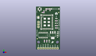
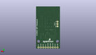
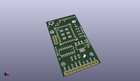

Contents
========

* [PROJ-SPAR-12072-STAN-01>CC3000 WiFi Breakout](#proj-spar-12072-stan-01cc3000-wifi-breakout)
	* [Images](#images)
	* [Interactive BOM](#interactive-bom)
	* [OOMP Parts](#oomp-parts)
	* [Tags](#tags)
  
![][im]
# PROJ-SPAR-12072-STAN-01>CC3000 WiFi Breakout

- ID: PROJ-SPAR-12072-STAN-01
- Hex ID: PRS12072
- Name: CC3000 WiFi Breakout
- Description: 

## Images
  
  

|eagleImage|kicadPcb3dFront|kicadPcb3dBack|kicadPcb3d|
| :---: | :---: | :---: | :---: |
|||||

## Interactive BOM

- Interactive BOM page: [ibom.html](kicad/bom/ibom.html)

## OOMP Parts
  

|OOMP Parts|
| :---: |
|UNMATCHED-UNMATCHED-X-UNMATCHED-01, AE1, 20.32, 43.18, 0,AE1, ANTENNA22500AT44M0400, ANTENNA-CHIP_2500AT44M0400, SparkFun-RF, (0.8, 1.7), R0|
|CAPE-0805-X-UNMATCHED-01, C1, 13.97, 8.889999999999999, 270,C1, 10uF, 0805, SparkFun-Capacitors, (0.55, 0.35), R270|
|CAPE-0805-X-UNMATCHED-01, C2, 22.86, 17.779999999999998, 90,C2, 10uF, 0805, SparkFun-Capacitors, (0.9, 0.7), R90|
|CAPE-0603-X-NF100-01, C3, 11.43, 8.889999999999999, 270,C3, 0.1uF, 0603-CAP, SparkFun-Capacitors, (0.45, 0.35), R270|
|CAPE-0805-X-UNMATCHED-01, C4, 22.86, 13.97, 270,C4, 1uF, 0805, SparkFun-Capacitors, (0.9, 0.55), R270|
|CAPE-0805-X-UNMATCHED-01, C5, 21.59, 27.94, 0,C5, 1uF, 0805, SparkFun-Capacitors, (0.85, 1.1), R0|
|CAPE-0603-X-UNMATCHED-01, C6, 8.4328, 40.2082, 270,C6, 10pF, 0603-CAP, SparkFun-Capacitors, (0.332, 1.583), R270|
|CAPE-0603-X-PF22D-01, C7, 12.7, 43.18, 180,C7, 2.2pF, 0603-CAP, SparkFun-Capacitors, (0.5, 1.7), R180|
|UNMATCHED-0603-X-UNMATCHED-01, C8, 7.492999999999999, 39.395399999999995, 180,C8, DNP, 0603-CAP, SparkFun-Capacitors, (0.295, 1.551), R180|
|UNMATCHED-0603-X-UNMATCHED-01, D1, 21.59, 33.019999999999996, 90,D1, GREEN, LED-0603, SparkFun-LED, (0.85, 1.3), R90|
|UNMATCHED-UNMATCHED-X-UNMATCHED-01, J1, 3.8099999999999996, 43.18, 270,J1, U.FL, U.FL, SparkFun-Connectors, (0.15, 1.7), R270|
|UNMATCHED-UNMATCHED-X-UNMATCHED-01, JP1, 2.54, 29.209999999999997, 270,JP1, Debug, 1X03, SparkFun-Connectors, (0.1, 1.15), R270|
|UNMATCHED-UNMATCHED-X-UNMATCHED-01, JP2, 22.86, 1.27, 180,JP2, M09, 1X09, SparkFun-Connectors, (0.9, 0.05), R180|
|UNMATCHED-0603-X-UNMATCHED-01, L1, 14.858999999999998, 42.316399999999994, 270,L1, DNP, 0603, SparkFun-Passives, (0.585, 1.666), R270|
|UNMATCHED-0603-X-UNMATCHED-01, L2, 10.5918, 42.316399999999994, 270,L2, 2.2nH, 0603, SparkFun-Passives, (0.417, 1.666), R270|
|RESE-0603-X-UNMATCHED-01, R1, 21.59, 25.4, 180,R1, 240, 0603-RES, SparkFun-Resistors, (0.85, 1), R180|
|RESE-0603-X-UNMATCHED-01, R2, 21.59, 22.86, 0,R2, 390, 0603-RES, SparkFun-Resistors, (0.85, 0.9), R0|
|RESE-0603-X-UNMATCHED-01, R3, 21.59, 30.479999999999997, 180,R3, 390, 0603-RES, SparkFun-Resistors, (0.85, 1.2), R180|
|<table><tr><td></td><td> R4</td><td>[RESE-0603-X-O103-01 SMD (0603) 10k Ohm Resistor](https://github.com/oomlout/oomlout_OOMP_parts/tree/main/RESE-0603-X-O103-01/)</td><td>[R6103](https://github.com/oomlout/oomlout_OOMP_parts/tree/main/RESE-0603-X-O103-01/)</td></tr></table>|
|UNMATCHED-UNMATCHED-X-UNMATCHED-01, SJ1, 2.54, 34.29, 90,SJ1, Mode, SJ_3_PASTE1&2, SparkFun-Passives, (0.1, 1.35), R90|
|UNMATCHED-UNMATCHED-X-UNMATCHED-01, U1, 17.779999999999998, 15.239999999999998, 180,U1, LM1117, SOT223, SparkFun-PowerIC, (0.7, 0.6), R180|
|UNMATCHED-UNMATCHED-X-UNMATCHED-01, U3, 7.619999999999999, 15.239999999999998, 180,U3, 74HC4050, SO016, SparkFun-DigitalIC, (0.3, 0.6), R180|
|UNMATCHED-UNMATCHED-X-UNMATCHED-01, U5, 11.43, 29.209999999999997, 0,U5, CC3000, QFN-46_CC3000, SparkFun-RF, (0.45, 1.15), R0|

## Tags

- hexID: PRS12072
- oompType: PROJ
- oompSize: SPAR
- oompColor: 12072
- oompDesc: STAN
- oompIndex: 01
- oompName: CC3000 WiFi Breakout
- sources: All source files from https://github.com/sparkfun/CC3000_WiFi_Breakout (source licence details in srcLicense.md)
- linkBuyPage: https://www.sparkfun.com/products/12072
- oompPart: UNMATCHED-UNMATCHED-X-UNMATCHED-01, AE1, 20.32, 43.18, 0
- oompPart: CAPE-0805-X-UNMATCHED-01, C1, 13.97, 8.889999999999999, 270
- oompPart: CAPE-0805-X-UNMATCHED-01, C2, 22.86, 17.779999999999998, 90
- oompPart: CAPE-0603-X-NF100-01, C3, 11.43, 8.889999999999999, 270
- oompPart: CAPE-0805-X-UNMATCHED-01, C4, 22.86, 13.97, 270
- oompPart: CAPE-0805-X-UNMATCHED-01, C5, 21.59, 27.94, 0
- oompPart: CAPE-0603-X-UNMATCHED-01, C6, 8.4328, 40.2082, 270
- oompPart: CAPE-0603-X-PF22D-01, C7, 12.7, 43.18, 180
- oompPart: UNMATCHED-0603-X-UNMATCHED-01, C8, 7.492999999999999, 39.395399999999995, 180
- oompPart: UNMATCHED-0603-X-UNMATCHED-01, D1, 21.59, 33.019999999999996, 90
- oompPart: SKIP-UNMATCHED-X-UNMATCHED-01, FID1, 24.13, 39.37, 0
- oompPart: SKIP-UNMATCHED-X-UNMATCHED-01, FID2, 1.27, 11.43, 0
- oompPart: UNMATCHED-UNMATCHED-X-UNMATCHED-01, J1, 3.8099999999999996, 43.18, 270
- oompPart: UNMATCHED-UNMATCHED-X-UNMATCHED-01, JP1, 2.54, 29.209999999999997, 270
- oompPart: UNMATCHED-UNMATCHED-X-UNMATCHED-01, JP2, 22.86, 1.27, 180
- oompPart: UNMATCHED-0603-X-UNMATCHED-01, L1, 14.858999999999998, 42.316399999999994, 270
- oompPart: UNMATCHED-0603-X-UNMATCHED-01, L2, 10.5918, 42.316399999999994, 270
- oompPart: RESE-0603-X-UNMATCHED-01, R1, 21.59, 25.4, 180
- oompPart: RESE-0603-X-UNMATCHED-01, R2, 21.59, 22.86, 0
- oompPart: RESE-0603-X-UNMATCHED-01, R3, 21.59, 30.479999999999997, 180
- oompPart: RESE-0603-X-O103-01, R4, 8.889999999999999, 8.889999999999999, 270
- oompPart: UNMATCHED-UNMATCHED-X-UNMATCHED-01, SJ1, 2.54, 34.29, 90
- oompPart: UNMATCHED-UNMATCHED-X-UNMATCHED-01, U1, 17.779999999999998, 15.239999999999998, 180
- oompPart: UNMATCHED-UNMATCHED-X-UNMATCHED-01, U3, 7.619999999999999, 15.239999999999998, 180
- oompPart: UNMATCHED-UNMATCHED-X-UNMATCHED-01, U5, 11.43, 29.209999999999997, 0
- rawPart: AE1, ANTENNA22500AT44M0400, ANTENNA-CHIP_2500AT44M0400, SparkFun-RF, (0.8, 1.7), R0
- rawPart: C1, 10uF, 0805, SparkFun-Capacitors, (0.55, 0.35), R270
- rawPart: C2, 10uF, 0805, SparkFun-Capacitors, (0.9, 0.7), R90
- rawPart: C3, 0.1uF, 0603-CAP, SparkFun-Capacitors, (0.45, 0.35), R270
- rawPart: C4, 1uF, 0805, SparkFun-Capacitors, (0.9, 0.55), R270
- rawPart: C5, 1uF, 0805, SparkFun-Capacitors, (0.85, 1.1), R0
- rawPart: C6, 10pF, 0603-CAP, SparkFun-Capacitors, (0.332, 1.583), R270
- rawPart: C7, 2.2pF, 0603-CAP, SparkFun-Capacitors, (0.5, 1.7), R180
- rawPart: C8, DNP, 0603-CAP, SparkFun-Capacitors, (0.295, 1.551), R180
- rawPart: D1, GREEN, LED-0603, SparkFun-LED, (0.85, 1.3), R90
- rawPart: FID1, FIDUCIAL1X2, FIDUCIAL-1X2, SparkFun-Aesthetics, (0.95, 1.55), R0
- rawPart: FID2, FIDUCIAL1X2, FIDUCIAL-1X2, SparkFun-Aesthetics, (0.05, 0.45), R0
- rawPart: J1, U.FL, U.FL, SparkFun-Connectors, (0.15, 1.7), R270
- rawPart: JP1, Debug, 1X03, SparkFun-Connectors, (0.1, 1.15), R270
- rawPart: JP2, M09, 1X09, SparkFun-Connectors, (0.9, 0.05), R180
- rawPart: L1, DNP, 0603, SparkFun-Passives, (0.585, 1.666), R270
- rawPart: L2, 2.2nH, 0603, SparkFun-Passives, (0.417, 1.666), R270
- rawPart: R1, 240, 0603-RES, SparkFun-Resistors, (0.85, 1), R180
- rawPart: R2, 390, 0603-RES, SparkFun-Resistors, (0.85, 0.9), R0
- rawPart: R3, 390, 0603-RES, SparkFun-Resistors, (0.85, 1.2), R180
- rawPart: R4, 10k, 0603-RES, SparkFun-Resistors, (0.35, 0.35), R270
- rawPart: SJ1, Mode, SJ_3_PASTE1&2, SparkFun-Passives, (0.1, 1.35), R90
- rawPart: U1, LM1117, SOT223, SparkFun-PowerIC, (0.7, 0.6), R180
- rawPart: U3, 74HC4050, SO016, SparkFun-DigitalIC, (0.3, 0.6), R180
- rawPart: U5, CC3000, QFN-46_CC3000, SparkFun-RF, (0.45, 1.15), R0

[im]: kicadPcb3d_450.png
