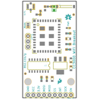
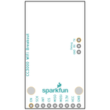
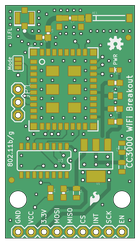
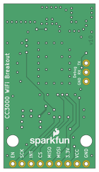

Contents
========

* [PRS12072 > CC3000 WiFi Breakout](#prs12072--cc3000-wifi-breakout)
	* [Schematic](#schematic)
	* [PCB](#pcb)
	* [Interactive BOM](#interactive-bom)
	* [Images](#images)
	* [Tags](#tags)
  
![][im]
# PRS12072 > CC3000 WiFi Breakout

- ID: PROJ-SPAR-12072-STAN-01
- Hex ID: PRS12072
- Name: Sparkfun
- Description: Sparkfun
- Long Link: [http://oom.lt/PROJ-SPAR-12072-STAN-01](http://oom.lt/PROJ-SPAR-12072-STAN-01)
- Short Link: [http://oom.lt/PRS12072](http://oom.lt/PRS12072)

## Schematic
  

## PCB
  

## Interactive BOM

- Interactive BOM page: [ibom.html](https://htmlpreview.github.io/?https://github.com/oomlout/oomlout_OOMP_projects/blob/main/PROJ-SPAR-12072-STAN-01/kicad/bom/ibom.html)

## Images
  
  

|bominteractivefront|bominteractiveback|kicadPcb3d|kicadPcb3dFront|kicadPcb3dBack|eagleImage|eagleSchemImage|pcbdraw|pcbdrawback|
| :---: | :---: | :---: | :---: | :---: | :---: | :---: | :---: | :---: |
||||||||||

## Tags

- hexID: PRS12072
- oompType: PROJ
- oompSize: SPAR
- oompColor: 12072
- oompDesc: STAN
- oompIndex: 01
- oompName: CC3000 WiFi Breakout
- sources: All source files from https://github.com/sparkfun/CC3000_WiFi_Breakout (source licence details in srcLicense.md)
- linkBuyPage: https://www.sparkfun.com/products/12072
- oompID: PROJ-SPAR-12072-STAN-01
- rawParts: AE1,ANTENNA22500AT44M0400,ANTENNA22500AT44M0400,ANTENNA-CHIP_2500AT44M0400,Chip antenna,,,,,
- rawParts: C1,10uF,CAP0805,0805,Capacitor,,,,,
- rawParts: C2,10uF,CAP0805,0805,Capacitor,,,,,
- rawParts: C3,0.1uF,CAP0603-CAP,0603-CAP,Capacitor,,,,,
- rawParts: C4,1uF,CAP0805,0805,Capacitor,,,,,
- rawParts: C5,1uF,CAP0805,0805,Capacitor,,,,,
- rawParts: C6,10pF,CAP0603-CAP,0603-CAP,Capacitor,C0G,,5%,,
- rawParts: C7,2.2pF,CAP0603-CAP,0603-CAP,Capacitor,C0G,,10%,,
- rawParts: C8,DNP,CAP0603-CAP,0603-CAP,Capacitor,,,,,
- rawParts: D1,GREEN,LED-GREEN0603,LED-0603,Various green LEDs,,DIO-00821,,GREEN,
- rawParts: FID1,FIDUCIAL1X2,FIDUCIAL1X2,FIDUCIAL-1X2,Fiducial Alignment Points,,,,,
- rawParts: FID2,FIDUCIAL1X2,FIDUCIAL1X2,FIDUCIAL-1X2,Fiducial Alignment Points,,,,,
- rawParts: FRAME1,FRAME-LETTER,FRAME-LETTER,CREATIVE_COMMONS,Schematic Frame,,,,,
- rawParts: J1,U.FL,U.FL,U.FL,SMD antenna connector- WRL-09144,,,,,
- rawParts: JP1,Debug,M03PTH,1X03,Header 3,,,,,
- rawParts: JP2,M09,M09,1X09,Header 9,,,,,
- rawParts: L1,DNP,INDUCTOR0603,0603,Inductors,,,,,
- rawParts: L2,2.2nH,INDUCTOR0603,0603,Inductors,,,,,
- rawParts: LOGO1,OSHW-LOGOS,OSHW-LOGOS,OSHW-LOGO-S,Open Source Hardware Logo This logo indicates the piece of hardware it is found on incorporates a OSHW license and/or adheres to the definition of open source hardware found here: http://freedomdefined.org/OSHW,,,,,
- rawParts: LOGO3,LOGO-SFESK,LOGO-SFESK,SFE-LOGO-FLAME,Spark Fun Electronics PCB Logo,,,,,
- rawParts: LOGO4,SFE_LOGO_NAME_FLAME.1_INCH,SFE_LOGO_NAME_FLAME.1_INCH,SFE_LOGO_NAME_FLAME_.1,SFE Logo, name and flame,,,,,
- rawParts: R1,240,RESISTOR0603,0603-RES,Resistor,,,,,
- rawParts: R2,390,RESISTOR0603,0603-RES,Resistor,,,,,
- rawParts: R3,390,RESISTOR0603-RES,0603-RES,Resistor,,,,,
- rawParts: R4,10k,RESISTOR0603-RES,0603-RES,Resistor,,,,,
- rawParts: SJ1,Mode,SOLDERJUMPER_2WAYPASTE1&2,SJ_3_PASTE1&2,Solder Jumper,,,,,
- rawParts: STANDOFF1,STAND-OFF,STAND-OFF,STAND-OFF,#4 Stand Off,,,,,
- rawParts: STANDOFF2,STAND-OFF,STAND-OFF,STAND-OFF,#4 Stand Off,,,,,
- rawParts: U1,LM1117,V_REG_LM1117SOT223,SOT223,Voltage Regulator LM1117,,,,,
- rawParts: U3,74HC4050,HEX_CONVERTER,SO016,Just what it says.,,,,,
- rawParts: U5,CC3000,CC3000,QFN-46_CC3000,TI CC3000 WiFi Module,,,,,

[im]: kicadPcb3d_450.png
