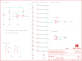

Contents
========

* [PRS12080 > Sparkfun](#prs12080--sparkfun)
	* [Schematic](#schematic)
	* [Interactive BOM](#interactive-bom)
	* [OOMP Parts](#oomp-parts)
	* [Images](#images)
	* [Tags](#tags)
  
![][im]
# PRS12080 > Sparkfun

- ID: PROJ-SPAR-12080-STAN-01
- Hex ID: PRS12080
- Name: Sparkfun
- Description: Sparkfun
- Long Link: [http://oom.lt/PROJ-SPAR-12080-STAN-01](http://oom.lt/PROJ-SPAR-12080-STAN-01)
- Short Link: [http://oom.lt/PRS12080](http://oom.lt/PRS12080)

## Schematic
  

## Interactive BOM

- Interactive BOM page: [ibom.html](https://htmlpreview.github.io/?https://github.com/oomlout/oomlout_OOMP_projects/blob/main/PROJ-SPAR-12080-STAN-01/kicad/bom/ibom.html)

## OOMP Parts
  

|OOMP Parts|
| :---: |
|C1,CAPC-0603-X-UNMATCHED-01,C1,.01uF,10NF/10000PF-50V-10%(0603),0603-CAP,CAP-00867,CAP-00867,10nF,|
|D1,DIOD-S323-X-UNMATCHED-01,D1,BAS16,DIODESOD,SOD-323,Diode,DIO-09646,,|
|JP1,HEAD-I01-X-PI03-01,FID1,FIDUCIALUFIDUCIAL,FIDUCIALUFIDUCIAL,MICRO-FIDUCIAL,Fiducial Alignment Points,,,|
|Q1,UNMATCHED-SO23-X-UNMATCHED-01,FID2,FIDUCIALUFIDUCIAL,FIDUCIALUFIDUCIAL,MICRO-FIDUCIAL,Fiducial Alignment Points,,,|
|R1,RESE-0603-X-O103-01,FRAME1,FRAME-LETTER,FRAME-LETTER,CREATIVE_COMMONS,Schematic Frame,,,|
|R2,RESE-0603-X-O102-01,JP1,POWER & OUTPUT,M031X03_NO_SILK,1X03_NO_SILK,Header 3,,,|
|R3,RESE-0603-X-UNMATCHED-01,LOGO1,LOGO-SFENEW,LOGO-SFENEW,SFE-NEW-WEBLOGO,Spark Fun Electronics PCB Logo,,,|
|R4,RESE-0603-X-O101-01,LOGO2,LOGO-SFENEW,LOGO-SFENEW,SFE-NEW-WEBLOGO,Spark Fun Electronics PCB Logo,,,|
|R5,RESE-0603-X-O331-01,LOGO3,OSHW-LOGOM,OSHW-LOGOM,OSHW-LOGO-M,Open Source Hardware Logo This logo indicates the piece of hardware it is found on incorporates a OSHW license and/or adheres to the definition of open source hardware found here: http://freedomdefined.org/OSHW,,,|
|R6,RESE-0603-X-O331-01,LOGO4,OSHW-LOGOL,OSHW-LOGOL,OSHW-LOGO-L,Open Source Hardware Logo This logo indicates the piece of hardware it is found on incorporates a OSHW license and/or adheres to the definition of open source hardware found here: http://freedomdefined.org/OSHW,,,|
|R7,RESE-0603-X-O331-01,Q1,MMBT3906,TRANSISTOR_PNPMMBT3906,SOT23,Generic PNP BJT,TRANS-08052,MMBT3906,|
|R8,RESE-0603-X-O331-01,R1,10k,10KOHM1/10W1%(0603)0603,0603-RES,RES-00824,RES-00824,10K,|
|R9,RESE-0603-X-O331-01,R2,1k,1KOHM1/10W1%(0603),0603-RES,RES-07856,RES-07856,1K,|
|R10,RESE-0603-X-O331-01,R3,1meg,1M-1%,0603-RES,1M-ohm SMT,RES-07868,1M,|
|R11,RESE-0603-X-O331-01,R4,100,100OHM1/10W1%(0603),0603-RES,RES-07863,RES-07863,100,|
|R12,RESE-0603-X-O331-01,R5,330,330OHM1/10W1%(0603),0603-RES,RES-00818,RES-00818,330,|
|R13,RESE-0603-X-O331-01,R6,330,330OHM1/10W1%(0603),0603-RES,RES-00818,RES-00818,330,|
|R14,RESE-0603-X-O331-01,R7,330,330OHM1/10W1%(0603),0603-RES,RES-00818,RES-00818,330,|
|R15,RESE-0603-X-O331-01,R8,330,330OHM1/10W1%(0603),0603-RES,RES-00818,RES-00818,330,|
|R16,RESE-0603-X-O331-01,R9,330,330OHM1/10W1%(0603),0603-RES,RES-00818,RES-00818,330,|
|R17,RESE-0603-X-O102-01,R10,330,330OHM1/10W1%(0603),0603-RES,RES-00818,RES-00818,330,|
|S1,UNMATCHED-UNMATCHED-X-UNMATCHED-01,R11,330,330OHM1/10W1%(0603),0603-RES,RES-00818,RES-00818,330,|
|S2,UNMATCHED-UNMATCHED-X-UNMATCHED-01,R12,330,330OHM1/10W1%(0603),0603-RES,RES-00818,RES-00818,330,|
|S3,UNMATCHED-UNMATCHED-X-UNMATCHED-01,R13,330,330OHM1/10W1%(0603),0603-RES,RES-00818,RES-00818,330,|
|S4,UNMATCHED-UNMATCHED-X-UNMATCHED-01,R14,330,330OHM1/10W1%(0603),0603-RES,RES-00818,RES-00818,330,|
|S5,UNMATCHED-UNMATCHED-X-UNMATCHED-01,R15,330,330OHM1/10W1%(0603),0603-RES,RES-00818,RES-00818,330,|
|S6,UNMATCHED-UNMATCHED-X-UNMATCHED-01,R16,330,330OHM1/10W1%(0603),0603-RES,RES-00818,RES-00818,330,|
|S7,UNMATCHED-UNMATCHED-X-UNMATCHED-01,R17,1k,1KOHM1/10W1%(0603),0603-RES,RES-07856,RES-07856,1K,|
|S8,UNMATCHED-UNMATCHED-X-UNMATCHED-01,S1,SWITCH-MOMENTARY-212MM,SWITCH-MOMENTARY-212MM,TACTILE-PTH-12MM,Various NO switches- pushbuttons, reed, etc,SWCH-09185,,|
|S9,UNMATCHED-UNMATCHED-X-UNMATCHED-01,S2,SWITCH-MOMENTARY-212MM,SWITCH-MOMENTARY-212MM,TACTILE-PTH-12MM,Various NO switches- pushbuttons, reed, etc,SWCH-09185,,|
|S10,UNMATCHED-UNMATCHED-X-UNMATCHED-01,S3,SWITCH-MOMENTARY-212MM,SWITCH-MOMENTARY-212MM,TACTILE-PTH-12MM,Various NO switches- pushbuttons, reed, etc,SWCH-09185,,|
|S11,UNMATCHED-UNMATCHED-X-UNMATCHED-01,S4,SWITCH-MOMENTARY-212MM,SWITCH-MOMENTARY-212MM,TACTILE-PTH-12MM,Various NO switches- pushbuttons, reed, etc,SWCH-09185,,|
|S12,UNMATCHED-UNMATCHED-X-UNMATCHED-01,S5,SWITCH-MOMENTARY-212MM,SWITCH-MOMENTARY-212MM,TACTILE-PTH-12MM,Various NO switches- pushbuttons, reed, etc,SWCH-09185,,|
|S13,UNMATCHED-UNMATCHED-X-UNMATCHED-01,S6,SWITCH-MOMENTARY-212MM,SWITCH-MOMENTARY-212MM,TACTILE-PTH-12MM,Various NO switches- pushbuttons, reed, etc,SWCH-09185,,|
|S14,UNMATCHED-UNMATCHED-X-UNMATCHED-01,S7,SWITCH-MOMENTARY-212MM,SWITCH-MOMENTARY-212MM,TACTILE-PTH-12MM,Various NO switches- pushbuttons, reed, etc,SWCH-09185,,|
|S15,UNMATCHED-UNMATCHED-X-UNMATCHED-01,S8,SWITCH-MOMENTARY-212MM,SWITCH-MOMENTARY-212MM,TACTILE-PTH-12MM,Various NO switches- pushbuttons, reed, etc,SWCH-09185,,|
|S16,UNMATCHED-UNMATCHED-X-UNMATCHED-01,S9,SWITCH-MOMENTARY-212MM,SWITCH-MOMENTARY-212MM,TACTILE-PTH-12MM,Various NO switches- pushbuttons, reed, etc,SWCH-09185,,|
|U1,UNMATCHED-UNMATCHED-X-UNMATCHED-01,S10,SWITCH-MOMENTARY-212MM,SWITCH-MOMENTARY-212MM,TACTILE-PTH-12MM,Various NO switches- pushbuttons, reed, etc,SWCH-09185,,|

## Images
  
  

|kicadPcb3d|kicadPcb3dFront|kicadPcb3dBack|eagleImage|eagleSchemImage|
| :---: | :---: | :---: | :---: | :---: |
||||||

## Tags

- hexID: PRS12080
- oompType: PROJ
- oompSize: SPAR
- oompColor: 12080
- oompDesc: STAN
- oompIndex: 01
- oompName: VKey Voltage Keypad
- sources: All source files from https://github.com/sparkfun/VKey_Voltage_Keypad (source licence details in srcLicense.md)
- linkBuyPage: https://www.sparkfun.com/products/12080
- oompID: PROJ-SPAR-12080-STAN-01
- oompParts: C1,CAPC-0603-X-UNMATCHED-01
- oompParts: D1,DIOD-S323-X-UNMATCHED-01
- oompParts: JP1,HEAD-I01-X-PI03-01
- oompParts: Q1,UNMATCHED-SO23-X-UNMATCHED-01
- oompParts: R1,RESE-0603-X-O103-01
- oompParts: R2,RESE-0603-X-O102-01
- oompParts: R3,RESE-0603-X-UNMATCHED-01
- oompParts: R4,RESE-0603-X-O101-01
- oompParts: R5,RESE-0603-X-O331-01
- oompParts: R6,RESE-0603-X-O331-01
- oompParts: R7,RESE-0603-X-O331-01
- oompParts: R8,RESE-0603-X-O331-01
- oompParts: R9,RESE-0603-X-O331-01
- oompParts: R10,RESE-0603-X-O331-01
- oompParts: R11,RESE-0603-X-O331-01
- oompParts: R12,RESE-0603-X-O331-01
- oompParts: R13,RESE-0603-X-O331-01
- oompParts: R14,RESE-0603-X-O331-01
- oompParts: R15,RESE-0603-X-O331-01
- oompParts: R16,RESE-0603-X-O331-01
- oompParts: R17,RESE-0603-X-O102-01
- oompParts: S1,UNMATCHED-UNMATCHED-X-UNMATCHED-01
- oompParts: S2,UNMATCHED-UNMATCHED-X-UNMATCHED-01
- oompParts: S3,UNMATCHED-UNMATCHED-X-UNMATCHED-01
- oompParts: S4,UNMATCHED-UNMATCHED-X-UNMATCHED-01
- oompParts: S5,UNMATCHED-UNMATCHED-X-UNMATCHED-01
- oompParts: S6,UNMATCHED-UNMATCHED-X-UNMATCHED-01
- oompParts: S7,UNMATCHED-UNMATCHED-X-UNMATCHED-01
- oompParts: S8,UNMATCHED-UNMATCHED-X-UNMATCHED-01
- oompParts: S9,UNMATCHED-UNMATCHED-X-UNMATCHED-01
- oompParts: S10,UNMATCHED-UNMATCHED-X-UNMATCHED-01
- oompParts: S11,UNMATCHED-UNMATCHED-X-UNMATCHED-01
- oompParts: S12,UNMATCHED-UNMATCHED-X-UNMATCHED-01
- oompParts: S13,UNMATCHED-UNMATCHED-X-UNMATCHED-01
- oompParts: S14,UNMATCHED-UNMATCHED-X-UNMATCHED-01
- oompParts: S15,UNMATCHED-UNMATCHED-X-UNMATCHED-01
- oompParts: S16,UNMATCHED-UNMATCHED-X-UNMATCHED-01
- oompParts: U1,UNMATCHED-UNMATCHED-X-UNMATCHED-01
- rawParts: C1,.01uF,10NF/10000PF-50V-10%(0603),0603-CAP,CAP-00867,CAP-00867,10nF,
- rawParts: D1,BAS16,DIODESOD,SOD-323,Diode,DIO-09646,,
- rawParts: FID1,FIDUCIALUFIDUCIAL,FIDUCIALUFIDUCIAL,MICRO-FIDUCIAL,Fiducial Alignment Points,,,
- rawParts: FID2,FIDUCIALUFIDUCIAL,FIDUCIALUFIDUCIAL,MICRO-FIDUCIAL,Fiducial Alignment Points,,,
- rawParts: FRAME1,FRAME-LETTER,FRAME-LETTER,CREATIVE_COMMONS,Schematic Frame,,,
- rawParts: JP1,POWER & OUTPUT,M031X03_NO_SILK,1X03_NO_SILK,Header 3,,,
- rawParts: LOGO1,LOGO-SFENEW,LOGO-SFENEW,SFE-NEW-WEBLOGO,Spark Fun Electronics PCB Logo,,,
- rawParts: LOGO2,LOGO-SFENEW,LOGO-SFENEW,SFE-NEW-WEBLOGO,Spark Fun Electronics PCB Logo,,,
- rawParts: LOGO3,OSHW-LOGOM,OSHW-LOGOM,OSHW-LOGO-M,Open Source Hardware Logo This logo indicates the piece of hardware it is found on incorporates a OSHW license and/or adheres to the definition of open source hardware found here: http://freedomdefined.org/OSHW,,,
- rawParts: LOGO4,OSHW-LOGOL,OSHW-LOGOL,OSHW-LOGO-L,Open Source Hardware Logo This logo indicates the piece of hardware it is found on incorporates a OSHW license and/or adheres to the definition of open source hardware found here: http://freedomdefined.org/OSHW,,,
- rawParts: Q1,MMBT3906,TRANSISTOR_PNPMMBT3906,SOT23,Generic PNP BJT,TRANS-08052,MMBT3906,
- rawParts: R1,10k,10KOHM1/10W1%(0603)0603,0603-RES,RES-00824,RES-00824,10K,
- rawParts: R2,1k,1KOHM1/10W1%(0603),0603-RES,RES-07856,RES-07856,1K,
- rawParts: R3,1meg,1M-1%,0603-RES,1M-ohm SMT,RES-07868,1M,
- rawParts: R4,100,100OHM1/10W1%(0603),0603-RES,RES-07863,RES-07863,100,
- rawParts: R5,330,330OHM1/10W1%(0603),0603-RES,RES-00818,RES-00818,330,
- rawParts: R6,330,330OHM1/10W1%(0603),0603-RES,RES-00818,RES-00818,330,
- rawParts: R7,330,330OHM1/10W1%(0603),0603-RES,RES-00818,RES-00818,330,
- rawParts: R8,330,330OHM1/10W1%(0603),0603-RES,RES-00818,RES-00818,330,
- rawParts: R9,330,330OHM1/10W1%(0603),0603-RES,RES-00818,RES-00818,330,
- rawParts: R10,330,330OHM1/10W1%(0603),0603-RES,RES-00818,RES-00818,330,
- rawParts: R11,330,330OHM1/10W1%(0603),0603-RES,RES-00818,RES-00818,330,
- rawParts: R12,330,330OHM1/10W1%(0603),0603-RES,RES-00818,RES-00818,330,
- rawParts: R13,330,330OHM1/10W1%(0603),0603-RES,RES-00818,RES-00818,330,
- rawParts: R14,330,330OHM1/10W1%(0603),0603-RES,RES-00818,RES-00818,330,
- rawParts: R15,330,330OHM1/10W1%(0603),0603-RES,RES-00818,RES-00818,330,
- rawParts: R16,330,330OHM1/10W1%(0603),0603-RES,RES-00818,RES-00818,330,
- rawParts: R17,1k,1KOHM1/10W1%(0603),0603-RES,RES-07856,RES-07856,1K,
- rawParts: S1,SWITCH-MOMENTARY-212MM,SWITCH-MOMENTARY-212MM,TACTILE-PTH-12MM,Various NO switches- pushbuttons, reed, etc,SWCH-09185,,
- rawParts: S2,SWITCH-MOMENTARY-212MM,SWITCH-MOMENTARY-212MM,TACTILE-PTH-12MM,Various NO switches- pushbuttons, reed, etc,SWCH-09185,,
- rawParts: S3,SWITCH-MOMENTARY-212MM,SWITCH-MOMENTARY-212MM,TACTILE-PTH-12MM,Various NO switches- pushbuttons, reed, etc,SWCH-09185,,
- rawParts: S4,SWITCH-MOMENTARY-212MM,SWITCH-MOMENTARY-212MM,TACTILE-PTH-12MM,Various NO switches- pushbuttons, reed, etc,SWCH-09185,,
- rawParts: S5,SWITCH-MOMENTARY-212MM,SWITCH-MOMENTARY-212MM,TACTILE-PTH-12MM,Various NO switches- pushbuttons, reed, etc,SWCH-09185,,
- rawParts: S6,SWITCH-MOMENTARY-212MM,SWITCH-MOMENTARY-212MM,TACTILE-PTH-12MM,Various NO switches- pushbuttons, reed, etc,SWCH-09185,,
- rawParts: S7,SWITCH-MOMENTARY-212MM,SWITCH-MOMENTARY-212MM,TACTILE-PTH-12MM,Various NO switches- pushbuttons, reed, etc,SWCH-09185,,
- rawParts: S8,SWITCH-MOMENTARY-212MM,SWITCH-MOMENTARY-212MM,TACTILE-PTH-12MM,Various NO switches- pushbuttons, reed, etc,SWCH-09185,,
- rawParts: S9,SWITCH-MOMENTARY-212MM,SWITCH-MOMENTARY-212MM,TACTILE-PTH-12MM,Various NO switches- pushbuttons, reed, etc,SWCH-09185,,
- rawParts: S10,SWITCH-MOMENTARY-212MM,SWITCH-MOMENTARY-212MM,TACTILE-PTH-12MM,Various NO switches- pushbuttons, reed, etc,SWCH-09185,,
- rawParts: S11,SWITCH-MOMENTARY-212MM,SWITCH-MOMENTARY-212MM,TACTILE-PTH-12MM,Various NO switches- pushbuttons, reed, etc,SWCH-09185,,
- rawParts: S12,SWITCH-MOMENTARY-212MM,SWITCH-MOMENTARY-212MM,TACTILE-PTH-12MM,Various NO switches- pushbuttons, reed, etc,SWCH-09185,,
- rawParts: S13,STANDOFF_ELECTRICAL,STANDOFF_ELECTRICAL,STANDOFF-ELECTRICAL,A standoff intended to be an electrically connected point.,,,
- rawParts: S14,STANDOFF_ELECTRICAL,STANDOFF_ELECTRICAL,STANDOFF-ELECTRICAL,A standoff intended to be an electrically connected point.,,,
- rawParts: S15,STANDOFF_ELECTRICAL,STANDOFF_ELECTRICAL,STANDOFF-ELECTRICAL,A standoff intended to be an electrically connected point.,,,
- rawParts: S16,STANDOFF_ELECTRICAL,STANDOFF_ELECTRICAL,STANDOFF-ELECTRICAL,A standoff intended to be an electrically connected point.,,,
- rawParts: U1,LMV358,LMV358,SO08,Jellybean rail-to-rail output op-amp,IC-09657,,

[im]: kicadPcb3d_450.png
