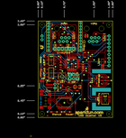
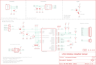

Contents
========

* [PRS12081 > Sparkfun](#prs12081--sparkfun)
	* [Images](#images)
	* [Tags](#tags)
  
![][im]
# PRS12081 > Sparkfun

- ID: PROJ-SPAR-12081-STAN-01
- Hex ID: PRS12081
- Name: Sparkfun
- Description: Sparkfun

## Images
  
  

|kicadPcb3d|kicadPcb3dFront|kicadPcb3dBack|eagleImage|eagleSchemImage|
| :---: | :---: | :---: | :---: | :---: |
||||||

## Tags

- hexID: PRS12081
- oompType: PROJ
- oompSize: SPAR
- oompColor: 12081
- oompDesc: STAN
- oompIndex: 01
- oompName: USB Weather Board
- sources: All source files from https://github.com/sparkfun/USB_Weather_Board (source licence details in srcLicense.md)
- linkBuyPage: https://www.sparkfun.com/products/12081
- oompID: PROJ-SPAR-12081-STAN-01
- oompParts: C1,UNMATCHED-UNMATCHED-UNMATCHED-UNMATCHED-UNMATCHED
- oompParts: C2,UNMATCHED-UNMATCHED-UNMATCHED-UNMATCHED-UNMATCHED
- oompParts: C3,UNMATCHED-UNMATCHED-UNMATCHED-UNMATCHED-UNMATCHED
- oompParts: C4,UNMATCHED-UNMATCHED-UNMATCHED-UNMATCHED-UNMATCHED
- oompParts: C5,UNMATCHED-UNMATCHED-UNMATCHED-UNMATCHED-UNMATCHED
- oompParts: C6,UNMATCHED-UNMATCHED-UNMATCHED-UNMATCHED-UNMATCHED
- oompParts: C7,UNMATCHED-UNMATCHED-UNMATCHED-UNMATCHED-UNMATCHED
- oompParts: C8,UNMATCHED-UNMATCHED-UNMATCHED-UNMATCHED-UNMATCHED
- oompParts: C9,UNMATCHED-UNMATCHED-UNMATCHED-UNMATCHED-UNMATCHED
- oompParts: C10,UNMATCHED-UNMATCHED-UNMATCHED-UNMATCHED-UNMATCHED
- oompParts: C11,UNMATCHED-UNMATCHED-UNMATCHED-UNMATCHED-UNMATCHED
- oompParts: C12,UNMATCHED-UNMATCHED-UNMATCHED-UNMATCHED-UNMATCHED
- oompParts: D1,UNMATCHED-UNMATCHED-UNMATCHED-UNMATCHED-UNMATCHED
- oompParts: D2,UNMATCHED-UNMATCHED-UNMATCHED-UNMATCHED-UNMATCHED
- oompParts: D3,UNMATCHED-UNMATCHED-UNMATCHED-UNMATCHED-UNMATCHED
- oompParts: D4,UNMATCHED-UNMATCHED-UNMATCHED-UNMATCHED-UNMATCHED
- oompParts: D5,UNMATCHED-UNMATCHED-UNMATCHED-UNMATCHED-UNMATCHED
- oompParts: D6,UNMATCHED-UNMATCHED-UNMATCHED-UNMATCHED-UNMATCHED
- oompParts: D7,UNMATCHED-UNMATCHED-UNMATCHED-UNMATCHED-UNMATCHED
- oompParts: D8,UNMATCHED-UNMATCHED-UNMATCHED-UNMATCHED-UNMATCHED
- oompParts: D9,UNMATCHED-UNMATCHED-UNMATCHED-UNMATCHED-UNMATCHED
- oompParts: D10,UNMATCHED-UNMATCHED-UNMATCHED-UNMATCHED-UNMATCHED
- oompParts: D11,UNMATCHED-UNMATCHED-UNMATCHED-UNMATCHED-UNMATCHED
- oompParts: JP1,UNMATCHED-UNMATCHED-UNMATCHED-UNMATCHED-UNMATCHED
- oompParts: JP2,UNMATCHED-UNMATCHED-UNMATCHED-UNMATCHED-UNMATCHED
- oompParts: JP3,UNMATCHED-UNMATCHED-UNMATCHED-UNMATCHED-UNMATCHED
- oompParts: JP4,UNMATCHED-UNMATCHED-UNMATCHED-UNMATCHED-UNMATCHED
- oompParts: JP5-DNP,UNMATCHED-UNMATCHED-UNMATCHED-UNMATCHED-UNMATCHED
- oompParts: JP6-DNP,UNMATCHED-UNMATCHED-UNMATCHED-UNMATCHED-UNMATCHED
- oompParts: JP7,UNMATCHED-UNMATCHED-UNMATCHED-UNMATCHED-UNMATCHED
- oompParts: JP8,UNMATCHED-UNMATCHED-UNMATCHED-UNMATCHED-UNMATCHED
- oompParts: JP9-DNP,UNMATCHED-UNMATCHED-UNMATCHED-UNMATCHED-UNMATCHED
- oompParts: JP10-DNP,UNMATCHED-UNMATCHED-UNMATCHED-UNMATCHED-UNMATCHED
- oompParts: LOGO1,UNMATCHED-UNMATCHED-UNMATCHED-UNMATCHED-UNMATCHED
- oompParts: R1,UNMATCHED-UNMATCHED-UNMATCHED-UNMATCHED-UNMATCHED
- oompParts: R2,UNMATCHED-UNMATCHED-UNMATCHED-UNMATCHED-UNMATCHED
- oompParts: R3,UNMATCHED-UNMATCHED-UNMATCHED-UNMATCHED-UNMATCHED
- oompParts: R4,UNMATCHED-UNMATCHED-UNMATCHED-UNMATCHED-UNMATCHED
- oompParts: R5,UNMATCHED-UNMATCHED-UNMATCHED-UNMATCHED-UNMATCHED
- oompParts: R6,UNMATCHED-UNMATCHED-UNMATCHED-UNMATCHED-UNMATCHED
- oompParts: R7,UNMATCHED-UNMATCHED-UNMATCHED-UNMATCHED-UNMATCHED
- oompParts: R8,UNMATCHED-UNMATCHED-UNMATCHED-UNMATCHED-UNMATCHED
- oompParts: R9,UNMATCHED-UNMATCHED-UNMATCHED-UNMATCHED-UNMATCHED
- oompParts: R10,UNMATCHED-UNMATCHED-UNMATCHED-UNMATCHED-UNMATCHED
- oompParts: R11,UNMATCHED-UNMATCHED-UNMATCHED-UNMATCHED-UNMATCHED
- oompParts: R12,UNMATCHED-UNMATCHED-UNMATCHED-UNMATCHED-UNMATCHED
- oompParts: R13,UNMATCHED-UNMATCHED-UNMATCHED-UNMATCHED-UNMATCHED
- oompParts: R14,UNMATCHED-UNMATCHED-UNMATCHED-UNMATCHED-UNMATCHED
- oompParts: R15,UNMATCHED-UNMATCHED-UNMATCHED-UNMATCHED-UNMATCHED
- oompParts: R16,UNMATCHED-UNMATCHED-UNMATCHED-UNMATCHED-UNMATCHED
- oompParts: R17,UNMATCHED-UNMATCHED-UNMATCHED-UNMATCHED-UNMATCHED
- oompParts: S1,UNMATCHED-UNMATCHED-UNMATCHED-UNMATCHED-UNMATCHED
- oompParts: S2,UNMATCHED-UNMATCHED-UNMATCHED-UNMATCHED-UNMATCHED
- oompParts: S3,UNMATCHED-UNMATCHED-UNMATCHED-UNMATCHED-UNMATCHED
- oompParts: SJ1,UNMATCHED-UNMATCHED-UNMATCHED-UNMATCHED-UNMATCHED
- oompParts: SJ2,UNMATCHED-UNMATCHED-UNMATCHED-UNMATCHED-UNMATCHED
- oompParts: U$1,UNMATCHED-UNMATCHED-UNMATCHED-UNMATCHED-UNMATCHED
- oompParts: U$2,UNMATCHED-UNMATCHED-UNMATCHED-UNMATCHED-UNMATCHED
- oompParts: U$3,UNMATCHED-UNMATCHED-UNMATCHED-UNMATCHED-UNMATCHED
- oompParts: U$4,UNMATCHED-UNMATCHED-UNMATCHED-UNMATCHED-UNMATCHED
- oompParts: U$5,UNMATCHED-UNMATCHED-UNMATCHED-UNMATCHED-UNMATCHED
- oompParts: U$6,UNMATCHED-UNMATCHED-UNMATCHED-UNMATCHED-UNMATCHED
- oompParts: U1,UNMATCHED-UNMATCHED-UNMATCHED-UNMATCHED-UNMATCHED
- oompParts: U2,UNMATCHED-UNMATCHED-UNMATCHED-UNMATCHED-UNMATCHED
- oompParts: U3,UNMATCHED-UNMATCHED-UNMATCHED-UNMATCHED-UNMATCHED
- oompParts: U4,UNMATCHED-UNMATCHED-UNMATCHED-UNMATCHED-UNMATCHED
- oompParts: U5,UNMATCHED-UNMATCHED-UNMATCHED-UNMATCHED-UNMATCHED
- oompParts: U6,UNMATCHED-UNMATCHED-UNMATCHED-UNMATCHED-UNMATCHED
- oompParts: Y1,UNMATCHED-UNMATCHED-UNMATCHED-UNMATCHED-UNMATCHED
- rawParts: C1,0.1uF,CAP0402-CAP,0402-CAP,Capacitor,,
- rawParts: C2,0.1uF,CAP0402-CAP,0402-CAP,Capacitor,,
- rawParts: C3,0.1uF,CAP0402-CAP,0402-CAP,Capacitor,,
- rawParts: C4,0.1uF,CAP0402-CAP,0402-CAP,Capacitor,,
- rawParts: C5,0.1uF,CAP0402-CAP,0402-CAP,Capacitor,,
- rawParts: C6,470pF,CAP0402-CAP,0402-CAP,Capacitor,,
- rawParts: C7,10uF,CAP_POL1206,EIA3216,Capacitor Polarized,,
- rawParts: C8,0.1uF,CAP0402-CAP,0402-CAP,Capacitor,,
- rawParts: C9,0.1uF,CAP0402-CAP,0402-CAP,Capacitor,,
- rawParts: C10,0.1uF,CAP0402-CAP,0402-CAP,Capacitor,,
- rawParts: C11,0.1uF,CAP0402-CAP,0402-CAP,Capacitor,,
- rawParts: C12,0.1uF,CAP0402-CAP,0402-CAP,Capacitor,,
- rawParts: D1,RED,LED0603,LED-0603,LEDs,,
- rawParts: D2,GREEN,LED0603,LED-0603,LEDs,,
- rawParts: D3,3.6V,DIODE-ZENER-BZT52,SOD-323,Zener Diode,,
- rawParts: D4,3.6V,DIODE-ZENER-BZT52,SOD-323,Zener Diode,,
- rawParts: D5,BAS16,DIODESOD,SOD-323,Diode,,
- rawParts: D6,BAS16,DIODESOD,SOD-323,Diode,,
- rawParts: D7,BAS16,DIODESOD,SOD-323,Diode,,
- rawParts: D8,BAS16,DIODESOD,SOD-323,Diode,,
- rawParts: D9,BAS16,DIODESOD,SOD-323,Diode,,
- rawParts: D10,BAS16,DIODESOD,SOD-323,Diode,,
- rawParts: D11,3.6V,DIODE-ZENER-BZT52,SOD-323,Zener Diode,,
- rawParts: JP1,JST,M02-JST-2MM-SMT,JST-2-SMD,Header 2,,
- rawParts: JP2,1X2,M021X02_NO_SILK,1X02_NO_SILK,Header 2,,
- rawParts: JP3,AVR_Prog,AVR_SPI_PRG_6PTH,2X3,AVR ISP 6 Pin,,
- rawParts: JP4,USBSMD,USBSMD,USB-MINIB,USB Connectors,,
- rawParts: JP5-DNP,BLUESMIRF,M06SIP,1X06,Header 6,,
- rawParts: JP6-DNP,XBEE,XBEE-1B1,XBEE-1,,,
- rawParts: JP7,1X8,M09,1X09,Header 9,,
- rawParts: JP8,1X2,M02PTH,1X02,Header 2,,
- rawParts: JP9-DNP,RJ11-RAIN,RJ11-6PTH,RJ11-6,RJ11 Jack,,
- rawParts: JP10-DNP,RJ11-WIND,RJ11-6PTH,RJ11-6,RJ11 Jack,,
- rawParts: LOGO1,OSHW_LOGO_FILLX0100-NT,OSHW_LOGO_FILLX0100-NT,OSHW_FILLX100_NOTEXT,,,
- rawParts: R1,750,RESISTOR0402-RES,0402-RES,Resistor,,
- rawParts: R2,180,RESISTOR0402-RES,0402-RES,Resistor,,
- rawParts: R3,10K,RESISTOR0402-RES,0402-RES,Resistor,,
- rawParts: R4,4.7K,RESISTOR0402-RES,0402-RES,Resistor,,
- rawParts: R5,4.7K,RESISTOR0402-RES,0402-RES,Resistor,,
- rawParts: R6,3.9K,RESISTOR0402-RES,0402-RES,Resistor,,
- rawParts: R7,1K,RESISTOR0402-RES,0402-RES,Resistor,,
- rawParts: R8,1K,RESISTOR0402-RES,0402-RES,Resistor,,
- rawParts: R9,2.2K,RESISTOR0402-RES,0402-RES,Resistor,,
- rawParts: R10,2.2K,RESISTOR0402-RES,0402-RES,Resistor,,
- rawParts: R11,1K,RESISTOR0402-RES,0402-RES,Resistor,,
- rawParts: R12,1K,RESISTOR0402-RES,0402-RES,Resistor,,
- rawParts: R13,1K,RESISTOR0402-RES,0402-RES,Resistor,,
- rawParts: R14,1K,RESISTOR0402-RES,0402-RES,Resistor,,
- rawParts: R15,1K,RESISTOR0402-RES,0402-RES,Resistor,,
- rawParts: R16,1K,RESISTOR0402-RES,0402-RES,Resistor,,
- rawParts: R17,4.7K,RESISTOR0402-RES,0402-RES,Resistor,,
- rawParts: S1,POWER,SWITCH-SPSTSMD,AYZ0202,SPST Switch,,
- rawParts: S2,RESET,TAC_SWITCHSMD,TACTILE_SWITCH_SMD,Momentary Switch,,
- rawParts: S3,COM,SWITCH-DPDTSMD,AYZ0202,DPDT Version of the COM-00597,,
- rawParts: SJ1,LIGHT,SOLDERJUMPERNC,SJ_2S,Solder Jumper,,
- rawParts: SJ2,,SOLDERJUMPERNO,SJ_2S-NO,Solder Jumper,,
- rawParts: U$1,LOGO-SFENEW,LOGO-SFENEW,SFE-NEW-WEBLOGO,Spark Fun Electronics PCB Logo,,
- rawParts: U$2,STAND-OFF,STAND-OFF,STAND-OFF,Stand Off,,
- rawParts: U$3,STAND-OFF,STAND-OFF,STAND-OFF,Stand Off,,
- rawParts: U$4,STAND-OFF,STAND-OFF,STAND-OFF,Stand Off,,
- rawParts: U$5,STAND-OFF,STAND-OFF,STAND-OFF,Stand Off,,
- rawParts: U$6,CREATIVE_COMMONS,CREATIVE_COMMONS,CREATIVE_COMMONS,,,
- rawParts: U1,ATMEGA328,AVR-MEGA8-AI,TQFP32-08,MICROCONTROLLER,,
- rawParts: U2,MIC5219-3.3BM5,V_REG_LDOSMD,SOT23-5,Voltage Regulator LDO,VREG-9872,
- rawParts: U3,FT232RL,FT232RL-BASICSSOP,SSOP28DB,USB UART,,
- rawParts: U4,SHT15,SHT1XSMD,SHT1X,SHT1x Humdity Sensor,,
- rawParts: U5,BMP085,BMP085,BMP085,BMP085 Pressure Sensor Great little MEMS pressure sensor. SKU: COM-09603,,
- rawParts: U6,TEMT6000,TEMT6000,TEMT6000-SEN,Ambient Light Sensor,,
- rawParts: Y1,8MHz,RESONATORSMD,RESONATOR-SMD,Resonator,,

[im]: kicadPcb3d_450.png
