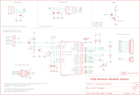

Contents
========

* [PRS12081 > USB Weather Board](#prs12081--usb-weather-board)
	* [Schematic](#schematic)
	* [PCB](#pcb)
	* [OOMP Parts](#oomp-parts)
	* [Images](#images)
	* [Tags](#tags)
  
![][im]
# PRS12081 > USB Weather Board

- ID: PROJ-SPAR-12081-STAN-01
- Hex ID: PRS12081
- Name: Sparkfun
- Description: Sparkfun
- Long Link: [http://oom.lt/PROJ-SPAR-12081-STAN-01](http://oom.lt/PROJ-SPAR-12081-STAN-01)
- Short Link: [http://oom.lt/PRS12081](http://oom.lt/PRS12081)

## Schematic
  

## PCB
  

## OOMP Parts
  

|OOMP Parts|
| :---: |
|CAPC-0402-X-UF1D-01 C1, C2, C3, C4, C5, C8, C9, C10, C11, C12|
|CAPC-0402-X-PF470-01 C6|
|CAPT-3216-X-UF10-01 C7|
|[LEDS-0603-R-STAN-01  SMD (0603) Red LED  D1](https://github.com/oomlout/oomlout_OOMP_parts/tree/main/LEDS-0603-R-STAN-01/)|
|[LEDS-0603-G-STAN-01  SMD (0603) Green LED  D2](https://github.com/oomlout/oomlout_OOMP_parts/tree/main/LEDS-0603-G-STAN-01/)|
|DIOD-S323-X-UNMATCHED-01 D3, D4, D5, D6, D7, D8, D9, D10, D11|
|HEAD-I01-X-UNMATCHED-01 JP1|
|[HEAD-I01-X-PI02-01  2.54 mm 2 Pin Header  JP2, JP8](https://github.com/oomlout/oomlout_OOMP_parts/tree/main/HEAD-I01-X-PI02-01/)|
|UNMATCHED-UNMATCHED-X-UNMATCHED-01 JP3, JP4, JP6-DNP, JP9-DNP, JP10-DNP, S1, S2, S3, U1, U3, U4, U5, U6, Y1|
|[HEAD-I01-X-PI06-01  2.54 mm 6 Pin Header  JP5-DNP](https://github.com/oomlout/oomlout_OOMP_parts/tree/main/HEAD-I01-X-PI06-01/)|
|[HEAD-I01-X-PI09-01  2.54 mm 9 Pin Header  JP7](https://github.com/oomlout/oomlout_OOMP_parts/tree/main/HEAD-I01-X-PI09-01/)|
|RESE-0402-X-O751-01 R1|
|[RESE-0402-X-O181-01  SMD (0402) 180 Ohm Resistor  R2](https://github.com/oomlout/oomlout_OOMP_parts/tree/main/RESE-0402-X-O181-01/)|
|[RESE-0402-X-O103-01  SMD (0402) 10k Ohm Resistor  R3](https://github.com/oomlout/oomlout_OOMP_parts/tree/main/RESE-0402-X-O103-01/)|
|[RESE-0402-X-O472-01  SMD (0402) 4.7k Ohm Resistor  R4, R5, R17](https://github.com/oomlout/oomlout_OOMP_parts/tree/main/RESE-0402-X-O472-01/)|
|RESE-0402-X-O392-01 R6|
|[RESE-0402-X-O102-01  SMD (0402) 1k Ohm Resistor  R7, R8, R11, R12, R13, R14, R15, R16](https://github.com/oomlout/oomlout_OOMP_parts/tree/main/RESE-0402-X-O102-01/)|
|[RESE-0402-X-O222-01  SMD (0402) 2.2k Ohm Resistor  R9, R10](https://github.com/oomlout/oomlout_OOMP_parts/tree/main/RESE-0402-X-O222-01/)|
|UNMATCHED-SO235-X-UNMATCHED-01 U2|

## Images
  
  

|kicadPcb3d|kicadPcb3dFront|kicadPcb3dBack|eagleImage|eagleSchemImage|
| :---: | :---: | :---: | :---: | :---: |
||||||

## Tags

- hexID: PRS12081
- oompType: PROJ
- oompSize: SPAR
- oompColor: 12081
- oompDesc: STAN
- oompIndex: 01
- oompName: USB Weather Board
- sources: All source files from https://github.com/sparkfun/USB_Weather_Board (source licence details in srcLicense.md)
- linkBuyPage: https://www.sparkfun.com/products/12081
- oompID: PROJ-SPAR-12081-STAN-01
- oompParts: C1,CAPC-0402-X-UF1D-01
- oompParts: C2,CAPC-0402-X-UF1D-01
- oompParts: C3,CAPC-0402-X-UF1D-01
- oompParts: C4,CAPC-0402-X-UF1D-01
- oompParts: C5,CAPC-0402-X-UF1D-01
- oompParts: C6,CAPC-0402-X-PF470-01
- oompParts: C7,CAPT-3216-X-UF10-01
- oompParts: C8,CAPC-0402-X-UF1D-01
- oompParts: C9,CAPC-0402-X-UF1D-01
- oompParts: C10,CAPC-0402-X-UF1D-01
- oompParts: C11,CAPC-0402-X-UF1D-01
- oompParts: C12,CAPC-0402-X-UF1D-01
- oompParts: D1,LEDS-0603-R-STAN-01
- oompParts: D2,LEDS-0603-G-STAN-01
- oompParts: D3,DIOD-S323-X-UNMATCHED-01
- oompParts: D4,DIOD-S323-X-UNMATCHED-01
- oompParts: D5,DIOD-S323-X-UNMATCHED-01
- oompParts: D6,DIOD-S323-X-UNMATCHED-01
- oompParts: D7,DIOD-S323-X-UNMATCHED-01
- oompParts: D8,DIOD-S323-X-UNMATCHED-01
- oompParts: D9,DIOD-S323-X-UNMATCHED-01
- oompParts: D10,DIOD-S323-X-UNMATCHED-01
- oompParts: D11,DIOD-S323-X-UNMATCHED-01
- oompParts: JP1,HEAD-I01-X-UNMATCHED-01
- oompParts: JP2,HEAD-I01-X-PI02-01
- oompParts: JP3,UNMATCHED-UNMATCHED-X-UNMATCHED-01
- oompParts: JP4,UNMATCHED-UNMATCHED-X-UNMATCHED-01
- oompParts: JP5-DNP,HEAD-I01-X-PI06-01
- oompParts: JP6-DNP,UNMATCHED-UNMATCHED-X-UNMATCHED-01
- oompParts: JP7,HEAD-I01-X-PI09-01
- oompParts: JP8,HEAD-I01-X-PI02-01
- oompParts: JP9-DNP,UNMATCHED-UNMATCHED-X-UNMATCHED-01
- oompParts: JP10-DNP,UNMATCHED-UNMATCHED-X-UNMATCHED-01
- oompParts: R1,RESE-0402-X-O751-01
- oompParts: R2,RESE-0402-X-O181-01
- oompParts: R3,RESE-0402-X-O103-01
- oompParts: R4,RESE-0402-X-O472-01
- oompParts: R5,RESE-0402-X-O472-01
- oompParts: R6,RESE-0402-X-O392-01
- oompParts: R7,RESE-0402-X-O102-01
- oompParts: R8,RESE-0402-X-O102-01
- oompParts: R9,RESE-0402-X-O222-01
- oompParts: R10,RESE-0402-X-O222-01
- oompParts: R11,RESE-0402-X-O102-01
- oompParts: R12,RESE-0402-X-O102-01
- oompParts: R13,RESE-0402-X-O102-01
- oompParts: R14,RESE-0402-X-O102-01
- oompParts: R15,RESE-0402-X-O102-01
- oompParts: R16,RESE-0402-X-O102-01
- oompParts: R17,RESE-0402-X-O472-01
- oompParts: S1,UNMATCHED-UNMATCHED-X-UNMATCHED-01
- oompParts: S2,UNMATCHED-UNMATCHED-X-UNMATCHED-01
- oompParts: S3,UNMATCHED-UNMATCHED-X-UNMATCHED-01
- oompParts: U1,UNMATCHED-UNMATCHED-X-UNMATCHED-01
- oompParts: U2,UNMATCHED-SO235-X-UNMATCHED-01
- oompParts: U3,UNMATCHED-UNMATCHED-X-UNMATCHED-01
- oompParts: U4,UNMATCHED-UNMATCHED-X-UNMATCHED-01
- oompParts: U5,UNMATCHED-UNMATCHED-X-UNMATCHED-01
- oompParts: U6,UNMATCHED-UNMATCHED-X-UNMATCHED-01
- oompParts: Y1,UNMATCHED-UNMATCHED-X-UNMATCHED-01
- rawParts: C1,0.1uF,CAP0402-CAP,0402-CAP,Capacitor,,
- rawParts: C2,0.1uF,CAP0402-CAP,0402-CAP,Capacitor,,
- rawParts: C3,0.1uF,CAP0402-CAP,0402-CAP,Capacitor,,
- rawParts: C4,0.1uF,CAP0402-CAP,0402-CAP,Capacitor,,
- rawParts: C5,0.1uF,CAP0402-CAP,0402-CAP,Capacitor,,
- rawParts: C6,470pF,CAP0402-CAP,0402-CAP,Capacitor,,
- rawParts: C7,10uF,CAP_POL1206,EIA3216,Capacitor Polarized,,
- rawParts: C8,0.1uF,CAP0402-CAP,0402-CAP,Capacitor,,
- rawParts: C9,0.1uF,CAP0402-CAP,0402-CAP,Capacitor,,
- rawParts: C10,0.1uF,CAP0402-CAP,0402-CAP,Capacitor,,
- rawParts: C11,0.1uF,CAP0402-CAP,0402-CAP,Capacitor,,
- rawParts: C12,0.1uF,CAP0402-CAP,0402-CAP,Capacitor,,
- rawParts: D1,RED,LED0603,LED-0603,LEDs,,
- rawParts: D2,GREEN,LED0603,LED-0603,LEDs,,
- rawParts: D3,3.6V,DIODE-ZENER-BZT52,SOD-323,Zener Diode,,
- rawParts: D4,3.6V,DIODE-ZENER-BZT52,SOD-323,Zener Diode,,
- rawParts: D5,BAS16,DIODESOD,SOD-323,Diode,,
- rawParts: D6,BAS16,DIODESOD,SOD-323,Diode,,
- rawParts: D7,BAS16,DIODESOD,SOD-323,Diode,,
- rawParts: D8,BAS16,DIODESOD,SOD-323,Diode,,
- rawParts: D9,BAS16,DIODESOD,SOD-323,Diode,,
- rawParts: D10,BAS16,DIODESOD,SOD-323,Diode,,
- rawParts: D11,3.6V,DIODE-ZENER-BZT52,SOD-323,Zener Diode,,
- rawParts: JP1,JST,M02-JST-2MM-SMT,JST-2-SMD,Header 2,,
- rawParts: JP2,1X2,M021X02_NO_SILK,1X02_NO_SILK,Header 2,,
- rawParts: JP3,AVR_Prog,AVR_SPI_PRG_6PTH,2X3,AVR ISP 6 Pin,,
- rawParts: JP4,USBSMD,USBSMD,USB-MINIB,USB Connectors,,
- rawParts: JP5-DNP,BLUESMIRF,M06SIP,1X06,Header 6,,
- rawParts: JP6-DNP,XBEE,XBEE-1B1,XBEE-1,,,
- rawParts: JP7,1X8,M09,1X09,Header 9,,
- rawParts: JP8,1X2,M02PTH,1X02,Header 2,,
- rawParts: JP9-DNP,RJ11-RAIN,RJ11-6PTH,RJ11-6,RJ11 Jack,,
- rawParts: JP10-DNP,RJ11-WIND,RJ11-6PTH,RJ11-6,RJ11 Jack,,
- rawParts: LOGO1,OSHW_LOGO_FILLX0100-NT,OSHW_LOGO_FILLX0100-NT,OSHW_FILLX100_NOTEXT,,,
- rawParts: R1,750,RESISTOR0402-RES,0402-RES,Resistor,,
- rawParts: R2,180,RESISTOR0402-RES,0402-RES,Resistor,,
- rawParts: R3,10K,RESISTOR0402-RES,0402-RES,Resistor,,
- rawParts: R4,4.7K,RESISTOR0402-RES,0402-RES,Resistor,,
- rawParts: R5,4.7K,RESISTOR0402-RES,0402-RES,Resistor,,
- rawParts: R6,3.9K,RESISTOR0402-RES,0402-RES,Resistor,,
- rawParts: R7,1K,RESISTOR0402-RES,0402-RES,Resistor,,
- rawParts: R8,1K,RESISTOR0402-RES,0402-RES,Resistor,,
- rawParts: R9,2.2K,RESISTOR0402-RES,0402-RES,Resistor,,
- rawParts: R10,2.2K,RESISTOR0402-RES,0402-RES,Resistor,,
- rawParts: R11,1K,RESISTOR0402-RES,0402-RES,Resistor,,
- rawParts: R12,1K,RESISTOR0402-RES,0402-RES,Resistor,,
- rawParts: R13,1K,RESISTOR0402-RES,0402-RES,Resistor,,
- rawParts: R14,1K,RESISTOR0402-RES,0402-RES,Resistor,,
- rawParts: R15,1K,RESISTOR0402-RES,0402-RES,Resistor,,
- rawParts: R16,1K,RESISTOR0402-RES,0402-RES,Resistor,,
- rawParts: R17,4.7K,RESISTOR0402-RES,0402-RES,Resistor,,
- rawParts: S1,POWER,SWITCH-SPSTSMD,AYZ0202,SPST Switch,,
- rawParts: S2,RESET,TAC_SWITCHSMD,TACTILE_SWITCH_SMD,Momentary Switch,,
- rawParts: S3,COM,SWITCH-DPDTSMD,AYZ0202,DPDT Version of the COM-00597,,
- rawParts: SJ1,LIGHT,SOLDERJUMPERNC,SJ_2S,Solder Jumper,,
- rawParts: SJ2,,SOLDERJUMPERNO,SJ_2S-NO,Solder Jumper,,
- rawParts: U$1,LOGO-SFENEW,LOGO-SFENEW,SFE-NEW-WEBLOGO,Spark Fun Electronics PCB Logo,,
- rawParts: U$2,STAND-OFF,STAND-OFF,STAND-OFF,Stand Off,,
- rawParts: U$3,STAND-OFF,STAND-OFF,STAND-OFF,Stand Off,,
- rawParts: U$4,STAND-OFF,STAND-OFF,STAND-OFF,Stand Off,,
- rawParts: U$5,STAND-OFF,STAND-OFF,STAND-OFF,Stand Off,,
- rawParts: U$6,CREATIVE_COMMONS,CREATIVE_COMMONS,CREATIVE_COMMONS,,,
- rawParts: U1,ATMEGA328,AVR-MEGA8-AI,TQFP32-08,MICROCONTROLLER,,
- rawParts: U2,MIC5219-3.3BM5,V_REG_LDOSMD,SOT23-5,Voltage Regulator LDO,VREG-9872,
- rawParts: U3,FT232RL,FT232RL-BASICSSOP,SSOP28DB,USB UART,,
- rawParts: U4,SHT15,SHT1XSMD,SHT1X,SHT1x Humdity Sensor,,
- rawParts: U5,BMP085,BMP085,BMP085,BMP085 Pressure Sensor Great little MEMS pressure sensor. SKU: COM-09603,,
- rawParts: U6,TEMT6000,TEMT6000,TEMT6000-SEN,Ambient Light Sensor,,
- rawParts: Y1,8MHz,RESONATORSMD,RESONATOR-SMD,Resonator,,

[im]: kicadPcb3d_450.png
