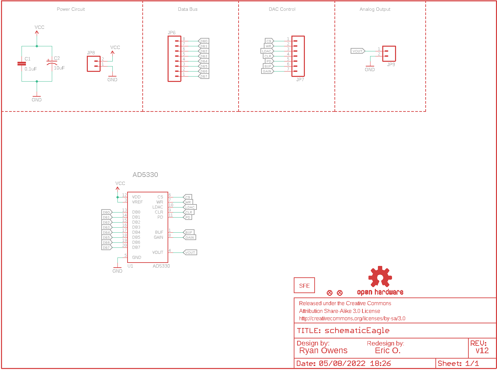
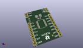
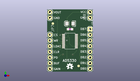
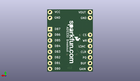
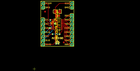
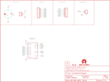

Contents
========

* [PRS12082 > Sparkfun](#prs12082--sparkfun)
	* [Schematic](#schematic)
	* [Interactive BOM](#interactive-bom)
	* [OOMP Parts](#oomp-parts)
	* [Images](#images)
	* [Tags](#tags)
  
![][im]
# PRS12082 > Sparkfun

- ID: PROJ-SPAR-12082-STAN-01
- Hex ID: PRS12082
- Name: Sparkfun
- Description: Sparkfun
- Long Link: [http://oom.lt/PROJ-SPAR-12082-STAN-01](http://oom.lt/PROJ-SPAR-12082-STAN-01)
- Short Link: [http://oom.lt/PRS12082](http://oom.lt/PRS12082)

## Schematic
  

## Interactive BOM

- Interactive BOM page: [ibom.html](https://htmlpreview.github.io/?https://github.com/oomlout/oomlout_OOMP_projects/blob/main/PROJ-SPAR-12082-STAN-01/kicad/bom/ibom.html)

## OOMP Parts
  

|OOMP Parts|
| :---: |
|C1,CAPC-0603-X-NF100-V50,C1,0.1uF,0.1UF-25V(+80/-20%)(0603),0603-CAP,Ceramic,CAP-00810,0.1uF,|
|C2,CAPX-UNMATCHED-X-UF10-01,C2,10uF,10UF-16V-10%(TANT),EIA3216,CAP-00811,CAP-00811,10uF,|
|JP6,HEAD-I01-X-PI08-01,FRAME1,FRAME-LETTER,FRAME-LETTER,CREATIVE_COMMONS,Schematic Frame,,,|
|JP7,HEAD-I01-X-PI07-01,JP1,LOGO-SFENEW,LOGO-SFENEW,SFE-NEW-WEBLOGO,Spark Fun Electronics PCB Logo,,,|
|JP8,HEAD-I01-X-PI02-01,JP2,FIDUCIAL1X2,FIDUCIAL1X2,FIDUCIAL-1X2,Fiducial Alignment Points,,,|
|JP9,HEAD-I01-X-PI02-01,JP3,FIDUCIAL1X2,FIDUCIAL1X2,FIDUCIAL-1X2,Fiducial Alignment Points,,,|
|U1,UNMATCHED-UNMATCHED-X-UNMATCHED-01,JP6,,M08,1X08,Header 8,,,|

## Images
  
  

|kicadPcb3d|kicadPcb3dFront|kicadPcb3dBack|eagleImage|eagleSchemImage|
| :---: | :---: | :---: | :---: | :---: |
||||||

## Tags

- hexID: PRS12082
- oompType: PROJ
- oompSize: SPAR
- oompColor: 12082
- oompDesc: STAN
- oompIndex: 01
- oompName: AD5330 Breakout
- sources: All source files from https://github.com/sparkfun/AD5330_Breakout (source licence details in srcLicense.md)
- linkBuyPage: https://www.sparkfun.com/products/12082
- oompID: PROJ-SPAR-12082-STAN-01
- oompParts: C1,CAPC-0603-X-NF100-V50
- oompParts: C2,CAPX-UNMATCHED-X-UF10-01
- oompParts: JP6,HEAD-I01-X-PI08-01
- oompParts: JP7,HEAD-I01-X-PI07-01
- oompParts: JP8,HEAD-I01-X-PI02-01
- oompParts: JP9,HEAD-I01-X-PI02-01
- oompParts: U1,UNMATCHED-UNMATCHED-X-UNMATCHED-01
- rawParts: C1,0.1uF,0.1UF-25V(+80/-20%)(0603),0603-CAP,Ceramic,CAP-00810,0.1uF,
- rawParts: C2,10uF,10UF-16V-10%(TANT),EIA3216,CAP-00811,CAP-00811,10uF,
- rawParts: FRAME1,FRAME-LETTER,FRAME-LETTER,CREATIVE_COMMONS,Schematic Frame,,,
- rawParts: JP1,LOGO-SFENEW,LOGO-SFENEW,SFE-NEW-WEBLOGO,Spark Fun Electronics PCB Logo,,,
- rawParts: JP2,FIDUCIAL1X2,FIDUCIAL1X2,FIDUCIAL-1X2,Fiducial Alignment Points,,,
- rawParts: JP3,FIDUCIAL1X2,FIDUCIAL1X2,FIDUCIAL-1X2,Fiducial Alignment Points,,,
- rawParts: JP6,,M08,1X08,Header 8,,,
- rawParts: JP7,,M07,1X07,Header 7,,,
- rawParts: JP8,,M02PTH,1X02,Header 2,,,
- rawParts: JP9,,M02PTH,1X02,Header 2,,,
- rawParts: LOGO1,OSHW-LOGOS,OSHW-LOGOS,OSHW-LOGO-S,Open Source Hardware Logo This logo indicates the piece of hardware it is found on incorporates a OSHW license and/or adheres to the definition of open source hardware found here: http://freedomdefined.org/OSHW,,,
- rawParts: U1,AD5330,AD5330,TSSOP20,,,,

[im]: kicadPcb3d_450.png
