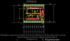
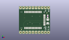
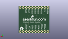
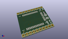

Contents
========

* [PROJ-SPAR-12579-STAN-01>Bluetooth Module Breakout](#proj-spar-12579-stan-01bluetooth-module-breakout)
	* [Images](#images)
	* [Interactive BOM](#interactive-bom)
	* [OOMP Parts](#oomp-parts)
	* [Tags](#tags)
  
![][im]
# PROJ-SPAR-12579-STAN-01>Bluetooth Module Breakout

- ID: PROJ-SPAR-12579-STAN-01
- Hex ID: PRS12579
- Name: Bluetooth Module Breakout
- Description: 

## Images
  
  

|eagleImage|kicadPcb3dFront|kicadPcb3dBack|kicadPcb3d|
| :---: | :---: | :---: | :---: |
|||||

## Interactive BOM

- Interactive BOM page: [ibom.html](kicad/bom/ibom.html)

## OOMP Parts
  

|OOMP Parts|
| :---: |
|CAPE-0603-X-NF100-01, C1, 23.495, 14.477999999999998, 90,C1, 0.1uF, 0603-CAP, SparkFun, (0.925, 0.57), R90|
|CAPE-UNMATCHED-X-UNMATCHED-01, C2, 23.495, 10.287, 90,C2, 10uF, EIA3216, SparkFun, (0.925, 0.405), R90|
|UNMATCHED-UNMATCHED-X-UNMATCHED-01, JP1, 24.13, 1.27, 180,JP1, 1X10, SparkFun, (0.95, 0.05), R180|
|UNMATCHED-UNMATCHED-X-UNMATCHED-01, JP2, 1.27, 21.59, 0,JP2, 1X10, SparkFun, (0.05, 0.85), R0|
|UNMATCHED-UNMATCHED-X-UNMATCHED-01, U1, 11.43, 11.43, 0,U1, BLUETOOTH-RN41, RN41, SparkFun-RF, (0.45, 0.45), R0|

## Tags

- hexID: PRS12579
- oompType: PROJ
- oompSize: SPAR
- oompColor: 12579
- oompDesc: STAN
- oompIndex: 01
- oompName: Bluetooth Module Breakout
- sources: All source files from https://github.com/sparkfun/Bluetooth_Module_Breakout (source licence details in srcLicense.md)
- linkBuyPage: https://www.sparkfun.com/products/12579
- oompPart: CAPE-0603-X-NF100-01, C1, 23.495, 14.477999999999998, 90
- oompPart: CAPE-UNMATCHED-X-UNMATCHED-01, C2, 23.495, 10.287, 90
- oompPart: SKIP-UNMATCHED-X-UNMATCHED-01, FID1, 22.86, 17.272000000000002, 0
- oompPart: SKIP-UNMATCHED-X-UNMATCHED-01, FID2, 2.032, 3.556, 0
- oompPart: UNMATCHED-UNMATCHED-X-UNMATCHED-01, JP1, 24.13, 1.27, 180
- oompPart: UNMATCHED-UNMATCHED-X-UNMATCHED-01, JP2, 1.27, 21.59, 0
- oompPart: UNMATCHED-UNMATCHED-X-UNMATCHED-01, U1, 11.43, 11.43, 0
- rawPart: C1, 0.1uF, 0603-CAP, SparkFun, (0.925, 0.57), R90
- rawPart: C2, 10uF, EIA3216, SparkFun, (0.925, 0.405), R90
- rawPart: FID1, FIDUCIALUFIDUCIAL, MICRO-FIDUCIAL, SparkFun-Aesthetics, (0.9, 0.68), R0
- rawPart: FID2, FIDUCIALUFIDUCIAL, MICRO-FIDUCIAL, SparkFun-Aesthetics, (0.08, 0.14), R0
- rawPart: JP1, 1X10, SparkFun, (0.95, 0.05), R180
- rawPart: JP2, 1X10, SparkFun, (0.05, 0.85), R0
- rawPart: U1, BLUETOOTH-RN41, RN41, SparkFun-RF, (0.45, 0.45), R0

[im]: kicadPcb3d_450.png
