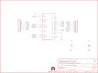

Contents
========

* [PRS12579 > Bluetooth Module Breakout](#prs12579--bluetooth-module-breakout)
	* [Schematic](#schematic)
	* [PCB](#pcb)
	* [Interactive BOM](#interactive-bom)
	* [OOMP Parts](#oomp-parts)
	* [Images](#images)
	* [Tags](#tags)
  
![][im]
# PRS12579 > Bluetooth Module Breakout

- ID: PROJ-SPAR-12579-STAN-01
- Hex ID: PRS12579
- Name: Sparkfun
- Description: Sparkfun
- Long Link: [http://oom.lt/PROJ-SPAR-12579-STAN-01](http://oom.lt/PROJ-SPAR-12579-STAN-01)
- Short Link: [http://oom.lt/PRS12579](http://oom.lt/PRS12579)

## Schematic
  

## PCB
  

## Interactive BOM

- Interactive BOM page: [ibom.html](https://htmlpreview.github.io/?https://github.com/oomlout/oomlout_OOMP_projects/blob/main/PROJ-SPAR-12579-STAN-01/kicad/bom/ibom.html)

## OOMP Parts
  

|OOMP Parts|
| :---: |
|C1 C1,CAPC-0603-X-UF1D-01|
|C2 C2,CAPX-UNMATCHED-X-UF10-01|
|[JP1 HEAD-I01-X-PI10-01 2.54 mm 10 Pin Header](https://github.com/oomlout/oomlout_OOMP_parts/tree/main/HEAD-I01-X-PI10-01/)|
|[JP2 HEAD-I01-X-PI10-01 2.54 mm 10 Pin Header](https://github.com/oomlout/oomlout_OOMP_parts/tree/main/HEAD-I01-X-PI10-01/)|
|U1 U1,UNMATCHED-UNMATCHED-X-UNMATCHED-01|

## Images
  
  

|kicadPcb3d|kicadPcb3dFront|kicadPcb3dBack|eagleImage|eagleSchemImage|
| :---: | :---: | :---: | :---: | :---: |
||||||

## Tags

- hexID: PRS12579
- oompType: PROJ
- oompSize: SPAR
- oompColor: 12579
- oompDesc: STAN
- oompIndex: 01
- oompName: Bluetooth Module Breakout
- sources: All source files from https://github.com/sparkfun/Bluetooth_Module_Breakout (source licence details in srcLicense.md)
- linkBuyPage: https://www.sparkfun.com/products/12579
- oompID: PROJ-SPAR-12579-STAN-01
- oompParts: C1,CAPC-0603-X-UF1D-01
- oompParts: C2,CAPX-UNMATCHED-X-UF10-01
- oompParts: JP1,HEAD-I01-X-PI10-01
- oompParts: JP2,HEAD-I01-X-PI10-01
- oompParts: U1,UNMATCHED-UNMATCHED-X-UNMATCHED-01
- rawParts: C1,0.1uF,CAP0603-CAP,0603-CAP,Capacitor,,
- rawParts: C2,10uF,CAP_POL1206,EIA3216,Capacitor Polarized,,
- rawParts: FID1,FIDUCIALUFIDUCIAL,FIDUCIALUFIDUCIAL,MICRO-FIDUCIAL,Fiducial Alignment Points,,
- rawParts: FID2,FIDUCIALUFIDUCIAL,FIDUCIALUFIDUCIAL,MICRO-FIDUCIAL,Fiducial Alignment Points,,
- rawParts: FRAME1,FRAME-LETTER,FRAME-LETTER,CREATIVE_COMMONS,Schematic Frame,,
- rawParts: JP1,,M10,1X10,Header 10,,
- rawParts: JP2,,M10,1X10,Header 10,,
- rawParts: LOGO1,OSHW-LOGOS,OSHW-LOGOS,OSHW-LOGO-S,Open Source Hardware Logo This logo indicates the piece of hardware it is found on incorporates a OSHW license and/or adheres to the definition of open source hardware found here: http://freedomdefined.org/OSHW,,
- rawParts: U$1,LOGO-SFENEW,LOGO-SFENEW,SFE-NEW-WEBLOGO,Spark Fun Electronics PCB Logo,,
- rawParts: U1,BLUETOOTH-RN41,BLUETOOTH-RN41,RN41,Bluetooth SMD module,,

[im]: kicadPcb3d_450.png
