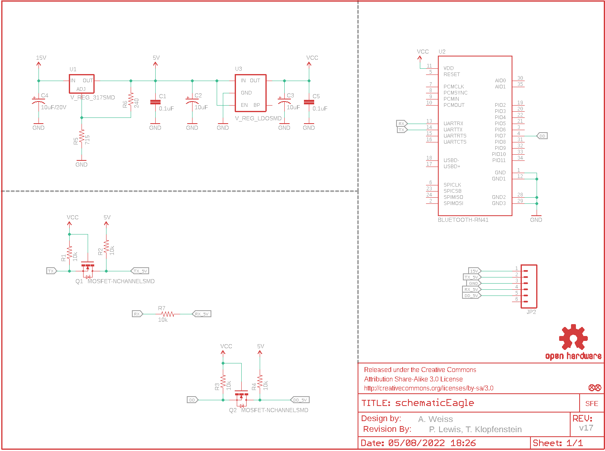
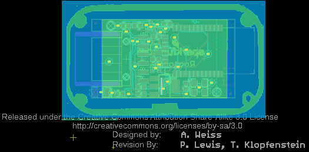
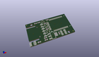
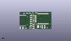
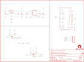

Contents
========

* [PRS12581 > RooTooth](#prs12581--rootooth)
	* [Schematic](#schematic)
	* [PCB](#pcb)
	* [Interactive BOM](#interactive-bom)
	* [OOMP Parts](#oomp-parts)
	* [Images](#images)
	* [Tags](#tags)
  
![][im]
# PRS12581 > RooTooth

- ID: PROJ-SPAR-12581-STAN-01
- Hex ID: PRS12581
- Name: Sparkfun
- Description: Sparkfun
- Long Link: [http://oom.lt/PROJ-SPAR-12581-STAN-01](http://oom.lt/PROJ-SPAR-12581-STAN-01)
- Short Link: [http://oom.lt/PRS12581](http://oom.lt/PRS12581)

## Schematic
  

## PCB
  

## Interactive BOM

- Interactive BOM page: [ibom.html](https://htmlpreview.github.io/?https://github.com/oomlout/oomlout_OOMP_projects/blob/main/PROJ-SPAR-12581-STAN-01/kicad/bom/ibom.html)

## OOMP Parts
  

|OOMP Parts|
| :---: |
|CAPC-0603-X-UF1D-01 C1, C5|
|CAPT-3216-X-UF10-01 C2, C3|
|CAPX-3528-X-UNMATCHED-01 C4|
|[HEAD-I01-X-PI06-01  2.54 mm 6 Pin Header  JP2](https://github.com/oomlout/oomlout_OOMP_parts/tree/main/HEAD-I01-X-PI06-01/)|
|UNMATCHED-SO23-X-UNMATCHED-01 Q1, Q2|
|[RESE-0603-X-O103-01  SMD (0603) 10k Ohm Resistor  R1, R2, R3, R4, R7](https://github.com/oomlout/oomlout_OOMP_parts/tree/main/RESE-0603-X-O103-01/)|
|RESE-0603-X-O711-01 R5|
|[RESE-0603-X-O241-01  SMD (0603) 240 Ohm Resistor  R6](https://github.com/oomlout/oomlout_OOMP_parts/tree/main/RESE-0603-X-O241-01/)|
|UNMATCHED-UNMATCHED-X-UNMATCHED-01 U1, U2|
|UNMATCHED-SO235-X-UNMATCHED-01 U3|

## Images
  
  

|kicadPcb3d|kicadPcb3dFront|kicadPcb3dBack|eagleImage|eagleSchemImage|
| :---: | :---: | :---: | :---: | :---: |
||||||

## Tags

- hexID: PRS12581
- oompType: PROJ
- oompSize: SPAR
- oompColor: 12581
- oompDesc: STAN
- oompIndex: 01
- oompName: RooTooth
- sources: All source files from https://github.com/sparkfun/RooTooth (source licence details in srcLicense.md)
- linkBuyPage: https://www.sparkfun.com/products/12581
- oompID: PROJ-SPAR-12581-STAN-01
- oompParts: C1,CAPC-0603-X-UF1D-01
- oompParts: C2,CAPT-3216-X-UF10-01
- oompParts: C3,CAPT-3216-X-UF10-01
- oompParts: C4,CAPX-3528-X-UNMATCHED-01
- oompParts: C5,CAPC-0603-X-UF1D-01
- oompParts: JP2,HEAD-I01-X-PI06-01
- oompParts: Q1,UNMATCHED-SO23-X-UNMATCHED-01
- oompParts: Q2,UNMATCHED-SO23-X-UNMATCHED-01
- oompParts: R1,RESE-0603-X-O103-01
- oompParts: R2,RESE-0603-X-O103-01
- oompParts: R3,RESE-0603-X-O103-01
- oompParts: R4,RESE-0603-X-O103-01
- oompParts: R5,RESE-0603-X-O711-01
- oompParts: R6,RESE-0603-X-O241-01
- oompParts: R7,RESE-0603-X-O103-01
- oompParts: U1,UNMATCHED-UNMATCHED-X-UNMATCHED-01
- oompParts: U2,UNMATCHED-UNMATCHED-X-UNMATCHED-01
- oompParts: U3,UNMATCHED-SO235-X-UNMATCHED-01
- rawParts: C1,0.1uF,CAP0603-CAP,0603-CAP,Capacitor,,
- rawParts: C2,10uF,CAP_POL1206,EIA3216,Capacitor Polarized,,
- rawParts: C3,10uF,CAP_POL1206,EIA3216,Capacitor Polarized,,
- rawParts: C4,10uF/20V,CAP_POL3528,EIA3528,Capacitor Polarized,,
- rawParts: C5,0.1uF,CAP0603-CAP,0603-CAP,Capacitor,,
- rawParts: FRAME1,FRAME-LETTER,FRAME-LETTER,CREATIVE_COMMONS,Schematic Frame,,
- rawParts: JP1,FIDUCIALUFIDUCIAL,FIDUCIALUFIDUCIAL,MICRO-FIDUCIAL,Fiducial Alignment Points,,
- rawParts: JP2,,M06SMD,1X06-SMD,Header 6,,
- rawParts: JP3,FIDUCIALUFIDUCIAL,FIDUCIALUFIDUCIAL,MICRO-FIDUCIAL,Fiducial Alignment Points,,
- rawParts: LOGO1,OSHW-LOGOS,OSHW-LOGOS,OSHW-LOGO-S,Open Source Hardware Logo This logo indicates the piece of hardware it is found on incorporates a OSHW license and/or adheres to the definition of open source hardware found here: http://freedomdefined.org/OSHW,,
- rawParts: Q1,MOSFET-NCHANNELSMD,MOSFET-NCHANNELSMD,SOT23-3,,,
- rawParts: Q2,MOSFET-NCHANNELSMD,MOSFET-NCHANNELSMD,SOT23-3,,,
- rawParts: R1,10k,RESISTOR0603-RES,0603-RES,Resistor,,
- rawParts: R2,10k,RESISTOR0603-RES,0603-RES,Resistor,,
- rawParts: R3,10k,RESISTOR0603-RES,0603-RES,Resistor,,
- rawParts: R4,10k,RESISTOR0603-RES,0603-RES,Resistor,,
- rawParts: R5,715,RESISTOR0603-RES,0603-RES,Resistor,,
- rawParts: R6,240,RESISTOR0603-RES,0603-RES,Resistor,,
- rawParts: R7,10k,RESISTOR0603-RES,0603-RES,Resistor,,
- rawParts: U$1,LOGO-SFENEW,LOGO-SFENEW,SFE-NEW-WEBLOGO,Spark Fun Electronics PCB Logo,,
- rawParts: U$2,REVISION,REVISION,REVISION,,,
- rawParts: U1,V_REG_317SMD,V_REG_317SMD,SOT223,Voltage Regulator,,
- rawParts: U2,BLUETOOTH-RN41,BLUETOOTH-RN41,RN41,Bluetooth SMD module,,
- rawParts: U3,V_REG_LDOSMD,V_REG_LDOSMD,SOT23-5,Voltage Regulator LDO,,

[im]: kicadPcb3d_450.png
