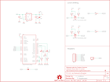

Contents
========

* [PRS12582 > Sparkfun](#prs12582--sparkfun)
	* [Schematic](#schematic)
	* [Interactive BOM](#interactive-bom)
	* [OOMP Parts](#oomp-parts)
	* [Images](#images)
	* [Tags](#tags)
  
![][im]
# PRS12582 > Sparkfun

- ID: PROJ-SPAR-12582-STAN-01
- Hex ID: PRS12582
- Name: Sparkfun
- Description: Sparkfun
- Long Link: [http://oom.lt/PROJ-SPAR-12582-STAN-01](http://oom.lt/PROJ-SPAR-12582-STAN-01)
- Short Link: [http://oom.lt/PRS12582](http://oom.lt/PRS12582)

## Schematic
  

## Interactive BOM

- Interactive BOM page: [ibom.html](https://htmlpreview.github.io/?https://github.com/oomlout/oomlout_OOMP_projects/blob/main/PROJ-SPAR-12582-STAN-01/kicad/bom/ibom.html)

## OOMP Parts
  

|OOMP Parts|
| :---: |
|C1,CAPX-UNMATCHED-X-UF10-01,C1,10uF,CAP_POL1206,EIA3216,Capacitor Polarized,,|
|C3,CAPX-UNMATCHED-X-UF10-01,C3,10uF,CAP_POL1206,EIA3216,Capacitor Polarized,,|
|C4,CAPC-0603-X-UF1-01,C4,1uF,CAP0603-CAP,0603-CAP,Capacitor,,|
|D1,LEDS-0603-G-STAN-01,D1,Red,LED0603,LED-0603,LEDs,,|
|D2,LEDS-0603-G-STAN-01,D2,Green,LED0603,LED-0603,LEDs,,|
|JP1,HEAD-I01-X-PI06-01,FRAME1,FRAME-LETTER,FRAME-LETTER,CREATIVE_COMMONS,Schematic Frame,,|
|JP2,HEAD-I01-X-PI01-01,JP1,,M06SIP,1X06,Header 6,,|
|Q1,UNMATCHED-SO23-X-UNMATCHED-01,JP2,M01SMDNS,M01SMDNS,1X01NS,Header 1,,|
|Q2,UNMATCHED-SO23-X-UNMATCHED-01,JP4,FIDUCIAL1X2,FIDUCIAL1X2,FIDUCIAL-1X2,Fiducial Alignment Points,,|
|R1,RESE-0603-X-O331-01,LOGO1,OSHW-LOGOS,OSHW-LOGOS,OSHW-LOGO-S,Open Source Hardware Logo This logo indicates the piece of hardware it is found on incorporates a OSHW license and/or adheres to the definition of open source hardware found here: http://freedomdefined.org/OSHW,,|
|R2,RESE-0603-X-O103-01,Q1,MOSFET-NCHANNELSMD,MOSFET-NCHANNELSMD,SOT23-3,,,|
|R3,RESE-0603-X-O103-01,Q2,MOSFET-NCHANNELSMD,MOSFET-NCHANNELSMD,SOT23-3,,,|
|R4,RESE-0603-X-O103-01,R1,330,RESISTOR0603-RES,0603-RES,Resistor,,|
|R5,RESE-0603-X-O103-01,R2,10K,RESISTOR0603-RES,0603-RES,Resistor,,|
|R6,RESE-0603-X-O331-01,R3,10K,RESISTOR0603-RES,0603-RES,Resistor,,|
|R7,RESE-0603-X-O103-01,R4,10K,RESISTOR0603-RES,0603-RES,Resistor,,|
|R8,RESE-0603-X-O103-01,R5,10K,RESISTOR0603-RES,0603-RES,Resistor,,|
|R9,RESE-0603-X-O103-01,R6,330,RESISTOR0603-RES,0603-RES,Resistor,,|
|TP1,UNMATCHED-UNMATCHED-X-UNMATCHED-01,R7,10K,RESISTOR0603-RES,0603-RES,Resistor,,|
|U$2,UNMATCHED-UNMATCHED-X-UNMATCHED-01,R8,10K,RESISTOR0603-RES,0603-RES,Resistor,,|
|U1,UNMATCHED-UNMATCHED-X-UNMATCHED-01,R9,10K,RESISTOR0603-RES,0603-RES,Resistor,,|
|U3,UNMATCHED-SO235-X-UNMATCHED-01,SJ1,SOLDERJUMPERNO,SOLDERJUMPERNO,SJ_2S-NO,Solder Jumper,,|

## Images
  
  

|kicadPcb3d|kicadPcb3dFront|kicadPcb3dBack|eagleImage|eagleSchemImage|
| :---: | :---: | :---: | :---: | :---: |
||||||

## Tags

- hexID: PRS12582
- oompType: PROJ
- oompSize: SPAR
- oompColor: 12582
- oompDesc: STAN
- oompIndex: 01
- oompName: BlueSMiRF
- sources: All source files from https://github.com/sparkfun/BlueSMiRF (source licence details in srcLicense.md)
- linkBuyPage: https://www.sparkfun.com/products/12582
- oompID: PROJ-SPAR-12582-STAN-01
- oompParts: C1,CAPX-UNMATCHED-X-UF10-01
- oompParts: C3,CAPX-UNMATCHED-X-UF10-01
- oompParts: C4,CAPC-0603-X-UF1-01
- oompParts: D1,LEDS-0603-G-STAN-01
- oompParts: D2,LEDS-0603-G-STAN-01
- oompParts: JP1,HEAD-I01-X-PI06-01
- oompParts: JP2,HEAD-I01-X-PI01-01
- oompParts: Q1,UNMATCHED-SO23-X-UNMATCHED-01
- oompParts: Q2,UNMATCHED-SO23-X-UNMATCHED-01
- oompParts: R1,RESE-0603-X-O331-01
- oompParts: R2,RESE-0603-X-O103-01
- oompParts: R3,RESE-0603-X-O103-01
- oompParts: R4,RESE-0603-X-O103-01
- oompParts: R5,RESE-0603-X-O103-01
- oompParts: R6,RESE-0603-X-O331-01
- oompParts: R7,RESE-0603-X-O103-01
- oompParts: R8,RESE-0603-X-O103-01
- oompParts: R9,RESE-0603-X-O103-01
- oompParts: TP1,UNMATCHED-UNMATCHED-X-UNMATCHED-01
- oompParts: U$2,UNMATCHED-UNMATCHED-X-UNMATCHED-01
- oompParts: U1,UNMATCHED-UNMATCHED-X-UNMATCHED-01
- oompParts: U3,UNMATCHED-SO235-X-UNMATCHED-01
- rawParts: C1,10uF,CAP_POL1206,EIA3216,Capacitor Polarized,,
- rawParts: C3,10uF,CAP_POL1206,EIA3216,Capacitor Polarized,,
- rawParts: C4,1uF,CAP0603-CAP,0603-CAP,Capacitor,,
- rawParts: D1,Red,LED0603,LED-0603,LEDs,,
- rawParts: D2,Green,LED0603,LED-0603,LEDs,,
- rawParts: FRAME1,FRAME-LETTER,FRAME-LETTER,CREATIVE_COMMONS,Schematic Frame,,
- rawParts: JP1,,M06SIP,1X06,Header 6,,
- rawParts: JP2,M01SMDNS,M01SMDNS,1X01NS,Header 1,,
- rawParts: JP4,FIDUCIAL1X2,FIDUCIAL1X2,FIDUCIAL-1X2,Fiducial Alignment Points,,
- rawParts: LOGO1,OSHW-LOGOS,OSHW-LOGOS,OSHW-LOGO-S,Open Source Hardware Logo This logo indicates the piece of hardware it is found on incorporates a OSHW license and/or adheres to the definition of open source hardware found here: http://freedomdefined.org/OSHW,,
- rawParts: Q1,MOSFET-NCHANNELSMD,MOSFET-NCHANNELSMD,SOT23-3,,,
- rawParts: Q2,MOSFET-NCHANNELSMD,MOSFET-NCHANNELSMD,SOT23-3,,,
- rawParts: R1,330,RESISTOR0603-RES,0603-RES,Resistor,,
- rawParts: R2,10K,RESISTOR0603-RES,0603-RES,Resistor,,
- rawParts: R3,10K,RESISTOR0603-RES,0603-RES,Resistor,,
- rawParts: R4,10K,RESISTOR0603-RES,0603-RES,Resistor,,
- rawParts: R5,10K,RESISTOR0603-RES,0603-RES,Resistor,,
- rawParts: R6,330,RESISTOR0603-RES,0603-RES,Resistor,,
- rawParts: R7,10K,RESISTOR0603-RES,0603-RES,Resistor,,
- rawParts: R8,10K,RESISTOR0603-RES,0603-RES,Resistor,,
- rawParts: R9,10K,RESISTOR0603-RES,0603-RES,Resistor,,
- rawParts: SJ1,SOLDERJUMPERNO,SOLDERJUMPERNO,SJ_2S-NO,Solder Jumper,,
- rawParts: TP1,,TEST-POINT3X5,PAD.03X.05,,,
- rawParts: U$1,LOGO-SFENEW,LOGO-SFENEW,SFE-NEW-WEBLOGO,Spark Fun Electronics PCB Logo,,
- rawParts: U$2,REVISION,REVISION,REVISION,,,
- rawParts: U1,BLUETOOTH-RN41,BLUETOOTH-RN41,RN41,Bluetooth SMD module,,
- rawParts: U3,3.3V,V_REG_LDOSMD,SOT23-5,Voltage Regulator LDO,,

[im]: kicadPcb3d_450.png
