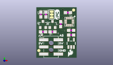
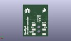
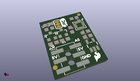

Contents
========

* [PROJ-SPAR-12589-STAN-01>RedBot Accelerometer](#proj-spar-12589-stan-01redbot-accelerometer)
	* [Images](#images)
	* [Interactive BOM](#interactive-bom)
	* [Tags](#tags)
  
![][im]
# PROJ-SPAR-12589-STAN-01>RedBot Accelerometer

- ID: PROJ-SPAR-12589-STAN-01
- Hex ID: PRS12589
- Name: RedBot Accelerometer
- Description: 

## Images
  
  

|eagleImage|kicadPcb3dFront|kicadPcb3dBack|kicadPcb3d|
| :---: | :---: | :---: | :---: |
|||||

## Interactive BOM

- Interactive BOM page: [ibom.html](kicad/bom/ibom.html)

## Tags

- hexID: PRS12589
- oompType: PROJ
- oompSize: SPAR
- oompColor: 12589
- oompDesc: STAN
- oompIndex: 01
- oompName: RedBot Accelerometer
- sources: All source files from https://github.com/sparkfun/RedBot_Accelerometer (source licence details in srcLicense.md)
- linkBuyPage: https://www.sparkfun.com/products/12589
- oompID: PROJ-SPAR-12589-STAN-01
- oompParts: C1,UNMATCHED-UNMATCHED-UNMATCHED-UNMATCHED-UNMATCHED
- oompParts: C2,UNMATCHED-UNMATCHED-UNMATCHED-UNMATCHED-UNMATCHED
- oompParts: C3,UNMATCHED-UNMATCHED-UNMATCHED-UNMATCHED-UNMATCHED
- oompParts: FRAME1,UNMATCHED-UNMATCHED-UNMATCHED-UNMATCHED-UNMATCHED
- oompParts: I2C,UNMATCHED-UNMATCHED-UNMATCHED-UNMATCHED-UNMATCHED
- oompParts: JP1,UNMATCHED-UNMATCHED-UNMATCHED-UNMATCHED-UNMATCHED
- oompParts: JP2,UNMATCHED-UNMATCHED-UNMATCHED-UNMATCHED-UNMATCHED
- oompParts: LOGO2,UNMATCHED-UNMATCHED-UNMATCHED-UNMATCHED-UNMATCHED
- oompParts: LOGO4,UNMATCHED-UNMATCHED-UNMATCHED-UNMATCHED-UNMATCHED
- oompParts: Q1,UNMATCHED-UNMATCHED-UNMATCHED-UNMATCHED-UNMATCHED
- oompParts: Q2,UNMATCHED-UNMATCHED-UNMATCHED-UNMATCHED-UNMATCHED
- oompParts: R1,UNMATCHED-UNMATCHED-UNMATCHED-UNMATCHED-UNMATCHED
- oompParts: R7,UNMATCHED-UNMATCHED-UNMATCHED-UNMATCHED-UNMATCHED
- oompParts: R8,UNMATCHED-UNMATCHED-UNMATCHED-UNMATCHED-UNMATCHED
- oompParts: R9,UNMATCHED-UNMATCHED-UNMATCHED-UNMATCHED-UNMATCHED
- oompParts: R10,UNMATCHED-UNMATCHED-UNMATCHED-UNMATCHED-UNMATCHED
- oompParts: U1,UNMATCHED-UNMATCHED-UNMATCHED-UNMATCHED-UNMATCHED
- oompParts: U2,UNMATCHED-UNMATCHED-UNMATCHED-UNMATCHED-UNMATCHED
- rawParts: C1,0.1uF,0.1UF-0603-25V-(+80/-20%),0603,0.1µF ceramic capacitors,,CAP-00810,,0.1uF,
- rawParts: C2,4.7uF,4.7UF-0603-6.3V-(10%),0603,4.7µF ceramic capacitors,,CAP-08280,,4.7uF,
- rawParts: C3,0.1uF,0.1UF-0603-25V-(+80/-20%),0603,0.1µF ceramic capacitors,,CAP-00810,,0.1uF,
- rawParts: FID1,FIDUCIAL1X2,FIDUCIAL1X2,FIDUCIAL-1X2,Fiducial Alignment Points,,,,,
- rawParts: FID3,FIDUCIAL1X2,FIDUCIAL1X2,FIDUCIAL-1X2,Fiducial Alignment Points,,,,,
- rawParts: FRAME1,FRAME-LETTER,FRAME-LETTER,CREATIVE_COMMONS,Schematic Frame - Letter,,,,,
- rawParts: I2C,JUMPER-SMT_3_2-NC_TRACE_SILK,JUMPER-SMT_3_2-NC_TRACE_SILK,SMT-JUMPER_3_2-NC_TRACE_SILK,Normally closed trace jumper (2 of 2 connections),,,,,
- rawParts: JP1,,M03X2SMT,2X3_SMT_POSTS,2x3 .1 header.,,CONN-11415,,,
- rawParts: JP2,,M03X2FEMALE_SMD,2X3_SMD,2x3 .1 header.,,CONN-11290,,,
- rawParts: LOGO2,OSHW-LOGOS,OSHW-LOGOS,OSHW-LOGO-S,Open-Source Hardware (OSHW) Logo,,,,,
- rawParts: LOGO4,SFE_LOGO_FLAME.1_INCH,SFE_LOGO_FLAME.1_INCH,SFE_LOGO_FLAME_.1,SparkFun Flame Logo,,,,,
- rawParts: Q1,220mA/50V/3.5Ω,MOSFET-NCH-BSS138,SOT23-3,N-channel MOSFETs,,TRANS-00830,,220mA/50V/3.5Ω,
- rawParts: Q2,220mA/50V/3.5Ω,MOSFET-NCH-BSS138,SOT23-3,N-channel MOSFETs,,TRANS-00830,,220mA/50V/3.5Ω,
- rawParts: R1,10k,10KOHM-0603-1/10W-1%,0603,10kΩ resistor,,RES-00824,,10k,
- rawParts: R7,10k,10KOHM-0603-1/10W-1%,0603,10kΩ resistor,,RES-00824,,10k,
- rawParts: R8,10k,10KOHM-0603-1/10W-1%,0603,10kΩ resistor,,RES-00824,,10k,
- rawParts: R9,10k,10KOHM-0603-1/10W-1%,0603,10kΩ resistor,,RES-00824,,10k,
- rawParts: R10,10k,10KOHM-0603-1/10W-1%,0603,10kΩ resistor,,RES-00824,,10k,
- rawParts: U1,MMA8452Q,MMA8452Q,QFN-16,NXP MMA8452Q 3-Axis Digital Accelerometer,,IC-10769,,,
- rawParts: U2,MIC5205-3.3V,MIC52053.3V,SOT23-5,MIC5205 150mA vreg,,VREG-00822,,,

[im]: kicadPcb3d_450.png
