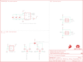

Contents
========

* [PRS12589 > RedBot Accelerometer](#prs12589--redbot-accelerometer)
	* [Schematic](#schematic)
	* [PCB](#pcb)
	* [Interactive BOM](#interactive-bom)
	* [OOMP Parts](#oomp-parts)
	* [Images](#images)
	* [Tags](#tags)
  
![][im]
# PRS12589 > RedBot Accelerometer

- ID: PROJ-SPAR-12589-STAN-01
- Hex ID: PRS12589
- Name: Sparkfun
- Description: Sparkfun
- Long Link: [http://oom.lt/PROJ-SPAR-12589-STAN-01](http://oom.lt/PROJ-SPAR-12589-STAN-01)
- Short Link: [http://oom.lt/PRS12589](http://oom.lt/PRS12589)

## Schematic
  

## PCB
  

## Interactive BOM

- Interactive BOM page: [ibom.html](https://htmlpreview.github.io/?https://github.com/oomlout/oomlout_OOMP_projects/blob/main/PROJ-SPAR-12589-STAN-01/kicad/bom/ibom.html)

## OOMP Parts
  

|OOMP ID|Name|Identifier|
| :---: | :---: | :---: |
|[CAPC-0603-X-NF100-V50](https://github.com/oomlout/oomlout_OOMP_parts/tree/main/CAPC-0603-X-NF100-V50/)|[SMD (0603) 100 nF Capacitor (Ceramic) 50v](https://github.com/oomlout/oomlout_OOMP_parts/tree/main/CAPC-0603-X-NF100-V50/)|[C1, C3](https://github.com/oomlout/oomlout_OOMP_parts/tree/main/CAPC-0603-X-NF100-V50/)|
|[CAPC-0603-X-UF47D-V10](https://github.com/oomlout/oomlout_OOMP_parts/tree/main/CAPC-0603-X-UF47D-V10/)|[SMD (0603) 4.7 uF Capacitor (Ceramic) 10v](https://github.com/oomlout/oomlout_OOMP_parts/tree/main/CAPC-0603-X-UF47D-V10/)|[C2](https://github.com/oomlout/oomlout_OOMP_parts/tree/main/CAPC-0603-X-UF47D-V10/)|
|HEAD-I01-X-UNMATCHED-01||JP1, JP2|
|MOSN-SO23-X-UNMATCHED-01||Q1, Q2|
|[RESE-0603-X-O103-01](https://github.com/oomlout/oomlout_OOMP_parts/tree/main/RESE-0603-X-O103-01/)|[SMD (0603) 10k Ohm Resistor](https://github.com/oomlout/oomlout_OOMP_parts/tree/main/RESE-0603-X-O103-01/)|[R1, R7, R8, R9, R10](https://github.com/oomlout/oomlout_OOMP_parts/tree/main/RESE-0603-X-O103-01/)|
|UNMATCHED-UNMATCHED-X-UNMATCHED-01||U1|
|VREG-SO235-X-KMIC5205-01||U2|

## Images
  
  

|bominteractivefront|bominteractiveback|kicadPcb3d|kicadPcb3dFront|kicadPcb3dBack|eagleImage|eagleSchemImage|pcbdraw|pcbdrawback|
| :---: | :---: | :---: | :---: | :---: | :---: | :---: | :---: | :---: |
||||||||||

## Tags

- hexID: PRS12589
- oompType: PROJ
- oompSize: SPAR
- oompColor: 12589
- oompDesc: STAN
- oompIndex: 01
- oompName: RedBot Accelerometer
- sources: All source files from https://github.com/sparkfun/RedBot_Accelerometer (source licence details in srcLicense.md)
- linkBuyPage: https://www.sparkfun.com/products/12589
- oompID: PROJ-SPAR-12589-STAN-01
- oompParts: C1,CAPC-0603-X-NF100-V50
- oompParts: C2,CAPC-0603-X-UF47D-V10
- oompParts: C3,CAPC-0603-X-NF100-V50
- oompParts: JP1,HEAD-I01-X-UNMATCHED-01
- oompParts: JP2,HEAD-I01-X-UNMATCHED-01
- oompParts: Q1,MOSN-SO23-X-UNMATCHED-01
- oompParts: Q2,MOSN-SO23-X-UNMATCHED-01
- oompParts: R1,RESE-0603-X-O103-01
- oompParts: R7,RESE-0603-X-O103-01
- oompParts: R8,RESE-0603-X-O103-01
- oompParts: R9,RESE-0603-X-O103-01
- oompParts: R10,RESE-0603-X-O103-01
- oompParts: U1,UNMATCHED-UNMATCHED-X-UNMATCHED-01
- oompParts: U2,VREG-SO235-X-KMIC5205-01
- rawParts: C1,0.1uF,0.1UF-0603-25V-(+80/-20%),0603,0.1µF ceramic capacitors,,CAP-00810,,0.1uF,
- rawParts: C2,4.7uF,4.7UF-0603-6.3V-(10%),0603,4.7µF ceramic capacitors,,CAP-08280,,4.7uF,
- rawParts: C3,0.1uF,0.1UF-0603-25V-(+80/-20%),0603,0.1µF ceramic capacitors,,CAP-00810,,0.1uF,
- rawParts: FID1,FIDUCIAL1X2,FIDUCIAL1X2,FIDUCIAL-1X2,Fiducial Alignment Points,,,,,
- rawParts: FID3,FIDUCIAL1X2,FIDUCIAL1X2,FIDUCIAL-1X2,Fiducial Alignment Points,,,,,
- rawParts: FRAME1,FRAME-LETTER,FRAME-LETTER,CREATIVE_COMMONS,Schematic Frame - Letter,,,,,
- rawParts: I2C,JUMPER-SMT_3_2-NC_TRACE_SILK,JUMPER-SMT_3_2-NC_TRACE_SILK,SMT-JUMPER_3_2-NC_TRACE_SILK,Normally closed trace jumper (2 of 2 connections),,,,,
- rawParts: JP1,,M03X2SMT,2X3_SMT_POSTS,2x3 .1 header.,,CONN-11415,,,
- rawParts: JP2,,M03X2FEMALE_SMD,2X3_SMD,2x3 .1 header.,,CONN-11290,,,
- rawParts: LOGO2,OSHW-LOGOS,OSHW-LOGOS,OSHW-LOGO-S,Open-Source Hardware (OSHW) Logo,,,,,
- rawParts: LOGO4,SFE_LOGO_FLAME.1_INCH,SFE_LOGO_FLAME.1_INCH,SFE_LOGO_FLAME_.1,SparkFun Flame Logo,,,,,
- rawParts: Q1,220mA/50V/3.5Ω,MOSFET-NCH-BSS138,SOT23-3,N-channel MOSFETs,,TRANS-00830,,220mA/50V/3.5Ω,
- rawParts: Q2,220mA/50V/3.5Ω,MOSFET-NCH-BSS138,SOT23-3,N-channel MOSFETs,,TRANS-00830,,220mA/50V/3.5Ω,
- rawParts: R1,10k,10KOHM-0603-1/10W-1%,0603,10kΩ resistor,,RES-00824,,10k,
- rawParts: R7,10k,10KOHM-0603-1/10W-1%,0603,10kΩ resistor,,RES-00824,,10k,
- rawParts: R8,10k,10KOHM-0603-1/10W-1%,0603,10kΩ resistor,,RES-00824,,10k,
- rawParts: R9,10k,10KOHM-0603-1/10W-1%,0603,10kΩ resistor,,RES-00824,,10k,
- rawParts: R10,10k,10KOHM-0603-1/10W-1%,0603,10kΩ resistor,,RES-00824,,10k,
- rawParts: U1,MMA8452Q,MMA8452Q,QFN-16,NXP MMA8452Q 3-Axis Digital Accelerometer,,IC-10769,,,
- rawParts: U2,MIC5205-3.3V,MIC52053.3V,SOT23-5,MIC5205 150mA vreg,,VREG-00822,,,

[im]: kicadPcb3d_450.png
