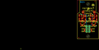
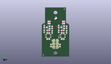
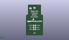
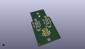

Contents
========

* [PROJ-SPAR-12617-STAN-01>Magician Encoder](#proj-spar-12617-stan-01magician-encoder)
	* [Images](#images)
	* [Interactive BOM](#interactive-bom)
	* [Tags](#tags)
  
![][im]
# PROJ-SPAR-12617-STAN-01>Magician Encoder

- ID: PROJ-SPAR-12617-STAN-01
- Hex ID: PRS12617
- Name: Magician Encoder
- Description: 

## Images
  
  

|eagleImage|kicadPcb3dFront|kicadPcb3dBack|kicadPcb3d|
| :---: | :---: | :---: | :---: |
|||||

## Interactive BOM

- Interactive BOM page: [ibom.html](kicad/bom/ibom.html)

## Tags

- hexID: PRS12617
- oompType: PROJ
- oompSize: SPAR
- oompColor: 12617
- oompDesc: STAN
- oompIndex: 01
- oompName: Magician Encoder
- sources: All source files from https://github.com/sparkfun/Magician_Encoder (source licence details in srcLicense.md)
- linkBuyPage: https://www.sparkfun.com/products/12617
- oompID: PROJ-SPAR-12617-STAN-01
- oompParts: C1,UNMATCHED-UNMATCHED-UNMATCHED-UNMATCHED-UNMATCHED
- oompParts: C2,UNMATCHED-UNMATCHED-UNMATCHED-UNMATCHED-UNMATCHED
- oompParts: C3,UNMATCHED-UNMATCHED-UNMATCHED-UNMATCHED-UNMATCHED
- oompParts: C4,UNMATCHED-UNMATCHED-UNMATCHED-UNMATCHED-UNMATCHED
- oompParts: C5,UNMATCHED-UNMATCHED-UNMATCHED-UNMATCHED-UNMATCHED
- oompParts: C6,UNMATCHED-UNMATCHED-UNMATCHED-UNMATCHED-UNMATCHED
- oompParts: C7,UNMATCHED-UNMATCHED-UNMATCHED-UNMATCHED-UNMATCHED
- oompParts: C8,UNMATCHED-UNMATCHED-UNMATCHED-UNMATCHED-UNMATCHED
- oompParts: FRAME1,UNMATCHED-UNMATCHED-UNMATCHED-UNMATCHED-UNMATCHED
- oompParts: JP1,UNMATCHED-UNMATCHED-UNMATCHED-UNMATCHED-UNMATCHED
- oompParts: LOGO1,UNMATCHED-UNMATCHED-UNMATCHED-UNMATCHED-UNMATCHED
- oompParts: LOGO3,UNMATCHED-UNMATCHED-UNMATCHED-UNMATCHED-UNMATCHED
- oompParts: LOGO4,UNMATCHED-UNMATCHED-UNMATCHED-UNMATCHED-UNMATCHED
- oompParts: Q1,UNMATCHED-UNMATCHED-UNMATCHED-UNMATCHED-UNMATCHED
- oompParts: Q2,UNMATCHED-UNMATCHED-UNMATCHED-UNMATCHED-UNMATCHED
- oompParts: R1,UNMATCHED-UNMATCHED-UNMATCHED-UNMATCHED-UNMATCHED
- oompParts: R2,UNMATCHED-UNMATCHED-UNMATCHED-UNMATCHED-UNMATCHED
- oompParts: R3,UNMATCHED-UNMATCHED-UNMATCHED-UNMATCHED-UNMATCHED
- oompParts: R4,UNMATCHED-UNMATCHED-UNMATCHED-UNMATCHED-UNMATCHED
- oompParts: R5,UNMATCHED-UNMATCHED-UNMATCHED-UNMATCHED-UNMATCHED
- oompParts: R6,UNMATCHED-UNMATCHED-UNMATCHED-UNMATCHED-UNMATCHED
- oompParts: R7,UNMATCHED-UNMATCHED-UNMATCHED-UNMATCHED-UNMATCHED
- oompParts: R8,UNMATCHED-UNMATCHED-UNMATCHED-UNMATCHED-UNMATCHED
- oompParts: R9,UNMATCHED-UNMATCHED-UNMATCHED-UNMATCHED-UNMATCHED
- oompParts: R10,UNMATCHED-UNMATCHED-UNMATCHED-UNMATCHED-UNMATCHED
- oompParts: R11,UNMATCHED-UNMATCHED-UNMATCHED-UNMATCHED-UNMATCHED
- oompParts: R12,UNMATCHED-UNMATCHED-UNMATCHED-UNMATCHED-UNMATCHED
- oompParts: STANDOFF1,UNMATCHED-UNMATCHED-UNMATCHED-UNMATCHED-UNMATCHED
- oompParts: STANDOFF2,UNMATCHED-UNMATCHED-UNMATCHED-UNMATCHED-UNMATCHED
- oompParts: U1,UNMATCHED-UNMATCHED-UNMATCHED-UNMATCHED-UNMATCHED
- oompParts: U2,UNMATCHED-UNMATCHED-UNMATCHED-UNMATCHED-UNMATCHED
- rawParts: C1,0.1uF,0.1UF-25V(+80/-20%)(0603),0603-CAP,Ceramic,CAP-00810,0.1uF,
- rawParts: C2,1.0uF,1.0UF-16V-10%(0603),0603-CAP,CAP-00868,CAP-00868,1.0uF,
- rawParts: C3,0.1uF,0.1UF-25V(+80/-20%)(0603),0603-CAP,Ceramic,CAP-00810,0.1uF,
- rawParts: C4,0.1uF,0.1UF-25V(+80/-20%)(0603),0603-CAP,Ceramic,CAP-00810,0.1uF,
- rawParts: C5,1.0uF,1.0UF-16V-10%(0603),0603-CAP,CAP-00868,CAP-00868,1.0uF,
- rawParts: C6,0.1uF,0.1UF-25V(+80/-20%)(0603),0603-CAP,Ceramic,CAP-00810,0.1uF,
- rawParts: C7,1.0uF,1.0UF-16V-10%(0603),0603-CAP,CAP-00868,CAP-00868,1.0uF,
- rawParts: C8,0.1uF,0.1UF-25V(+80/-20%)(0603),0603-CAP,Ceramic,CAP-00810,0.1uF,
- rawParts: FID1,FIDUCIALUFIDUCIAL,FIDUCIALUFIDUCIAL,MICRO-FIDUCIAL,Fiducial Alignment Points,,,
- rawParts: FID2,FIDUCIALUFIDUCIAL,FIDUCIALUFIDUCIAL,MICRO-FIDUCIAL,Fiducial Alignment Points,,,
- rawParts: FRAME1,FRAME-LETTER,FRAME-LETTER,CREATIVE_COMMONS,Schematic Frame,,,
- rawParts: JP1,,M03X22X3_SILK_SM,2X3,2x3 .1 header.,,,
- rawParts: LOGO1,LOGO-SFESK,LOGO-SFESK,SFE-LOGO-FLAME,Spark Fun Electronics PCB Logo,,,
- rawParts: LOGO3,OSHW-LOGOS,OSHW-LOGOS,OSHW-LOGO-S,Open Source Hardware Logo This logo indicates the piece of hardware it is found on incorporates a OSHW license and/or adheres to the definition of open source hardware found here: http://freedomdefined.org/OSHW,,,
- rawParts: LOGO4,LOGO-SFENEW,LOGO-SFENEW,SFE-NEW-WEBLOGO,Spark Fun Electronics PCB Logo,,,
- rawParts: Q1,MMBT2222A,TRANSISTOR_NPNMMBT2222A,SOT23,Generic NPN BJT,TRANS-08049,MMBT2222A,
- rawParts: Q2,MMBT2222A,TRANSISTOR_NPNMMBT2222A,SOT23,Generic NPN BJT,TRANS-08049,MMBT2222A,
- rawParts: R1,100,100OHM1/10W1%(0603),0603-RES,RES-07863,RES-07863,100,
- rawParts: R2,10K,10KOHM1/10W1%(0603)0603,0603-RES,RES-00824,RES-00824,10K,
- rawParts: R3,47K,47KOHM1/10W1%(0603),0603-RES,RES-07871,RES-07871,47K,
- rawParts: R4,6.8K,10KOHM1/10W1%(0603)0603,0603-RES,RES-00824,RES-08597,10K,
- rawParts: R5,4.7K,10KOHM1/10W1%(0603)0603,0603-RES,RES-00824,RES-07857,10K,
- rawParts: R6,100,1KOHM1/10W1%(0603),0603-RES,RES-07856,RES-07863,1K,
- rawParts: R7,100,100OHM1/10W1%(0603),0603-RES,RES-07863,RES-07863,100,
- rawParts: R8,10K,10KOHM1/10W1%(0603)0603,0603-RES,RES-00824,RES-00824,10K,
- rawParts: R9,47K,47KOHM1/10W1%(0603),0603-RES,RES-07871,RES-07871,47K,
- rawParts: R10,6.8K,10KOHM1/10W1%(0603)0603,0603-RES,RES-00824,RES-08597,10K,
- rawParts: R11,4.7K,10KOHM1/10W1%(0603)0603,0603-RES,RES-00824,RES-07857,10K,
- rawParts: R12,100,1KOHM1/10W1%(0603),0603-RES,RES-07856,RES-07863,1K,
- rawParts: STANDOFF1,STAND-OFF,STAND-OFF,STAND-OFF,#4 Stand Off,,,
- rawParts: STANDOFF2,STAND-OFF,STAND-OFF,STAND-OFF,#4 Stand Off,,,
- rawParts: U1,QRE1113,QRE1113,QRE1113,Reflective object sensor,IC-09357,,
- rawParts: U2,QRE1113,QRE1113,QRE1113,Reflective object sensor,IC-09357,,

[im]: kicadPcb3d_450.png
