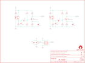

Contents
========

* [PRS12617 > Sparkfun](#prs12617--sparkfun)
	* [Schematic](#schematic)
	* [Interactive BOM](#interactive-bom)
	* [OOMP Parts](#oomp-parts)
	* [Images](#images)
	* [Tags](#tags)
  
![][im]
# PRS12617 > Sparkfun

- ID: PROJ-SPAR-12617-STAN-01
- Hex ID: PRS12617
- Name: Sparkfun
- Description: Sparkfun
- Long Link: [http://oom.lt/PROJ-SPAR-12617-STAN-01](http://oom.lt/PROJ-SPAR-12617-STAN-01)
- Short Link: [http://oom.lt/PRS12617](http://oom.lt/PRS12617)

## Schematic
  

## Interactive BOM

- Interactive BOM page: [ibom.html](https://htmlpreview.github.io/?https://github.com/oomlout/oomlout_OOMP_projects/blob/main/PROJ-SPAR-12617-STAN-01/kicad/bom/ibom.html)

## OOMP Parts
  

|OOMP Parts|
| :---: |
|C1,CAPC-0603-X-NF100-V50,C1,0.1uF,0.1UF-25V(+80/-20%)(0603),0603-CAP,Ceramic,CAP-00810,0.1uF,|
|C2,CAPC-0603-X-UNMATCHED-01,C2,1.0uF,1.0UF-16V-10%(0603),0603-CAP,CAP-00868,CAP-00868,1.0uF,|
|C3,CAPC-0603-X-NF100-V50,C3,0.1uF,0.1UF-25V(+80/-20%)(0603),0603-CAP,Ceramic,CAP-00810,0.1uF,|
|C4,CAPC-0603-X-NF100-V50,C4,0.1uF,0.1UF-25V(+80/-20%)(0603),0603-CAP,Ceramic,CAP-00810,0.1uF,|
|C5,CAPC-0603-X-UNMATCHED-01,C5,1.0uF,1.0UF-16V-10%(0603),0603-CAP,CAP-00868,CAP-00868,1.0uF,|
|C6,CAPC-0603-X-NF100-V50,C6,0.1uF,0.1UF-25V(+80/-20%)(0603),0603-CAP,Ceramic,CAP-00810,0.1uF,|
|C7,CAPC-0603-X-UNMATCHED-01,C7,1.0uF,1.0UF-16V-10%(0603),0603-CAP,CAP-00868,CAP-00868,1.0uF,|
|C8,CAPC-0603-X-NF100-V50,C8,0.1uF,0.1UF-25V(+80/-20%)(0603),0603-CAP,Ceramic,CAP-00810,0.1uF,|
|JP1,UNMATCHED-UNMATCHED-X-UNMATCHED-01,FID1,FIDUCIALUFIDUCIAL,FIDUCIALUFIDUCIAL,MICRO-FIDUCIAL,Fiducial Alignment Points,,,|
|Q1,UNMATCHED-SO23-X-UNMATCHED-01,FID2,FIDUCIALUFIDUCIAL,FIDUCIALUFIDUCIAL,MICRO-FIDUCIAL,Fiducial Alignment Points,,,|
|Q2,UNMATCHED-SO23-X-UNMATCHED-01,FRAME1,FRAME-LETTER,FRAME-LETTER,CREATIVE_COMMONS,Schematic Frame,,,|
|R1,RESE-0603-X-O101-01,JP1,,M03X22X3_SILK_SM,2X3,2x3 .1 header.,,,|
|R2,RESE-0603-X-O103-01,LOGO1,LOGO-SFESK,LOGO-SFESK,SFE-LOGO-FLAME,Spark Fun Electronics PCB Logo,,,|
|R3,RESE-0603-X-O473-01,LOGO3,OSHW-LOGOS,OSHW-LOGOS,OSHW-LOGO-S,Open Source Hardware Logo This logo indicates the piece of hardware it is found on incorporates a OSHW license and/or adheres to the definition of open source hardware found here: http://freedomdefined.org/OSHW,,,|
|R4,RESE-0603-X-UNMATCHED-01,LOGO4,LOGO-SFENEW,LOGO-SFENEW,SFE-NEW-WEBLOGO,Spark Fun Electronics PCB Logo,,,|
|R5,RESE-0603-X-O472-01,Q1,MMBT2222A,TRANSISTOR_NPNMMBT2222A,SOT23,Generic NPN BJT,TRANS-08049,MMBT2222A,|
|R6,RESE-0603-X-O101-01,Q2,MMBT2222A,TRANSISTOR_NPNMMBT2222A,SOT23,Generic NPN BJT,TRANS-08049,MMBT2222A,|
|R7,RESE-0603-X-O101-01,R1,100,100OHM1/10W1%(0603),0603-RES,RES-07863,RES-07863,100,|
|R8,RESE-0603-X-O103-01,R2,10K,10KOHM1/10W1%(0603)0603,0603-RES,RES-00824,RES-00824,10K,|
|R9,RESE-0603-X-O473-01,R3,47K,47KOHM1/10W1%(0603),0603-RES,RES-07871,RES-07871,47K,|
|R10,RESE-0603-X-UNMATCHED-01,R4,6.8K,10KOHM1/10W1%(0603)0603,0603-RES,RES-00824,RES-08597,10K,|
|R11,RESE-0603-X-O472-01,R5,4.7K,10KOHM1/10W1%(0603)0603,0603-RES,RES-00824,RES-07857,10K,|
|R12,RESE-0603-X-O101-01,R6,100,1KOHM1/10W1%(0603),0603-RES,RES-07856,RES-07863,1K,|
|U1,UNMATCHED-UNMATCHED-X-UNMATCHED-01,R7,100,100OHM1/10W1%(0603),0603-RES,RES-07863,RES-07863,100,|
|U2,UNMATCHED-UNMATCHED-X-UNMATCHED-01,R8,10K,10KOHM1/10W1%(0603)0603,0603-RES,RES-00824,RES-00824,10K,|

## Images
  
  

|kicadPcb3d|kicadPcb3dFront|kicadPcb3dBack|eagleImage|eagleSchemImage|
| :---: | :---: | :---: | :---: | :---: |
||||||

## Tags

- hexID: PRS12617
- oompType: PROJ
- oompSize: SPAR
- oompColor: 12617
- oompDesc: STAN
- oompIndex: 01
- oompName: Magician Encoder
- sources: All source files from https://github.com/sparkfun/Magician_Encoder (source licence details in srcLicense.md)
- linkBuyPage: https://www.sparkfun.com/products/12617
- oompID: PROJ-SPAR-12617-STAN-01
- oompParts: C1,CAPC-0603-X-NF100-V50
- oompParts: C2,CAPC-0603-X-UNMATCHED-01
- oompParts: C3,CAPC-0603-X-NF100-V50
- oompParts: C4,CAPC-0603-X-NF100-V50
- oompParts: C5,CAPC-0603-X-UNMATCHED-01
- oompParts: C6,CAPC-0603-X-NF100-V50
- oompParts: C7,CAPC-0603-X-UNMATCHED-01
- oompParts: C8,CAPC-0603-X-NF100-V50
- oompParts: JP1,UNMATCHED-UNMATCHED-X-UNMATCHED-01
- oompParts: Q1,UNMATCHED-SO23-X-UNMATCHED-01
- oompParts: Q2,UNMATCHED-SO23-X-UNMATCHED-01
- oompParts: R1,RESE-0603-X-O101-01
- oompParts: R2,RESE-0603-X-O103-01
- oompParts: R3,RESE-0603-X-O473-01
- oompParts: R4,RESE-0603-X-UNMATCHED-01
- oompParts: R5,RESE-0603-X-O472-01
- oompParts: R6,RESE-0603-X-O101-01
- oompParts: R7,RESE-0603-X-O101-01
- oompParts: R8,RESE-0603-X-O103-01
- oompParts: R9,RESE-0603-X-O473-01
- oompParts: R10,RESE-0603-X-UNMATCHED-01
- oompParts: R11,RESE-0603-X-O472-01
- oompParts: R12,RESE-0603-X-O101-01
- oompParts: U1,UNMATCHED-UNMATCHED-X-UNMATCHED-01
- oompParts: U2,UNMATCHED-UNMATCHED-X-UNMATCHED-01
- rawParts: C1,0.1uF,0.1UF-25V(+80/-20%)(0603),0603-CAP,Ceramic,CAP-00810,0.1uF,
- rawParts: C2,1.0uF,1.0UF-16V-10%(0603),0603-CAP,CAP-00868,CAP-00868,1.0uF,
- rawParts: C3,0.1uF,0.1UF-25V(+80/-20%)(0603),0603-CAP,Ceramic,CAP-00810,0.1uF,
- rawParts: C4,0.1uF,0.1UF-25V(+80/-20%)(0603),0603-CAP,Ceramic,CAP-00810,0.1uF,
- rawParts: C5,1.0uF,1.0UF-16V-10%(0603),0603-CAP,CAP-00868,CAP-00868,1.0uF,
- rawParts: C6,0.1uF,0.1UF-25V(+80/-20%)(0603),0603-CAP,Ceramic,CAP-00810,0.1uF,
- rawParts: C7,1.0uF,1.0UF-16V-10%(0603),0603-CAP,CAP-00868,CAP-00868,1.0uF,
- rawParts: C8,0.1uF,0.1UF-25V(+80/-20%)(0603),0603-CAP,Ceramic,CAP-00810,0.1uF,
- rawParts: FID1,FIDUCIALUFIDUCIAL,FIDUCIALUFIDUCIAL,MICRO-FIDUCIAL,Fiducial Alignment Points,,,
- rawParts: FID2,FIDUCIALUFIDUCIAL,FIDUCIALUFIDUCIAL,MICRO-FIDUCIAL,Fiducial Alignment Points,,,
- rawParts: FRAME1,FRAME-LETTER,FRAME-LETTER,CREATIVE_COMMONS,Schematic Frame,,,
- rawParts: JP1,,M03X22X3_SILK_SM,2X3,2x3 .1 header.,,,
- rawParts: LOGO1,LOGO-SFESK,LOGO-SFESK,SFE-LOGO-FLAME,Spark Fun Electronics PCB Logo,,,
- rawParts: LOGO3,OSHW-LOGOS,OSHW-LOGOS,OSHW-LOGO-S,Open Source Hardware Logo This logo indicates the piece of hardware it is found on incorporates a OSHW license and/or adheres to the definition of open source hardware found here: http://freedomdefined.org/OSHW,,,
- rawParts: LOGO4,LOGO-SFENEW,LOGO-SFENEW,SFE-NEW-WEBLOGO,Spark Fun Electronics PCB Logo,,,
- rawParts: Q1,MMBT2222A,TRANSISTOR_NPNMMBT2222A,SOT23,Generic NPN BJT,TRANS-08049,MMBT2222A,
- rawParts: Q2,MMBT2222A,TRANSISTOR_NPNMMBT2222A,SOT23,Generic NPN BJT,TRANS-08049,MMBT2222A,
- rawParts: R1,100,100OHM1/10W1%(0603),0603-RES,RES-07863,RES-07863,100,
- rawParts: R2,10K,10KOHM1/10W1%(0603)0603,0603-RES,RES-00824,RES-00824,10K,
- rawParts: R3,47K,47KOHM1/10W1%(0603),0603-RES,RES-07871,RES-07871,47K,
- rawParts: R4,6.8K,10KOHM1/10W1%(0603)0603,0603-RES,RES-00824,RES-08597,10K,
- rawParts: R5,4.7K,10KOHM1/10W1%(0603)0603,0603-RES,RES-00824,RES-07857,10K,
- rawParts: R6,100,1KOHM1/10W1%(0603),0603-RES,RES-07856,RES-07863,1K,
- rawParts: R7,100,100OHM1/10W1%(0603),0603-RES,RES-07863,RES-07863,100,
- rawParts: R8,10K,10KOHM1/10W1%(0603)0603,0603-RES,RES-00824,RES-00824,10K,
- rawParts: R9,47K,47KOHM1/10W1%(0603),0603-RES,RES-07871,RES-07871,47K,
- rawParts: R10,6.8K,10KOHM1/10W1%(0603)0603,0603-RES,RES-00824,RES-08597,10K,
- rawParts: R11,4.7K,10KOHM1/10W1%(0603)0603,0603-RES,RES-00824,RES-07857,10K,
- rawParts: R12,100,1KOHM1/10W1%(0603),0603-RES,RES-07856,RES-07863,1K,
- rawParts: STANDOFF1,STAND-OFF,STAND-OFF,STAND-OFF,#4 Stand Off,,,
- rawParts: STANDOFF2,STAND-OFF,STAND-OFF,STAND-OFF,#4 Stand Off,,,
- rawParts: U1,QRE1113,QRE1113,QRE1113,Reflective object sensor,IC-09357,,
- rawParts: U2,QRE1113,QRE1113,QRE1113,Reflective object sensor,IC-09357,,

[im]: kicadPcb3d_450.png
