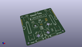
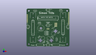
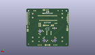
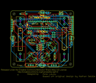
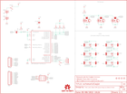

Contents
========

* [PRS12634 > Sparkfun](#prs12634--sparkfun)
	* [Images](#images)
	* [Tags](#tags)
  
![][im]
# PRS12634 > Sparkfun

- ID: PROJ-SPAR-12634-STAN-01
- Hex ID: PRS12634
- Name: Sparkfun
- Description: Sparkfun

## Images
  
  

|kicadPcb3d|kicadPcb3dFront|kicadPcb3dBack|eagleImage|eagleSchemImage|
| :---: | :---: | :---: | :---: | :---: |
||||||

## Tags

- hexID: PRS12634
- oompType: PROJ
- oompSize: SPAR
- oompColor: 12634
- oompDesc: STAN
- oompIndex: 01
- oompName: Simon Tilts
- sources: All source files from https://github.com/sparkfun/Simon_Tilts (source licence details in srcLicense.md)
- linkBuyPage: https://www.sparkfun.com/products/12634
- oompID: PROJ-SPAR-12634-STAN-01
- oompParts: BAT1,UNMATCHED-UNMATCHED-UNMATCHED-UNMATCHED-UNMATCHED
- oompParts: BAT2,UNMATCHED-UNMATCHED-UNMATCHED-UNMATCHED-UNMATCHED
- oompParts: C1,UNMATCHED-UNMATCHED-UNMATCHED-UNMATCHED-UNMATCHED
- oompParts: C2,UNMATCHED-UNMATCHED-UNMATCHED-UNMATCHED-UNMATCHED
- oompParts: FRAME1,UNMATCHED-UNMATCHED-UNMATCHED-UNMATCHED-UNMATCHED
- oompParts: JP1,UNMATCHED-UNMATCHED-UNMATCHED-UNMATCHED-UNMATCHED
- oompParts: JP2,UNMATCHED-UNMATCHED-UNMATCHED-UNMATCHED-UNMATCHED
- oompParts: JP3,UNMATCHED-UNMATCHED-UNMATCHED-UNMATCHED-UNMATCHED
- oompParts: JP4,UNMATCHED-UNMATCHED-UNMATCHED-UNMATCHED-UNMATCHED
- oompParts: JP5,UNMATCHED-UNMATCHED-UNMATCHED-UNMATCHED-UNMATCHED
- oompParts: JP6,UNMATCHED-UNMATCHED-UNMATCHED-UNMATCHED-UNMATCHED
- oompParts: JP7,UNMATCHED-UNMATCHED-UNMATCHED-UNMATCHED-UNMATCHED
- oompParts: LED0,UNMATCHED-UNMATCHED-UNMATCHED-UNMATCHED-UNMATCHED
- oompParts: LED1,UNMATCHED-UNMATCHED-UNMATCHED-UNMATCHED-UNMATCHED
- oompParts: LED2,UNMATCHED-UNMATCHED-UNMATCHED-UNMATCHED-UNMATCHED
- oompParts: LED3,UNMATCHED-UNMATCHED-UNMATCHED-UNMATCHED-UNMATCHED
- oompParts: LED4,UNMATCHED-UNMATCHED-UNMATCHED-UNMATCHED-UNMATCHED
- oompParts: LED5,UNMATCHED-UNMATCHED-UNMATCHED-UNMATCHED-UNMATCHED
- oompParts: R1,UNMATCHED-UNMATCHED-UNMATCHED-UNMATCHED-UNMATCHED
- oompParts: R2,UNMATCHED-UNMATCHED-UNMATCHED-UNMATCHED-UNMATCHED
- oompParts: R3,UNMATCHED-UNMATCHED-UNMATCHED-UNMATCHED-UNMATCHED
- oompParts: R4,UNMATCHED-UNMATCHED-UNMATCHED-UNMATCHED-UNMATCHED
- oompParts: R5,UNMATCHED-UNMATCHED-UNMATCHED-UNMATCHED-UNMATCHED
- oompParts: S1,UNMATCHED-UNMATCHED-UNMATCHED-UNMATCHED-UNMATCHED
- oompParts: S2,UNMATCHED-UNMATCHED-UNMATCHED-UNMATCHED-UNMATCHED
- oompParts: SG1,UNMATCHED-UNMATCHED-UNMATCHED-UNMATCHED-UNMATCHED
- oompParts: SJ1,UNMATCHED-UNMATCHED-UNMATCHED-UNMATCHED-UNMATCHED
- oompParts: SJ2,UNMATCHED-UNMATCHED-UNMATCHED-UNMATCHED-UNMATCHED
- oompParts: SJ3,UNMATCHED-UNMATCHED-UNMATCHED-UNMATCHED-UNMATCHED
- oompParts: SJ4,UNMATCHED-UNMATCHED-UNMATCHED-UNMATCHED-UNMATCHED
- oompParts: SJ5,UNMATCHED-UNMATCHED-UNMATCHED-UNMATCHED-UNMATCHED
- oompParts: SJ6,UNMATCHED-UNMATCHED-UNMATCHED-UNMATCHED-UNMATCHED
- oompParts: SJ7,UNMATCHED-UNMATCHED-UNMATCHED-UNMATCHED-UNMATCHED
- oompParts: SJ8,UNMATCHED-UNMATCHED-UNMATCHED-UNMATCHED-UNMATCHED
- oompParts: SJ9,UNMATCHED-UNMATCHED-UNMATCHED-UNMATCHED-UNMATCHED
- oompParts: SJ10,UNMATCHED-UNMATCHED-UNMATCHED-UNMATCHED-UNMATCHED
- oompParts: SJ11,UNMATCHED-UNMATCHED-UNMATCHED-UNMATCHED-UNMATCHED
- oompParts: SJ12,UNMATCHED-UNMATCHED-UNMATCHED-UNMATCHED-UNMATCHED
- oompParts: U$1,UNMATCHED-UNMATCHED-UNMATCHED-UNMATCHED-UNMATCHED
- oompParts: U$3,UNMATCHED-UNMATCHED-UNMATCHED-UNMATCHED-UNMATCHED
- oompParts: U$4,UNMATCHED-UNMATCHED-UNMATCHED-UNMATCHED-UNMATCHED
- oompParts: U$5,UNMATCHED-UNMATCHED-UNMATCHED-UNMATCHED-UNMATCHED
- oompParts: U$6,UNMATCHED-UNMATCHED-UNMATCHED-UNMATCHED-UNMATCHED
- oompParts: U$7,UNMATCHED-UNMATCHED-UNMATCHED-UNMATCHED-UNMATCHED
- rawParts: BAT1,AA,BATTERYAA-KIT,BATTERY-AA-KIT,Battery Holders,BATT-08316,
- rawParts: BAT2,AA,BATTERYAA-KIT,BATTERY-AA-KIT,Battery Holders,BATT-08316,
- rawParts: C1,0.1uF,0.1UF-50V-20%(PTH)KIT-EZ,CAP-PTH-SMALL-KIT,CAP-08370,CAP-08370,
- rawParts: C2,0.1uF,0.1UF-50V-20%(PTH)KIT-EZ,CAP-PTH-SMALL-KIT,CAP-08370,CAP-08370,
- rawParts: FRAME1,FRAME-LETTER,FRAME-LETTER,CREATIVE_COMMONS,Schematic Frame,,
- rawParts: JP1,Serial,M06-SFENOSILK,1X06-NOSILK,Header 6,,
- rawParts: JP2,STAND-OFF,STAND-OFF,STAND-OFF,Stand Off,,
- rawParts: JP3,,AVR_SPI_PRG_6NS,2X3-NS,AVR ISP 6 Pin,,
- rawParts: JP4,M09,M09,1X09,Header 9,,
- rawParts: JP5,STAND-OFF,STAND-OFF,STAND-OFF,Stand Off,,
- rawParts: JP6,STAND-OFF,STAND-OFF,STAND-OFF,Stand Off,,
- rawParts: JP7,STAND-OFF,STAND-OFF,STAND-OFF,Stand Off,,
- rawParts: LED0,,LED5MM-KIT,LED5MM-KIT,LEDs,,
- rawParts: LED1,,LED5MM-KIT,LED5MM-KIT,LEDs,,
- rawParts: LED2,,LED5MM-KIT,LED5MM-KIT,LEDs,,
- rawParts: LED3,,LED5MM-KIT,LED5MM-KIT,LEDs,,
- rawParts: LED4,,LED5MM-KIT,LED5MM-KIT,LEDs,,
- rawParts: LED5,,LED5MM-KIT,LED5MM-KIT,LEDs,,
- rawParts: R1,10K,10KOHM1/6W5%(PTH)KIT,AXIAL-0.3-KIT,RES-08375,RES-08375,
- rawParts: R2,100,RESISTORAX-0.3-KIT,AXIAL-0.3-KIT,Resistor,,
- rawParts: R3,330,RESISTORAX-0.3-KIT,AXIAL-0.3-KIT,Resistor,,
- rawParts: R4,330,RESISTORAX-0.3-KIT,AXIAL-0.3-KIT,Resistor,,
- rawParts: R5,330,RESISTORAX-0.3-KIT,AXIAL-0.3-KIT,Resistor,,
- rawParts: S1,Power,SWITCH-SPDTKIT,SWITCH-SPDT_KIT,SPDT Switch,SWCH-08261,
- rawParts: S2,,SWITCH-SPDTKIT,SWITCH-SPDT_KIT,SPDT Switch,SWCH-08261,
- rawParts: SG1,BUZZER,BUZZERPTH-KIT,BUZZER-12MM-KIT,Buzzer 12mm,COMP-08253,
- rawParts: SJ1,,SOLDERJUMPER_2WAYS,SJ_3,Solder Jumper,,
- rawParts: SJ2,,SOLDERJUMPER_2WAYS,SJ_3,Solder Jumper,,
- rawParts: SJ3,,SOLDERJUMPER_2WAYS,SJ_3,Solder Jumper,,
- rawParts: SJ4,,SOLDERJUMPER_2WAYS,SJ_3,Solder Jumper,,
- rawParts: SJ5,,SOLDERJUMPER_2WAYS,SJ_3,Solder Jumper,,
- rawParts: SJ6,,SOLDERJUMPER_2WAYS,SJ_3,Solder Jumper,,
- rawParts: SJ7,,SOLDERJUMPER_2WAYS,SJ_3,Solder Jumper,,
- rawParts: SJ8,,SOLDERJUMPER_2WAYS,SJ_3,Solder Jumper,,
- rawParts: SJ9,,SOLDERJUMPER_2WAYS,SJ_3,Solder Jumper,,
- rawParts: SJ10,,SOLDERJUMPER_2WAYS,SJ_3,Solder Jumper,,
- rawParts: SJ11,,SOLDERJUMPER_2WAYS,SJ_3,Solder Jumper,,
- rawParts: SJ12,,SOLDERJUMPER_2WAYS,SJ_3,Solder Jumper,,
- rawParts: U$1,LOGO-SFENEW,LOGO-SFENEW,SFE-NEW-WEBLOGO,Spark Fun Electronics PCB Logo,,
- rawParts: U$3,OSHW-LOGOS,OSHW-LOGOS,OSHW-LOGO-S,Open Source Hardware Logo This logo indicates the piece of hardware it is found on incorporates a OSHW license and/or adheres to the definition of open source hardware found here: http://freedomdefined.org/OSHW,,
- rawParts: U$4,TILT_SENSORV5,TILT_SENSORV5,TILT_SENSOR_V5,,,
- rawParts: U$5,TILT_SENSORV5,TILT_SENSORV5,TILT_SENSOR_V5,,,
- rawParts: U$6,TILT_SENSORV5,TILT_SENSORV5,TILT_SENSOR_V5,,,
- rawParts: U$7,AVR-MEGA8-P-KEYED-14,AVR-MEGA8-P-KEYED-14,DIL28-3_KEYED-14,,,

[im]: kicadPcb3d_450.png
