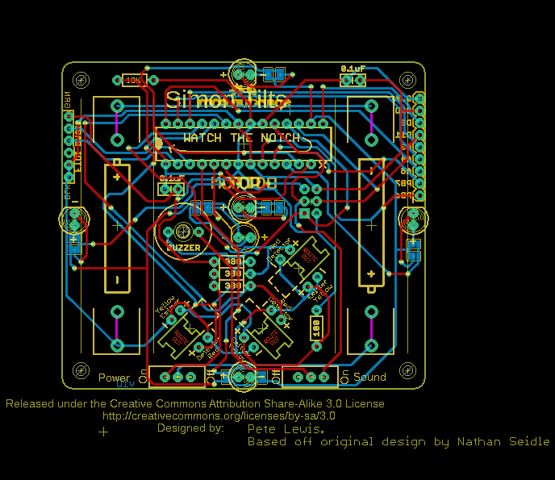
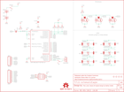

Contents
========

* [PRS12634 > Simon Tilts](#prs12634--simon-tilts)
	* [Schematic](#schematic)
	* [PCB](#pcb)
	* [Interactive BOM](#interactive-bom)
	* [OOMP Parts](#oomp-parts)
	* [Images](#images)
	* [Tags](#tags)
  
![][im]
# PRS12634 > Simon Tilts

- ID: PROJ-SPAR-12634-STAN-01
- Hex ID: PRS12634
- Name: Sparkfun
- Description: Sparkfun
- Long Link: [http://oom.lt/PROJ-SPAR-12634-STAN-01](http://oom.lt/PROJ-SPAR-12634-STAN-01)
- Short Link: [http://oom.lt/PRS12634](http://oom.lt/PRS12634)

## Schematic
  

## PCB
  

## Interactive BOM

- Interactive BOM page: [ibom.html](https://htmlpreview.github.io/?https://github.com/oomlout/oomlout_OOMP_projects/blob/main/PROJ-SPAR-12634-STAN-01/kicad/bom/ibom.html)

## OOMP Parts
  

|OOMP Parts|
| :---: |
|BAT1 BAT1,UNMATCHED-UNMATCHED-X-UNMATCHED-01|
|BAT2 BAT2,UNMATCHED-UNMATCHED-X-UNMATCHED-01|
|C1 C1,CAPX-UNMATCHED-X-UF1D-01|
|C2 C2,CAPX-UNMATCHED-X-UF1D-01|
|[JP1 HEAD-I01-X-PI06-01 2.54 mm 6 Pin Header](https://github.com/oomlout/oomlout_OOMP_parts/tree/main/HEAD-I01-X-PI06-01/)|
|JP3 JP3,UNMATCHED-UNMATCHED-X-UNMATCHED-01|
|[JP4 HEAD-I01-X-PI09-01 2.54 mm 9 Pin Header](https://github.com/oomlout/oomlout_OOMP_parts/tree/main/HEAD-I01-X-PI09-01/)|
|LED0 LED0,LEDS-UNMATCHED-G-STAN-01|
|LED1 LED1,LEDS-UNMATCHED-G-STAN-01|
|LED2 LED2,LEDS-UNMATCHED-G-STAN-01|
|LED3 LED3,LEDS-UNMATCHED-G-STAN-01|
|LED4 LED4,LEDS-UNMATCHED-G-STAN-01|
|LED5 LED5,LEDS-UNMATCHED-G-STAN-01|
|R1 R1,RESE-UNMATCHED-X-O103-01|
|R2 R2,RESE-UNMATCHED-X-O101-01|
|R3 R3,RESE-UNMATCHED-X-O331-01|
|R4 R4,RESE-UNMATCHED-X-O331-01|
|R5 R5,RESE-UNMATCHED-X-O331-01|
|S1 S1,UNMATCHED-UNMATCHED-X-UNMATCHED-01|
|S2 S2,UNMATCHED-UNMATCHED-X-UNMATCHED-01|
|SG1 SG1,UNMATCHED-UNMATCHED-X-UNMATCHED-01|
|U$4 U$4,UNMATCHED-UNMATCHED-X-UNMATCHED-01|
|U$5 U$5,UNMATCHED-UNMATCHED-X-UNMATCHED-01|
|U$6 U$6,UNMATCHED-UNMATCHED-X-UNMATCHED-01|
|U$7 U$7,UNMATCHED-UNMATCHED-X-UNMATCHED-01|

## Images
  
  

|kicadPcb3d|kicadPcb3dFront|kicadPcb3dBack|eagleImage|eagleSchemImage|
| :---: | :---: | :---: | :---: | :---: |
||||||

## Tags

- hexID: PRS12634
- oompType: PROJ
- oompSize: SPAR
- oompColor: 12634
- oompDesc: STAN
- oompIndex: 01
- oompName: Simon Tilts
- sources: All source files from https://github.com/sparkfun/Simon_Tilts (source licence details in srcLicense.md)
- linkBuyPage: https://www.sparkfun.com/products/12634
- oompID: PROJ-SPAR-12634-STAN-01
- oompParts: BAT1,UNMATCHED-UNMATCHED-X-UNMATCHED-01
- oompParts: BAT2,UNMATCHED-UNMATCHED-X-UNMATCHED-01
- oompParts: C1,CAPX-UNMATCHED-X-UF1D-01
- oompParts: C2,CAPX-UNMATCHED-X-UF1D-01
- oompParts: JP1,HEAD-I01-X-PI06-01
- oompParts: JP3,UNMATCHED-UNMATCHED-X-UNMATCHED-01
- oompParts: JP4,HEAD-I01-X-PI09-01
- oompParts: LED0,LEDS-UNMATCHED-G-STAN-01
- oompParts: LED1,LEDS-UNMATCHED-G-STAN-01
- oompParts: LED2,LEDS-UNMATCHED-G-STAN-01
- oompParts: LED3,LEDS-UNMATCHED-G-STAN-01
- oompParts: LED4,LEDS-UNMATCHED-G-STAN-01
- oompParts: LED5,LEDS-UNMATCHED-G-STAN-01
- oompParts: R1,RESE-UNMATCHED-X-O103-01
- oompParts: R2,RESE-UNMATCHED-X-O101-01
- oompParts: R3,RESE-UNMATCHED-X-O331-01
- oompParts: R4,RESE-UNMATCHED-X-O331-01
- oompParts: R5,RESE-UNMATCHED-X-O331-01
- oompParts: S1,UNMATCHED-UNMATCHED-X-UNMATCHED-01
- oompParts: S2,UNMATCHED-UNMATCHED-X-UNMATCHED-01
- oompParts: SG1,UNMATCHED-UNMATCHED-X-UNMATCHED-01
- oompParts: U$4,UNMATCHED-UNMATCHED-X-UNMATCHED-01
- oompParts: U$5,UNMATCHED-UNMATCHED-X-UNMATCHED-01
- oompParts: U$6,UNMATCHED-UNMATCHED-X-UNMATCHED-01
- oompParts: U$7,UNMATCHED-UNMATCHED-X-UNMATCHED-01
- rawParts: BAT1,AA,BATTERYAA-KIT,BATTERY-AA-KIT,Battery Holders,BATT-08316,
- rawParts: BAT2,AA,BATTERYAA-KIT,BATTERY-AA-KIT,Battery Holders,BATT-08316,
- rawParts: C1,0.1uF,0.1UF-50V-20%(PTH)KIT-EZ,CAP-PTH-SMALL-KIT,CAP-08370,CAP-08370,
- rawParts: C2,0.1uF,0.1UF-50V-20%(PTH)KIT-EZ,CAP-PTH-SMALL-KIT,CAP-08370,CAP-08370,
- rawParts: FRAME1,FRAME-LETTER,FRAME-LETTER,CREATIVE_COMMONS,Schematic Frame,,
- rawParts: JP1,Serial,M06-SFENOSILK,1X06-NOSILK,Header 6,,
- rawParts: JP2,STAND-OFF,STAND-OFF,STAND-OFF,Stand Off,,
- rawParts: JP3,,AVR_SPI_PRG_6NS,2X3-NS,AVR ISP 6 Pin,,
- rawParts: JP4,M09,M09,1X09,Header 9,,
- rawParts: JP5,STAND-OFF,STAND-OFF,STAND-OFF,Stand Off,,
- rawParts: JP6,STAND-OFF,STAND-OFF,STAND-OFF,Stand Off,,
- rawParts: JP7,STAND-OFF,STAND-OFF,STAND-OFF,Stand Off,,
- rawParts: LED0,,LED5MM-KIT,LED5MM-KIT,LEDs,,
- rawParts: LED1,,LED5MM-KIT,LED5MM-KIT,LEDs,,
- rawParts: LED2,,LED5MM-KIT,LED5MM-KIT,LEDs,,
- rawParts: LED3,,LED5MM-KIT,LED5MM-KIT,LEDs,,
- rawParts: LED4,,LED5MM-KIT,LED5MM-KIT,LEDs,,
- rawParts: LED5,,LED5MM-KIT,LED5MM-KIT,LEDs,,
- rawParts: R1,10K,10KOHM1/6W5%(PTH)KIT,AXIAL-0.3-KIT,RES-08375,RES-08375,
- rawParts: R2,100,RESISTORAX-0.3-KIT,AXIAL-0.3-KIT,Resistor,,
- rawParts: R3,330,RESISTORAX-0.3-KIT,AXIAL-0.3-KIT,Resistor,,
- rawParts: R4,330,RESISTORAX-0.3-KIT,AXIAL-0.3-KIT,Resistor,,
- rawParts: R5,330,RESISTORAX-0.3-KIT,AXIAL-0.3-KIT,Resistor,,
- rawParts: S1,Power,SWITCH-SPDTKIT,SWITCH-SPDT_KIT,SPDT Switch,SWCH-08261,
- rawParts: S2,,SWITCH-SPDTKIT,SWITCH-SPDT_KIT,SPDT Switch,SWCH-08261,
- rawParts: SG1,BUZZER,BUZZERPTH-KIT,BUZZER-12MM-KIT,Buzzer 12mm,COMP-08253,
- rawParts: SJ1,,SOLDERJUMPER_2WAYS,SJ_3,Solder Jumper,,
- rawParts: SJ2,,SOLDERJUMPER_2WAYS,SJ_3,Solder Jumper,,
- rawParts: SJ3,,SOLDERJUMPER_2WAYS,SJ_3,Solder Jumper,,
- rawParts: SJ4,,SOLDERJUMPER_2WAYS,SJ_3,Solder Jumper,,
- rawParts: SJ5,,SOLDERJUMPER_2WAYS,SJ_3,Solder Jumper,,
- rawParts: SJ6,,SOLDERJUMPER_2WAYS,SJ_3,Solder Jumper,,
- rawParts: SJ7,,SOLDERJUMPER_2WAYS,SJ_3,Solder Jumper,,
- rawParts: SJ8,,SOLDERJUMPER_2WAYS,SJ_3,Solder Jumper,,
- rawParts: SJ9,,SOLDERJUMPER_2WAYS,SJ_3,Solder Jumper,,
- rawParts: SJ10,,SOLDERJUMPER_2WAYS,SJ_3,Solder Jumper,,
- rawParts: SJ11,,SOLDERJUMPER_2WAYS,SJ_3,Solder Jumper,,
- rawParts: SJ12,,SOLDERJUMPER_2WAYS,SJ_3,Solder Jumper,,
- rawParts: U$1,LOGO-SFENEW,LOGO-SFENEW,SFE-NEW-WEBLOGO,Spark Fun Electronics PCB Logo,,
- rawParts: U$3,OSHW-LOGOS,OSHW-LOGOS,OSHW-LOGO-S,Open Source Hardware Logo This logo indicates the piece of hardware it is found on incorporates a OSHW license and/or adheres to the definition of open source hardware found here: http://freedomdefined.org/OSHW,,
- rawParts: U$4,TILT_SENSORV5,TILT_SENSORV5,TILT_SENSOR_V5,,,
- rawParts: U$5,TILT_SENSORV5,TILT_SENSORV5,TILT_SENSOR_V5,,,
- rawParts: U$6,TILT_SENSORV5,TILT_SENSORV5,TILT_SENSOR_V5,,,
- rawParts: U$7,AVR-MEGA8-P-KEYED-14,AVR-MEGA8-P-KEYED-14,DIL28-3_KEYED-14,,,

[im]: kicadPcb3d_450.png
