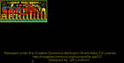
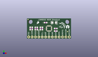
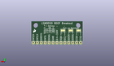
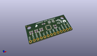

Contents
========

* [PROJ-SPAR-12636-STAN-01>LSM9DS0 Breakout](#proj-spar-12636-stan-01lsm9ds0-breakout)
	* [Images](#images)
	* [Interactive BOM](#interactive-bom)
	* [OOMP Parts](#oomp-parts)
	* [Tags](#tags)
  
![][im]
# PROJ-SPAR-12636-STAN-01>LSM9DS0 Breakout

- ID: PROJ-SPAR-12636-STAN-01
- Hex ID: PRS12636
- Name: LSM9DS0 Breakout
- Description: 

## Images
  
  

|eagleImage|kicadPcb3dFront|kicadPcb3dBack|kicadPcb3d|
| :---: | :---: | :---: | :---: |
|||||

## Interactive BOM

- Interactive BOM page: [ibom.html](kicad/bom/ibom.html)

## OOMP Parts
  

|OOMP Parts|
| :---: |
|CAPC-0603-X-UNMATCHED-01, C1, 21.59, 5.715, 0,C1, 4.7uF, 0603-CAP, SparkFun-Capacitors, (0.85, 0.225), R0|
|CAPC-0603-X-NF220-V50, C2, 21.59, 7.619999999999999, 0,C2, 0.22uF, 0603-CAP, SparkFun-Capacitors, (0.85, 0.3), R0|
|CAPC-UNMATCHED-X-UNMATCHED-01, C3, 20.32, 12.065, 180,C3, 10uF, EIA3216, SparkFun-Capacitors, (0.8, 0.475), R180|
|CAPC-0603-X-UNMATCHED-01, C4, 13.97, 12.065, 180,C4, 1.0uF, 0603-CAP, SparkFun-Capacitors, (0.55, 0.475), R180|
|HEAD-I01-X-PI13-01, JP1, 31.75, 1.27, M0,JP1, M13, 1X13, SparkFun-Connectors, (1.25, 0.05), MR0|
|<table><tr><td></td><td> R1</td><td>[RESE-0603-X-O103-01 SMD (0603) 10k Ohm Resistor](https://github.com/oomlout/oomlout_OOMP_parts/tree/main/RESE-0603-X-O103-01/)</td><td>[R6103](https://github.com/oomlout/oomlout_OOMP_parts/tree/main/RESE-0603-X-O103-01/)</td></tr></table>|
|<table><tr><td></td><td> R2</td><td>[RESE-0603-X-O103-01 SMD (0603) 10k Ohm Resistor](https://github.com/oomlout/oomlout_OOMP_parts/tree/main/RESE-0603-X-O103-01/)</td><td>[R6103](https://github.com/oomlout/oomlout_OOMP_parts/tree/main/RESE-0603-X-O103-01/)</td></tr></table>|
|<table><tr><td></td><td> R3</td><td>[RESE-0603-X-O103-01 SMD (0603) 10k Ohm Resistor](https://github.com/oomlout/oomlout_OOMP_parts/tree/main/RESE-0603-X-O103-01/)</td><td>[R6103](https://github.com/oomlout/oomlout_OOMP_parts/tree/main/RESE-0603-X-O103-01/)</td></tr></table>|
|<table><tr><td></td><td> R4</td><td>[RESE-0603-X-O103-01 SMD (0603) 10k Ohm Resistor](https://github.com/oomlout/oomlout_OOMP_parts/tree/main/RESE-0603-X-O103-01/)</td><td>[R6103](https://github.com/oomlout/oomlout_OOMP_parts/tree/main/RESE-0603-X-O103-01/)</td></tr></table>|
|<table><tr><td></td><td> R5</td><td>[RESE-0603-X-O103-01 SMD (0603) 10k Ohm Resistor](https://github.com/oomlout/oomlout_OOMP_parts/tree/main/RESE-0603-X-O103-01/)</td><td>[R6103](https://github.com/oomlout/oomlout_OOMP_parts/tree/main/RESE-0603-X-O103-01/)</td></tr></table>|
|<table><tr><td></td><td> R6</td><td>[RESE-0603-X-O103-01 SMD (0603) 10k Ohm Resistor](https://github.com/oomlout/oomlout_OOMP_parts/tree/main/RESE-0603-X-O103-01/)</td><td>[R6103](https://github.com/oomlout/oomlout_OOMP_parts/tree/main/RESE-0603-X-O103-01/)</td></tr></table>|
|UNMATCHED-UNMATCHED-X-UNMATCHED-01, U1, 16.509999999999998, 7.619999999999999, 90,U1, LSM9DS0, LGA-24, SparkFun-DigitalIC, (0.65, 0.3), R90|

## Tags

- hexID: PRS12636
- oompType: PROJ
- oompSize: SPAR
- oompColor: 12636
- oompDesc: STAN
- oompIndex: 01
- oompName: LSM9DS0 Breakout
- sources: All source files from https://github.com/sparkfun/LSM9DS0_Breakout (source licence details in srcLicense.md)
- linkBuyPage: https://www.sparkfun.com/products/12636
- oompID: PROJ-SPAR-12636-STAN-01
- oompPart: CAPC-0603-X-UNMATCHED-01, C1, 21.59, 5.715, 0
- oompPart: CAPC-0603-X-NF220-V50, C2, 21.59, 7.619999999999999, 0
- oompPart: CAPC-UNMATCHED-X-UNMATCHED-01, C3, 20.32, 12.065, 180
- oompPart: CAPC-0603-X-UNMATCHED-01, C4, 13.97, 12.065, 180
- oompPart: SKIP-UNMATCHED-X-UNMATCHED-01, FID1, 30.479999999999997, 5.334, 0
- oompPart: SKIP-UNMATCHED-X-UNMATCHED-01, FID2, 0.7619999999999999, 14.477999999999998, 0
- oompPart: HEAD-I01-X-PI13-01, JP1, 31.75, 1.27, M0
- oompPart: RESE-0603-X-O103-01, R1, 11.557, 7.619999999999999, 270
- oompPart: RESE-0603-X-O103-01, R2, 10.033, 7.619999999999999, 270
- oompPart: RESE-0603-X-O103-01, R3, 2.413, 7.619999999999999, 270
- oompPart: RESE-0603-X-O103-01, R4, 3.937, 7.619999999999999, 270
- oompPart: RESE-0603-X-O103-01, R5, 7.746999999999999, 7.619999999999999, 270
- oompPart: RESE-0603-X-O103-01, R6, 6.223, 7.619999999999999, 270
- oompPart: SKIP-UNMATCHED-X-UNMATCHED-01, SJ1, 12.7, 9.270999999999999, M180
- oompPart: SKIP-UNMATCHED-X-UNMATCHED-01, SJ2, 2.54, 9.270999999999999, M180
- oompPart: SKIP-UNMATCHED-X-UNMATCHED-01, SJ3, 7.619999999999999, 9.270999999999999, M180
- oompPart: UNMATCHED-UNMATCHED-X-UNMATCHED-01, U1, 16.509999999999998, 7.619999999999999, 90
- rawPart: C1, 4.7uF, 0603-CAP, SparkFun-Capacitors, (0.85, 0.225), R0
- rawPart: C2, 0.22uF, 0603-CAP, SparkFun-Capacitors, (0.85, 0.3), R0
- rawPart: C3, 10uF, EIA3216, SparkFun-Capacitors, (0.8, 0.475), R180
- rawPart: C4, 1.0uF, 0603-CAP, SparkFun-Capacitors, (0.55, 0.475), R180
- rawPart: FID1, FIDUCIALUFIDUCIAL, MICRO-FIDUCIAL, SparkFun-Aesthetics, (1.2, 0.21), R0
- rawPart: FID2, FIDUCIALUFIDUCIAL, MICRO-FIDUCIAL, SparkFun-Aesthetics, (0.03, 0.57), R0
- rawPart: JP1, M13, 1X13, SparkFun-Connectors, (1.25, 0.05), MR0
- rawPart: R1, 10k, 0603-RES, SparkFun-Resistors, (0.455, 0.3), R270
- rawPart: R2, 10k, 0603-RES, SparkFun-Resistors, (0.395, 0.3), R270
- rawPart: R3, 10k, 0603-RES, SparkFun-Resistors, (0.095, 0.3), R270
- rawPart: R4, 10k, 0603-RES, SparkFun-Resistors, (0.155, 0.3), R270
- rawPart: R5, 10k, 0603-RES, SparkFun-Resistors, (0.305, 0.3), R270
- rawPart: R6, 10k, 0603-RES, SparkFun-Resistors, (0.245, 0.3), R270
- rawPart: SJ1, SJ_3, SparkFun-Passives, (0.5, 0.365), MR180
- rawPart: SJ2, SJ_3, SparkFun-Passives, (0.1, 0.365), MR180
- rawPart: SJ3, SJ_3, SparkFun-Passives, (0.3, 0.365), MR180
- rawPart: U1, LSM9DS0, LGA-24, SparkFun-DigitalIC, (0.65, 0.3), R90

[im]: kicadPcb3d_450.png
