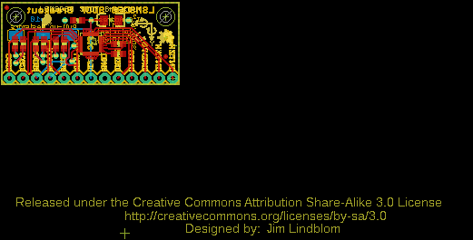
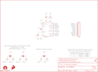

Contents
========

* [PRS12636 > LSM9DS0 Breakout](#prs12636--lsm9ds0-breakout)
	* [Schematic](#schematic)
	* [PCB](#pcb)
	* [Interactive BOM](#interactive-bom)
	* [OOMP Parts](#oomp-parts)
	* [Images](#images)
	* [Tags](#tags)
  
![][im]
# PRS12636 > LSM9DS0 Breakout

- ID: PROJ-SPAR-12636-STAN-01
- Hex ID: PRS12636
- Name: Sparkfun
- Description: Sparkfun
- Long Link: [http://oom.lt/PROJ-SPAR-12636-STAN-01](http://oom.lt/PROJ-SPAR-12636-STAN-01)
- Short Link: [http://oom.lt/PRS12636](http://oom.lt/PRS12636)

## Schematic
  

## PCB
  

## Interactive BOM

- Interactive BOM page: [ibom.html](https://htmlpreview.github.io/?https://github.com/oomlout/oomlout_OOMP_projects/blob/main/PROJ-SPAR-12636-STAN-01/kicad/bom/ibom.html)

## OOMP Parts
  

|OOMP Parts|
| :---: |
|[CAPC-0603-X-UF47D-V10  SMD (0603) 4.7 uF Capacitor (Ceramic) 10v  C1](https://github.com/oomlout/oomlout_OOMP_parts/tree/main/CAPC-0603-X-UF47D-V10/)|
|[CAPC-0603-X-NF220-V25  SMD (0603) 220 nF Capacitor (Ceramic) 25v  C2](https://github.com/oomlout/oomlout_OOMP_parts/tree/main/CAPC-0603-X-NF220-V25/)|
|CAPT-3216-X-UF10-01 C3|
|[CAPC-0603-X-UF1-V25  SMD (0603) 1 uF Capacitor (Ceramic) 25v  C4](https://github.com/oomlout/oomlout_OOMP_parts/tree/main/CAPC-0603-X-UF1-V25/)|
|HEAD-I01-X-PI13-01 JP1|
|[RESE-0603-X-O103-01  SMD (0603) 10k Ohm Resistor  R1, R2, R3, R4, R5, R6](https://github.com/oomlout/oomlout_OOMP_parts/tree/main/RESE-0603-X-O103-01/)|
|UNMATCHED-UNMATCHED-X-UNMATCHED-01 U1|

## Images
  
  

|kicadPcb3d|kicadPcb3dFront|kicadPcb3dBack|eagleImage|eagleSchemImage|
| :---: | :---: | :---: | :---: | :---: |
||||||

## Tags

- hexID: PRS12636
- oompType: PROJ
- oompSize: SPAR
- oompColor: 12636
- oompDesc: STAN
- oompIndex: 01
- oompName: LSM9DS0 Breakout
- sources: All source files from https://github.com/sparkfun/LSM9DS0_Breakout (source licence details in srcLicense.md)
- linkBuyPage: https://www.sparkfun.com/products/12636
- oompID: PROJ-SPAR-12636-STAN-01
- oompParts: C1,CAPC-0603-X-UF47D-V10
- oompParts: C2,CAPC-0603-X-NF220-V25
- oompParts: C3,CAPT-3216-X-UF10-01
- oompParts: C4,CAPC-0603-X-UF1-V25
- oompParts: JP1,HEAD-I01-X-PI13-01
- oompParts: R1,RESE-0603-X-O103-01
- oompParts: R2,RESE-0603-X-O103-01
- oompParts: R3,RESE-0603-X-O103-01
- oompParts: R4,RESE-0603-X-O103-01
- oompParts: R5,RESE-0603-X-O103-01
- oompParts: R6,RESE-0603-X-O103-01
- oompParts: U1,UNMATCHED-UNMATCHED-X-UNMATCHED-01
- rawParts: C1,4.7uF,4.7UF-6.3V-10%(0603)0603,0603-CAP,CAP-08280,CAP-08280,4.7uF,
- rawParts: C2,0.22uF,0.22UF-25V-10%(0603),0603-CAP,CAP-07822,CAP-07822,0.22uF,
- rawParts: C3,10uF,10UF-16V-10%(TANT),EIA3216,CAP-00811,CAP-00811,10uF,
- rawParts: C4,1.0uF,1.0UF-16V-10%(0603),0603-CAP,CAP-00868,CAP-00868,1.0uF,
- rawParts: FID1,FIDUCIALUFIDUCIAL,FIDUCIALUFIDUCIAL,MICRO-FIDUCIAL,Fiducial Alignment Points,,,
- rawParts: FID2,FIDUCIALUFIDUCIAL,FIDUCIALUFIDUCIAL,MICRO-FIDUCIAL,Fiducial Alignment Points,,,
- rawParts: FRAME1,FRAME-LETTER,FRAME-LETTER,CREATIVE_COMMONS,Schematic Frame,,,
- rawParts: JP1,M13,M13,1X13,13-pin single row .1 header,,,
- rawParts: LOGO1,OSHW-LOGOS,OSHW-LOGOS,OSHW-LOGO-S,Open Source Hardware Logo This logo indicates the piece of hardware it is found on incorporates a OSHW license and/or adheres to the definition of open source hardware found here: http://freedomdefined.org/OSHW,,,
- rawParts: LOGO2,SFE_LOGO_FLAME.1_INCH,SFE_LOGO_FLAME.1_INCH,SFE_LOGO_FLAME_.1,SFE Logo, flame only,,,
- rawParts: LOGO3,SFE_LOGO_FLAME.1_INCH,SFE_LOGO_FLAME.1_INCH,SFE_LOGO_FLAME_.1,SFE Logo, flame only,,,
- rawParts: R1,10k,10K-1%RES-00824,0603-RES,10k-ohm SMT,RES-00824,10k,
- rawParts: R2,10k,10K-1%RES-00824,0603-RES,10k-ohm SMT,RES-00824,10k,
- rawParts: R3,10k,10K-1%RES-00824,0603-RES,10k-ohm SMT,RES-00824,10k,
- rawParts: R4,10k,10K-1%RES-00824,0603-RES,10k-ohm SMT,RES-00824,10k,
- rawParts: R5,10k,10K-1%RES-00824,0603-RES,10k-ohm SMT,RES-00824,10k,
- rawParts: R6,10k,10K-1%RES-00824,0603-RES,10k-ohm SMT,RES-00824,10k,
- rawParts: SJ1,,SOLDERJUMPER_2WAYS,SJ_3,Solder Jumper,,,
- rawParts: SJ2,,SOLDERJUMPER_2WAYS,SJ_3,Solder Jumper,,,
- rawParts: SJ3,,SOLDERJUMPER_2WAYS,SJ_3,Solder Jumper,,,
- rawParts: STANDOFF1,STAND-OFF,STAND-OFF,STAND-OFF,#4 Stand Off,,,
- rawParts: STANDOFF2,STAND-OFF,STAND-OFF,STAND-OFF,#4 Stand Off,,,
- rawParts: U1,LSM9DS0,LSM9DS0,LGA-24,LSM9DS0 3D Accelerometer, 3D Gyroscope, 3D Magnetomter,,,

[im]: kicadPcb3d_450.png
