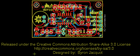
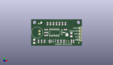
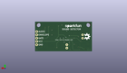
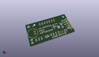

Contents
========

* [PROJ-SPAR-12642-STAN-01>Sound Detector](#proj-spar-12642-stan-01sound-detector)
	* [Images](#images)
	* [Interactive BOM](#interactive-bom)
	* [OOMP Parts](#oomp-parts)
	* [Tags](#tags)
  
![][im]
# PROJ-SPAR-12642-STAN-01>Sound Detector

- ID: PROJ-SPAR-12642-STAN-01
- Hex ID: PRS12642
- Name: Sound Detector
- Description: 

## Images
  
  

|eagleImage|kicadPcb3dFront|kicadPcb3dBack|kicadPcb3d|
| :---: | :---: | :---: | :---: |
|||||

## Interactive BOM

- Interactive BOM page: [ibom.html](kicad/bom/ibom.html)

## OOMP Parts
  

|OOMP Parts|
| :---: |
|CAPE-UNMATCHED-X-UNMATCHED-01, C1, 34.29, 9.524999999999999, 90,C1, 10uF, 1206, SparkFun-Capacitors, (1.35, 0.375), R90|
|CAPE-UNMATCHED-X-UNMATCHED-01, C2, 2.54, 3.8099999999999996, 270,C2, 10uF, 1206, SparkFun-Capacitors, (0.1, 0.15), R270|
|CAPE-0603-X-UNMATCHED-01, C3, 12.7, 13.97, 180,C3, 1.0uF, 0603-CAP, SparkFun-Capacitors, (0.5, 0.55), R180|
|CAPE-0603-X-UNMATCHED-01, C4, 8.889999999999999, 3.8099999999999996, 270,C4, 1.0uF, 0603-CAP, SparkFun-Capacitors, (0.35, 0.15), R270|
|UNMATCHED-UNMATCHED-X-UNMATCHED-01, D1, 29.845, 3.8099999999999996, 270,D1, RB751, SOD-523, SparkFun-DiscreteSemi, (1.175, 0.15), R270|
|UNMATCHED-UNMATCHED-X-UNMATCHED-01, D2, 31.75, 3.8099999999999996, 270,D2, RB751, SOD-523, SparkFun-DiscreteSemi, (1.25, 0.15), R270|
|UNMATCHED-0603-X-UNMATCHED-01, D3, 27.94, 11.43, 90,D3, RED, LED-0603, SparkFun-LED, (1.1, 0.45), R90|
|UNMATCHED-UNMATCHED-X-UNMATCHED-01, IC1, 19.049999999999997, 11.43, 0,IC1, LMV324, SO014, SparkFun-AnalogIC, (0.75, 0.45), R0|
|ERROR, JP1 IO Connector, 0, 0, 0,JP1, IO, Connector, 1X05, SparkFun-Connectors, (1.65, 0.2), R90|
|UNMATCHED-UNMATCHED-X-UNMATCHED-01, MIC1, 5.08, 11.43, 180,MIC1, MIC9.7MM, MIC-9.7MM, SparkFun-Sensors, (0.2, 0.45), R180|
|RESE-0603-X-UNMATCHED-01, R1, 6.35, 3.8099999999999996, 90,R1, 2.2k, 0603-RES, SparkFun-Resistors, (0.25, 0.15), R90|
|RESE-0603-X-UNMATCHED-01, R2, 11.43, 3.8099999999999996, 90,R2, 1K, 0603-RES, SparkFun-Resistors, (0.45, 0.15), R90|
|<table><tr><td></td><td> R3</td><td>[RESE-0603-X-O104-01 SMD (0603) 100k Ohm Resistor](https://github.com/oomlout/oomlout_OOMP_parts/tree/main/RESE-0603-X-O104-01/)</td><td>[R6104](https://github.com/oomlout/oomlout_OOMP_parts/tree/main/RESE-0603-X-O104-01/)</td></tr></table>|
|<table><tr><td></td><td> R4</td><td>[RESE-0603-X-O103-01 SMD (0603) 10k Ohm Resistor](https://github.com/oomlout/oomlout_OOMP_parts/tree/main/RESE-0603-X-O103-01/)</td><td>[R6103](https://github.com/oomlout/oomlout_OOMP_parts/tree/main/RESE-0603-X-O103-01/)</td></tr></table>|
|<table><tr><td></td><td> R5</td><td>[RESE-0603-X-O103-01 SMD (0603) 10k Ohm Resistor](https://github.com/oomlout/oomlout_OOMP_parts/tree/main/RESE-0603-X-O103-01/)</td><td>[R6103](https://github.com/oomlout/oomlout_OOMP_parts/tree/main/RESE-0603-X-O103-01/)</td></tr></table>|
|<table><tr><td></td><td> R6</td><td>[RESE-0603-X-O103-01 SMD (0603) 10k Ohm Resistor](https://github.com/oomlout/oomlout_OOMP_parts/tree/main/RESE-0603-X-O103-01/)</td><td>[R6103](https://github.com/oomlout/oomlout_OOMP_parts/tree/main/RESE-0603-X-O103-01/)</td></tr></table>|
|<table><tr><td></td><td> R7</td><td>[RESE-0603-X-O223-01 SMD (0603) 22k Ohm Resistor](https://github.com/oomlout/oomlout_OOMP_parts/tree/main/RESE-0603-X-O223-01/)</td><td>[R6223](https://github.com/oomlout/oomlout_OOMP_parts/tree/main/RESE-0603-X-O223-01/)</td></tr></table>|
|RESE-0603-X-UNMATCHED-01, R8, 34.29, 3.8099999999999996, 90,R8, 100, 0603-RES, SparkFun-Resistors, (1.35, 0.15), R90|
|<table><tr><td></td><td> R9</td><td>[RESE-0603-X-O103-01 SMD (0603) 10k Ohm Resistor](https://github.com/oomlout/oomlout_OOMP_parts/tree/main/RESE-0603-X-O103-01/)</td><td>[R6103](https://github.com/oomlout/oomlout_OOMP_parts/tree/main/RESE-0603-X-O103-01/)</td></tr></table>|
|RESE-0603-X-UNMATCHED-01, R10, 13.97, 19.049999999999997, 90,R10, 1K, 0603-RES, SparkFun-Resistors, (0.55, 0.75), R90|
|<table><tr><td></td><td> R11</td><td>[RESE-0603-X-O104-01 SMD (0603) 100k Ohm Resistor](https://github.com/oomlout/oomlout_OOMP_parts/tree/main/RESE-0603-X-O104-01/)</td><td>[R6104](https://github.com/oomlout/oomlout_OOMP_parts/tree/main/RESE-0603-X-O104-01/)</td></tr></table>|
|RESE-0603-X-UNMATCHED-01, R12, 21.59, 19.049999999999997, 270,R12, 3.3k, 0603-RES, SparkFun-Resistors, (0.85, 0.75), R270|
|RESE-0603-X-UNMATCHED-01, R13, 19.049999999999997, 19.049999999999997, 90,R13, 1K, 0603-RES, SparkFun-Resistors, (0.75, 0.75), R90|
|<table><tr><td></td><td> R14</td><td>[RESE-0603-X-O104-01 SMD (0603) 100k Ohm Resistor](https://github.com/oomlout/oomlout_OOMP_parts/tree/main/RESE-0603-X-O104-01/)</td><td>[R6104](https://github.com/oomlout/oomlout_OOMP_parts/tree/main/RESE-0603-X-O104-01/)</td></tr></table>|
|RESE-0603-X-UNMATCHED-01, R15, 29.209999999999997, 19.049999999999997, 90,R15, 100, 0603-RES, SparkFun-Resistors, (1.15, 0.75), R90|
|RESE-0603-X-UNMATCHED-01, R16, 29.209999999999997, 13.97, 180,R16, 2.2k, 0603-RES, SparkFun-Resistors, (1.15, 0.55), R180|
|RESE-UNMATCHED-X-UNMATCHED-01, R17, 19.049999999999997, 2.54, 90,R17, GAIN, AXIAL-0.1EZ, SparkFun-Resistors, (0.75, 0.1), R90|
|RESE-0603-X-UNMATCHED-01, R18, 16.509999999999998, 19.049999999999997, 90,R18, 100, 0603-RES, SparkFun-Resistors, (0.65, 0.75), R90|
|RESE-0603-X-UNMATCHED-01, R19, 22.86, 3.8099999999999996, 270,R19, 100, 0603-RES, SparkFun-Resistors, (0.9, 0.15), R270|
|ERROR, SJ1 Disable LED, 0, 0, 0,SJ1, Disable, LED, SJ_2S, SparkFun-Passives, (1.2, 0.37), R90|

## Tags

- hexID: PRS12642
- oompType: PROJ
- oompSize: SPAR
- oompColor: 12642
- oompDesc: STAN
- oompIndex: 01
- oompName: Sound Detector
- sources: All source files from https://github.com/sparkfun/Sound_Detector (source licence details in srcLicense.md)
- linkBuyPage: https://www.sparkfun.com/products/12642
- oompPart: CAPE-UNMATCHED-X-UNMATCHED-01, C1, 34.29, 9.524999999999999, 90
- oompPart: CAPE-UNMATCHED-X-UNMATCHED-01, C2, 2.54, 3.8099999999999996, 270
- oompPart: CAPE-0603-X-UNMATCHED-01, C3, 12.7, 13.97, 180
- oompPart: CAPE-0603-X-UNMATCHED-01, C4, 8.889999999999999, 3.8099999999999996, 270
- oompPart: UNMATCHED-UNMATCHED-X-UNMATCHED-01, D1, 29.845, 3.8099999999999996, 270
- oompPart: UNMATCHED-UNMATCHED-X-UNMATCHED-01, D2, 31.75, 3.8099999999999996, 270
- oompPart: UNMATCHED-0603-X-UNMATCHED-01, D3, 27.94, 11.43, 90
- oompPart: SKIP-UNMATCHED-X-UNMATCHED-01, FID3, 40.64, 2.54, 0
- oompPart: SKIP-UNMATCHED-X-UNMATCHED-01, FID4, 6.35, 19.049999999999997, 0
- oompPart: UNMATCHED-UNMATCHED-X-UNMATCHED-01, IC1, 19.049999999999997, 11.43, 0
- oompPart: ERROR, JP1 IO Connector, 0, 0, 0
- oompPart: UNMATCHED-UNMATCHED-X-UNMATCHED-01, MIC1, 5.08, 11.43, 180
- oompPart: RESE-0603-X-UNMATCHED-01, R1, 6.35, 3.8099999999999996, 90
- oompPart: RESE-0603-X-UNMATCHED-01, R2, 11.43, 3.8099999999999996, 90
- oompPart: RESE-0603-X-O104-01, R3, 15.875, 3.8099999999999996, 90
- oompPart: RESE-0603-X-O103-01, R4, 25.4, 3.8099999999999996, 90
- oompPart: RESE-0603-X-O103-01, R5, 12.7, 11.43, 0
- oompPart: RESE-0603-X-O103-01, R6, 12.7, 8.889999999999999, 180
- oompPart: RESE-0603-X-O223-01, R7, 27.94, 3.8099999999999996, 270
- oompPart: RESE-0603-X-UNMATCHED-01, R8, 34.29, 3.8099999999999996, 90
- oompPart: RESE-0603-X-O103-01, R9, 36.195, 3.8099999999999996, 90
- oompPart: RESE-0603-X-UNMATCHED-01, R10, 13.97, 19.049999999999997, 90
- oompPart: RESE-0603-X-O104-01, R11, 24.13, 19.049999999999997, 90
- oompPart: RESE-0603-X-UNMATCHED-01, R12, 21.59, 19.049999999999997, 270
- oompPart: RESE-0603-X-UNMATCHED-01, R13, 19.049999999999997, 19.049999999999997, 90
- oompPart: RESE-0603-X-O104-01, R14, 26.669999999999998, 19.049999999999997, 270
- oompPart: RESE-0603-X-UNMATCHED-01, R15, 29.209999999999997, 19.049999999999997, 90
- oompPart: RESE-0603-X-UNMATCHED-01, R16, 29.209999999999997, 13.97, 180
- oompPart: RESE-UNMATCHED-X-UNMATCHED-01, R17, 19.049999999999997, 2.54, 90
- oompPart: RESE-0603-X-UNMATCHED-01, R18, 16.509999999999998, 19.049999999999997, 90
- oompPart: RESE-0603-X-UNMATCHED-01, R19, 22.86, 3.8099999999999996, 270
- oompPart: ERROR, SJ1 Disable LED, 0, 0, 0
- rawPart: C1, 10uF, 1206, SparkFun-Capacitors, (1.35, 0.375), R90
- rawPart: C2, 10uF, 1206, SparkFun-Capacitors, (0.1, 0.15), R270
- rawPart: C3, 1.0uF, 0603-CAP, SparkFun-Capacitors, (0.5, 0.55), R180
- rawPart: C4, 1.0uF, 0603-CAP, SparkFun-Capacitors, (0.35, 0.15), R270
- rawPart: D1, RB751, SOD-523, SparkFun-DiscreteSemi, (1.175, 0.15), R270
- rawPart: D2, RB751, SOD-523, SparkFun-DiscreteSemi, (1.25, 0.15), R270
- rawPart: D3, RED, LED-0603, SparkFun-LED, (1.1, 0.45), R90
- rawPart: FID3, FIDUCIAL1X2, FIDUCIAL-1X2, SparkFun-Aesthetics, (1.6, 0.1), R0
- rawPart: FID4, FIDUCIAL1X2, FIDUCIAL-1X2, SparkFun-Aesthetics, (0.25, 0.75), R0
- rawPart: IC1, LMV324, SO014, SparkFun-AnalogIC, (0.75, 0.45), R0
- rawPart: JP1, IO, Connector, 1X05, SparkFun-Connectors, (1.65, 0.2), R90
- rawPart: MIC1, MIC9.7MM, MIC-9.7MM, SparkFun-Sensors, (0.2, 0.45), R180
- rawPart: R1, 2.2k, 0603-RES, SparkFun-Resistors, (0.25, 0.15), R90
- rawPart: R2, 1K, 0603-RES, SparkFun-Resistors, (0.45, 0.15), R90
- rawPart: R3, 100k, 0603-RES, SparkFun-Resistors, (0.625, 0.15), R90
- rawPart: R4, 10K, 0603-RES, SparkFun-Resistors, (1, 0.15), R90
- rawPart: R5, 10K, 0603-RES, SparkFun-Resistors, (0.5, 0.45), R0
- rawPart: R6, 10K, 0603-RES, SparkFun-Resistors, (0.5, 0.35), R180
- rawPart: R7, 22K, 0603-RES, SparkFun-Resistors, (1.1, 0.15), R270
- rawPart: R8, 100, 0603-RES, SparkFun-Resistors, (1.35, 0.15), R90
- rawPart: R9, 10K, 0603-RES, SparkFun-Resistors, (1.425, 0.15), R90
- rawPart: R10, 1K, 0603-RES, SparkFun-Resistors, (0.55, 0.75), R90
- rawPart: R11, 100k, 0603-RES, SparkFun-Resistors, (0.95, 0.75), R90
- rawPart: R12, 3.3k, 0603-RES, SparkFun-Resistors, (0.85, 0.75), R270
- rawPart: R13, 1K, 0603-RES, SparkFun-Resistors, (0.75, 0.75), R90
- rawPart: R14, 100k, 0603-RES, SparkFun-Resistors, (1.05, 0.75), R270
- rawPart: R15, 100, 0603-RES, SparkFun-Resistors, (1.15, 0.75), R90
- rawPart: R16, 2.2k, 0603-RES, SparkFun-Resistors, (1.15, 0.55), R180
- rawPart: R17, GAIN, AXIAL-0.1EZ, SparkFun-Resistors, (0.75, 0.1), R90
- rawPart: R18, 100, 0603-RES, SparkFun-Resistors, (0.65, 0.75), R90
- rawPart: R19, 100, 0603-RES, SparkFun-Resistors, (0.9, 0.15), R270
- rawPart: SJ1, Disable, LED, SJ_2S, SparkFun-Passives, (1.2, 0.37), R90

[im]: kicadPcb3d_450.png
