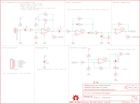

Contents
========

* [PRS12642 > Sparkfun](#prs12642--sparkfun)
	* [Schematic](#schematic)
	* [Interactive BOM](#interactive-bom)
	* [OOMP Parts](#oomp-parts)
	* [Images](#images)
	* [Tags](#tags)
  
![][im]
# PRS12642 > Sparkfun

- ID: PROJ-SPAR-12642-STAN-01
- Hex ID: PRS12642
- Name: Sparkfun
- Description: Sparkfun
- Long Link: [http://oom.lt/PROJ-SPAR-12642-STAN-01](http://oom.lt/PROJ-SPAR-12642-STAN-01)
- Short Link: [http://oom.lt/PRS12642](http://oom.lt/PRS12642)

## Schematic
  

## Interactive BOM

- Interactive BOM page: [ibom.html](https://htmlpreview.github.io/?https://github.com/oomlout/oomlout_OOMP_projects/blob/main/PROJ-SPAR-12642-STAN-01/kicad/bom/ibom.html)

## OOMP Parts
  

|OOMP Parts|
| :---: |
|C1,CAPC-1206-X-UF10-01,C1,10uF,10UF-6.3V-20%(1206),1206,Ceramic,CAP-10057,10uF,|
|C2,CAPC-1206-X-UF10-01,C2,10uF,10UF-6.3V-20%(1206),1206,Ceramic,CAP-10057,10uF,|
|C3,CAPC-0603-X-UNMATCHED-01,C3,1.0uF,1.0UF-16V-10%(0603),0603-CAP,CAP-00868,CAP-00868,1.0uF,|
|C4,CAPC-0603-X-UNMATCHED-01,C4,1.0uF,1.0UF-16V-10%(0603),0603-CAP,CAP-00868,CAP-00868,1.0uF,|
|D1,DIOD-UNMATCHED-X-UNMATCHED-01,D1,RB751,RB751,SOD-523,40V 120mA SOD-523 Schottky,DIO-11018,RB751,|
|D2,DIOD-UNMATCHED-X-UNMATCHED-01,D2,RB751,RB751,SOD-523,40V 120mA SOD-523 Schottky,DIO-11018,RB751,|
|D3,LEDS-0603-G-STAN-01,D3,RED,LED-RED0603,LED-0603,Assorted Red LEDs,DIO-00819,RED,|
|IC1,UNMATCHED-UNMATCHED-X-UNMATCHED-01,FID3,FIDUCIAL1X2,FIDUCIAL1X2,FIDUCIAL-1X2,Fiducial Alignment Points,,,|
|JP1,HEAD-I01-X-PI05-01,FID4,FIDUCIAL1X2,FIDUCIAL1X2,FIDUCIAL-1X2,Fiducial Alignment Points,,,|
|MIC1,UNMATCHED-UNMATCHED-X-UNMATCHED-01,FRAME1,FRAME-LETTER,FRAME-LETTER,CREATIVE_COMMONS,Schematic Frame,,,|
|R1,RESE-0603-X-UNMATCHED-01,IC1,LMV324,LMV324,SO014,Jellybean quad op-amp,IC-08227,LMV324,|
|R2,RESE-0603-X-O102-01,JP1,IO Connector,M05PTH,1X05,Header 5,,,|
|R3,RESE-0603-X-O1003-01,LOGO1,OSHW-LOGOM,OSHW-LOGOM,OSHW-LOGO-M,Open Source Hardware Logo This logo indicates the piece of hardware it is found on incorporates a OSHW license and/or adheres to the definition of open source hardware found here: http://freedomdefined.org/OSHW,,,|
|R4,RESE-0603-X-O103-01,LOGO2,LOGO-SFENW2,LOGO-SFENW2,SFE-NEW-WEB,Spark Fun Electronics PCB Logo,,,|
|R5,RESE-0603-X-O103-01,LOGO3,LOGO-SFESK,LOGO-SFESK,SFE-LOGO-FLAME,Spark Fun Electronics PCB Logo,,,|
|R6,RESE-0603-X-O103-01,MIC1,MIC9.7MM,MIC9.7MM,MIC-9.7MM,Omni-directional electret microphone. 9.7mm standard diameter.,COMP-08856,,|
|R7,RESE-0603-X-O223-01,R1,2.2k,2.2KOHM1/10W1%(0603),0603-RES,RES-08272,RES-08272,2.2k,|
|R8,RESE-0603-X-O101-01,R2,1K,1KOHM1/10W1%(0603),0603-RES,RES-07856,RES-07856,1K,|
|R9,RESE-0603-X-O103-01,R3,100k,100KOHM1/10W1%(0603),0603-RES,RES-07828,RES-07828,100k,|
|R10,RESE-0603-X-O102-01,R4,10K,10KOHM1/10W1%(0603)0603,0603-RES,RES-00824,RES-00824,10K,|
|R11,RESE-0603-X-O1003-01,R5,10K,10KOHM1/10W1%(0603)0603,0603-RES,RES-00824,RES-00824,10K,|
|R12,RESE-0603-X-UNMATCHED-01,R6,10K,10KOHM1/10W1%(0603)0603,0603-RES,RES-00824,RES-00824,10K,|
|R13,RESE-0603-X-O102-01,R7,22K,22KOHM1/10W1%(0603),0603-RES,RES-07853,RES-07853,22K,|
|R14,RESE-0603-X-O1003-01,R8,100,100OHM1/10W1%(0603),0603-RES,RES-07863,RES-07863,100,|
|R15,RESE-0603-X-O101-01,R9,10K,10KOHM1/10W1%(0603)0603,0603-RES,RES-00824,RES-00824,10K,|
|R16,RESE-0603-X-UNMATCHED-01,R10,1K,1KOHM1/10W1%(0603),0603-RES,RES-07856,RES-07856,1K,|
|R17,RESE-UNMATCHED-X-UNMATCHED-01,R11,100k,100KOHM1/10W1%(0603),0603-RES,RES-07828,RES-07828,100k,|
|R18,RESE-0603-X-O101-01,R12,3.3k,3.3KOHM1/10W1%(0603),0603-RES,RES-07851,RES-07851,,|
|R19,RESE-0603-X-O101-01,R13,1K,1KOHM1/10W1%(0603),0603-RES,RES-07856,RES-07856,1K,|

## Images
  
  

|kicadPcb3d|kicadPcb3dFront|kicadPcb3dBack|eagleImage|eagleSchemImage|
| :---: | :---: | :---: | :---: | :---: |
||||||

## Tags

- hexID: PRS12642
- oompType: PROJ
- oompSize: SPAR
- oompColor: 12642
- oompDesc: STAN
- oompIndex: 01
- oompName: Sound Detector
- sources: All source files from https://github.com/sparkfun/Sound_Detector (source licence details in srcLicense.md)
- linkBuyPage: https://www.sparkfun.com/products/12642
- oompID: PROJ-SPAR-12642-STAN-01
- oompParts: C1,CAPC-1206-X-UF10-01
- oompParts: C2,CAPC-1206-X-UF10-01
- oompParts: C3,CAPC-0603-X-UNMATCHED-01
- oompParts: C4,CAPC-0603-X-UNMATCHED-01
- oompParts: D1,DIOD-UNMATCHED-X-UNMATCHED-01
- oompParts: D2,DIOD-UNMATCHED-X-UNMATCHED-01
- oompParts: D3,LEDS-0603-G-STAN-01
- oompParts: IC1,UNMATCHED-UNMATCHED-X-UNMATCHED-01
- oompParts: JP1,HEAD-I01-X-PI05-01
- oompParts: MIC1,UNMATCHED-UNMATCHED-X-UNMATCHED-01
- oompParts: R1,RESE-0603-X-UNMATCHED-01
- oompParts: R2,RESE-0603-X-O102-01
- oompParts: R3,RESE-0603-X-O1003-01
- oompParts: R4,RESE-0603-X-O103-01
- oompParts: R5,RESE-0603-X-O103-01
- oompParts: R6,RESE-0603-X-O103-01
- oompParts: R7,RESE-0603-X-O223-01
- oompParts: R8,RESE-0603-X-O101-01
- oompParts: R9,RESE-0603-X-O103-01
- oompParts: R10,RESE-0603-X-O102-01
- oompParts: R11,RESE-0603-X-O1003-01
- oompParts: R12,RESE-0603-X-UNMATCHED-01
- oompParts: R13,RESE-0603-X-O102-01
- oompParts: R14,RESE-0603-X-O1003-01
- oompParts: R15,RESE-0603-X-O101-01
- oompParts: R16,RESE-0603-X-UNMATCHED-01
- oompParts: R17,RESE-UNMATCHED-X-UNMATCHED-01
- oompParts: R18,RESE-0603-X-O101-01
- oompParts: R19,RESE-0603-X-O101-01
- rawParts: C1,10uF,10UF-6.3V-20%(1206),1206,Ceramic,CAP-10057,10uF,
- rawParts: C2,10uF,10UF-6.3V-20%(1206),1206,Ceramic,CAP-10057,10uF,
- rawParts: C3,1.0uF,1.0UF-16V-10%(0603),0603-CAP,CAP-00868,CAP-00868,1.0uF,
- rawParts: C4,1.0uF,1.0UF-16V-10%(0603),0603-CAP,CAP-00868,CAP-00868,1.0uF,
- rawParts: D1,RB751,RB751,SOD-523,40V 120mA SOD-523 Schottky,DIO-11018,RB751,
- rawParts: D2,RB751,RB751,SOD-523,40V 120mA SOD-523 Schottky,DIO-11018,RB751,
- rawParts: D3,RED,LED-RED0603,LED-0603,Assorted Red LEDs,DIO-00819,RED,
- rawParts: FID3,FIDUCIAL1X2,FIDUCIAL1X2,FIDUCIAL-1X2,Fiducial Alignment Points,,,
- rawParts: FID4,FIDUCIAL1X2,FIDUCIAL1X2,FIDUCIAL-1X2,Fiducial Alignment Points,,,
- rawParts: FRAME1,FRAME-LETTER,FRAME-LETTER,CREATIVE_COMMONS,Schematic Frame,,,
- rawParts: IC1,LMV324,LMV324,SO014,Jellybean quad op-amp,IC-08227,LMV324,
- rawParts: JP1,IO Connector,M05PTH,1X05,Header 5,,,
- rawParts: LOGO1,OSHW-LOGOM,OSHW-LOGOM,OSHW-LOGO-M,Open Source Hardware Logo This logo indicates the piece of hardware it is found on incorporates a OSHW license and/or adheres to the definition of open source hardware found here: http://freedomdefined.org/OSHW,,,
- rawParts: LOGO2,LOGO-SFENW2,LOGO-SFENW2,SFE-NEW-WEB,Spark Fun Electronics PCB Logo,,,
- rawParts: LOGO3,LOGO-SFESK,LOGO-SFESK,SFE-LOGO-FLAME,Spark Fun Electronics PCB Logo,,,
- rawParts: MIC1,MIC9.7MM,MIC9.7MM,MIC-9.7MM,Omni-directional electret microphone. 9.7mm standard diameter.,COMP-08856,,
- rawParts: R1,2.2k,2.2KOHM1/10W1%(0603),0603-RES,RES-08272,RES-08272,2.2k,
- rawParts: R2,1K,1KOHM1/10W1%(0603),0603-RES,RES-07856,RES-07856,1K,
- rawParts: R3,100k,100KOHM1/10W1%(0603),0603-RES,RES-07828,RES-07828,100k,
- rawParts: R4,10K,10KOHM1/10W1%(0603)0603,0603-RES,RES-00824,RES-00824,10K,
- rawParts: R5,10K,10KOHM1/10W1%(0603)0603,0603-RES,RES-00824,RES-00824,10K,
- rawParts: R6,10K,10KOHM1/10W1%(0603)0603,0603-RES,RES-00824,RES-00824,10K,
- rawParts: R7,22K,22KOHM1/10W1%(0603),0603-RES,RES-07853,RES-07853,22K,
- rawParts: R8,100,100OHM1/10W1%(0603),0603-RES,RES-07863,RES-07863,100,
- rawParts: R9,10K,10KOHM1/10W1%(0603)0603,0603-RES,RES-00824,RES-00824,10K,
- rawParts: R10,1K,1KOHM1/10W1%(0603),0603-RES,RES-07856,RES-07856,1K,
- rawParts: R11,100k,100KOHM1/10W1%(0603),0603-RES,RES-07828,RES-07828,100k,
- rawParts: R12,3.3k,3.3KOHM1/10W1%(0603),0603-RES,RES-07851,RES-07851,,
- rawParts: R13,1K,1KOHM1/10W1%(0603),0603-RES,RES-07856,RES-07856,1K,
- rawParts: R14,100k,100KOHM1/10W1%(0603),0603-RES,RES-07828,RES-07828,100k,
- rawParts: R15,100,100OHM1/10W1%(0603),0603-RES,RES-07863,RES-07863,100,
- rawParts: R16,2.2k,2.2KOHM1/10W1%(0603),0603-RES,RES-08272,RES-08272,2.2k,
- rawParts: R17,GAIN,RESISTORPTH-1/4W-VERT-KIT,AXIAL-0.1EZ,Resistor,,,
- rawParts: R18,100,100OHM1/10W1%(0603),0603-RES,RES-07863,RES-07863,100,
- rawParts: R19,100,100OHM1/10W1%(0603),0603-RES,RES-07863,RES-07863,100,
- rawParts: SJ1,Disable LED,SOLDERJUMPERNC,SJ_2S,Solder Jumper,,,
- rawParts: STANDOFF1,STAND-OFF,STAND-OFF,STAND-OFF,#4 Stand Off,,,
- rawParts: STANDOFF2,STAND-OFF,STAND-OFF,STAND-OFF,#4 Stand Off,,,

[im]: kicadPcb3d_450.png
